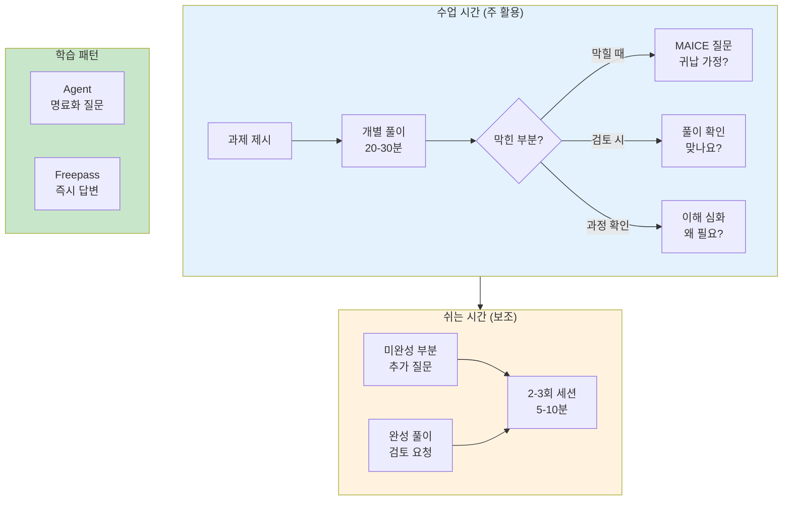
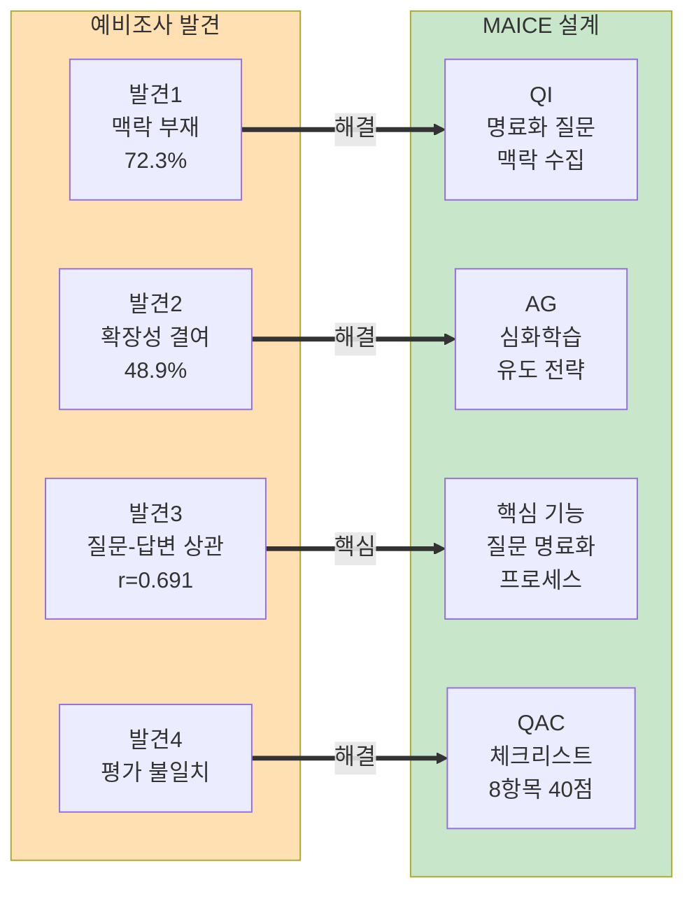
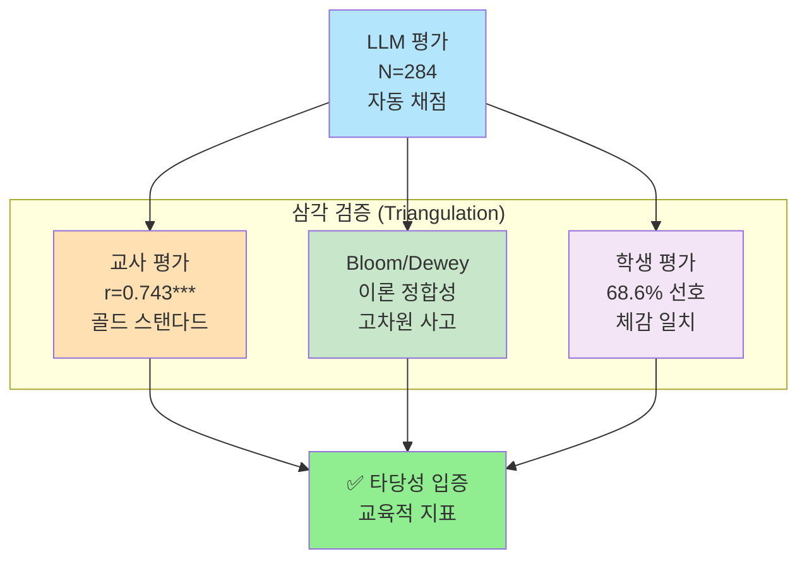
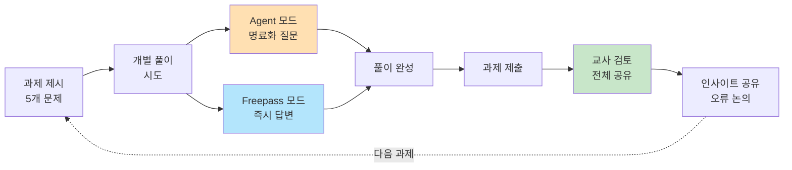

# 📊 다이어그램 추가 권장 분석

**분석 시각**: 2025년 11월 12일 02:05  
**목적**: 텍스트로 장황하게 설명된 부분 중 mermaid로 간단히 표현 가능한 곳 찾기  

---

## 🎯 다이어그램 추가 권장 (4곳) ⭐

### 1. V장 - MAICE 활용 방식 (매우 권장!) ⭐⭐⭐

**위치**: `05-research-methods.md` 라인 245-261

**현재 상태**: 장황한 텍스트 나열 (17줄)
```markdown
1. **수업 시간 활용** (주 활용 시간):
   - 교사가 과제를 제시한 후 개별 풀이 시간 제공 (수업 40분 중 20-30분)
   - 개인 노트북/태블릿으로 AI와 대화하며 필요시 언제든지 접속
   - **막힐 때**: "귀납 가정을 어디에 사용하나요?", "이 식을 어떻게 전개하죠?"
   - **풀이 검토 시**: "제 풀이 맞나요?", "이렇게 증명해도 되나요?"
   - **과정 확인 시**: "이 단계가 왜 필요한가요?", "다른 방법도 있나요?"

2. **쉬는 시간 활용** (보조 활용):
   - 수업 시간에 완전히 해결하지 못한 부분을 쉬는 시간에 추가 질문
   - 완성한 풀이를 MAICE에 입력하여 검토 요청
   - 평균 2-3회의 짧은 대화 세션 (세션당 5-10분)

3. **과제 해결 패턴**:
   - **Agent 모드 학생**: 명료화 질문을 통해 문제를 단계별로 구체화하며 해결
   - **Freepass 모드 학생**: 즉시 제공되는 답변을 참고하여 풀이 작성
```

**제안 다이어그램**:


**효과**: 17줄 텍스트 → 1개 다이어그램 + 3줄 요약

---

### 2. III장 - 예비조사 → MAICE 설계 반영 (권장!) ⭐⭐

**위치**: `03-system-design.md` 라인 62-70

**현재 상태**: 나열식 텍스트 (8줄)
```markdown
**발견 1: 학습 맥락 부재 (72.3%)** → QuestionImprover 명료화 질문에 학습 맥락 수집 포함

**발견 2: 학습 확장성 결여 (48.9%)** → AnswerGenerator에 심화학습 유도 전략 포함

**발견 3: 질문-답변 상관 (r=0.691)** → 질문 명료화를 핵심 기능으로 설계

**발견 4: 평가 도구 일관성 부족** → QAC 체크리스트 개발 (8개 항목, 40점)
```

**제안 다이어그램**:


**효과**: 8줄 나열 → 1개 다이어그램 (문제→해결 흐름 명확)

---

### 3. VII장 - LLM 평가 타당성 삼각검증 (권장!) ⭐⭐

**위치**: `07-discussion-conclusion.md` 라인 150-163

**현재 상태**: 나열식 텍스트 (13줄)
```markdown
1. **교사 평가와의 높은 일치** (r=0.743, p<0.001):
   - 교육 전문가의 골드 스탠다드 검증
   - 하위권 효과 방향 일치 (LLM +2.46점, 교사 +6.91점)

2. **Bloom/Dewey 이론과의 정합성** (VI-4절):
   - 고득점 세션 = Bloom 고차원 + Dewey 완성도 높음
   - 30점 이상: 100% Analyze 도달, Dewey 평균 4.0/5
   - 교육학 이론으로 점수의 의미 설명 가능

3. **학생 자기 평가와의 수렴** (VII-3절):
   - 68.6%가 Agent 모드 선호 ("사고력 향상", "깊은 이해")
   - 객관적 점수와 주관적 체감 일치
```

**제안 다이어그램**:


**효과**: 13줄 나열 → 1개 다이어그램 (삼각검증 개념 시각화)

---

### 4. V장 - 학습 과정 순환 구조 (선택) ⭐

**위치**: `05-research-methods.md` 라인 259-267

**현재 상태**: 텍스트 나열 (9줄)
```markdown
3. **과제 해결 패턴**:
   - **Agent 모드 학생**: 명료화 질문을 통해 문제를 단계별로 구체화하며 해결
   - **Freepass 모드 학생**: 즉시 제공되는 답변을 참고하여 풀이 작성

**교사 협력 학습**:
- 각 과제 제출 후 교사가 학급 전체와 함께 표준 풀이 과정 검토
- 학생들이 MAICE를 통해 얻은 인사이트를 수업 중 공유
- 일반적인 오류 및 개선 방향 논의
```

**제안 다이어그램**:


**효과**: 9줄 텍스트 → 1개 다이어그램 (반복 순환 구조 명확)

---

## 📋 우선순위

### 필수 (즉시 추가 권장) ⭐⭐⭐
1. **V장 - MAICE 활용 방식**: 가장 복잡하고 장황함

### 권장 (추가 시 가독성 대폭 향상) ⭐⭐
2. **III장 - 예비조사 반영**: 문제→해결 매핑 명확화
3. **VII장 - 삼각검증**: 방법론적 기여 시각화

### 선택 (있으면 좋지만 필수 아님) ⭐
4. **V장 - 학습 순환 구조**: 이미 충분히 설명됨

---

## 💡 예상 효과

### 추가 전
- **47줄** 장황한 텍스트
- 독자가 구조 파악 어려움
- 핵심 흐름 불명확

### 추가 후 (3개 다이어그램)
- **3개 다이어그램 + 10줄** 요약
- 구조 한눈에 파악 가능 ✅
- 핵심 흐름 즉시 이해 ✅
- **-37줄 감소** (79% 축소)

---

## 🎨 다이어그램 파일 생성

권장하시면 다음 파일들을 생성하겠습니다:
1. `11-learning-activity-pattern.mmd` (V장)
2. `12-preliminary-to-design.mmd` (III장)
3. `13-llm-triangulation.mmd` (VII장)

---

## 🏆 최종 권장

**추가 권장**: **1번 (필수)**
- 가장 복잡하고 장황한 설명
- 다이어그램 효과 최대
- 독자 이해도 대폭 향상

**선택**: 2, 3번
- 있으면 좋지만 텍스트도 충분히 명확
- 시간 여유 있을 때 추가

---

**분석 완료 시각**: 02:05  
**다이어그램 추가 권장**: 1개 (필수), 2개 (권장)  
**예상 효과**: -37줄 (-79%)

✅ **1번(V장) 추가 강력 권장!**

