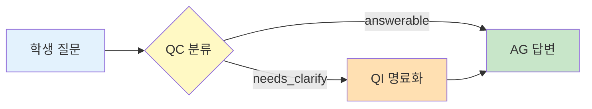

# 📊 MAICE 논문 머메이드 색상 가이드

## 🎨 공식 색상 팔레트

### 1. 프로세스 흐름
| 색상코드 | 색상명 | 역할 | 사용 예시 |
|---------|--------|------|-----------|
| `#E3F2FD` | 연한 파랑 | **입력/시작** | 학생 질문, 데이터 입력, 시작점 |
| `#FFF9C4` | 연한 노랑 | **처리/분석** | QC 분류, 판단, 평가, 분석 |
| `#FFE0B2` | 연한 오렌지 | **명료화** | QI 명료화, 질문 개선, 구체화 |
| `#C8E6C9` | 연한 초록 | **답변/출력** | AG 답변, 최종 결과, 완성 |
| `#F3E5F5` | 연한 보라 | **관찰/로깅** | LO 관찰, 요약, 컨텍스트 |

### 2. 상태 표시
| 색상코드 | 색상명 | 역할 |
|---------|--------|------|
| `#FFB6C1` | 연한 핑크 | **오류/경고** - 문제 상황, 실패, 경고 |
| `#FFE4E1` | 매우 연한 핑크 | **대조군** - FT (Freepass 모드) |

---

## 📋 에이전트별 색상

---

## 🔧 적용 규칙

1. **동일 역할 = 동일 색상**
   - QC는 항상 `#FFF9C4` (노랑)
   - QI는 항상 `#FFE0B2` (오렌지)
   - AG는 항상 `#C8E6C9` (초록)
   - LO는 항상 `#F3E5F5` (보라)

2. **시각적 흐름**
   - 왼쪽 → 오른쪽: 파랑 → 노랑 → 오렌지 → 초록 → 보라
   - 위 → 아래: 파랑(입력) → 노랑/오렌지(처리) → 초록(출력)

3. **최대 색상 수**
   - 한 다이어그램에 5-7개 이하
   - 너무 많은 색상은 혼란 유발

4. **명암 조절**
   - 중요한 노드: 같은 계열에서 약간 진하게
   - 예: `#C8E6C9` → `#A5D6A7` (더 진한 초록)

---

## 📊 사용 예시

### 예시 1: 질문 처리 흐름

### 예시 2: 오류 처리

---

**생성일**: 2025년 11월 12일  
**버전**: 1.0  
**적용**: MAICE 논문 전체
