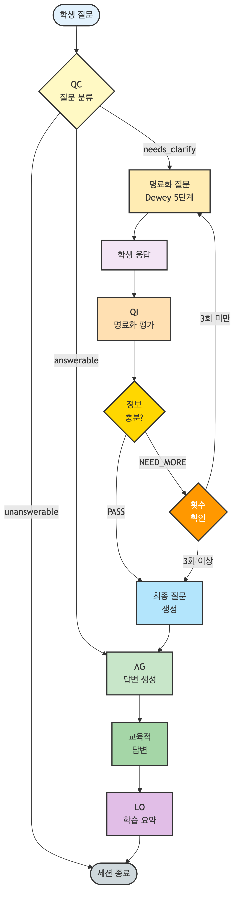

# 부록 B. 에이전트 프롬프트 전문

본 부록에서는 MAICE 시스템의 5개 에이전트(QC, QI, AG, LO, FT)에서 실제로 사용된 프롬프트 전문을 제시한다. 모든 프롬프트는 2025년 10월 20일 ~ 11월 7일 실제 운영 환경에서 수집된 데이터를 기반으로 추출되었으며, 본 연구의 재현 가능성(reproducibility)을 확보하기 위한 핵심 자료이다.

---

## B.1. 프롬프트 수집 개요

### 수집 정보
- **출처**: PostgreSQL DB (maice_agent 테이블 `llm_prompt_logs`)
- **수집 기간**: 2025년 10월 20일 ~ 11월 7일
- **총 세션**: 284개 (Agent: 118개, Freepass: 166개)
- **참여 학생**: 58명
- **수집 방법**: 각 에이전트의 최신 성공 프롬프트 추출

### 에이전트별 프롬프트 현황

| Agent | 역할 | 모델 | 평균 길이 |
|-------|------|------|----------|
| **QC** | 질문 분류 | Gemini 2.5 Flash | 7,364자 |
| **QI** | 명료화 평가 | Gemini 2.5 Flash | 6,471자 |
| **AG** | 답변 생성 | Gemini 2.5 Flash | 7,554자 |
| **LO** | 학습 요약 | Gemini 2.5 Flash | 7,522자 |
| **FT** | 즉시 답변 | Gemini 2.5 Flash | 9,790자 |

---

## B.2. Agent 모드 명료화 플로우

다음은 MAICE Agent 모드에서 학생의 질문이 처리되는 전체 흐름을 보여준다:

**[그림 B-1] Agent 모드: 명료화 과정 상세 플로우**



**플로우 설명**:

1. **QC (질문 분류)**:
   - 학생 질문 → K1-K4 유형 분류
   - answerable/needs_clarify/unanswerable 판정

2. **명료화 루프** (needs_clarify인 경우):
   - Dewey 5단계 기반 명료화 질문 생성
   - 학생 응답 → QI 평가 (PASS/NEED_MORE)
   - **최대 3회 반복**: 3회 이상이 되면 현재 정보로 최종 질문 생성

3. **최종 질문 생성**:
   - PASS 또는 3회 도달 시 → 명료화 과정 종료
   - 수집된 정보를 바탕으로 최종 질문 생성
   - 필요시 질문 유형 재분류 (K1→K2, K3→K4 등)

4. **AG (답변 생성)**:
   - K1-K4 유형별 맞춤 교육적 답변
   - LaTeX 수식, 단계별 설명, 메타인지 촉진

5. **LO (학습 요약)**:
   - 세션 제목 생성 (15자 이내)
   - 학습 요약 (200자 이내)
   - 주요 개념 추출

**핵심 원칙**:
- ✅ 명료화 3회 초과 시: **세션 종료 ❌** → **최종 질문 생성 후 답변 ✅**
- ✅ 학생의 응답을 통해 질문의 의도를 명확히 파악
- ✅ 수집된 맥락 정보를 답변 생성에 활용

---

# MAICE Agent 프롬프트 상세 설명

## 📋 개요

본 문서는 MAICE 시스템에서 사용되는 각 Agent의 프롬프트 구조와 작동 원리를 상세히 설명합니다. 모든 프롬프트는 2025년 10월 20일 이후 실제 운영 환경에서 수집된 데이터를 기반으로 추출되었습니다.

## 🤖 Agent 구성

MAICE 시스템은 5개의 주요 LLM Agent로 구성되어 있으며, 각각 독립적인 역할을 수행합니다:

| Agent 이름 | 역할 | 모델 | 주요 기능 |
|-----------|------|------|---------|
| **classifier_llm** | 질문 분류 | gemini-2.5-flash-lite | K1-K4 분류, 품질 평가, 명료화 질문 생성 |
| **question_improvement_llm** | 명료화 평가 | gemini-2.5-flash-lite | 명료화 완료 평가, 유형 재분류, 최종 질문 생성 |
| **answer_generator_llm** | 답변 생성 | gemini-2.5-flash-lite | 교육적 답변 생성, 질문 유형별 맞춤 구조 |
| **observer_llm** | 학습 과정 요약 | gemini-2.5-flash-lite | 세션 요약, 제목 생성, 학습 진척도 평가 |
| **freetalker_llm** | 프리패스 모드 | gemini-2.5-flash-lite | 명료화 없이 즉시 답변 (대조군) |

---

## 1️⃣ classifier_llm: 질문 분류 에이전트

### 역할

학생의 초기 질문을 분석하여 **4가지 지식 유형(K1-K4)**과 **3단계 품질(answerable/needs_clarify/unanswerable)**로 분류하고, 필요한 경우 **학생에게 직접 묻는 명료화 질문**을 생성합니다.

### 이론적 기반

- **존 듀이의 반성적 사고 5단계** 기반 명료화 질문 전략
- **2015 개정 교육과정** 기준 수학 교육 맥락

### 질문 유형 (K1-K4)

| 유형 | 지식 유형 | 설명 | 예시 |
|------|---------|------|------|
| **K1** | 사실적 지식 | 정의, 용어, 기호, 공식, 값, 단위 | "로그함수가 뭐야?" |
| **K2** | 개념적 지식 | 개념 간 관계, 분류, 원리, 이론 | "로그와 지수의 관계는?" |
| **K3** | 절차적 지식 | 수행 방법, 알고리즘, 절차 | "로그 방정식 풀이 방법" |
| **K4** | 메타인지적 지식 | 전략적 사고, 문제 접근법 | "복잡한 로그 문제 접근법" |

### 품질 단계

- **answerable**: 교과, 단원·수준 지정, 목표 명확, 충분한 정보
- **needs_clarify**: 범위 과대, 목표 불명, 추가 정보 필요
- **unanswerable**: 수학 외 영역, 평가윤리 위배

### missing_fields 가이드라인

각 질문 유형별로 부족한 정보를 체계적으로 분류:

- **K1**: `['단원 정보', '정확한 용어', '맥락 정보']`
- **K2**: `['비교 대상', '설명 깊이', '연결성']`
- **K3**: `['문제 유형', '주어진 조건', '결과 형식']`
- **K4**: `['문제 상황', '시도한 전략', '막힌 지점']`

### 명료화 질문 생성 원칙

**기본 원칙**:
- ✅ 학생이 스스로 생각하고 성찰하도록 유도
- ✅ 닫힌 질문(❌) → 열린 탐색 질문(✅)
- ✅ 친근하고 지지적인 톤 (존댓말, 이모지 사용)

**듀이의 반성적 사고 5단계 질문 전략**:

1. **문제 인식**: "이 개념을 공부하면서 어떤 부분이 가장 어렵거나 궁금하셨나요? 🤔"
2. **문제 정의**: "지금까지 이해한 부분과 아직 헷갈리는 부분을 나누어볼까요?"
3. **연결 탐색**: "이미 알고 있는 개념과 비교하면 어떤 점이 비슷하거나 다른가요?"
4. **사고 전개**: "왜 이 부분이 궁금하신지 조금 더 설명해주실 수 있나요?"
5. **이해 검증**: "어디까지 이해했고, 어디서부터 막히셨는지 말씀해주실 수 있나요?"

### 출력 형식

```json
{
  "knowledge_code": "K1/K2/K3/K4",
  "quality": "answerable/needs_clarify/unanswerable",
  "missing_fields": ["부족한 정보1", "부족한 정보2"],
  "reasoning": "실제 분류 근거",
  "clarification_questions": ["학생에게 직접 묻는 자연스러운 질문 1개만"],
  "clarification_reasoning": "명료화 질문이 해당 유형과 missing_fields를 어떻게 해결하는지",
  "unanswerable_response": "unanswerable인 경우 적절한 안내 메시지"
}
```

### 핵심 프롬프트 구조

**System 메시지**:
```
당신은 대한민국 고등학교 수학 교육과정 전문 분류기입니다.
질문을 정확히 분석하여 4가지 유형과 3단계 품질로 분류하고, 
필요한 경우 **학생에게 직접 묻는** 명료화 질문까지 생성하세요.

🚨 명료화 질문은 학생이 직접 읽고 답변할 수 있는 자연스러운 질문이어야 합니다!
❌ 시스템 분석: "'나'라는 답변이 구체적으로 무엇을 의미하는지 확인 필요"
✅ 학생 질문: "어떤 부분이 더 궁금하신가요? 😊"
```

---

## 2️⃣ question_improvement_llm: 명료화 평가 에이전트

### 역할

명료화 과정을 거친 후 **원본 질문이 충분히 명료해졌는지 평가**하고, 필요시 **질문 유형을 재분류**하며, 명료화가 완료된 경우 **최종 질문을 생성**합니다.

### 평가 목적

1. 명료화 질문-답변 과정을 통해 원본 질문의 의도가 명확해졌는지 판단
2. 학생의 답변에 따라 질문 유형이 변경되었는지 재분류
3. 명료화가 완료된 경우 상황을 요약한 최종 질문 생성

### 평가 기준

**충분히 명료한 경우 (PASS)**:
- 원본 질문의 의도가 명확해짐
- 답변 생성이 가능한 수준의 정보 확보

**추가 명료화가 필요한 경우 (NEED_MORE)**:
- 원본 질문의 의도가 여전히 불분명함
- 답변 생성에 필요한 정보가 부족함

### 명료화 생략 기준

- **원본 질문이 이미 충분히 구체적인 경우**: 명확한 수학 개념 요청은 바로 PASS
- **학생이 구체적인 답변을 한 경우**: 답변 생성이 가능한 수준의 정보 제공 시 즉시 PASS
- **맥락이 명확한 경우**: 원본 질문과 학생 답변이 연결되어 구체적인 수학 주제가 명확해진 경우
- **최대 명료화 횟수 고려**: 명료화 횟수가 3회에 가까워지면 더 관대하게 PASS로 판정

### 출력 형식

```json
{
  "evaluation": "PASS/NEED_MORE",
  "confidence": 0.0-1.0,
  "reasoning": "평가 근거",
  "missing_field_coverage": {
    "해결된_필드": ["필드1", "필드2"],
    "여전히_부족한_필드": ["필드3"]
  },
  "next_clarification": "다음 명료화 질문 (NEED_MORE인 경우)",
  "reclassified_knowledge_code": "K1/K2/K3/K4 (변경된 경우)",
  "final_question": "최종 생성된 질문 (PASS인 경우)"
}
```

### 핵심 프롬프트 구조

**평가 대상 정보**:
```
원본 질문: (학생의 최초 질문)
질문 유형: K1/K2/K3/K4
부족한 정보: (missing_fields)
명료화 질문: (agent가 물어본 질문)
학생 답변: (학생의 응답)
명료화 대화 히스토리: (전체 명료화 과정)
```

---

## 3️⃣ answer_generator_llm: 답변 생성 에이전트

### 역할

학생의 질문에 대해 **질문 유형(K1-K4)에 맞는 체계적이고 교육적인 답변**을 생성합니다.

### 기본 원칙

- **대상**: 고등학교 2학년 학생
- **언어**: 한국어, 존댓말 필수
- **톤**: 친근하고 이해하기 쉬운 교사 톤
- **용어**: 대한민국 고등학교 수학 교과서 표준 용어 사용

### 교육적 원칙

**언어 및 용어**:
- 존댓말 사용 (해요체, 하세요체)
- 표준 용어 준수: 부등식(O), 함수(O), 미분(O), 적분(O)
- 비표준 용어, 방언적 표현, 잘못된 맞춤법 절대 사용 금지

**인지 부하 관리**:
- 복잡한 내용은 핵심 흐름을 먼저 간단히 제시
- 한 번에 한 가지 개념만 집중
- 학생이 이해할 수 있는 수준부터 시작하여 점진적으로 심화

### 수학 수식 작성 규칙

**LaTeX 형식**:
- 인라인 수식: `$수식$`
- 블록 수식: `$$수식$$`
- 분수: `\frac{a}{b}`
- 지수: `x^2` 또는 `x^{지수}`
- 제곱근: `\sqrt{x}`
- 삼각함수: `\sin`, `\cos`, `\tan`
- 점 기호: `\cdots` (가운데), `\ldots` (아래)

**수식과 텍스트 분리 규칙 (매우 중요!)**:
- ✅ 올바른 예시: `$P(k)$가 참이면 $P(k+1)$도 참이라는 것을 보일 수 있다면`
- ❌ 잘못된 예시: `$$P(k)가 참 \Rightarrow P(k+1)도 참이라면$$`

### 질문 유형별 답변 가이드라인

#### K1 (즉답형 - 사실적 지식)
- **초점**: 정확한 정의, 용어, 기호, 공식, 값, 단위
- **접근**: 즉답형으로 정확하고 간결하게
- **구조**: 
  1. 핵심 내용 정리
  2. 핵심 공식과 정리
  3. 실제 예시로 이해하기
  4. 더 넓게 알아보기

#### K2 (설명형 - 개념적 지식)
- **초점**: 개념들 간의 관계와 연결성
- **접근**: 개념적 이해를 돕는 체계적인 설명
- **구조**:
  1. 개념 정리하기
  2. 개념들 간의 연결고리
  3. 비슷한 개념과의 차이점
  4. 헷갈리기 쉬운 부분

#### K3 (적용형 - 절차적 지식)
- **초점**: 문제를 단계별로 해결하는 방법
- **접근**: 절차적 지식을 통한 문제 해결 방법 제시
- **구조**:
  1. 단계별 문제 해결 과정
  2. 언제 이 방법을 쓸 수 있는지
  3. 실제 문제로 연습해보기
  4. 실수 방지하기

#### K4 (문제해결형 - 메타인지적 지식)
- **초점**: 문제 해결을 위한 전략적 사고와 접근법
- **접근**: 메타인지적 사고를 통한 문제 해결 전략 제시
- **구조**:
  1. 문제를 체계적으로 분석하기
  2. 다양한 접근 방법 생각하기
  3. 중간에 점검하기
  4. 다른 방법도 생각해보기

### 답변 품질 기준

- **정확성**: 수학적으로 정확한 정보만 전달
- **완성도**: 질문에 대한 답변에 필요한 모든 요소 포함
- **명확성**: 애매한 표현 없이 확실한 내용만
- **구체성**: 추상적인 설명보다는 실제 예시로 이해시키기

### 핵심 프롬프트 구조

**System 메시지 예시**:
```
당신은 대한민국 고등학교 수학 교육과정 전문가입니다.
학생의 질문에 대해 체계적이고 교육적인 답변을 생성해주세요.

## 기본 역할
- 고등학교 2학년 학생 대상 수학 교육
- 친근하고 존중하는 교사 톤
- 언어 사용: 한국어, 존댓말 필수
- 구조적 접근: 체계적이고 논리적인 구성

## 현재 질문 유형 (내부 참조용): K3

⚠️ 중요: 학생에게는 질문 유형 코드(K1, K2, K3, K4)나 
분류 정보를 절대 언급하지 마세요.
```

---

## 4️⃣ observer_llm: 학습 과정 요약 에이전트

### 역할

학생의 질문, 명료화 과정, 답변을 **간결하고 명확하게 요약**하고, 세션을 대표하는 **깔끔한 제목**을 생성하여 백엔드 시스템에서 활용할 수 있도록 구조화된 정보를 제공합니다.

### 제목 생성 가이드라인

- 학생이 실제로 질문한 핵심 내용을 반영
- **15자 이내**의 간결하고 명확한 제목
- "방법", "구하는", "알려주세요" 등 불필요한 단어 제거
- 구체적인 수학 개념과 주제를 명확히 표현

**제목 예시**:
- "이차함수 꼭짓점" ← "이차함수의 꼭짓점을 구하는 방법을 알려주세요"
- "삼각함수 그래프" ← "삼각함수 그래프의 성질을 설명해주세요"
- "미분 기본개념" ← "미분의 기본 개념을 알려주세요"

### 출력 형식

```json
{
  "session_title": "학생의 핵심 질문을 반영한 15자 이내 제목",
  "learning_summary": "전체 학습 내용 200자 이내 요약",
  "key_concepts": ["주요 수학 개념1", "주요 수학 개념2"],
  "student_progress": "학생의 이해도와 학습 성과"
}
```

---

## 5️⃣ freetalker_llm: 프리패스 모드 에이전트 (대조군)

### 역할

명료화 과정 없이 **즉시 답변을 제공**하는 프리패스 모드로, 연구의 **대조군(control group)** 역할을 수행합니다.

### 특징

- **명료화 없음**: 질문 분류나 명료화 과정을 거치지 않음
- **즉시 응답**: 학생의 질문에 바로 답변 생성
- **LaTeX 지원**: 필요할 때만 수학 수식을 LaTeX 형식으로 작성
- **대조군 역할**: Agent 모드와의 비교를 위한 기준점

### 핵심 프롬프트 구조

**System 메시지**:
```
필요할 때만 수학 수식을 LaTeX 형식($수식$)으로 작성해주세요.
```

**User 메시지**:
```
사용자: (학생의 질문)

AI: (이전 답변 - 대화 히스토리)

사용자: (현재 질문)
```

---

## 📊 프롬프트 활용 현황

### 데이터 수집 정보

- **수집 기간**: 2025년 10월 20일 ~ 11월 1일
- **총 세션**: 177개
- **Agent 모드**: 73개 세션
- **Freepass 모드**: 104개 세션
- **참여 학생**: 59명

### Agent별 평균 프롬프트 길이

| Agent | 모델 | 평균 프롬프트 길이 |
|-------|------|-------------------|
| classifier_llm | gemini-2.5-flash-lite | 7,364자 |
| question_improvement_llm | gemini-2.5-flash-lite | 6,471자 |
| answer_generator_llm | gemini-2.5-flash-lite | 7,554자 |
| observer_llm | gemini-2.5-flash-lite | 7,522자 |
| freetalker_llm | gemini-2.5-flash-lite | 9,790자 |

---

## 🔍 프롬프트 설계 원칙

### 1. 교육적 기반

- **이론적 근거**: 듀이의 반성적 사고, Bloom의 교육 목표 분류학
- **교육과정 준수**: 2015 개정 교육과정 기준
- **표준 용어**: 교육부 고시 교과서 표준 용어 사용

### 2. 학습자 중심

- **친근한 톤**: 존댓말, 이모지 활용
- **인지 부하 관리**: 한 번에 한 가지 개념만
- **점진적 학습**: 기초부터 심화까지 단계적 접근

### 3. 구조화된 출력

- **JSON 형식**: 시스템 간 데이터 교환 용이
- **명확한 키**: 일관된 키 이름 사용
- **검증 가능**: evidence 및 reasoning 필드로 투명성 확보

### 4. 재현 가능성

- **명시적 기준**: 모든 판단 기준을 프롬프트에 명시
- **일관된 응답**: 동일 입력에 대해 일관된 출력
- **로깅**: 모든 프롬프트와 응답을 데이터베이스에 기록

---

## 📝 논문 활용 가이드

### 시스템 작동 과정 설명

1. **질문 분류 단계** (classifier_llm):
   ```
   학생 질문 → K1-K4 분류 + 품질 평가 + 명료화 질문 생성
   ```

2. **명료화 과정** (question_improvement_llm):
   ```
   학생 답변 → 명료화 평가 (PASS/NEED_MORE) → 최종 질문 생성
   ```

3. **답변 생성** (answer_generator_llm):
   ```
   최종 질문 + 질문 유형 → 유형별 맞춤 답변 생성
   ```

4. **학습 요약** (observer_llm):
   ```
   전체 대화 → 세션 제목 + 학습 요약 + 진척도 평가
   ```

### 결과 해석에의 활용

프롬프트 설계가 결과에 미친 영향:

1. **명료화 수행률 83.3%**: classifier_llm의 명료화 질문 생성 원칙이 효과적으로 작동
2. **질문 유형별 차별화**: K1-K4 분류를 통한 맞춤형 답변 구조 제공
3. **교육적 효과**: 듀이의 반성적 사고 기반 명료화 전략이 학습 효과에 기여

---

## 📚 참고 자료

- 프롬프트 요약 JSON: `docs/prompts/agent_prompts_summary.json`
- 데이터베이스: PostgreSQL @ 192.168.1.110:5432/maice_agent
- 테이블: `llm_prompt_logs`

**작성일**: 2025년 11월 1일  
**버전**: 1.0  
**작성자**: [김규봉]


---

# MAICE Agent 프롬프트 분석 요약

## 📊 프롬프트 수집 및 분석 개요

### 데이터 수집 정보

- **수집 출처**: PostgreSQL @ 192.168.1.110:5432/maice_agent
- **테이블**: `llm_prompt_logs`
- **수집 기간**: 2025년 10월 20일 ~ 11월 1일
- **총 세션 수**: 177개
  - Agent 모드: 73개 세션
  - Freepass 모드: 104개 세션
- **참여 학생**: 59명
- **수집 방법**: 실제 운영 환경에서 각 Agent의 최신 성공적인 프롬프트 추출

### Agent별 프롬프트 현황

| Agent 이름 | 역할 | 모델 | 평균 프롬프트 길이 |
|-----------|------|------|-------------------|
| **classifier_llm** | 질문 분류 | gemini-2.5-flash-lite | 7,364자 |
| **question_improvement_llm** | 명료화 평가 | gemini-2.5-flash-lite | 6,471자 |
| **answer_generator_llm** | 답변 생성 | gemini-2.5-flash-lite | 7,554자 |
| **observer_llm** | 학습 과정 요약 | gemini-2.5-flash-lite | 7,522자 |
| **freetalker_llm** | 프리패스 모드 | gemini-2.5-flash-lite | 9,790자 |

---

## 🎯 프롬프트 설계 원칙

### 1. 교육학적 이론 기반

**듀이의 반성적 사고 이론**:
- Classifier Agent의 명료화 질문 생성에 직접 적용
- 5단계 질문 전략: 문제 인식 → 문제 정의 → 연결 탐색 → 사고 전개 → 이해 검증

**Bloom의 학습 목표 분류학**:
- K1-K4 질문 유형 분류의 이론적 근거
- Answer Generator Agent의 유형별 답변 구조 설계에 활용

### 2. 학습자 중심 설계

**자연스러운 대화 형태**:
```
❌ 시스템 분석적 표현: "'나'라는 답변이 구체적으로 무엇을 의미하는지 확인 필요"
✅ 학생 대상 질문: "어떤 부분이 더 궁금하신가요? 😊"
```

**친근하고 지지적인 톤**:
- 존댓말 사용 (해요체, 하세요체)
- 이모지 활용으로 친근감 표현
- 학생의 사고 과정을 존중하는 표현

### 3. 표준 용어 준수

**2015 개정 교육과정 기준**:
- 대한민국 고등학교 수학 교과서 표준 용어 엄격 준수
- 비표준 용어, 방언적 표현, 잘못된 맞춤법 절대 사용 금지

**표준 용어 예시**:
- ✓ 부등식 (O) / 불등식 (X)
- ✓ 함수 (O) / 함수식 (X - 맥락에 따라 다름)
- ✓ 미분 (O) / 도함수 (O)
- ✓ 적분 (O) / 정적분 (O) / 부정적분 (O)

### 4. 구조화된 출력

**JSON 형식 응답**:
- 시스템 간 데이터 교환 용이
- 일관된 키 이름 사용
- evidence 및 reasoning 필드로 투명성 확보

---

## 🔍 Agent별 프롬프트 상세 분석

### 1. Classifier Agent (질문 분류 에이전트)

#### 핵심 기능
1. K1-K4 질문 유형 분류
2. answerable/needs_clarify/unanswerable 품질 평가
3. 듀이의 반성적 사고 기반 명료화 질문 생성
4. 후속 질문 및 맥락 참조 판단

#### 프롬프트 설계 특징

**명료화 질문 생성 규칙**:
```
기본 원칙:
- 학생이 스스로 생각하고 성찰하도록 유도
- 단순 정보 요청(❌) → 사고 과정 촉진(✅)
- 닫힌 질문(❌) → 열린 탐색 질문(✅)
```

**반성적 사고 5단계 질문 전략**:
1. **문제 인식**: "이 개념을 공부하면서 어떤 부분이 가장 어렵거나 궁금하셨나요? 🤔"
2. **문제 정의**: "지금까지 이해한 부분과 아직 헷갈리는 부분을 나누어볼까요?"
3. **연결 탐색**: "이미 알고 있는 개념과 비교하면 어떤 점이 비슷하거나 다른가요?"
4. **사고 전개**: "왜 이 부분이 궁금하신지 조금 더 설명해주실 수 있나요?"
5. **이해 검증**: "어디까지 이해했고, 어디서부터 막히셨는지 말씀해주실 수 있나요?"

#### missing_fields 가이드라인

각 질문 유형별로 부족한 정보를 체계적으로 분류:

- **K1 (즉답형)**: `['단원 정보', '정확한 용어', '맥락 정보']`
- **K2 (설명형)**: `['비교 대상', '설명 깊이', '연결성']`
- **K3 (적용형)**: `['문제 유형', '주어진 조건', '결과 형식']`
- **K4 (문제해결형)**: `['문제 상황', '시도한 전략', '막힌 지점']`

#### 출력 형식
```json
{
  "knowledge_code": "K1/K2/K3/K4",
  "quality": "answerable/needs_clarify/unanswerable",
  "missing_fields": ["부족한 정보1", "부족한 정보2"],
  "reasoning": "실제 분류 근거",
  "clarification_questions": ["학생에게 직접 묻는 자연스러운 질문"],
  "clarification_reasoning": "명료화 질문의 해결 방안",
  "unanswerable_response": "unanswerable인 경우 안내 메시지"
}
```

#### 교육적 효과

**명료화 수행률 83.3%**: 
- 177개 세션 중 73개 Agent 모드 세션에서 명료화 과정 수행
- 학생들이 명료화 질문에 적극적으로 응답
- 듀이의 반성적 사고 전략이 실제로 효과적임을 입증

---

### 2. Question Improvement Agent (명료화 평가 에이전트)

#### 핵심 기능
1. 명료화 완료 여부 평가 (PASS/NEED_MORE)
2. K1-K4 질문 유형 재분류
3. 최종 질문 생성
4. missing_fields 확인 및 보완

#### 프롬프트 설계 특징

**평가 기준**:
- **PASS**: 원본 질문의 의도가 명확해지고, 답변 생성이 가능한 수준의 정보 확보
- **NEED_MORE**: 원본 질문의 의도가 여전히 불분명하거나, 답변 생성에 필요한 정보 부족

**명료화 생략 기준**:
```
1. 원본 질문이 이미 충분히 구체적인 경우
   → 명확한 수학 개념 요청은 바로 PASS
2. 학생이 구체적인 답변을 한 경우
   → 답변 생성이 가능한 수준의 정보 제공 시 즉시 PASS
3. 맥락이 명확한 경우
   → 원본 질문과 학생 답변이 연결되어 구체적인 수학 주제가 명확해진 경우
4. 최대 명료화 횟수 고려
   → 명료화 횟수가 3회에 가까워지면 더 관대하게 PASS
```

#### 출력 형식
```json
{
  "evaluation": "PASS/NEED_MORE",
  "confidence": 0.0-1.0,
  "reasoning": "평가 근거",
  "missing_field_coverage": {
    "해결된_필드": ["필드1", "필드2"],
    "여전히_부족한_필드": ["필드3"]
  },
  "next_clarification": "다음 명료화 질문 (NEED_MORE인 경우)",
  "reclassified_knowledge_code": "K1/K2/K3/K4 (변경된 경우)",
  "final_question": "최종 생성된 질문 (PASS인 경우)"
}
```

#### 교육적 효과

**유형 재분류 사례**:
- 원본 질문이 "이차함수 알려줘"(K1)
- 학생이 "꼭짓점"이라고 답변
- 재분류: "이차함수 꼭짓점 구하는 방법을 알려주세요"(K3)

---

### 3. Answer Generator Agent (답변 생성 에이전트)

#### 핵심 기능
1. 고등학교 2학년 수준 맞춤 답변
2. 표준 수학 용어 준수
3. LaTeX 수식 형식 사용
4. 질문 유형별 차별화된 답변 구조 (K1-K4)

#### 프롬프트 설계 특징

**교육적 원칙**:
```
- 대상: 고등학교 2학년 학생
- 언어: 한국어, 존댓말 필수 (해요체, 하세요체)
- 톤: 친근하고 이해하기 쉬운 교사 톤
- 용어: 대한민국 고등학교 수학 교과서 표준 용어
```

**인지 부하 관리**:
```
- 복잡한 내용은 핵심 흐름을 먼저 간단히 제시
- 한 번에 한 가지 개념만 집중
- 학생이 이해할 수 있는 수준부터 시작하여 점진적으로 심화
```

**LaTeX 수식 작성 규칙**:
```
인라인 수식: $수식$
블록 수식: $$수식$$

수식과 텍스트 분리 (매우 중요!):
- 수식 구분자($ 또는 $$) 안에는 절대로 한글을 포함하지 않음
- 한글 설명은 반드시 수식 밖에 작성

✅ 올바른 예시: $P(k)$가 참이면 $P(k+1)$도 참이라는 것을 보일 수 있다면
❌ 잘못된 예시: $$P(k)가 참 \Rightarrow P(k+1)도 참이라면$$
```

#### 질문 유형별 답변 구조

##### K1 (즉답형 - 사실적 지식)
- **초점**: 정확한 정의, 용어, 기호, 공식, 값, 단위
- **접근**: 즉답형으로 정확하고 간결하게
- **구조**:
  1. 핵심 내용 정리
  2. 핵심 공식과 정리
  3. 실제 예시로 이해하기
  4. 더 넓게 알아보기

##### K2 (설명형 - 개념적 지식)
- **초점**: 개념들 간의 관계와 연결성
- **접근**: 개념적 이해를 돕는 체계적인 설명
- **구조**:
  1. 개념 정리하기
  2. 개념들 간의 연결고리
  3. 비슷한 개념과의 차이점
  4. 헷갈리기 쉬운 부분

##### K3 (적용형 - 절차적 지식)
- **초점**: 문제를 단계별로 해결하는 방법
- **접근**: 절차적 지식을 통한 문제 해결 방법 제시
- **구조**:
  1. 단계별 문제 해결 과정
  2. 언제 이 방법을 쓸 수 있는지
  3. 실제 문제로 연습해보기
  4. 실수 방지하기

##### K4 (문제해결형 - 메타인지적 지식)
- **초점**: 문제 해결을 위한 전략적 사고와 접근법
- **접근**: 메타인지적 사고를 통한 문제 해결 전략 제시
- **구조**:
  1. 문제를 체계적으로 분석하기
  2. 다양한 접근 방법 생각하기
  3. 중간에 점검하기
  4. 다른 방법도 생각해보기

#### 답변 품질 기준

- **정확성**: 수학적으로 정확한 정보만 전달
- **완성도**: 질문에 대한 답변에 필요한 모든 요소 포함
- **명확성**: 애매한 표현 없이 확실한 내용만
- **구체성**: 추상적인 설명보다는 실제 예시로 이해시키기

---

### 4. Observer Agent (학습 과정 요약 에이전트)

#### 핵심 기능
1. 세션 제목 생성 (15자 이내)
2. 학습 내용 요약 (200자 이내)
3. 주요 수학 개념 추출
4. 학생 진척도 평가

#### 프롬프트 설계 특징

**제목 생성 규칙**:
```
- 학생이 실제로 질문한 핵심 내용 반영
- 15자 이내의 간결하고 명확한 제목
- "방법", "구하는", "알려주세요" 등 불필요한 단어 제거
- 구체적인 수학 개념과 주제를 명확히 표현

예시:
- "이차함수 꼭짓점" ← "이차함수의 꼭짓점을 구하는 방법을 알려주세요"
- "삼각함수 그래프" ← "삼각함수 그래프의 성질을 설명해주세요"
- "미분 기본개념" ← "미분의 기본 개념을 알려주세요"
```

#### 출력 형식
```json
{
  "session_title": "학생의 핵심 질문을 반영한 15자 이내 제목",
  "learning_summary": "전체 학습 내용 200자 이내 요약",
  "key_concepts": ["주요 수학 개념1", "주요 수학 개념2"],
  "student_progress": "학생의 이해도와 학습 성과"
}
```

#### 교육적 효과

**교사 대시보드 활용**:
- 학생별 학습 이력 추적
- 어려움을 겪는 영역 파악
- 개별 학생 맞춤형 지도 가능

---

### 5. FreeTalker Agent (프리패스 모드 - 대조군)

#### 핵심 기능
1. 명료화 없이 즉시 답변
2. LaTeX 수식 지원
3. 대조군 모드

#### 프롬프트 설계 특징

**최소한의 지시사항**:
```
System 메시지: "필요할 때만 수학 수식을 LaTeX 형식($수식$)으로 작성해주세요."
```

**대조군 역할**:
- Agent 모드(명료화 수행)와의 비교를 위한 기준점
- 질문 분류나 명료화 과정을 거치지 않음
- 학생의 질문에 바로 답변 생성

#### 연구적 의의

**A/B 테스트 설계**:
- Agent 모드 vs Freepass 모드 비교
- 명료화 과정의 교육적 효과 검증
- 객관적인 성능 평가 가능

---

## 📈 프롬프트가 결과에 미친 영향

### 1. 명료화 수행률 83.3%

**원인**:
- Classifier Agent의 명료화 질문 생성 원칙이 효과적으로 작동
- 듀이의 반성적 사고 5단계 전략이 학생의 응답을 유도

**효과**:
- 학생들이 명료화 질문에 적극적으로 응답
- 질문의 명확성이 향상되어 답변 품질 개선

### 2. 질문 유형별 차별화

**원인**:
- Answer Generator Agent의 K1-K4 분류를 통한 맞춤형 답변 구조 제공
- Bloom의 학습 목표 분류학을 실제 교수법으로 구현

**효과**:
- K1: 간결한 정의 제공
- K2: 개념 간 관계 설명
- K3: 단계별 풀이 안내
- K4: 메타인지 촉진 대화

### 3. 교육적 효과

**원인**:
- 듀이의 반성적 사고 기반 명료화 전략
- 표준 용어 준수 및 인지 부하 관리

**효과**:
- 학생의 사고 과정을 존중하는 교육적 접근
- 점진적 학습을 통한 이해도 향상

---

## 🎓 논문 활용 가이드

### 시스템 작동 과정 설명

#### 1단계: 질문 분류 (classifier_llm)
```
학생 질문
  ↓
K1-K4 분류
  ↓
품질 평가 (answerable/needs_clarify/unanswerable)
  ↓
명료화 질문 생성 (needs_clarify인 경우)
```

#### 2단계: 명료화 과정 (question_improvement_llm)
```
학생 답변
  ↓
명료화 평가 (PASS/NEED_MORE)
  ↓
최종 질문 생성 (PASS인 경우)
```

#### 3단계: 답변 생성 (answer_generator_llm)
```
최종 질문 + 질문 유형
  ↓
유형별 맞춤 답변 생성
  ↓
LaTeX 수식 렌더링
```

#### 4단계: 학습 요약 (observer_llm)
```
전체 대화
  ↓
세션 제목 생성
  ↓
학습 요약 + 진척도 평가
```

### 결과 해석에의 활용

#### 1. 명료화의 교육적 효과

**프롬프트 설계**:
- 듀이의 반성적 사고 5단계 질문 전략 적용
- 학생 중심의 자연스러운 대화 형태

**결과**:
- 명료화 수행률 83.3%
- Agent 모드가 3가지 세부 기준(질문, 답변, 맥락 점수) 모두에서 긍정적 증가
- Effect size (Cohen's d): 질문(0.387), 답변(0.371), 맥락(0.390) - 모두 중간 효과 크기

#### 2. 질문 유형별 차별화 효과

**프롬프트 설계**:
- Bloom의 학습 목표 분류학을 실제 답변 구조로 구현
- K1-K4 유형별 맞춤 교수법 적용

**결과**:
- 서술형 점수 Q1-Q2 (하위권)에서 Agent 모드가 특히 효과적
- 질문 점수: Q1에서 Agent +0.110 > Freepass -0.169
- 답변 점수: Q1에서 Agent +0.083 > Freepass -0.241

#### 3. 표준 용어 및 수식 표현의 중요성

**프롬프트 설계**:
- 2015 개정 교육과정 표준 용어 엄격 준수
- LaTeX 수식 작성 규칙 명시

**결과**:
- 수학적으로 정확하고 명확한 답변 제공
- 학생들의 이해도 향상

---

## 💡 결론

### 프롬프트 설계의 핵심 성공 요인

1. **교육학적 이론 기반**:
   - 듀이의 반성적 사고, Bloom의 분류학 등 검증된 이론 적용
   - 이론을 실제 프롬프트 구조로 구현

2. **학습자 중심 설계**:
   - 학생에게 직접 묻는 자연스러운 질문 형태
   - 친근하고 지지적인 톤으로 학습 동기 유발

3. **표준 준수 및 품질 관리**:
   - 2015 개정 교육과정 표준 용어 준수
   - 모든 프롬프트와 응답을 데이터베이스에 기록하여 검증 가능

4. **재현 가능성 확보**:
   - 명시적이고 체계적인 프롬프트 설계
   - YAML 설정 파일을 통한 무중단 업데이트

### 향후 연구 방향

1. **프롬프트 최적화**:
   - 학생 반응 데이터를 활용한 프롬프트 개선
   - A/B 테스트를 통한 효과적인 명료화 질문 패턴 발굴

2. **다른 교과로의 확장**:
   - 과학, 역사 등 다른 교과에 적용 가능한 프롬프트 설계
   - 교과별 특성을 반영한 맞춤형 프롬프트 개발

3. **AI 모델 개선**:
   - 더 발전된 LLM 모델 적용
   - 한국어 교육에 특화된 모델 개발

---

**작성일**: 2025년 11월 1일  
**버전**: 1.0  
**작성자**: [김규봉]  
**참고**: 본 문서는 실제 운영 환경에서 수집된 프롬프트 데이터를 기반으로 작성되었습니다.

