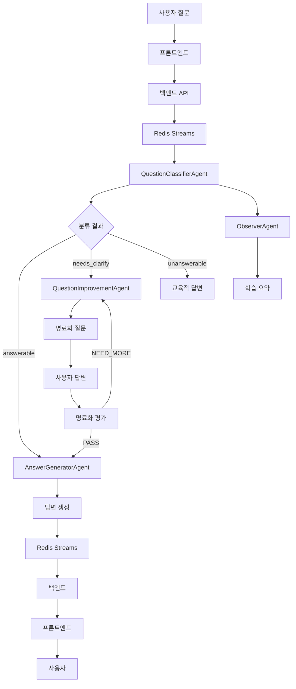

# MAICE 시스템 데이터 플로우

## 📋 개요

MAICE 시스템의 데이터 플로우는 사용자 질문부터 최종 답변까지의 전체 과정을 다룹니다. Redis Streams와 Pub/Sub를 활용한 비동기 처리로 실시간 스트리밍과 높은 성능을 제공합니다.

## 🔄 전체 데이터 플로우



## 📊 데이터 모델

### 1. 질문 분류 데이터
```json
{
  "knowledge_code": "K1|K2|K3|K4",
  "quality": "answerable|needs_clarify|unanswerable",
  "missing_fields": ["누락된 정보들"],
  "unit_tags": ["단원 태그들"],
  "policy_flags": {"위반 사항": false},
  "reasoning": "분류 및 게이팅 판단 근거",
  "clarification_questions": ["명료화 질문들"]
}
```

### 2. 명료화 데이터
```json
{
  "questions": ["친근한 명료화 질문들"],
  "evaluation": "PASS|NEED_MORE",
  "confidence": 0.0-1.0,
  "reasoning": "평가 근거",
  "improved_question": "개선된 질문"
}
```

### 3. 답변 데이터
```json
{
  "answer_type": "K1|K2|K3|K4",
  "content": "답변 내용",
  "structure": {
    "핵심_내용": "...",
    "공식_정리": "...",
    "실제_예시": "...",
    "연관_내용": "..."
  },
  "latex_expressions": ["수식들"]
}
```

## 🗄️ 데이터베이스 스키마

### 사용자 테이블
```sql
CREATE TABLE users (
    id SERIAL PRIMARY KEY,
    username VARCHAR(50) UNIQUE NOT NULL,
    email VARCHAR(100) UNIQUE NOT NULL,
    role user_role NOT NULL,
    created_at TIMESTAMP DEFAULT CURRENT_TIMESTAMP
);
```

### 대화 세션 테이블
```sql
CREATE TABLE conversation_sessions (
    id SERIAL PRIMARY KEY,
    user_id INTEGER REFERENCES users(id),
    title VARCHAR(200),
    created_at TIMESTAMP DEFAULT CURRENT_TIMESTAMP,
    updated_at TIMESTAMP DEFAULT CURRENT_TIMESTAMP
);
```

### 질문 테이블
```sql
CREATE TABLE questions (
    id SERIAL PRIMARY KEY,
    user_id INTEGER REFERENCES users(id),
    question_text TEXT NOT NULL,
    session_id INTEGER REFERENCES conversation_sessions(id),
    knowledge_code VARCHAR(10),
    quality VARCHAR(20),
    created_at TIMESTAMP DEFAULT CURRENT_TIMESTAMP
);
```

### 답변 테이블
```sql
CREATE TABLE answers (
    id SERIAL PRIMARY KEY,
    question_id INTEGER REFERENCES questions(id),
    answer_text TEXT NOT NULL,
    answer_type VARCHAR(10),
    created_at TIMESTAMP DEFAULT CURRENT_TIMESTAMP
);
```

## 🔄 Redis Streams 구조

### 1. 백엔드 → 에이전트 스트림
```json
{
  "stream": "maice:backend_to_agent",
  "fields": {
    "session_id": "12345",
    "user_id": "67890",
    "question": "사용자 질문",
    "timestamp": "2025-01-27T10:00:00Z",
    "message_type": "question_classification"
  }
}
```

### 2. 에이전트 → 백엔드 스트림
```json
{
  "stream": "maice:agent_to_backend",
  "fields": {
    "session_id": "12345",
    "agent_type": "question_classifier",
    "result": "분류 결과 JSON",
    "timestamp": "2025-01-27T10:00:01Z",
    "message_type": "classification_complete"
  }
}
```

### 3. 에이전트 간 Pub/Sub
```json
{
  "channel": "maice:agent_communication",
  "message": {
    "from_agent": "question_classifier",
    "to_agent": "answer_generator",
    "session_id": "12345",
    "data": "전달할 데이터"
  }
}
```

## 📈 성능 최적화

### 1. 비동기 처리
- Redis Streams를 통한 비동기 메시지 처리
- 에이전트 간 병렬 처리
- 스트리밍 답변으로 응답 시간 단축

### 2. 캐싱 전략
- Redis를 활용한 세션 데이터 캐싱
- 프롬프트 템플릿 캐싱
- 사용자 인증 토큰 캐싱

### 3. 데이터베이스 최적화
- 인덱스 최적화
- 연결 풀 관리
- 비동기 쿼리 처리

## 🔍 모니터링

### 1. 메시지 큐 모니터링
- Redis Streams 길이 모니터링
- 메시지 처리 지연 시간 측정
- 에이전트별 처리량 추적

### 2. 데이터베이스 모니터링
- 연결 풀 상태
- 쿼리 성능
- 트랜잭션 처리량

### 3. 애플리케이션 메트릭
- API 응답 시간
- 에이전트 처리 시간
- 사용자 세션 지속 시간
