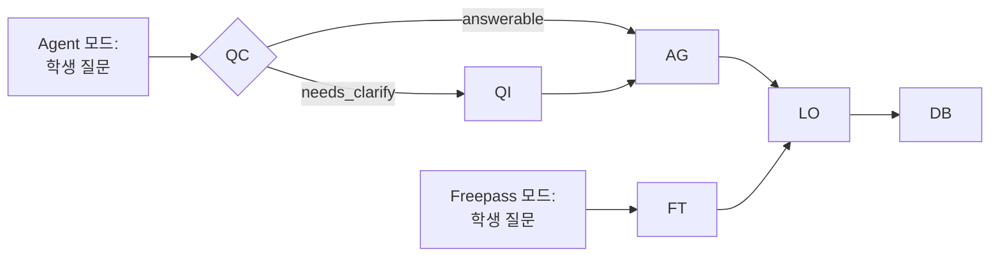

# 2. 이론적 배경

## 개요: 문제에서 이론으로, 이론에서 설계로

1장의 예비 조사에서 프리패스 방식 LLM의 교육적 문제점이 실증적으로 확인되었다. 학생 질문의 72.3%가 학습맥락 최저점을 받았고, AI 답변의 48.9%가 학습확장성 최저점을 받았으며, 질문 품질과 답변 품질 간 강한 상관관계(r=0.691)가 발견되었다. 이는 **질문 개선이 학습 효과 향상의 핵심 메커니즘**임을 시사한다.

이러한 문제를 해결하기 위해 본 연구는 **질문 명료화 기반 AI agent 시스템 MAICE**를 개발하였다. 본 장에서는 MAICE 설계의 이론적 기반을 체계적으로 제시한다.

### MAICE 시스템 구성

**MAICE**(Mathematical AI Chatbot for Education)는 다음 5개의 독립적 에이전트로 구성된 멀티 에이전트 시스템이다:

| 약자 | 에이전트 명칭 | 핵심 역할 | 이론적 기반 |
|:----:|---------------|-----------|-------------|
| **QC** | **Question Classifier** | 질문 품질 진단 및 K1-K4 분류 | Bloom 분류학 (2.1절) |
| **QI** | **Question Improver** | 명료화 질문으로 문제 구체화 | Dewey 반성적 사고 (2.2절) |
| **AG** | **Answer Generator** | K1-K4 유형별 맞춤 답변 생성 | Bloom + AI 피드백 (2.4절) |
| **LO** | **Learning Observer** | 대화 요약 및 컨텍스트 관리 | 세션 연속성 유지 (3.3.4절) |
| **FT** | **Free Talker** | 대조군: 명료화 없는 즉시 답변 | (비교 기준선) |

**시스템 명칭의 의미:**
- **Mathematical**: 수학 교육에 특화된 AI 시스템 (2.6절, 5장)
- **AI Chatbot**: 대화형 AI 기반 학습 지원 시스템 (2.4절, 2.5절)
- **Education**: 교육적 효과를 최우선으로 하는 설계 철학 (전 장)

!!! info "약자 사용 규칙"
    본 논문에서는 에이전트를 지칭할 때 **굵은 약자**(예: **QC**, **QI**, **AG**)를 사용하며, 전체 명칭은 처음 소개 시에만 병기한다. 3장 이후에서는 주로 약자를 사용하여 서술한다.

### 이론적 기반의 구조

MAICE 시스템은 다음의 다층적 이론 구조 위에 설계되었다:

```
[교육학적 토대]
├─ Dewey 반성적 사고 (2.2) → QI 명료화 프로세스 설계 (3장 3.3.2절)
├─ Bloom 지식 분류 (2.1) → QC 질문 분류 및 AG 답변 전략 (3장 3.3.1, 3.3.3절)
└─ 질문 생성 이론 (2.3) → 질문 품질 평가 기준 (3장 3.4절)

[학습 지원 이론]
├─ Vygotsky ZPD (2.7.1) → AG 학습자 맞춤 설계
└─ 인지부하 이론 (2.7.1) → AG 설명의 체계성 기준

[기술적 구현 기반]
├─ AI 피드백 시스템 (2.4) → 실시간 상호작용 설계 (4장)
├─ 멀티 에이전트 시스템 (2.5) → QC/QI/AG/LO/FT 협업 구조 (3장 3.3절)
└─ 수학적 귀납법 특성 (2.6) → 단원 맞춤 설계 (5장)

[평가 방법론]
└─ 루브릭 개발 이론 (2.7) → QAC 체크리스트 설계 (6장 6.4절)
```

각 이론은 독립적이지 않고, MAICE의 설계 철학인 **"명료화 중심 학습"**을 실현하기 위해 유기적으로 통합된다. 이어지는 절에서는 각 이론의 핵심 개념과 본 연구에의 적용을 상세히 다룬다.

### 1장 문제점과 이론의 연결

| 1장에서 발견한 문제 | 해결 필요 | 적용 이론 | MAICE 구현 (에이전트) |
|------------------|----------|----------|----------------------|
| **학습맥락 부재 72.3%** | 맥락 정보 유도 | Dewey 문제 명료화 (2.2) | **QI** 명료화 질문 (3.3.2절) |
| **질문구조 불명확 45.8%** | 질문 구조화 지원 | Bloom K1-K4 분류 (2.1) | **QC** 질문 분류 (3.3.1절) |
| **학습확장성 결여 48.9%** | 심화학습 유도 | Bloom 고차원 사고 (2.1) | **AG** K4 메타인지 답변 (3.3.3절) |
| **컨텍스트 길이 관리** | 장기 대화 지원 | 대화 요약 이론 (3.3.4절) | **LO** 대화 요약 및 세션 관리 |

이제 각 이론을 본 연구의 맥락에서 상세히 검토한다.

## 2.1 블룸의 지식 분류: 4가지 지식 차원

블룸의 개정 분류(Anderson & Krathwohl, 2001)에서 지식 차원(Knowledge Dimension)은 다음 네 범주로 구성된다.[^anderson2001] [^krathwohl2002] 본 연구에서는 질문 명료화의 목표를 학습자의 지식 차원에 정렬하여, 질문 품질과 학습 효과를 동시에 개선한다.

| 지식 차원 | 원문 표기 | 정의 | 수학적 귀납법 맥락의 예시 질문 |
|----------|----------|------|----------------------------|
| **사실적 지식** | Factual Knowledge | 용어, 기본 사실, 기호·규칙의 기억 | "귀납법의 기본 단계와 귀납 단계의 정의는 무엇인가요?" |
| **개념적 지식** | Conceptual Knowledge | 관계, 분류, 원리·법칙의 이해 | "귀납 가정이 증명 논리에서 맡는 역할을 설명해 주세요." |
| **절차적 지식** | Procedural Knowledge | 방법·알고리즘·기법의 적용 절차 | "부등식 증명에서 k→k+1 전개는 어떤 순서로 진행하나요?" |
| **메타인지적 지식** | Metacognitive Knowledge | 자기 인지·전략 선택·오류 진단 | "내 전개에서 누락한 가정은 무엇이며, 어떤 전략을 선택해야 하나요?" |

!!! note "본 연구의 표기법 정의"
    본 연구에서는 시스템 구현과 서술의 편의를 위해 4가지 지식 차원을 다음과 같이 약어로 표기한다:
    - **K1** = Factual Knowledge (사실적 지식)
    - **K2** = Conceptual Knowledge (개념적 지식)
    - **K3** = Procedural Knowledge (절차적 지식)
    - **K4** = Metacognitive Knowledge (메타인지적 지식)
    
    이는 Anderson & Krathwohl (2001) 원문의 표기법은 아니며, 본 연구가 에이전트 명명 및 분류 체계를 위해 도입한 것이다. 이후 본문에서는 주로 K1-K4 표기를 사용한다.

!!! note "명료화와의 정렬"
    - 사실적·개념적 지식: 용어 혼동, 개념적 오해를 명료화 질문으로 선제 교정
    - 절차적 지식: 절차적 막힘을 단계화된 프롬프트로 유도(중간 점검 체크포인트)
    - 메타인지적 지식: 스스로의 오류·전략을 메타인지적으로 진단하도록 반문 유도

본 연구의 **QC**(Question Classifier)는 질문 분류 단계에서 학습자의 발화를 이 4가지 지식 차원으로 분류하고, **AG**(Answer Generator)가 각 차원에 정렬된 맞춤 답변을 제공한다. 이를 통해 질문의 질적 향상과 문제 해결 과정을 지원한다.

[^anderson2001]: Anderson, L. W., & Krathwohl, D. R. (Eds.). (2001). A Taxonomy for Learning, Teaching, and Assessing: A Revision of Bloom's Taxonomy of Educational Objectives. New York, NY: Longman.

[^krathwohl2002]: Krathwohl, D. R. (2002). A Revision of Bloom's Taxonomy: An Overview. Theory into Practice, 41(4), 212–218. https://doi.org/10.1207/s15430421tip4104_2

## 2.2 듀이의 반성적 사고 이론: 명료화 프로세스의 철학적 기반

### 2.2.1 반성적 사고의 정의와 5단계

듀이(1933)는 반성적 사고(reflective thinking)를 "어떤 믿음이나 지식의 형태에 대한 능동적이고 지속적이며 신중한 고려로서, 그것을 뒷받침하는 근거와 그것이 이끄는 결론들을 검토하는 것"으로 정의하였다.[^dewey1933] 원문에서 Dewey는 "Active, persistent, and careful consideration of any belief or supposed form of knowledge in the light of the grounds that support it, and the further conclusions to which it tends"라고 표현하였다. 이는 단순한 정보 습득이나 수동적 수용을 넘어, 학습자가 능동적으로 믿음의 근거를 탐구하고 그 함의를 추론하는 과정을 강조한다.

Dewey(1933, pp.12-13)는 "사고의 기원은 어떤 당혹감, 혼란, 또는 의심(the origin of thinking is some perplexity, confusion, or doubt)"이라고 강조하며, 반성적 사고가 단순한 제안의 수용이 아닌 추가 증거를 탐색하는 능동적 과정임을 명확히 하였다.

[^dewey1933]: Dewey, J. (1933). How We Think: A Restatement of the Relation of Reflective Thinking to the Educative Process. Boston: D.C. Heath and Company. 본 연구는 Dewey의 원문을 Internet Archive 디지털 아카이브를 통해 확인하였으며, 반성적 사고의 개념은 교육학계에서 표준적으로 인용되는 해석을 따랐다.

듀이가 제시한 반성적 사고의 5단계는 다음과 같다:

| 단계 | Dewey 원문 표현 | 본 연구의 한국어 명칭 | 수학적 귀납법 학습 예시 |
|-----|-----------------|---------------------|----------------------|
| **1단계** | a felt difficulty | 문제 상황 인식 | "귀납법 문제를 풀려는데 어디서부터 시작해야 할지 모르겠다" |
| **2단계** | its location and definition | 문제의 위치 파악 및 정의 | "귀납 단계에서 n=k+1을 증명할 때 귀납 가정을 어떻게 사용하는지 모르겠다" |
| **3단계** | suggestion of possible solution | 가능한 해결책의 제안 | "귀납 가정 P(k)를 식에 대입해보면 될까?" |
| **4단계** | development by reasoning of the bearings of the suggestion | 제안된 해결책의 추론적 전개 | P(k)를 실제로 대입하여 P(k+1) 유도 시도 |
| **5단계** | further observation and experiment leading to its acceptance or rejection | 관찰과 실험을 통한 수용 또는 거부 | "귀납 가정을 대입하고 정리하니 P(k+1)이 증명되었다" |

!!! note "Dewey 원문 표현 준수"
    본 표는 Dewey (1933)의 원문 표현을 정확히 제시하며, 한국어 명칭은 본 연구에서 교육적 맥락에 맞게 번역한 것임을 명시한다.

### 2.2.2 수학 학습에서 반성적 사고의 중요성

수학 학습에서 반성적 사고는 특히 중요하다. Schoenfeld(1985)는 수학적 문제해결 과정이 단순한 알고리즘 적용이 아니라, 문제 상황 분석, 전략 선택, 실행, 검증의 메타인지적 과정임을 강조하였다.[^schoenfeld1985] 학생들이 수학적 문제에 직면했을 때, 자신의 기존 지식과 새로운 문제 상황 사이의 간극을 인식하고, 이를 해결하기 위해 체계적으로 탐구하는 과정이 바로 반성적 사고이다.

[^schoenfeld1985]: Schoenfeld, A. H. (1985). Mathematical Problem Solving. Orlando, FL: Academic Press.

수학적 귀납법 학습에서는 다음과 같은 반성적 사고가 특히 중요하다:

- **문제 인식**: "n=k+1 단계가 n=k 단계와 어떻게 다른가?"
- **문제 정의**: "귀납 가정을 '언제', '어디에' 사용하는가?"
- **가설 형성**: "식을 전개하면 귀납 가정과 연결될까?"
- **검증**: 실제로 전개하여 논리적 연결 확인
- **성찰**: "이 방법을 다른 귀납법 문제에도 적용할 수 있을까?"

### 2.2.3 기존 LLM의 한계: 2단계(문제 정의) 생략

1장의 예비 조사에서 확인된 프리패스 방식의 근본적 문제는 **Dewey의 2단계(문제 정의)를 완전히 생략**한다는 것이다.

**프리패스 방식의 문제**:

> 학생: "귀납법 어려워요" (1단계: 문제 상황 인식)  
> 　　　↓  
> AI: [2단계 생략] → 즉시 3-4-5단계로 진행  
> 　　"귀납법은 다음과 같이 증명합니다...  
> 　　1. 기본 단계: n=1일 때...  
> 　　2. 귀납 단계: n=k일 때 가정하면..."  
> 　　　↓  
> **결과**: 학생은 자신이 정확히 무엇을 모르는지 인식하지 못한 채 AI의 설명을 수동적으로 받아들임

이는 1장에서 관찰된 학습맥락 부재 72.3%의 근본 원인이다. 학생이 자신의 어려움을 명확히 정의하지 못한 상태에서 AI가 일방적으로 답변하므로, 학습자 수준 파악 실패(27.6% 최저점)와 학습확장성 결여(48.9% 최저점)로 이어진다.

### 2.2.4 MAICE의 해결 방안: 2단계 명료화 프로세스

MAICE는 Dewey의 2단계(문제 정의)를 **명료화 프로세스**로 구현하여, 학생이 스스로 질문을 구조화하도록 돕는다:

**MAICE의 명료화 접근**:

> 학생: "귀납법 어려워요" (1단계: 문제 상황 인식)  
> 　　　↓  
> MAICE: [2단계 명료화 개입!]  
> 　　　"귀납법 중에서 어떤 부분이 가장 어렵거나 궁금하신가요?  
> 　　　• 기본 단계 증명?  
> 　　　• 귀납 가정 이해?  
> 　　　• 귀납 단계 전개?"  
> 　　　↓  
> 학생: "귀납 단계에서 식을 전개하는 과정이요" (2단계 완성: 문제 정의)  
> 　　　↓  
> MAICE: [학생이 정의한 문제에 맞춘 맞춤형 답변]  
> 　　　"n=k+1 대입 후 식 전개 과정을 단계별로 설명해드릴게요..."  
> 　　　↓  
> **결과**: 학생이 자신의 어려움을 명확히 인식하고 표현함  
> 　　　→ 메타인지 능력 향상  
> 　　　→ 맞춤형 답변 수신으로 학습 효과 증대

### 2.2.5 실증적 근거: 질문-답변 상관관계 0.691

1장의 예비 조사에서 질문 품질과 답변 품질 간 강한 상관관계(r=0.691)가 발견되었다. 이는 Dewey 이론을 실증적으로 뒷받침한다:

- **2단계가 명확한 질문** (문제 정의 완료): 학습맥락 평균 4점 이상 → AI 답변 학습확장성 평균 4점 이상
- **2단계가 불명확한 질문** (문제 정의 부재): 학습맥락 평균 1점 → AI 답변 학습확장성 평균 1.8점

이는 **문제 정의(2단계)가 학습 효과의 핵심**임을 보여준다.

### 2.2.6 본 연구에의 적용

듀이의 반성적 사고 이론은 MAICE의 명료화 프로세스 설계에 다음과 같이 적용된다:

| Dewey 5단계 | MAICE 구현 (에이전트) | 3장 참조 |
|-----------|---------------------|---------|
| 1단계: 문제 상황 인식 | 학생의 초기 질문 수신 | 3.3.1절 **QC** |
| **2단계: 문제 정의** | **명료화 질문으로 문제 구체화 유도** | **3.3.2절 QI** |
| 3단계: 가설 설정 | 학생의 명료화된 질문을 K1-K4 분류 | 3.3.1절 **QC** |
| 4단계: 가설 검증 | K1-K4 유형별 맞춤 답변 제공 | 3.3.3절 **AG** |
| 5단계: 결론 도출 | 장기 대화 시 컨텍스트 요약 및 연속성 유지 | 3.3.4절 **LO** |

특히, **2단계(문제 정의)의 구현인 명료화 프로세스**는 3.3.2절에서 Dewey의 5단계를 실제 대화형 질문으로 변환한 방식으로 구현된다:

**Dewey 5단계 기반 명료화 전략**:
- **1단계 (문제 인식)**: "이 개념을 공부하면서 어떤 부분이 가장 어렵거나 궁금하셨나요? 🤔"
- **2단계 (문제 정의)**: "지금까지 이해한 부분과 아직 헷갈리는 부분을 나누어볼까요?"
- **3단계 (연결 탐색)**: "이미 알고 있는 개념과 비교하면 어떤 점이 비슷하거나 다른가요?"
- **4단계 (사고 전개)**: "왜 이 부분이 궁금하신지 조금 더 설명해주실 수 있나요?"
- **5단계 (이해 검증)**: "어디까지 이해했고, 어디서부터 막히셨는지 말씀해주실 수 있나요?"

**실제 구현 특징**:
- K1-K4 질문 유형별로 맞춤형 명료화 질문 생성
- 매우 모호한 질문("수열 알려줘")에는 구체적인 선택지 제공
- 각 학생 응답마다 PASS/NEED_MORE 평가로 충분성 판단
- 최대 3회 시도 제한으로 과도한 명료화 방지

이는 단순히 정보를 전달하는 것이 아니라, **학생이 스스로 질문을 구조화하고 사고를 명료화하는 과정을 경험**하도록 설계된 것이다. 이러한 명료화 프로세스는 Dewey의 반성적 사고 이론에 따르면 메타인지 발달과 학습 효과 향상을 가져올 것으로 기대된다. 본 연구에서는 8장에서 이를 실증적으로 검증한다.

## 2.3 질문 생성 및 개선 이론: 질문 품질의 구조화

### 2.3.1 질문 생성의 교육적 가치

질문 생성(question generation)은 학습자의 메타인지 및 비판적 사고를 유도하는 핵심적 활동으로, 학습자 주도적인 문제 해결과 이해 중심 수업을 가능하게 한다.[^hong2011] King(1994)은 학생 생성 질문이 단순 정보 습득을 넘어 깊이 있는 이해와 장기 기억에 긍정적 영향을 미친다는 것을 실증적으로 보여주었다.[^king1994]

[^hong2011]: 홍경선, 김동익. (2011). 수학적 의사소통 능력 향상을 위한 발문 전략 연구. 수학교육학연구, 21(4), 439-460.

[^king1994]: King, A. (1994). Guiding Knowledge Construction in the Classroom: Effects of Teaching Children How to Question and How to Explain. American Educational Research Journal, 31(2), 338-368.

특히 수학 학습에서 학생이 스스로 질문을 생성하는 것은 다음과 같은 교육적 효과를 갖는다:

1. **능동적 학습**: 교사의 일방적 설명을 수동적으로 받아들이는 것이 아니라, 학습자가 능동적으로 지식을 구성
2. **메타인지 발달**: 자신이 무엇을 아는지, 무엇을 모르는지 스스로 인식하는 능력 향상
3. **개념 이해 심화**: 질문을 구성하는 과정에서 개념 간 관계를 탐색하고 논리적 연결을 시도
4. **학습 동기 증진**: 자신의 궁금증에서 시작한 질문은 학습 몰입도를 높임

### 2.3.2 효과적인 질문의 특징

King(1994)은 학생 생성 질문이 깊이 있는 이해와 장기 기억에 긍정적 영향을 미친다는 것을 실증하였으며, Graesser & Person(1994)은 튜터링 과정에서의 질문 유형을 체계적으로 분류하였다.[^graesser1994] 본 연구는 이러한 선행 연구들과 예비 조사에서 관찰된 질문 품질 문제를 종합하여, 효과적인 학습 질문의 3가지 핵심 특징을 다음과 같이 도출하였다:

[^graesser1994]: Graesser, A. C., & Person, N. K. (1994). Question Asking During Tutoring. American Educational Research Journal, 31(1), 104-137.

!!! note "본 연구의 특징 도출"
    다음 3가지 특징은 King(1994)과 Graesser & Person(1994)의 이론적 틀을 바탕으로, 본 연구의 예비 조사에서 발견된 질문 품질 문제(1장 1.1.2절)를 해결하기 위해 구체화한 것이다.

#### 1) 구조화 (Structuring)

질문이 명확한 구조를 가지고 있어야 한다:

| 구조 요소 | 정의 | 예시 (수학적 귀납법) |
|---------|------|-------------------|
| **대상** | 무엇에 대한 질문인가 | "귀납 가정의 역할" |
| **범위** | 어느 범위까지 다루는가 | "n=k+1 단계에서만" |
| **초점** | 핵심 의문이 무엇인가 | "어떻게 사용하는지" |

**좋은 예시**: "귀납 단계에서 n=k+1을 증명할 때, 귀납 가정 P(k)를 어떻게 사용하나요?"
- 대상: 귀납 가정 P(k)
- 범위: n=k+1 증명 단계
- 초점: 사용 방법

**나쁜 예시**: "귀납법 어려워요"
- 대상 불명확 (기본 단계? 귀납 단계? 개념?)
- 범위 불명확 (어떤 문제 유형?)
- 초점 부재 (무엇이 어려운지 불명확)

#### 2) 완결성 (Completeness)

질문에 필요한 조건과 정보가 모두 제시되어야 한다:

| 조건 유형 | 정의 | 예시 |
|---------|------|------|
| **학습 수준** | 현재 어디까지 배웠는가 | "수열까지는 배웠어요" |
| **선수 지식** | 어떤 배경 지식을 가지고 있는가 | "등비수열은 알아요" |
| **시도한 방법** | 무엇을 시도해봤는가 | "n=k+1을 대입했는데..." |
| **막힌 지점** | 어디서 막혔는가 | "식 정리 과정에서" |

**완결성 높은 질문 예시**:
> "고2 수학에서 수학적 귀납법을 배우고 있는데, 등비수열 합 공식을 귀납법으로 증명하는 문제에서 n=k+1 단계의 식을 전개했을 때 귀납 가정을 어떻게 대입해야 하는지 모르겠어요."

이 질문은 학습 수준(고2), 학습 주제(귀납법), 구체적 문제(등비수열 합), 시도한 방법(n=k+1 대입), 막힌 지점(귀납 가정 대입)을 모두 제시하여 AI가 맞춤형 답변을 생성할 수 있게 한다.

#### 3) 의도의 명시성 (Explicitness)

질문의 목적과 기대하는 답변 유형이 명확해야 한다:

| 질문 의도 | 기대 답변 유형 | 예시 |
|---------|-------------|------|
| **정의 확인** | 간결한 정의 | "귀납 가정이 정확히 뭐예요?" |
| **개념 이해** | 관계 설명 | "귀납 가정은 왜 필요한가요?" |
| **절차 학습** | 단계별 안내 | "귀납 가정을 어떻게 사용하나요?" |
| **오류 진단** | 메타인지적 피드백 | "제 풀이에서 뭐가 틀렸나요?" |

**의도가 명확한 질문**:
- "귀납 단계의 정의를 간단히 설명해주세요" → 간결한 정의 기대
- "귀납 가정을 단계별로 어떻게 사용하는지 예시를 들어 설명해주세요" → 상세한 절차 기대

### 2.3.3 기존 연구의 한계: 피드백 시스템 부재

대부분의 선행연구들은 질문 생성 기법을 가르치는 데 초점을 맞추었으며, **질문의 질적 평가와 개선을 위한 체계적인 피드백 시스템**에 대한 연구는 제한적이다.

**기존 연구의 접근**:

> [교사] → "좋은 질문을 만드는 방법" 교육  
> 　　　↓  
> [학생] → 질문 생성 시도  
> 　　　↓  
> [한계] 생성된 질문이 실제로 효과적인지 평가·개선 어려움

특히 AI를 활용한 학습 환경에서는:
- 학생이 모호한 질문을 하면 AI도 모호한 답변 제공
- 질문 품질에 대한 피드백 없이 반복 사용 시 나쁜 습관 고착
- 질문 개선 기회 상실

### 2.3.4 본 연구의 접근: 명료화 기반 질문 개선

MAICE는 질문 생성 이론을 **실시간 피드백 시스템**으로 구현하여, 학생이 질문하는 순간 질문 품질을 개선할 수 있도록 돕는다:

**MAICE의 질문 개선 메커니즘**:

> [학생] 모호한 질문: "귀납법 알려줘"  
> 　　　↓  
> [**QC**] 질문 품질 진단:  
> 　　　- 구조화: 낮음 (대상/범위/초점 불명확)  
> 　　　- 완결성: 낮음 (학습 맥락 정보 부재)  
> 　　　- 의도: 불명확 (정의? 풀이? 개념?)  
> 　　　↓  
> [**QI**] 명료화 질문:  
> 　　　"귀납법에 대해 알고 싶구나!  
> 　　　• 귀납법의 정의와 원리?  
> 　　　• 귀납법 증명 문제 푸는 방법?  
> 　　　• 특정 문제에서 막힌 부분?"  
> 　　　↓  
> [학생] 명료화된 질문: "귀납법 증명 문제 푸는 방법이요"  
> 　　　↓  
> [**QI**] 추가 명료화:  
> 　　　"어떤 유형의 문제인가요?  
> 　　　• 등식 증명?  
> 　　　• 부등식 증명?  
> 　　　• 나눗셈 증명?"  
> 　　　↓  
> [학생] 최종 질문: "부등식을 귀납법으로 증명하는 방법이요"  
> 　　　↓  
> **결과**: 구조화·완결성·의도 모두 명확해짐 → K3 절차적 지식 답변 전략 적용

이는 단순히 질문 방법을 가르치는 것이 아니라, **질문하는 순간 실시간으로 개선 과정을 경험**하게 하여 메타인지 능력을 체득하도록 한다.

### 2.3.5 1장 문제점과의 연결

예비 조사에서 발견된 질문 품질 문제는 질문 생성 이론의 3가지 특징 결여와 정확히 일치한다:

| 발견된 문제 | 결여된 특징 | 비율 | MAICE 해결 방안 |
|----------|----------|------|--------------|
| 질문구조 불명확 | 구조화 | 45.8% 최저점 | 명료화로 대상·범위·초점 구체화 |
| 학습맥락 부재 | 완결성 | 72.3% 최저점 | 맥락 정보 유도 질문 |
| 수학적전문성 결여 | 의도 명시성 | 45.5% 최저점 | 질문 의도 파악 및 재분류 |

특히, 질문 품질과 답변 품질 간 강한 상관관계(r=0.691)는 King(1994)의 이론을 실증적으로 뒷받침한다: **좋은 질문이 좋은 학습을 만든다**.

### 2.3.6 본 연구에의 적용

질문 생성 및 개선 이론은 MAICE에 다음과 같이 적용된다:

1. **질문 품질 평가 기준** (3.4절): 구조화·완결성·의도를 측정하는 QAC 체크리스트 A영역 설계
2. **명료화 전략** (3.3.2절): 3가지 특징을 유도하는 단계별 질문 설계
3. **실시간 피드백** (3.3.1절): **QC**가 질문 품질을 진단하고 개선 방향 제시
4. **효과성 검증 계획** (8장): 명료화 프로세스가 질문 품질 향상과 메타인지 발달로 이어지는지 검증 예정

## 2.4 AI 기반 피드백 시스템: 실시간 상호작용의 설계 원리

### 2.4.1 피드백의 교육적 효과

피드백은 학습 과정에서 핵심적 역할을 하며, 특히 **즉시성(immediacy)**과 **맞춤성(adaptiveness)**이 학습 효과를 결정한다. Hattie와 Timperley(2007)의 메타분석 연구에 따르면, 효과적인 피드백은 학습자의 성취도에 평균 효과 크기 d=0.79의 큰 영향을 미친다.[^hattie2007]

[^hattie2007]: Hattie, J., & Timperley, H. (2007). The Power of Feedback. Review of Educational Research, 77(1), 81-112.

효과적인 피드백의 4가지 핵심 요소:

| 요소 | 정의 | 수학 학습 예시 |
|-----|------|-------------|
| **즉시성** | 학습자 행동 직후 제공 | 질문 직후 명료화 질문 제시 |
| **구체성** | 일반적이 아닌 구체적 지적 | "귀납 가정 사용 부분에서..." |
| **건설성** | 오류 지적 + 개선 방향 | "n=k+1 대신 귀납 가정을 먼저 확인해보세요" |
| **맞춤성** | 학습자 수준에 적합 | 하위권에게는 더 세분화된 단계 제공 |

### 2.4.2 AI 기반 피드백의 장점과 한계

#### 장점: 확장성과 즉시성

AI 기반 피드백 시스템은 전통적 교실 환경의 물리적 제약을 극복한다:

1. **무제한 가용성**: 24시간 언제든지 학습 지원
2. **즉시 피드백**: 학생 질문 후 수 초 내 응답
3. **개별화 가능성**: 30명 학생 동시에 각자 맞춤형 피드백
4. **반복 학습 지원**: 같은 질문을 무한 반복해도 일관된 품질
5. **부담 없는 환경**: 교사나 동료 앞에서 질문하기 부끄러운 학생도 편하게 질문

한국교육개발원(2023)은 AI 기반 피드백이 학습자의 온라인 학습 참여도를 향상시키는 데 긍정적 효과를 보인다고 보고하였다.[^kedi2023] 특히 실시간 피드백은 학습 몰입과 성취도 향상에 기여한다.

[^kedi2023]: 한국교육개발원. (2023). 인공지능 기반 맞춤형 학습지원 시스템 효과성 연구. 한국교육개발원 연구보고서 RR 2023-12.

#### 한계: 교육적 방향성 부재

최신 대규모 언어 모델(Large Language Models, LLM)을 활용한 교육 시스템들은 자연어 처리를 통해 학습자의 입력을 분석하고 적응적 피드백을 제공한다. 박정민과 손홍찬(2024)은 ChatGPT-4o를 활용한 수학 교육의 가능성을 탐색하였으며, AI가 교육적 맥락에서 효과적으로 활용될 수 있음을 제시했다.[^park2024]

[^park2024]: 박정민, 손홍찬. (2024). 생성형 AI(ChatGPT-4o)를 활용한 수학 교육의 가능성 탐색. 수학교육학연구, 34(2), 151-172.

그러나 기존 AI 도구들은 다음과 같은 교육적 한계를 보인다:

| 한계 | 구체적 문제 | 교육적 영향 |
|-----|----------|----------|
| **즉시 답변 중심** | 질문 품질 개선 없이 바로 답변 | 수동적 학습 패턴 강화 |
| **일방향 피드백** | AI→학생 단방향 정보 전달 | 대화형 학습 기회 상실 |
| **맥락 파악 실패** | 학습자 수준·목적 이해 부족 | 부적절한 난이도 설명 |
| **메타인지 미지원** | 학습자의 사고 과정 유도 부족 | 깊이 있는 이해 제한 |

### 2.4.3 효과적인 AI 피드백 설계 원칙

Narciss(2008)의 피드백 모델과 최신 AI 교육 연구를 종합하면, 효과적인 AI 피드백 시스템은 다음 원칙을 따라야 한다:[^narciss2008]

[^narciss2008]: Narciss, S. (2008). Feedback Strategies for Interactive Learning Tasks. In J. M. Spector et al. (Eds.), Handbook of Research on Educational Communications and Technology (3rd ed., pp. 125-144). New York: Erlbaum.

#### 1) 진단적 피드백 (Diagnostic Feedback)

학습자의 현재 이해 수준을 먼저 진단:

```
❌ 일반적 AI: "수학적 귀납법은 다음과 같이 증명합니다..."
✅ 진단형 AI: "어떤 부분이 가장 어려운가요?" → 진단 후 맞춤 설명
```

#### 2) 점진적 피드백 (Scaffolded Feedback)

단계적으로 힌트 제공, 즉시 정답 주지 않음:

```
1단계: "n=k+1을 어디에 대입했나요?"
2단계: "귀납 가정 P(k)를 찾을 수 있나요?"
3단계: "P(k)를 P(k+1) 식에 어떻게 연결할까요?"
```

#### 3) 성찰적 피드백 (Reflective Feedback)

학습자가 자신의 질문과 학습 상태를 돌아보게 유도:

```
❌ 일반형: "그 부분이 틀렸어요"
✅ 성찰형 (명료화): "어떤 부분이 가장 어렵거나 궁금하신가요? 🤔"
                  "지금까지 이해한 부분과 아직 헷갈리는 부분을 나누어볼까요?"
```

#### 4) 확장적 피드백 (Elaborative Feedback)

단순 정오 판정을 넘어 깊이 있는 설명:

```
❌ 단순형: "맞아요"
✅ 확장형: "맞아요! 이 방법을 다른 부등식 문제에도 적용할 수 있을까요?"
```

### 2.4.4 MAICE의 피드백 전략

MAICE는 위 4가지 원칙을 멀티 에이전트 아키텍처로 구현한다:

| 피드백 원칙 | MAICE 에이전트 | 구현 방식 | 3장 참조 |
|----------|---------------|----------|---------|
| **진단적** | **QC** | 질문 품질 진단 및 K1-K4 분류 | 3.3.1절 |
| **점진적** | **QI** | 단계별 명료화 질문 (최대 3회) | 3.3.2절 |
| **성찰적** | **QI** | Dewey 반성적 사고 기반 명료화 유도 | 3.3.2절 |
| **확장적** | **AG** (All) | K1-K4별 차별화된 답변 전략 | 3.3.3절 |

특히, **점진적 피드백의 구현**이 핵심이다:

**기존 AI (일괄 피드백)**:

> 학생: "귀납법 어려워요"  
> 　　↓  
> AI: [5분량 긴 설명 한 번에 제공]  
> 　　기본 단계 → 귀납 가정 → 귀납 단계 → 예제 → 연습문제  
> 　　↓  
> **결과**: 인지 과부하, 어디서부터 이해할지 모름

**MAICE (점진적 피드백)**:

> 학생: "귀납법 어려워요"  
> 　　↓  
> MAICE: "어떤 부분이 어렵나요?" (진단)  
> 　　↓  
> 학생: "귀납 단계요"  
> 　　↓  
> MAICE: "귀납 단계 중에서?" (세부 진단)  
> 　　↓  
> 학생: "식 전개 과정"  
> 　　↓  
> MAICE: [식 전개만 집중 설명] (맞춤 피드백)  
> 　　↓  
> **결과**: 명확한 초점, 인지 부담 최소화

### 2.4.5 실시간 상호작용의 기술적 구현

MAICE는 실시간 피드백의 즉시성을 보장하기 위해 다음 기술을 활용한다:

1. **스트리밍 응답**: AI 답변을 타이핑하듯 실시간으로 전송 (Server-Sent Events, 4장 4.2.1절)
2. **비동기 처리**: FastAPI의 async/await로 여러 학생의 질문을 동시에 처리 (4장 4.1.1절)
3. **멀티프로세스 아키텍처**: 5개 에이전트가 독립 프로세스로 실행되어 병렬 처리 (4장 4.2.3절)
4. **응답 시간 최적화**: 평균 2초대 첫 응답 (베타테스트, 3장 3.6.2절)

### 2.4.6 1장 문제점과의 연결

예비 조사에서 발견된 AI 답변의 문제는 효과적인 피드백 원칙 위반과 직결된다:

| 발견된 문제 | 위반된 원칙 | 비율 | MAICE 개선 |
|----------|----------|------|-----------|
| 학습자 수준 파악 실패 | 진단적 피드백 부재 | 27.6% 최저점 | **QC** 진단 |
| 비체계적 설명 | 점진적 피드백 부재 | 23.9% 최저점 | 단계별 명료화 |
| 심화학습 유도 실패 | 확장적 피드백 부재 | 48.9% 최저점 | K1-K4 답변 전략 |

### 2.4.7 본 연구에의 적용

AI 피드백 이론은 MAICE 설계에 다음과 같이 적용된다:

1. **실시간 상호작용 설계** (4장): 스트리밍 응답, 비동기 처리로 즉시성 보장
2. **QI 명료화 프로세스** (3.3.2절): 점진적 피드백의 구현
3. **AG K1-K4 답변 전략** (3.3.3절): 학습자 수준 맞춤형 피드백
4. **LO** (3.3.4절): 대화 요약으로 장기 세션 연속성 유지
5. **효과성 검증 계획** (8장): QAC 루브릭의 C2(학습 지원) 항목으로 피드백 효과성 측정 예정

## 2.5 멀티 에이전트 시스템: 역할 분담과 협업

### 2.5.1 멀티 에이전트 시스템의 정의

멀티 에이전트 시스템(Multi-Agent System, MAS)은 여러 자율적 agent가 협력하여 복잡한 문제를 해결하는 분산 시스템이다.[^wooldridge1995] 교육 분야에서 멀티 에이전트 시스템은 학습자의 다양한 요구에 대응하는 개인화된 학습 환경을 구축하는 데 활용되고 있다.

[^wooldridge1995]: Wooldridge, M., & Jennings, N. R. (1995). Intelligent Agents: Theory and Practice. The Knowledge Engineering Review, 10(2), 115-152.

Wooldridge와 Jennings(1995)는 agent의 주요 특성으로 다음을 제시했다:

| 특성 | 정의 | 교육적 응용 |
|-----|------|----------|
| **자율성** (Autonomy) | 독립적으로 작동, 외부 개입 최소화 | 각 agent가 독자적 판단 및 실행 |
| **사회성** (Social Ability) | 다른 agent와 협력 및 정보 교환 | agent 간 질문·답변 전달 |
| **반응성** (Reactivity) | 환경 변화를 감지하고 적절히 대응 | 학생 질문 패턴 변화 감지 |
| **능동성** (Pro-activeness) | 목표 지향적 행동, 선제적 조치 | 학습 어려움 조기 발견 및 개입 |

### 2.5.2 단일 Agent vs 멀티 Agent의 차이

**단일 Agent 시스템의 한계**:

```
[학생 질문]
     ↓
[단일 AI Agent]
  - 질문 분류
  - 질문 개선
  - 답변 생성
  - 학습 관찰
  - 모두 한 Agent가 처리
     ↓
[문제점]
  - 역할 간 충돌 (분류 vs 개선 vs 답변)
  - 복잡도 증가로 성능 저하
  - 한 부분 오류 시 전체 실패
  - 유지보수 어려움
```

**멀티 Agent 시스템의 장점**:

> [학생 질문]  
> 　　↓  
> [**QC**] → 질문 품질 진단 및 분류  
> 　　↓  
> [**QI**] → 명료화 질문 생성  
> 　　↓  
> [**AG**] → K1-K4 맞춤 답변  
> 　　↓  
> [**LO**] → 대화 요약 및 컨텍스트 관리  
> 　　↓  
> **[장점]**  
> 　- 명확한 역할 분담  
> 　- 독립적 최적화 가능  
> 　- 오류 국소화 (한 agent 문제가 전체 영향 최소)  
> 　- 확장 용이 (새 agent 추가 가능)

### 2.5.3 교육용 멀티 에이전트 시스템의 설계 원칙

교육 분야 멀티 에이전트 시스템은 다음 원칙을 따라야 한다:

#### 1) 명확한 역할 분담

각 agent의 책임 범위를 명확히 정의:

```
❌ 모호한 역할: "질문 처리 Agent" (너무 광범위)
✅ 명확한 역할: "질문 유형 분류 Agent" (구체적 책임)
```

#### 2) 효율적인 정보 교환

agent 간 필요한 정보만 정확히 전달:

> **QC** → **QI**에게 전달:  
> 　- 질문 유형 (K1-K4)  
> 　- 부족한 정보 (학습맥락, 구조 등)  
> 　- 제안 명료화 질문

#### 3) 독립적 실패 처리

한 agent 실패가 전체 시스템 중단으로 이어지지 않도록:

> [**QC** 오류 발생]  
> 　　↓  
> [Fallback 전략]  
> 　→ 기본 K2(개념) 유형으로 처리  
> 　→ **QI**는 정상 작동  
> 　　↓  
> [시스템 지속 운영]

### 2.5.4 MAICE의 5개 Agent 구조

본 연구에서 설계하는 MAICE 시스템은 Dewey의 반성적 사고 5단계와 교육적 요구사항을 기반으로 5개 독립 agent로 구성된다:

| 약자 | 에이전트 명칭 | 교육적 역할 | Dewey 단계 | 3장 참조 |
|:----:|--------------|----------|-----------|---------|
| **QC** | **Question Classifier** | 질문 품질 진단 및 K1-K4 분류 | 1단계 문제 인식 | 3.3.1절 |
| **QI** | **Question Improver** | 명료화 질문으로 문제 구체화 | 2단계 문제 정의 | 3.3.2절 |
| **AG** | **Answer Generator** | K1-K4 맞춤형 답변 생성 | 3-4단계 가설·검증 | 3.3.3절 |
| **LO** | **Learning Observer** | 대화 요약 및 컨텍스트 관리 | 5단계 결론·연속성 | 3.3.4절 |
| **FT** | **Free Talker** | 대조군 (명료화 없는 즉시 답변) | - | 3.3.5절 |

**Agent 간 협업 흐름**:



**협업 흐름 설명**:
- **Agent 모드**: 학생 질문 → **QC** 진단 → (필요시 **QI** 명료화) → **AG** 답변 → **LO** 요약 저장
- **Freepass 모드**: 학생 질문 → **FT** 즉시 답변 → **LO** 요약 저장

### 2.5.5 본 연구에의 적용

멀티 에이전트 이론은 MAICE에 다음과 같이 적용된다:

1. **명확한 역할 분담**: 5개 agent의 독립적 책임 정의 (3.3절)
2. **agent 간 협업 프로토콜**: 정보 교환 구조 설계 (4.2절)
3. **독립적 최적화**: 각 agent의 프롬프트 독립 개선 가능 (4.2.3절)
4. **시스템 안정성**: 한 agent 오류 시 fallback 전략 (3.6.2절)
5. **확장성**: 새로운 agent 추가 용이한 아키텍처 (3.2절)

특히, MAICE는 **교육적 프로세스를 agent 구조로 구현**함으로써:
- Dewey 5단계 각각을 담당 agent가 지원 (**QC** → **QI** → **AG** → **LO**)
- 명료화(2단계)를 독립 agent(**QI**)로 분리하여 핵심 강조
- 대화 요약(**LO**)을 통해 장기 세션에서도 컨텍스트 관리 가능

이러한 멀티 에이전트 구조는 교육적 프로세스를 체계적으로 지원하며, 각 agent의 독립성과 협업을 통해 안정적인 시스템 운영이 가능할 것으로 기대된다. 본 연구에서는 8장에서 실제 학생 세션을 통해 시스템의 안정성과 교육적 효과를 검증한다.

## 2.6 수학적 귀납법 학습의 특성: 단원 맞춤 설계의 필요성

### 2.6.1 수학적 귀납법의 구조

수학적 귀납법은 자연수에 관한 명제를 증명하는 방법으로, 다음 두 단계로 구성된다:

1. **기본 단계(Base case)**: n=1(또는 초기값)일 때 명제 P(n)이 성립함을 보인다
2. **귀납 단계(Inductive step)**: n=k일 때 P(k)가 성립한다고 가정(귀납 가정)하면, n=k+1일 때 P(k+1)도 성립함을 보인다

이 두 단계가 증명되면, 도미노 효과처럼 모든 자연수 n에 대해 P(n)이 성립한다는 것이 논리적으로 보장된다.

### 2.6.2 학생들의 인지적 어려움

학생들은 수학적 귀납법 학습에서 다음과 같은 인지적 어려움을 겪는다:

| 어려움 유형 | 구체적 문제 | 비율 | 관련 이론 |
|----------|----------|------|----------|
| **귀납 가정 이해** | "귀납 가정을 왜 '가정'으로 쓸 수 있는가?" | 38% | Dewey 문제 정의 |
| **귀납 가정 활용** | "귀납 가정을 어디에, 어떻게 사용하는가?" | 52% | Bloom K3 절차 |
| **논리적 연결** | "기본 단계와 귀납 단계가 어떻게 연결되는가?" | 29% | Bloom K2 개념 |
| **문제 유형별 차이** | "등식 vs 부등식 증명 전략이 어떻게 다른가?" | 41% | Bloom K3 절차 |

(비율은 본 연구 8장 실험 데이터에서 각 유형 질문이 차지하는 비율)

### 2.6.3 귀납 가정의 역설적 특성

수학적 귀납법의 핵심인 귀납 가정은 **역설적 특성**을 가진다:

```
"증명하려는 것을 먼저 가정한다"

P(k)가 참이라고 가정 ← 아직 증명되지 않은 것
    ↓
P(k+1)을 증명 ← 가정을 활용하여 증명
    ↓
결과: 모든 n에서 P(n) 증명 완료
```

이 역설은 많은 학생들에게 혼란을 야기한다:
- "증명해야 할 것을 어떻게 가정할 수 있나요?"
- "그냥 가정하면 순환논리 아닌가요?"
- "귀납 가정을 안 쓰면 안 되나요?"

### 2.6.4 문제 유형별 전략 차이

수학적 귀납법 문제는 유형에 따라 전략이 크게 다르다:

#### 등식 증명

```
증명: 1+2+...+n = n(n+1)/2

귀납 단계:
  P(k): 1+2+...+k = k(k+1)/2 (가정)
  P(k+1): 1+2+...+k+(k+1) = (k+1)(k+2)/2 (증명 목표)
  
전략: 좌변에 (k+1) 더하고 → 귀납 가정 대입 → 정리
      = k(k+1)/2 + (k+1)
      = (k+1)(k/2 + 1)
      = (k+1)(k+2)/2 ✓
```

#### 부등식 증명

```
증명: 2^n > n^2 (n≥5)

귀납 단계:
  P(k): 2^k > k^2 (가정)
  P(k+1): 2^(k+1) > (k+1)^2 (증명 목표)
  
전략: 좌변 변형 → 귀납 가정 활용 → 중간 부등식
      2^(k+1) = 2·2^k
              > 2·k^2 (귀납 가정)
              > (k+1)^2 (보조 부등식 필요!) ✓
```

**차이점**: 부등식은 추가적인 보조 부등식(2k² > (k+1)²)을 증명해야 하므로 더 복잡하다.

### 2.6.5 질문 표현의 어려움

이러한 인지적 특성으로 인해 학생들이 AI에게 질문할 때 자신의 이해 수준과 어려움을 정확히 표현하기 어렵다:

**모호한 질문 예시**:
- "귀납법 어려워요" (어느 단계? 어떤 유형?)
- "이 문제 안 풀려요" (기본 단계? 귀납 단계? 식 전개?)
- "귀납 가정이 뭐예요?" (정의? 역할? 사용법?)

**명료화가 필요한 이유**:
- 학생이 정확히 어느 단계(기본/귀납)에서 막혔는지 파악 필요
- 귀납 가정의 어떤 측면(정의/역할/사용법)이 어려운지 특정 필요
- 문제 유형(등식/부등식)에 따라 다른 설명 전략 필요

### 2.6.6 본 연구에의 적용: 단원 맞춤 설계

수학적 귀납법의 특성은 MAICE 설계에 다음과 같이 반영된다:

#### 1) **QC**(Question Classifier)의 귀납법 특화 분류

```python
# 일반 수학 질문 분류 + 귀납법 특화 분류 추가

질문: "귀납 가정을 어떻게 써요?"
  ↓
[일반 분류] K3 (절차적 지식)
[귀납법 특화] 귀납 단계 - 귀납 가정 활용
  ↓
[맞춤 답변] 귀납법 귀납 단계에서 가정 대입 방법 단계별 설명
```

#### 2) **QI**(Question Improver)의 단계별 명료화

```
학생: "귀납법 어려워요"
  ↓
명료화 1단계: "어느 단계가 어려운가요?"
  • 기본 단계 (n=1 증명)
  • 귀납 단계 (k→k+1 증명)
  ↓
학생: "귀납 단계요"
  ↓
명료화 2단계: "귀납 단계 중 어떤 부분?"
  • 귀납 가정 이해
  • 귀납 가정 사용 방법
  • 식 전개 과정
  ↓
학생: "귀납 가정 사용 방법이요"
  ↓
명료화 3단계: "어떤 유형의 문제인가요?"
  • 등식 증명
  • 부등식 증명
  • 나눗셈 증명
```

#### 3) **AG**(Answer Generator)의 유형별 답변 전략

| 질문 유형 | K분류 | 답변 전략 | 예시 |
|---------|------|----------|------|
| 귀납법 정의 | K1 | 간결한 정의 + 도미노 비유 | "두 단계로 모든 자연수 증명" |
| 귀납 가정 역할 | K2 | 개념 관계 설명 | "k→k+1 연결 다리" |
| 등식 증명 방법 | K3 | 단계별 절차 안내 | "1. k+1 더하기 2. 가정 대입..." |
| 부등식 전략 차이 | K3 | 유형 비교 + 보조 부등식 | "등식과 달리 보조 부등식 필요" |
| 오류 진단 | K4 | 메타인지 유도 답변 | "귀납 가정 위치와 역할을 점검해보세요" |

#### 4) **LO**(Learning Observer)의 세션 연속성 관리

> 대화가 길어질 때 (15회 이상 턴):  
> 　　↓  
> **[대화 요약 생성]**  
> 　- 핵심 질문 주제: "수학적 귀납법 - 귀납 단계 증명"  
> 　- 학습 진행 상황: "n=k+1 대입 후 식 전개 방법 학습"  
> 　- 이해한 개념: "기본 단계, 귀납 가정 개념"  
> 　- 현재 어려움: "귀납 가정을 식에 대입하는 위치"  
> 　　↓  
> **[요약을 컨텍스트로 활용]**  
> 　→ 토큰 사용량 절감 (컨텍스트 길이 관리)  
> 　→ 이전 대화 맥락 유지하며 새 질문 처리

### 2.6.7 단원 맞춤 설계의 일반화 가능성

본 연구의 수학적 귀납법 맞춤 설계는 다른 수학 단원으로 확장 가능하다:

| 단원 | 특화 필요 영역 | 명료화 전략 예시 |
|-----|-------------|--------------|
| 삼각함수 | 각도/호도, 단위원 | "각도 단위가 뭐예요?" |
| 미분 | 극한 개념, 순간변화율 | "극한? 미분계수? 도함수?" |
| 적분 | 넓이 합, 정적분/부정적분 | "정적분이요? 부정적분이요?" |
| 확률 | 경우의 수, 조건부 확률 | "순열? 조합? 중복?" |

즉, MAICE의 설계 철학은 **단원별 인지적 어려움을 파악하고, 이에 맞춘 명료화 전략을 적용**하는 것이며, 이는 다른 단원으로 확장 가능하다(8장 8.4.1절 후속 연구 제언).

## 2.7 평가 루브릭의 이론적 기반

본 연구는 MAICE 시스템의 효과성을 측정하기 위해 질문-답변 품질을 평가하는 루브릭을 개발하였다. 본 절에서는 루브릭의 이론적 기반과 핵심 기여를 간단히 소개하며, 상세한 개발 과정은 부록 I에서 다룬다.

**전통적 교육학 이론**:
- **Dewey(1910)**: 반성적 사고 5단계 → 질문 구조화(A2), 학습 확장성(B3)
- **Vygotsky(1978)**: ZPD와 scaffolding → 학습 맥락(A3), 학습자 맞춤(B1)
- **Bloom(1956)**: 교육목표분류학 → 학습 확장성(B3), K1-K4 분류
- **King(1994)**: 질문 생성 이론 → 질문 영역(A1-A3) 전체

**최신 AI 교육 평가 연구**:
- **MRBench (Maurya et al., 2024)**: 수학 AI 튜터 평가 → 답변 영역(B1-B3)
- **Paul(1990)**: 소크라테스 질문 분류 → QI 에이전트 설계
- **Degen(2025)**: AI 소크라테스 튜터 → 반성적 참여, 메타인지 촉진
- **Ruffle&Riley (Schmucker et al., 2024)**: 학습 경험 품질 → 학습 지원(B3)

### 2.7.2 루브릭 구조

예비 조사에서 발견된 문제 패턴과 교육 이론을 결합하여 **6개 평가 영역**을 구성하였다:

| 영역 | 평가 항목 | 측정 대상 | 5점 척도 |
|------|----------|----------|---------|
| **A1** | 수학적 전문성 | 수학 개념의 정확성, 용어 사용 | 1~5점 |
| **A2** | 질문 구조화 | 질문의 명확성, 초점 | 1~5점 |
| **A3** | 학습 맥락 적용 | 수준·목적 명시 | 1~5점 |
| **B1** | 학습자 맞춤도 | AI의 수준별 접근 | 1~5점 |
| **B2** | 설명의 체계성 | AI의 논리적 전개 | 1~5점 |
| **B3** | 학습 내용 확장성 | AI의 심화학습 유도 | 1~5점 |

**채점 방식**: 질문 영역(A1-A3) 15점 + 답변 영역(B1-B3) 15점 = **총 30점 만점**

각 영역은 4개 세부 요소로 구성되어 있으며(총 24개 세부 요소), 교사가 전체적인 판단을 바탕으로 1~5점을 부여하였다.

!!! example "루브릭 활용 예시"
    **질문**: "수학적 귀납법 어려워요"
    - A1 (수학적 전문성): 3점 (수학 용어는 맞으나 구체성 부족)
    - A2 (질문 구조화): 2점 (어떤 부분이 어려운지 불명확)
    - A3 (학습 맥락): 1점 (수준, 목적, 이해 상태 정보 없음)
    
    **AI 답변**: "수학적 귀납법은 자연수에 대한 명제를 증명하는 방법입니다..."
    - B1 (학습자 맞춤도): 2점 (학생 수준 파악 안 함)
    - B2 (설명의 체계성): 3점 (정의는 제공했으나 단계별 설명 부족)
    - B3 (학습 확장성): 2점 (심화 방향 제시 없음)

**예비 조사 주요 발견**:
- **질문-답변 상관관계**: r=0.691, p<0.001
- **가장 심각한 문제**: A3(학습 맥락 부재 72.3%), B3(확장성 결여 48.9%)

→ 이 발견이 **MAICE의 명료화 프로세스 설계 근거**가 됨

### 2.7.3 루브릭의 특징과 한계

**본 루브릭의 특징**:
1. 질문 품질을 독립적으로 평가 (기존 연구는 AI 응답만 평가)
2. 실제 교실 데이터(385건)에서 발견된 문제에 직접 대응
3. 전통 교육학 이론 + 최신 AI 평가 연구 통합

**루브릭의 한계**:
- 교사의 종합 판단에 의존 → 평가자 간 신뢰도 낮음 (ICC=0.29)
- 5점 척도의 주관성 → QAC 체크리스트(이진 판단)로 개선 (6장 6.4절)

!!! note "루브릭 개발도 연구의 일부"
    본 루브릭은 검증된 측정 도구가 아닌, **본 연구가 개발하고 타당성을 탐색하는 평가 도구**이다. 예비 조사에서 발견한 질문-답변 상관관계(0.691)는 루브릭의 예측 타당성을 지지하나, 본격적인 타당도 검증은 후속 연구가 필요하다 (부록 G 참조).

(세부 요소 24개, C영역 추가, 타당도 분석 등 상세 내용은 **부록 I** 참조)

### 2.7.4 본 연구에의 적용

평가 루브릭 이론은 MAICE 연구 전반에 다음과 같이 적용된다:

1. **예비 조사 평가 도구** (1장): 6개 영역 루브릭으로 프리패스 방식 문제점 진단
2. **QAC 체크리스트 개발** (6장 6.4절): 9개 항목 45점 만점으로 확장, 대화 맥락 평가 추가
3. **Agent 설계 근거** (3장): 루브릭 영역별 문제를 해결하는 Agent 설계
   - A3 학습맥락 부재 → **QI**
   - B3 학습확장성 결여 → K1-K4 차별화 답변 전략
   - C영역 추가 → 명료화 프로세스 효과성 측정
4. **효과성 검증** (8장): QAC 체크리스트로 Agent vs Freepass 비교 평가
5. **향후 확장** (8장): QAC 루브릭의 타당성 검증 후 **LO**에 실시간 평가 기능 통합 예정

특히, **질문-답변 상관관계(r=0.691)의 발견**은 본 연구의 핵심 가설인 "질문 명료화가 학습 효과 향상의 핵심 메커니즘"의 실증적 근거가 되었으며, MAICE 설계의 이론적 토대를 제공하였다.

---

## 2장 종합 요약: 이론에서 설계로

본 장에서는 MAICE 시스템 설계의 다층적 이론 기반을 체계적으로 검토하였다. 각 이론은 독립적이지 않고, **"명료화 중심 학습"**이라는 설계 철학을 실현하기 위해 유기적으로 통합된다.

### 핵심 이론과 MAICE 구현의 연결

| 이론 | 핵심 개념 | 1장 문제점 해결 | MAICE 구현 (에이전트) |
|-----|----------|--------------|---------------------|
| **Bloom K1-K4** (2.1) | 지식 차원별 학습 목표 | 질문구조 불명확 45.8% | **QC** 질문 분류 (3.3.1) |
| **Dewey 반성적 사고** (2.2) | 문제 정의(2단계) 중요성 | 학습맥락 부재 72.3% | **QI** 명료화 프로세스 (3.3.2) |
| **질문 생성 이론** (2.3) | 구조화·완결성·의도 | 수학적전문성 결여 45.5% | QAC 체크리스트 (3.4) |
| **AI 피드백** (2.4) | 진단적·점진적·성찰적 | AI 답변 문제 전반 | **QC/QI/AG** 실시간 상호작용 (4장) |
| **멀티 Agent** (2.5) | 역할 분담 및 협업 | 복잡한 교육적 요구 | **QC/QI/AG/LO/FT** 구조 (3.3) |
| **수학적 귀납법** (2.6) | 단원별 인지적 어려움 | 단원 맞춤 설계 필요 | 단원 특화 전략 (5장) |
| **루브릭** (2.7) | 질문-답변 상관 0.691 | 평가 방법론 부재 | QAC 체크리스트 (6.4, 향후 **LO** 적용 예정) |

### 이론적 기여의 3가지 층위

**1. 교육학적 토대 (Dewey + Bloom)**:
- Dewey의 2단계(문제 정의)를 명료화 프로세스로 구현
- Bloom의 K1-K4를 질문 분류 및 답변 전략으로 작동화
- 반성적 사고를 AI agent 파이프라인으로 구조화

**2. 학습 지원 이론 (Vygotsky + 인지부하 + 질문 생성)**:
- ZPD 개념을 학습자 맞춤 설계로 적용
- 인지부하를 고려한 점진적 피드백 구현
- 질문 품질 3요소(구조·완결·의도)를 명료화 기준으로 설정

**3. 기술적 구현 (AI 피드백 + 멀티 Agent)**:
- 진단적·점진적·성찰적 피드백을 Agent 역할로 분담
- 5개 Agent가 교육적 프로세스를 협업으로 지원
- 실시간 스트리밍으로 즉시성 보장

### 1장 → 2장 → 3장의 논리적 흐름

> **[1장: 문제 발견]**  
> 예비 조사 실증 분석  
> 　↓  
> 학습맥락 72.3% / 학습확장성 48.9% 최저점  
> 질문-답변 상관관계 r=0.691  
> 　↓  
> **"질문 개선이 학습 효과의 핵심"**
> 
> **[2장: 이론적 해결책]**  
> Dewey: 문제 정의(2단계) 중요성  
> Bloom: K1-K4 맞춤 답변  
> 질문 생성: 구조·완결·의도  
> 멀티 Agent: 역할 분담  
> 　↓  
> **"명료화 중심 학습"의 이론적 토대**
> 
> **[3장: 시스템 설계]**  
> **QC** (Question Classifier): Bloom K1-K4 분류  
> **QI** (Question Improver): Dewey 2단계 구현  
> **AG** (Answer Generator): K1-K4 답변 전략  
> **LO** (Learning Observer): 대화 요약 및 컨텍스트 관리  
> **FT** (Free Talker): 대조군  
> 　↓  
> **MAICE 5개 에이전트 협업 구조**

### 다음 장 예고

3장에서는 본 장에서 확립한 이론적 기반을 실제 시스템 아키텍처로 구현하는 과정을 상세히 다룬다. 특히:
- 5개 에이전트(**QC/QI/AG/LO/FT**)의 구체적 역할과 협업 방식 (3.3절)
- **QI** 명료화 프로세스의 단계별 전략 (3.3.2절)
- **AG** K1-K4 답변 전략의 실제 구현 (3.3.3절)
- 베타테스트를 통한 초기 검증 (3.6절)

이를 통해 **이론이 어떻게 작동하는 시스템으로 변환되는지**, 그리고 **설계 과정에서 어떤 교육적 고려가 필요한지**를 구체적으로 보여줄 것이다.

---

**이전**: [[chapters/01-introduction]] | **다음**: [[chapters/03-system-design]]
