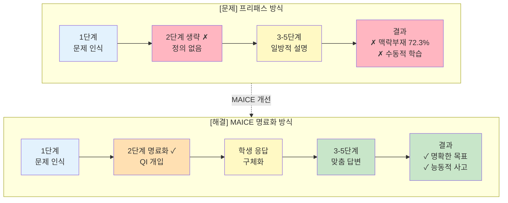
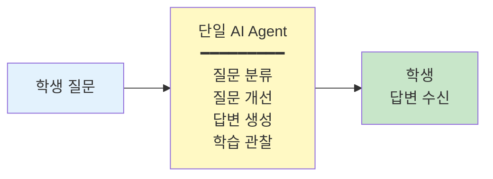
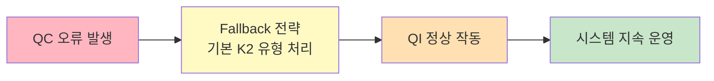

# II. 이론적 배경

예비 조사(III장 1절, N=385)에서 확인된 프리패스 LLM의 문제점(학습 맥락 부재 72.3%, 질문-답변 상관 r=0.691)을 해결하기 위해, 본 장에서는 **질문 명료화 기반 AI 에이전트 시스템 MAICE**의 이론적 기반을 제시한다.

MAICE(Mathematical AI Chatbot for Education)는 다음 5개의 독립적 에이전트로 구성된 멀티 에이전트 시스템이다:

**[표Ⅱ-1] MAICE 멀티 에이전트 시스템 구성**

| 약자 | 에이전트 명칭 | 핵심 역할 | 이론적 기반 |
|:----:|---------------|-----------|-------------|
| **QC** | **Question Classifier** | 질문 품질 진단 및 K1-K4 분류 | Bloom 분류학 (2.1절) |
| **QI** | **Question Improver** | 명료화 질문으로 문제 구체화 | Dewey 반성적 사고 (2.2절) |
| **AG** | **Answer Generator** | K1-K4 유형별 맞춤 답변 생성 | Bloom + AI 피드백 (2.4절) |
| **LO** | **Learning Observer** | 대화 요약 및 컨텍스트 관리 | 세션 연속성 유지 (3.3.4절) |
| **FT** | **Free Talker** | 대조군: 명료화 없는 즉시 답변 | (비교 기준선) |

## 1. 이론적 기반의 구조

MAICE 시스템의 핵심 설계 철학은 **Dewey의 반성적 사고 5단계 중 2단계(문제 정의)를 명료화 프로세스로 구현**하는 것이다. 다음 다이어그램은 프리패스 방식의 문제점과 MAICE의 해결 방안을 비교한다:

**[그림Ⅱ-1] 프리패스 방식과 MAICE 명료화 방식의 비교 (Dewey 반성적 사고 5단계 기반)**



**핵심 통찰**: 1장의 예비 조사에서 발견된 **질문 품질과 답변 품질의 강한 상관관계(r=0.691)**는 Dewey의 2단계(문제 정의)가 학습 과정 지원의 중요한 요소일 가능성을 시사한다.

**[표Ⅱ-2] 이론적 기반과 MAICE 구현의 연결**

| 이론 영역           | 이론 (2장)          | 핵심 개념         | 1장 문제점 해결         | MAICE 구현                          |
| --------------- | ---------------- | ------------- | ----------------- | --------------------------------- |
| **교육학적<br/>토대** | 2.1 Bloom 지식 분류  | K1→K4 4단계 분류  | 질문구조 불명확 45.8%    | **QC** 질문 분류 → **AG** K1-K4 맞춤 답변 |
|                 | 2.2 Dewey 반성적 사고 | **2단계 문제 정의** | **학습맥락 부재 72.3%** | **QI 명료화 프로세스** (핵심!)             |
|                 | 2.3 질문 생성 이론     | 구조·완결·의도      | 수학적전문성 45.5%      | **QC** 품질 진단 → **QI** 개선 유도       |
| **기술적<br/>구현**  | 2.4 AI 피드백 시스템   | 즉시성·맞춤성       | 일방향 답변            | 실시간 대화형 피드백 (4장)                  |
|                 | 2.5 멀티에이전트       | 역할 분담·협업      | 단일 AI의 한계         | QC/QI/AG/LO/FT 5개 협업 (3.3)        |
|                 | 2.6 수학적 귀납법      | 단원 특성 반영      | 일반적 설명            | 단원 맥락 적응형 명료화 (V장)                |
| **평가<br/>방법론**  | 2.7 루브릭 개발       | 질문-답변 평가      | 평가 기준 부재          | QAC 체크리스트 (6.4)                   |

표 2-1과 그림 2-1에서 보듯이, 각 이론은 1장에서 발견된 문제점을 해결하기 위한 이론적 해결책을 제시한다. 이어지는 절에서는 각 이론의 핵심 개념과 본 연구에의 적용을 상세히 검토한다.

## 2. 블룸의 지식 분류: 4가지 지식 차원

블룸의 개정 분류(Anderson & Krathwohl, 2001; Krathwohl, 2002)에서 지식 차원(Knowledge Dimension)은 다음 네 범주로 구성된다. 본 연구에서는 질문 명료화의 목표를 학습자의 지식 차원에 정렬하여, 질문 품질과 학습 효과를 동시에 개선한다.

**[표Ⅱ-3] Bloom의 지식 차원 분류 (K1~K4)**

| 본 연구<br/>표기 | 지식 차원 | 원문 표기 | 정의 | 수학적 귀납법 맥락의 예시 질문 |
|:---:|----------|----------|------|----------------------------|
| **K1** | **사실적 지식** | Factual Knowledge | 용어, 기본 사실, 기호·규칙의 기억 | "귀납법의 기본 단계와 귀납 단계의 정의는 무엇인가요?" |
| **K2** | **개념적 지식** | Conceptual Knowledge | 관계, 분류, 원리·법칙의 이해 | "귀납 가정이 증명 논리에서 맡는 역할을 설명해 주세요." |
| **K3** | **절차적 지식** | Procedural Knowledge | 방법·알고리즘·기법의 적용 절차 | "부등식 증명에서 k→k+1 전개는 어떤 순서로 진행하나요?" |
| **K4** | **메타인지적 지식** | Metacognitive Knowledge | 자기 인지·전략 선택·오류 진단 | "내 전개에서 누락한 가정은 무엇이며, 어떤 전략을 선택해야 하나요?" |

본 연구에서는 시스템 구현과 서술의 편의를 위해 4가지 지식 차원을 다음과 같이 약어로 표기한다: **K1**(사실적 지식), **K2**(개념적 지식), **K3**(절차적 지식), **K4**(메타인지적 지식). 이는 Anderson & Krathwohl (2001) 원문의 표기법은 아니며, 본 연구가 에이전트 명명 및 분류 체계를 위해 도입한 것이다. 이후 본문에서는 주로 K1-K4 표기를 사용한다.

이러한 지식 차원 분류는 MAICE의 명료화 프로세스와 다음과 같이 정렬된다. 사실적·개념적 지식(K1-K2)의 경우 용어 혼동이나 개념적 오해를 명료화 질문으로 선제 교정하며, 절차적 지식(K3)은 절차적 막힘을 단계화된 프롬프트로 유도한다. 메타인지적 지식(K4)은 학습자가 스스로의 오류와 전략을 메타인지적으로 진단하도록 반문을 통해 유도한다.

본 연구의 **QC**(Question Classifier)는 질문 분류 단계에서 학습자의 발화를 이 4가지 지식 차원으로 분류하고, **AG**(Answer Generator)가 각 차원에 정렬된 맞춤 답변을 제공한다. 이를 통해 질문의 질적 향상과 문제 해결 과정을 지원한다.

## 3. 듀이의 반성적 사고 이론: 명료화 프로세스의 철학적 기반

### 가. 반성적 사고의 정의와 5단계

듀이(Dewey, 1910)는 반성적 사고(reflective thinking)를 "어떤 믿음이나 지식의 형태에 대한 능동적이고 지속적이며 신중한 고려로서, 그것을 뒷받침하는 근거와 그것이 이끄는 결론들을 검토하는 것"으로 정의하였다. 원문에서 Dewey는 "Active, persistent, and careful consideration of any belief or supposed form of knowledge in the light of the grounds that support it, and the further conclusions to which it tends"라고 표현하였다(p.6). 이는 단순한 정보 습득이나 수동적 수용을 넘어, 학습자가 능동적으로 믿음의 근거를 탐구하고 그 함의를 추론하는 과정을 강조한다.

Dewey(1910, p.13)는 "사고의 기원은 어떤 당혹감, 혼란, 또는 의심(the origin of thinking is some perplexity, confusion, or doubt)"이라고 강조하며, 반성적 사고가 단순한 제안의 수용이 아닌 추가 증거를 탐색하는 능동적 과정임을 명확히 하였다.

듀이가 제시한 반성적 사고의 5단계는 다음과 같다(Dewey, 1910, p.72):

**[표Ⅱ-4] Dewey의 반성적 사고 5단계와 수학적 귀납법 학습 예시**

| 단계 | Dewey 원문 표현 | 본 연구의 한국어 명칭 | 수학적 귀납법 학습 예시 |
|-----|-----------------|---------------------|----------------------|
| **1단계** | a felt difficulty | 문제 상황 인식 | "귀납법 문제를 풀려는데 어디서부터 시작해야 할지 모르겠다" |
| **2단계** | its location and definition | 문제의 위치 파악 및 정의 | "귀납 단계에서 n=k+1을 증명할 때 귀납 가정을 어떻게 사용하는지 모르겠다" |
| **3단계** | suggestion of possible solution | 가능한 해결책의 제안 | "귀납 가정 P(k)를 식에 대입해보면 될까?" |
| **4단계** | development by reasoning of the bearings of the suggestion | 제안된 해결책의 추론적 전개 | P(k)를 실제로 대입하여 P(k+1) 유도 시도 |
| **5단계** | further observation and experiment leading to its acceptance or rejection | 관찰과 실험을 통한 수용 또는 거부 | "귀납 가정을 대입하고 정리하니 P(k+1)이 증명되었다" |

위 표는 Dewey (1910)의 원문 표현을 정확히 제시하며, 한국어 명칭은 본 연구에서 교육적 맥락에 맞게 번역한 것이다.

### 나. 수학 학습에서 반성적 사고의 중요성

수학 학습에서 반성적 사고는 특히 중요하다. Schoenfeld(1985)는 수학적 문제해결 과정이 단순한 알고리즘 적용이 아니라, 문제 상황 분석, 전략 선택, 실행, 검증의 메타인지적 과정임을 강조하였다. 학생들이 수학적 문제에 직면했을 때, 자신의 기존 지식과 새로운 문제 상황 사이의 간극을 인식하고, 이를 해결하기 위해 체계적으로 탐구하는 과정이 바로 반성적 사고이다.

수학적 귀납법 학습에서는 다음과 같은 반성적 사고가 특히 중요하다:

- **문제 인식**: "n=k+1 단계가 n=k 단계와 어떻게 다른가?"
- **문제 정의**: "귀납 가정을 '언제', '어디에' 사용하는가?"
- **가설 형성**: "식을 전개하면 귀납 가정과 연결될까?"
- **검증**: 실제로 전개하여 논리적 연결 확인
- **성찰**: "이 방법을 다른 귀납법 문제에도 적용할 수 있을까?"

### 다. 기존 LLM의 한계: 2단계(문제 정의) 생략

1장의 예비 조사에서 확인된 프리패스 방식의 근본적 문제는 **Dewey의 2단계(문제 정의)를 완전히 생략**한다는 것이다(그림 2-1 상단 참조).

프리패스 방식에서 학생이 "귀납법 어려워요"라고 질문하면(1단계: 문제 상황 인식), AI는 2단계(문제 정의) 없이 즉시 3-5단계로 진행하여 "귀납법은 다음과 같이 증명합니다... 1. 기본 단계: n=1일 때... 2. 귀납 단계: n=k일 때 가정하면..."과 같은 일반적 설명을 제공한다. 그 결과 **학생은 자신이 정확히 무엇을 모르는지 인식하지 못한 채 AI의 설명을 수동적으로 받아들이게 된다**.

이는 1장에서 관찰된 학습맥락 부재 72.3%의 근본 원인이다. 학생이 자신의 어려움을 명확히 정의하지 못한 상태에서 AI가 일방적으로 답변하므로, 학습자 수준 파악 실패(27.6% 최저점)와 학습확장성 결여(48.9% 최저점)로 이어진다.

### 라. MAICE의 해결 방안: 2단계 명료화 프로세스

MAICE는 Dewey의 2단계(문제 정의)를 **명료화 프로세스**로 구현하여, 학생이 스스로 질문을 구조화하도록 돕는다(그림 2-1 하단 참조).

MAICE 방식에서는 학생이 "귀납법 어려워요"라고 질문하면(1단계: 문제 상황 인식), **QI** 에이전트가 2단계(문제 정의)를 위해 명료화 질문을 제시한다: "귀납법 중에서 어떤 부분이 가장 어렵거나 궁금하신가요? • 기본 단계 증명? • 귀납 가정 이해? • 귀납 단계 전개?" 학생이 "귀납 단계에서 식을 전개하는 과정이요"라고 응답하면 2단계가 완성되고, **AG** 에이전트는 학생이 정의한 문제에 맞춘 맞춤형 답변을 생성한다: "n=k+1 대입 후 식 전개 과정을 단계별로 설명해드릴게요..."

그 결과 **학생이 자신의 어려움을 명확히 인식하고 표현**하게 되며, 이는 메타인지 능력 향상과 맞춤형 답변 수신으로 이어질 가능성이 있다.

### 마. 본 연구에의 적용

듀이의 반성적 사고 이론은 MAICE의 명료화 프로세스 설계에 적용된다. Dewey 5단계는 MAICE의 5개 에이전트 구조와 직접 매핑되며(상세 매핑은 2.5절 라 참조), 특히 **2단계(문제 정의)**가 **QI** 에이전트의 명료화 프로세스로 구현된다. 

명료화 프로세스는 Dewey의 5단계를 실제 대화형 질문으로 변환하여, 학생이 스스로 질문을 구조화하고 사고를 명료화하는 과정을 경험하도록 설계된다. 구체적인 구현 방식(명료화 질문 생성 전략, K1-K4 유형별 맞춤, 평가 기준 등)은 4장에서 상세히 다룬다.

이러한 명료화 프로세스는 Dewey의 반성적 사고 이론에 따르면 메타인지 발달과 학습 효과 향상을 가져올 것으로 기대된다. 본 연구에서는 V장에서 이를 실증적으로 검증한다.

## 4. 질문 생성 및 개선 이론: 질문 품질의 구조화

### 가. 질문 생성의 교육적 가치

질문 생성(question generation)은 학습자의 메타인지 및 비판적 사고를 유도하는 핵심적 활동으로, 학습자 주도적인 문제 해결과 이해 중심 수업을 가능하게 한다(홍경선, 김동익, 2011). 

King(1994)은 초등학교 4-5학년 58명을 대상으로 한 실험 연구에서, 질문 생성 훈련을 받은 학생들이 대조군에 비해 **이해도 검사**(literal comprehension: *F*(2,21)=3.56, *p*<.05; inferential/integrative comprehension: *F*(2,21)=4.17, *p*<.05)와 **7일 후 파지 검사**(retention test: *F*(2,21)=16.34, *p*<.001)에서 유의미하게 높은 성취를 보였다. 특히 경험 기반 질문(experience-based questions)을 생성한 학생들이 수업 내 질문(lesson-based questions)만 한 학생들보다 장기 기억에서 더 우수한 성과를 나타냈다. 이는 학생 생성 질문이 단순 정보 습득을 넘어 **복잡한 지식 구성(complex knowledge construction)**을 유도하며, 이것이 학습 효과를 증진시킨다는 것을 실증적으로 보여준다.

특히 수학 학습에서 학생이 스스로 질문을 생성하는 것은 다음과 같은 교육적 효과를 갖는다:

1. **능동적 학습**: 교사의 일방적 설명을 수동적으로 받아들이는 것이 아니라, 학습자가 능동적으로 지식을 구성
2. **메타인지 발달**: 자신이 무엇을 아는지, 무엇을 모르는지 스스로 인식하는 능력 향상
3. **개념 이해 심화**: 질문을 구성하는 과정에서 개념 간 관계를 탐색하고 논리적 연결을 시도
4. **학습 동기 증진**: 자신의 궁금증에서 시작한 질문은 학습 몰입도를 높임

### 나. 효과적인 질문의 특징

King(1994)은 학생 생성 질문이 깊이 있는 이해와 장기 기억에 긍정적 영향을 미친다는 것을 실증하였으며, Graesser & Person(1994)은 튜터링 과정에서의 질문 유형을 체계적으로 분류하였다. 본 연구는 이러한 선행 연구들과 예비 조사에서 관찰된 질문 품질 문제를 종합하여, 효과적인 학습 질문의 3가지 핵심 특징을 다음과 같이 도출하였다:

다음 제시하는 효과적인 질문의 3가지 특징은 King(1994)과 Graesser & Person(1994)의 이론적 틀을 바탕으로, 본 연구의 예비 조사에서 발견된 질문 품질 문제(1장 1.1.2절)를 해결하기 위해 구체화한 것이다.

#### 1) 구조화 (Structuring)

질문이 명확한 구조를 가지고 있어야 한다:

**[표Ⅱ-5] 효과적인 질문의 구조 요소**

| 구조 요소 | 정의 | 예시 (수학적 귀납법) |
|---------|------|-------------------|
| **대상** | 무엇에 대한 질문인가 | "귀납 가정의 역할" |
| **범위** | 어느 범위까지 다루는가 | "n=k+1 단계에서만" |
| **초점** | 핵심 의문이 무엇인가 | "어떻게 사용하는지" |

**좋은 예시**: "귀납 단계에서 n=k+1을 증명할 때, 귀납 가정 P(k)를 어떻게 사용하나요?"
- 대상: 귀납 가정 P(k)
- 범위: n=k+1 증명 단계
- 초점: 사용 방법

**나쁜 예시**: "귀납법 어려워요"
- 대상 불명확 (기본 단계? 귀납 단계? 개념?)
- 범위 불명확 (어떤 문제 유형?)
- 초점 부재 (무엇이 어려운지 불명확)

#### 2) 완결성 (Completeness)

질문에 필요한 조건과 정보가 모두 제시되어야 한다:

**[표Ⅱ-6] 효과적인 질문의 완결성 조건**

| 조건 유형 | 정의 | 예시 |
|---------|------|------|
| **학습 수준** | 현재 어디까지 배웠는가 | "수열까지는 배웠어요" |
| **선수 지식** | 어떤 배경 지식을 가지고 있는가 | "등비수열은 알아요" |
| **시도한 방법** | 무엇을 시도해봤는가 | "n=k+1을 대입했는데..." |
| **막힌 지점** | 어디서 막혔는가 | "식 정리 과정에서" |

**완결성 높은 질문 예시**:
> "고2 수학에서 수학적 귀납법을 배우고 있는데, 등비수열 합 공식을 귀납법으로 증명하는 문제에서 n=k+1 단계의 식을 전개했을 때 귀납 가정을 어떻게 대입해야 하는지 모르겠어요."

이 질문은 학습 수준(고2), 학습 주제(귀납법), 구체적 문제(등비수열 합), 시도한 방법(n=k+1 대입), 막힌 지점(귀납 가정 대입)을 모두 제시하여 AI가 맞춤형 답변을 생성할 수 있게 한다.

#### 3) 의도의 명시성 (Explicitness)

질문의 목적과 기대하는 답변 유형이 명확해야 한다:

**[표Ⅱ-7] 효과적인 질문의 의도 명시성**

| 질문 의도 | 기대 답변 유형 | 예시 |
|---------|-------------|------|
| **정의 확인** | 간결한 정의 | "귀납 가정이 정확히 뭐예요?" |
| **개념 이해** | 관계 설명 | "귀납 가정은 왜 필요한가요?" |
| **절차 학습** | 단계별 안내 | "귀납 가정을 어떻게 사용하나요?" |
| **오류 진단** | 메타인지적 피드백 | "제 풀이에서 뭐가 틀렸나요?" |

**의도가 명확한 질문**:
- "귀납 단계의 정의를 간단히 설명해주세요" → 간결한 정의 기대
- "귀납 가정을 단계별로 어떻게 사용하는지 예시를 들어 설명해주세요" → 상세한 절차 기대

### 다. 기존 연구의 한계: 피드백 시스템 부재

대부분의 선행연구들은 질문 생성 기법을 가르치는 데 초점을 맞추었으며, **질문의 질적 평가와 개선을 위한 체계적인 피드백 시스템**에 대한 연구는 제한적이다. 교사가 좋은 질문 만드는 방법을 교육하더라도, 학생이 실제 질문을 생성할 때 질문 품질을 평가하고 개선 피드백을 제공하는 시스템이 없다면 다음과 같은 문제가 발생한다:

1. **모호한 질문 → 모호한 답변**: 질문 품질이 낮으면 AI 답변도 일반적이고 맥락 없는 설명에 그침
2. **나쁜 습관 고착**: 피드백 없이 반복되면 모호한 질문 습관이 고착됨
3. **질문 개선 기회 상실**: 질문을 구조화하고 명료화하는 메타인지 능력 발달 기회를 놓침

특히 AI 학습 환경에서는 즉각적인 질문 개선 피드백이 더욱 중요하다. 학생이 질문하는 순간이 바로 질문 품질을 개선할 수 있는 교육적 기회이기 때문이다.

### 라. 본 연구의 접근: 명료화 기반 질문 개선

MAICE는 질문 생성 이론을 **실시간 피드백 시스템**으로 구현하여, 학생이 질문하는 순간 질문 품질을 개선할 수 있도록 돕는다. 구체적인 명료화 프로세스와 에이전트 간 협업 메커니즘은 4장에서 상세히 다룬다.

이는 단순히 질문 방법을 가르치는 것이 아니라, **질문하는 순간 실시간으로 개선 과정을 경험**하게 하여 메타인지 능력을 체득하도록 하는 교육적 개입이다.

### 마. 1장 문제점과의 연결

예비 조사에서 발견된 질문 품질 문제는 질문 생성 이론의 3가지 특징 결여와 정확히 일치한다. 질문구조 불명확(45.8%)은 구조화 부족, 학습맥락 부재(72.3%)는 완결성 부족, 수학적전문성 결여(45.5%)는 의도 명시성 부족에서 기인한다(상세 매핑은 표 2-2 참조). King(1994)의 이론에 따르면 **좋은 질문이 좋은 학습을 만든다**.

### 바. 본 연구에의 적용

질문 생성 및 개선 이론은 MAICE에 다음과 같이 적용된다:

1. **질문 품질 평가 기준**: 구조화·완결성·의도를 측정하는 QAC 체크리스트 A영역 설계 (상세: 3.4절)
2. **명료화 전략**: 3가지 특징을 유도하는 단계별 질문 설계 (상세: 4장)
3. **실시간 피드백**: **QC** 에이전트가 질문 품질을 진단하고 개선 방향 제시 (상세: 4장)
4. **효과성 검증**: 명료화 프로세스가 학습 과정 지원과 메타인지 발달로 이어지는지 검증 (V-VI장)

## 5. AI 기반 피드백 시스템: 실시간 상호작용의 설계 원리

### 가. 피드백의 교육적 효과

피드백은 학습 과정에서 핵심적 역할을 하며, 특히 **즉시성(immediacy)**과 **맞춤성(adaptiveness)**이 학습 효과를 결정한다. Hattie와 Timperley(2007)의 메타분석 연구에 따르면, 효과적인 피드백은 학습자의 성취도에 평균 효과 크기 d=0.79의 큰 영향을 미친다.

효과적인 피드백의 4가지 핵심 요소:

**[표Ⅱ-8] 효과적인 피드백의 핵심 요소**

| 요소 | 정의 | 수학 학습 예시 |
|-----|------|-------------|
| **즉시성** | 학습자 행동 직후 제공 | 질문 직후 명료화 질문 제시 |
| **구체성** | 일반적이 아닌 구체적 지적 | "귀납 가정 사용 부분에서..." |
| **건설성** | 오류 지적 + 개선 방향 | "n=k+1 대신 귀납 가정을 먼저 확인해보세요" |
| **맞춤성** | 학습자 수준에 적합 | 하위권에게는 더 세분화된 단계 제공 |

### 나. 질문 명료화를 통한 답변 범위 제한

MAICE의 핵심 전략은 **질문을 구체화하여 답변 범위를 자동으로 제한**하는 것이다:

**기존 AI의 문제**:
- 모호한 질문에 대해 **모든 내용**을 포괄적으로 설명
- 학생이 실제로 필요한 부분을 찾기 어려움
- 인지 과부하 발생 (정보량 과다)

**MAICE의 접근**:

**[표Ⅱ-9] MAICE의 질문 명료화를 통한 답변 범위 제한 메커니즘**

| 단계 | 역할 | 활동 | 이론적 기반 |
|------|------|------|------------|
| 1 | **QC** | "어떤 부분이 어렵나요?" | Dewey 1단계: 문제 인식 |
| 2 | 학생 | "귀납 단계요" | 문제 구체화 |
| 3 | **QC** | "귀납 단계 중에서?" | Dewey 2단계: 문제 정의 |
| 4 | 학생 | "식 전개 과정" | 최종 명료화 |
| 5 | **AG3** | 식 전개만 설명 | Bloom K3: 절차적 지식 |

**핵심 원리**: 
> 질문이 구체화되면 → 답변 범위가 자동으로 제한됨 → 인지 부담 최소화

학생은 "귀납법 전체"가 아니라 "식 전개 과정"만 학습하게 되어, 필요한 정보에 집중할 수 있다.

### 다. 실시간 상호작용의 기술적 원리

MAICE는 실시간 피드백의 즉시성을 보장하기 위해 스트리밍 응답, 비동기 처리, 멀티프로세스 아키텍처 등의 기술을 활용한다. 구체적인 기술적 구현 방식과 시스템 아키텍처는 4장에서 상세히 다룬다.

### 라. 본 연구에의 적용

AI 피드백 이론은 MAICE에 다음과 같이 적용된다:

1. **즉시성**: 학생 질문 직후 **QC**가 품질 진단, **QI**가 명료화 질문 제시 (평균 2초 내 응답)
2. **구체성**: 질문의 어떤 부분(구조화/완결성/의도)이 부족한지 명시적 피드백
3. **건설성**: 단순 지적이 아닌 명료화 질문으로 개선 방향 제시
4. **맞춤성**: K1-K4 유형별 차별화된 답변 전략 (2.1절 참조)

기술적 구현(스트리밍 응답, 비동기 처리)은 IV장에서, 효과성 검증은 QAC 루브릭의 C2(학습 과정 지원) 항목으로 측정한다(V-VI장).

## 6. 멀티 에이전트 시스템: 역할 분담과 협업

### 가. 멀티 에이전트 시스템의 정의

멀티 에이전트 시스템(Multi-Agent System, MAS)은 여러 자율적 agent가 협력하여 복잡한 문제를 해결하는 분산 시스템이다(Wooldridge & Jennings, 1995). 교육 분야에서 멀티 에이전트 시스템은 학습자의 다양한 요구에 대응하는 개인화된 학습 환경을 구축하는 데 활용되고 있다.

Wooldridge와 Jennings(1995)는 agent의 주요 특성으로 다음을 제시하였다:

**[표Ⅱ-10] Wooldridge & Jennings의 Agent 특성과 교육적 응용**

| 특성 | 정의 | 교육적 응용 |
|-----|------|----------|
| **자율성** (Autonomy) | 독립적으로 작동, 외부 개입 최소화 | 각 agent가 독자적 판단 및 실행 |
| **사회성** (Social Ability) | 다른 agent와 협력 및 정보 교환 | agent 간 질문·답변 전달 |
| **반응성** (Reactivity) | 환경 변화를 감지하고 적절히 대응 | 학생 질문 패턴 변화 감지 |
| **능동성** (Pro-activeness) | 목표 지향적 행동, 선제적 조치 | 학습 어려움 조기 발견 및 개입 |

### 나. 단일 Agent vs 멀티 Agent의 차이

**[그림Ⅱ-3] 단일 Agent 시스템**



단일 Agent 시스템은 모든 역할을 하나의 Agent가 처리하므로 역할 간 충돌, 복잡도 증가, 전체 실패 위험, 유지보수 어려움 등의 문제가 발생한다.

**[그림Ⅱ-4] 멀티 Agent 시스템의 역할 분담과 협업**

```mermaid
flowchart LR
    S["학생 질문"]
    
    subgraph agents["5개 독립 Agent"]
        QC["QC<br/>질문 진단·분류"]
        QI["QI<br/>명료화"]
        AG["AG<br/>K1-K4 답변"]
        LO["LO<br/>요약·컨텍스트"]
        FT["FT<br/>즉시 답변<br/>(대조군)"]
    end
    
    R["학생<br/>답변 수신"]
    
    S --> QC
    QC -->|명료화 필요| QI
    QC -.->|명료화 불필요| AG
    QI --> AG
    AG --> R
    
    AG -.-> LO
    
    S -.-> FT
    FT -.대조군.-> R
    
    style S fill:#E3F2FD
    style QC fill:#FFF9C4
    style QI fill:#FFE0B2
    style AG fill:#C8E6C9
    style LO fill:#F3E5F5
    style FT fill:#FFE4E1
    style R fill:#C8E6C9

멀티 Agent 시스템은 역할을 명확히 분담하여 각 agent를 독립적으로 최적화할 수 있고, 한 agent의 오류가 전체 시스템에 미치는 영향을 최소화하며, 새로운 agent 추가가 용이하다. MAICE는 **Agent 모드**(QC→QI→AG→LO)와 **Freepass 모드**(FT→LO)의 2가지 모드를 지원한다(상세 메커니즘은 III장 참조).

### 다. 교육용 멀티 에이전트 시스템의 설계 원칙

최근 Degen(2025)은 고등교육에서 Orchestrated Multi-Agent System (OMAS)의 개념을 제시하며, AI 소크라테스 튜터가 학생의 연구 질문 개발을 지원하는 방식을 연구하였다. 이러한 조율된 멀티 에이전트 시스템은 각 agent가 독립적으로 작동하면서도 전체적으로 일관된 교육 목표를 달성하도록 설계된다.

교육 분야 멀티 에이전트 시스템은 다음 원칙을 따라야 한다:

#### 1) 명확한 역할 분담

각 agent의 책임 범위를 명확히 정의:

- ❌ **모호한 역할**: "질문 처리 Agent" (너무 광범위)
- ✅ **명확한 역할**: "질문 유형 분류 Agent" (구체적 책임)

#### 2) 효율적인 정보 교환

**[그림Ⅱ-5] Agent 간 정보 교환 예시**

```mermaid
flowchart LR
    QC["QC Agent"]
    QI["QI Agent"]
    
    QC -->|"질문 유형: K3<br/>부족 정보: 학습맥락<br/>제안 질문: 어떤 단계?"| QI
    
    style QC fill:#FFF9C4
    style QI fill:#FFE0B2
```

#### 3) 독립적 실패 처리

**[그림Ⅱ-6] Agent 오류 시 Fallback 전략**



### 라. 본 연구에의 적용

멀티 에이전트 이론은 MAICE에 다음과 같이 적용된다:

1. **명확한 역할 분담**: 5개 agent의 독립적 책임 정의 (상세: 4장)
2. **agent 간 협업 프로토콜**: 정보 교환 구조 설계 (상세: 4장)
3. **독립적 최적화**: 각 agent의 프롬프트 독립 개선 가능 (상세: 4장)
4. **시스템 안정성**: 한 agent 오류 시 fallback 전략 (상세: 4장)
5. **확장성**: 새로운 agent 추가 용이한 아키텍처 (상세: 4장)

특히, MAICE는 **교육적 프로세스를 agent 구조로 구현**함으로써:
- Dewey 5단계 각각을 담당 agent가 지원 (**QC** → **QI** → **AG** → **LO**)
- 명료화(2단계)를 독립 agent(**QI**)로 분리하여 핵심 강조
- 대화 요약(**LO**)을 통해 장기 세션에서도 컨텍스트 관리 가능

구체적인 구현 방식과 시스템 아키텍처는 4장에서 상세히 다룬다. 본 연구에서는 V장에서 실제 학생 세션을 통해 시스템의 안정성과 교육적 효과를 검증한다.

## 7. 수학적 귀납법 단원 선정: 단원 맥락 반영 필요성

### 가. 연구 대상 단원으로 수학적 귀납법을 선정한 이유

본 연구는 고등학교 2학년 수학Ⅰ 과정의 **수학적 귀납법** 단원을 MAICE 시스템의 적용 대상으로 선정하였다. 이는 다음의 교육적 특성 때문이다:

**1. 명료화가 특히 필요한 학습 내용**

수학적 귀납법은 기본 단계(n=1)와 귀납 단계(n=k→k+1)라는 이중 구조를 가지며, 학생들은 자신의 어려움이 어느 단계에서 발생하는지 정확히 표현하기 어렵다. "귀납법 어려워요"와 같은 막연한 질문이 빈번하게 발생하며, 이는 명료화 프로세스의 효과를 검증하기에 적합하다.

**2. Dewey 반성적 사고의 적용 가능성**

수학적 귀납법의 핵심인 **귀납 가정**은 "증명하려는 것을 먼저 가정한다"는 역설적 특성을 가진다. 이는 학습자에게 당혹감과 혼란을 야기하며(Dewey의 1단계), 이를 정확히 정의하고(2단계) 해결하는 반성적 사고 과정이 필수적이다.

**3. 유형별 전략 차이**

등식 증명과 부등식 증명은 전개 전략이 크게 다르다(등식: 대입 후 정리, 부등식: 보조 부등식 필요). 학생이 어떤 유형의 문제에서 어려움을 겪는지에 따라 다른 설명이 필요하므로, 질문 명료화의 중요성이 더욱 부각된다.

### 나. LLM의 맥락 적응 능력 활용

MAICE는 수학적 귀납법에 특화된 별도의 코드를 작성하지 않는다. 대신 **LLM의 맥락 이해 능력**을 활용하여, 학생 질문에 포함된 "귀납법", "귀납 가정" 등의 단어로부터 단원 맥락을 자동으로 인식하고 적응한다:

- **QC** 에이전트: 질문에서 "귀납 가정을 어떻게 써요?"를 보고 K3(절차적 지식)로 분류
- **QI** 에이전트: "귀납법"이라는 맥락을 파악하여 "어느 단계가 어려운가요? 기본 단계? 귀납 단계?"와 같은 명료화 질문 동적 생성
- **AG** 에이전트: K1-K4 분류에 따라 단원 맥락에 맞는 답변 생성

이러한 설계는 향후 다른 수학 단원(미적분, 삼각함수 등)으로 확장할 때도 시스템 구조 변경 없이 적용 가능함을 의미한다. 

수학적 귀납법 단원의 구체적 특성과 MAICE의 실제 적용 사례는 **V장**에서 상세히 다룬다.

## 8. 평가 루브릭의 이론적 기반

본 연구는 MAICE 시스템의 효과성을 측정하기 위해 질문-답변 품질을 평가하는 QAC(Question-Answer-Context) 체크리스트를 개발하였다. 본 절에서는 루브릭의 개발 동기, 이론적 기반, 그리고 체크리스트 구조를 제시한다.

### 가. 루브릭 개발의 필요성과 이론적 기반

#### 개발 동기: 예비 조사에서 발견된 문제

본 연구는 MAICE 시스템 개발에 앞서 실제 중학생 385명이 AI와 나눈 수학 학습 대화를 분석하는 예비 조사를 수행하였다. 이 과정에서 학생 질문과 AI 답변에서 다음과 같은 체계적 문제가 발견되었다:

**질문 영역의 문제**:
1. **학습 맥락 부재**: "수학적 귀납법 어려워요"와 같이 현재 학습 수준, 어려움의 구체적 지점, 학습 목표를 제시하지 않음
2. **질문 구조 불명확**: 한 질문에 여러 의도가 섞이거나, 필요한 조건이 누락됨
3. **수학적 표현 부정확**: 수학 용어의 오용 또는 개념 혼동

**답변 영역의 문제**:
1. **학습 확장성 결여**: 단편적 답변 제공 후 심화 방향 제시 없음
2. **학습자 맞춤도 부족**: 학생의 수준이나 선수학습 상태를 고려하지 않은 일률적 설명
3. **설명 체계성 부족**: 논리적 흐름 없이 단편적 정보 나열

이러한 문제는 단순한 정답 제시를 넘어 **교육적으로 효과적인 대화**를 구성하는 요소가 무엇인지 명확한 기준이 필요함을 보여준다. 기존 AI 평가 연구들은 주로 답변의 정확성만을 평가하였으나, 본 연구는 **질문 품질**도 학습 효과의 핵심 요소로 보고 이를 독립적으로 평가하는 체계를 개발하였다.

#### 이론적 기반: 교육학 이론의 통합

루브릭의 6개 평가 영역은 전통적 교육학 이론에 기반하여 설계되었다:

**A영역: 질문 평가 (15점)**

- **A1. 수학적 전문성 (5점)**
  - 이론적 기반: 내용지식(content knowledge)의 중요성
  - 측정 대상: 수학 개념의 정확성, 용어 사용의 적절성, 교과과정 내 위계 파악
  - 교육적 의의: 학습자가 문제의 본질을 정확히 파악하고 있는지 평가

- **A2. 질문 구조화 (5점)**
  - 이론적 기반: **King(1994)** 질문 생성 이론, **Graesser & Person(1994)** 튜터링 질문 분류
  - 측정 대상: 질문의 단일성, 조건 완결성, 문장 논리성, 의도 명확성
  - 교육적 의의: 명확한 질문은 명확한 답변을 유도하며, 이는 효과적 학습 대화의 출발점

- **A3. 학습 맥락 적용 (5점)**
  - 이론적 기반: 상황학습이론(situated learning), 근접발달영역(ZPD) 개념
  - 측정 대상: 현재 학습 단계, 선수학습 내용, 구체적 어려움, 학습 목표
  - 교육적 의의: 맥락 정보는 AI가 학생에게 적합한 수준의 설명을 제공하는 데 필수적

**B영역: 답변 평가 (15점)**

- **B1. 학습자 적합성 (5점)**
  - 이론적 기반: 비계설정(scaffolding), 차별화 교수(differentiated instruction)
  - 측정 대상: 수준별 접근, 선수지식 연계, 난이도 조절, 개인화 피드백
  - 교육적 의의: 학생의 현재 수준에 맞는 설명이 학습 효과를 극대화

- **B2. 설명의 체계성 (5점)**
  - 이론적 기반: 인지부하이론(cognitive load theory), 멀티미디어 학습 원리
  - 측정 대상: 개념 위계화, 단계별 논리, 핵심 강조, 예시 적절성
  - 교육적 의의: 체계적 설명은 인지 부하를 줄이고 이해를 촉진

- **B3. 학습 내용 확장성 (5점)**
  - 이론적 기반: **Bloom(1956, as cited in Anderson & Krathwohl, 2001)** 교육목표분류학, **Anderson & Krathwohl(2001)** K1-K4 지식 차원
  - 측정 대상: 심화 방향 제시, 응용 문제 연계, 오개념 교정, 자기주도 학습 유도
  - 교육적 의의: 단편적 답변을 넘어 지속적 학습으로 연결

**C영역: 맥락 평가 (10점)**

- **C1. 대화 일관성 및 연속성 (5점)**
  - 이론적 기반: 대화 일관성 이론, 공통기반이론(common ground theory)
  - 측정 대상: 학습 목표 중심성, 대화 이력 참조, 주제 연속성, 턴 간 유기적 연결
  - 교육적 의의: 일관된 대화 흐름은 학습 몰입과 이해 누적을 지원

- **C2. 학습 과정 지원성 (5점)**
  - 이론적 기반: **Dewey(1910)** 반성적 사고, 메타인지 이론
  - 측정 대상: 사고 과정 유도, 이해도 확인, 메타인지 촉진, 깊이 있는 사고 유도
  - 교육적 의의: 학습자가 자신의 사고 과정을 인식하고 조절하도록 지원

#### 루브릭의 특징

본 루브릭은 기존 AI 평가 도구와 다음 점에서 차별화된다:

1. **질문 품질 독립 평가**: 기존 연구는 AI 답변만 평가했으나, 본 연구는 질문 품질이 학습 효과의 선행 조건임을 인식
2. **이론-실증 통합**: 교육학 이론을 실제 학생 데이터(385건)에서 발견된 문제와 연결
3. **체크리스트 방식**: 각 영역을 4개의 구체적 요소로 세분화하여 평가 일관성 확보 (체크리스트는 본 절 표 2-13~2-15 참조)
4. **MAICE 설계 근거 제공**: 루브릭에서 발견된 A3(맥락 부재)와 B3(확장성 부족) 문제가 MAICE의 명료화 프로세스 설계 동기가 됨

### 나. 루브릭 구조: 체크리스트 기반 평가

예비 조사에서 발견된 문제 패턴과 교육 이론을 결합하여 **8개 평가 항목, 32개 체크리스트 요소**로 구성된 QAC 체크리스트를 개발하였다:

**A영역: 질문 평가 (15점)**

**[표Ⅱ-11] QAC 루브릭 A영역: 질문 평가 체크리스트**

| 항목 | 체크리스트 요소 | 평가 기준 (질문 형태) |
|------|----------------|-------------------|
| **A1. 수학적 전문성** (5점) | ① 개념 정확성<br>② 교과과정 위계<br>③ 용어 적절성<br>④ 문제 방향 구체성 | 수학 용어를 정확하게 사용했는가?<br>학년 수준에 맞는 개념인가?<br>전문 용어를 적절히 사용했는가?<br>해결하려는 문제가 구체적인가? |
| **A2. 질문 구조화** (5점) | ① 질문 단일성<br>② 조건 완결성<br>③ 문장 논리성<br>④ 의도 명확성 | 한 번에 하나의 명확한 질문을 하는가?<br>필요한 조건/정보를 모두 제시했는가?<br>문장이 논리적으로 구성되었는가?<br>무엇을 알고 싶은지 명확한가? |
| **A3. 학습 맥락** (5점) | ① 학습 단계 설명<br>② 선수학습 언급<br>③ 어려움 명시<br>④ 학습 목표 제시 | 학년/단원/진도를 언급했는가?<br>이전에 배운 내용을 언급했는가?<br>어디서 막혔는지 구체적으로 말했는가?<br>무엇을 배우고 싶은지 목표를 제시했는가? |

**B영역: 답변 평가 (15점)**

**[표Ⅱ-12] QAC 루브릭 B영역: 답변 평가 체크리스트**

| 항목 | 체크리스트 요소 | 평가 기준 (질문 형태) |
|------|----------------|-------------------|
| **B1. 학습자 적합성** (5점) | ① 수준별 접근<br>② 선수지식 연계<br>③ 난이도 조절<br>④ 개인화 피드백 | 학생 수준에 맞게 설명했는가?<br>이미 배운 내용과 연결했는가?<br>너무 어렵거나 쉽지 않은가?<br>학생 상황을 고려한 피드백인가? |
| **B2. 설명의 체계성** (5점) | ① 개념 위계화<br>② 단계별 논리<br>③ 핵심 강조<br>④ 예시 적절성 | 쉬운 것부터 어려운 것으로 단계적 설명?<br>각 단계가 논리적으로 연결되는가?<br>중요한 내용을 명확히 강조했는가?<br>이해를 돕는 적절한 예시 제공? |
| **B3. 학습 확장성** (5점) | ① 심화 방향 제시<br>② 응용 문제 연계<br>③ 오개념 교정<br>④ 자기주도 유도 | 더 깊이 공부할 방향을 제시했는가?<br>관련된 응용 문제를 연결했는가?<br>잘못된 이해를 바로잡았는가?<br>스스로 탐구하도록 유도했는가? |

**C영역: 맥락 평가 (10점)**

**[표Ⅱ-11] QAC 루브릭 C영역: 맥락 평가 체크리스트**

| 항목 | 체크리스트 요소 | 평가 기준 (질문 형태) |
|------|----------------|-------------------|
| **C1. 대화 일관성** (5점) | ① 목표 중심성<br>② 맥락 참조<br>③ 주제 연속성<br>④ 턴 간 연결 | 학습 목표를 벗어나지 않고 진행?<br>전체 대화 이력을 기억하고 참조?<br>주제가 자연스럽게 연결되는가?<br>각 발화가 직전 턴과 유기적 연결? |
| **C2. 학습 과정 지원** (5점) | ① 사고 과정 유도<br>② 이해도 확인<br>③ 메타인지 촉진<br>④ 깊이 있는 사고 유도 | 학생의 사고 과정을 유도하는가?<br>학생의 이해도를 확인하는가?<br>학생이 학습 과정을 돌아보게 하는가?<br>깊이 있는 사고를 유도하는가? |

**채점 방식** (객관적 체크리스트 기반):

각 항목의 점수는 **충족된 체크리스트 요소 개수**로 자동 계산된다:

> **점수 = 충족 요소 개수 + 1**
>
> 예시:
> - 0개 충족 → 1점
> - 1개 충족 → 2점
> - 2개 충족 → 3점
> - 3개 충족 → 4점
> - 4개 충족 → 5점 (만점)

**총점 계산**:
- 질문 영역 (A1+A2+A3): 최대 15점
- 답변 영역 (B1+B2+B3): 최대 15점
- 맥락 영역 (C1+C2): 최대 10점
- **전체 총점: 40점 만점**

**[표Ⅱ-12] 체크리스트 기반 평가 예시 (실제 데이터)**

| 구분 | 낮은 품질 질문 예시 | 높은 품질 질문 예시 |
|------|-------------------|-------------------|
| **학생<br/>질문** | "수학적 귀납법이 뭐야" | "모든 자연수 $n$에 대해, $\log_2 n < n$임을 수학적 귀납법을 이용하여 증명하시오. 기저단계, 귀납단계를 사용하여 수식으로 간단히 풀어내시오." |
| **A1.<br/>수학적<br/>전문성** | 4점 (3개 충족)<br/>✅ 개념정확성, 용어적절성, 문제방향<br/>❌ 교과과정위계 | 5점 (4개 충족)<br/>✅ 개념정확성, 교과과정위계, 용어적절성, 문제방향 |
| **A2.<br/>질문<br/>구조화** | 4점 (3개 충족)<br/>✅ 질문단일성, 문장논리성, 의도명확성<br/>❌ 조건완결성 | 5점 (4개 충족)<br/>✅ 질문단일성, 조건완결성, 문장논리성, 의도명확성 |
| **A3.<br/>학습<br/>맥락** | 1점 (0개 충족)<br/>❌ 학습단계, 선수학습, 어려움, 목표 모두 부재 | 4점 (3개 충족)<br/>✅ 학습단계, 선수학습, 어려움<br/>❌ 학습목표 |
| **질문<br/>총점** | **9점/15점 (60%)** | **14점/15점 (93.3%)** |

체크리스트 방식은 이진 판단(충족/미충족)으로 평가자 간 일관성을 높이며, 어떤 요소가 부족한지 구체적으로 파악하여 개선 방향을 제시할 수 있다.

### 다. 본 연구에의 적용

본 루브릭은 기존의 검증된 측정 도구가 아닌, 본 연구가 개발하고 타당성을 탐색하는 평가 도구이다. 루브릭의 신뢰도 및 타당도 검증 과정, 교사 평가자 간 일치도, AI-교사 평가 일치도 등은 IV장과 V장에서 상세히 다룬다.

평가 루브릭 이론은 MAICE 연구 전반에 다음과 같이 적용된다:

1. **예비 조사 평가 도구** (1장): 6개 영역 루브릭으로 프리패스 방식 문제점 진단
2. **QAC 체크리스트 개발** (IV장): 9개 항목 45점 만점으로 확장, 대화 맥락 평가 추가
3. **Agent 설계 근거** (III장): 루브릭 영역별 문제를 해결하는 Agent 설계
   - A3 학습맥락 부재 → **QI**
   - B3 학습확장성 결여 → K1-K4 차별화 답변 전략
   - C영역 추가 → 명료화 프로세스 효과성 측정
4. **효과성 검증** (V-VI장): QAC 체크리스트로 Agent vs Freepass 비교 평가
5. **향후 확장** (VI장): QAC 루브릭의 타당성 검증 후 **LO**에 실시간 평가 기능 통합 예정
