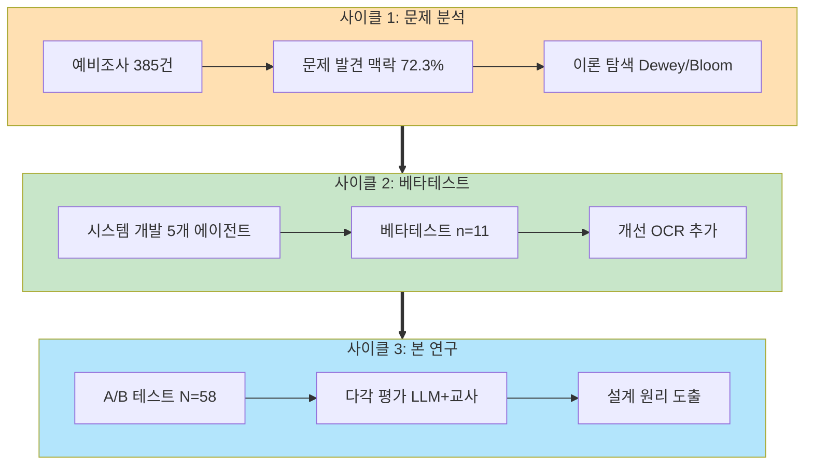
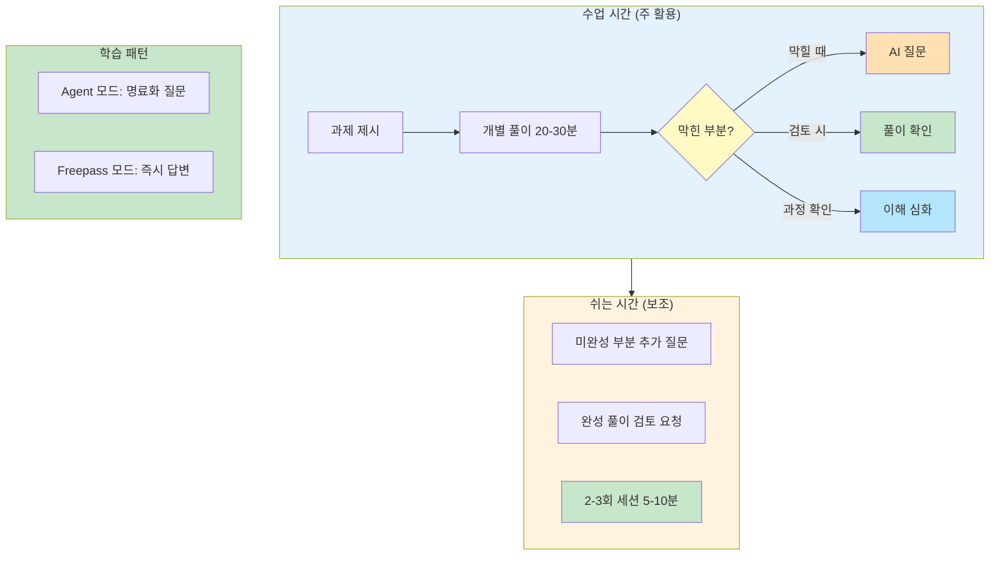
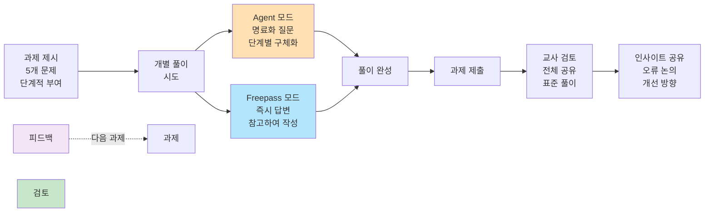

# III. 연구 방법 및 설계 기반 개선 과정

본 장에서는 **Design-Based Research(DBR, 설계 기반 연구)** 관점에서 AI 에이전트 시스템의 반복적 개선 과정과 본 연구의 A/B 테스트 방법론을 제시한다.

---

## 1. 연구 방법론: Design-Based Research

본 연구는 설계 기반 연구(Design-Based Research, DBR) 방법론을 채택하였다. DBR은 교육 이론을 실제 교육 맥락에서 검증하고, 실용적 산출물을 개발하며, 반복적 개선을 통해 설계 원리를 도출하는 연구 방법이다(Collins, Joseph, & Bielaczyc, 2004).

본 연구의 방법론은 II장에서 고찰한 이론적 기반(Dewey 반성적 사고, Bloom 지식 분류, 질문 생성 이론, Hattie 피드백 이론, 멀티 에이전트 시스템 이론)을 바탕으로 설계되었다. 구체적으로, 이론적 기반이 시스템 설계에 반영된 내용은 II장 각 절의 "본 연구에의 적용" 항목에서 상세히 다루었으며, 본 장(III장)에서는 이러한 이론적 기반이 연구 방법론(평가 도구, 실험 설계, 측정 변인)에 어떻게 반영되었는지를 제시한다.

본 연구의 DBR 수행 과정은 **3차 반복 사이클**로 진행되었다:

**[그림Ⅲ-1] DBR 3차 사이클 및 반복적 개선 과정**

**사이클 1 (2025년 5월)**: 문제 분석 및 프로토타입 설계
- 예비조사 385건 질문-답변 분석 (I장, 본 장 1절 사이클 1)
- 문제 발견: 학습 맥락 부재(72.3%), 질문-답변 상관(r=0.691)
- 이론 기반 설계: Dewey/Bloom → 5개 에이전트 구조 도출

**사이클 2 (2025년 9월)**: 베타테스트 및 시스템 개선
- 베타테스트 10일간, 학생 11명 (본 장 2절 상세)
- 발견: 수식 입력 어려움, 이미지 질문 수요
- 개선: OCR 수식 인식 시스템 추가 (부록 A 참조)

**사이클 3 (2025년 10-11월)**: 본 연구 A/B 테스트
- 무작위 배정 A/B 테스트 (N=58, 284개 세션)
- LLM-교사 이중 평가 + 질적 분석 (1,589건)
- 설계 원리 도출: 명료화 효과, 하위권 메커니즘

**DBR 반복성의 의의**: 단순 일회성 실험이 아닌, **문제 발견 → 설계 → 검증 → 재설계**의 체계적 과정을 거친 연구임을 보여준다.

---

## 2. 사이클 2: 베타테스트 및 반복적 개선 (2025년 9월)

본 절에서는 DBR 사이클 2에 해당하는 베타테스트 과정과 이를 통한 시스템 개선 사항을 기술한다.

### 가. 베타테스트 개요

**기간**: 2025년 9월 15일 ~ 9월 25일 (10일)  
**참여자**: 고2 학생 11명 (자발적)  
**단원**: 수열 (등차수열, 등비수열)  
**목적**: 시스템 안정성 + 교육적 효과 초기 검증

### 나. 주요 발견 및 개선

**발견 1: 수식 입력 어려움**
- 학생들이 LaTeX 수식 입력에 어려움 호소
- 개선: **OCR 수식 인식 시스템 추가** (부록 A 참조)
  - 이미지 업로드 → Gemini Vision API → 수식 자동 인식
  - 입력 시간 단축 및 사용성 개선

**발견 2: 메타인지 향상 징후**
- 설문: "무엇을 모르는지 규정" 4.2/5점
- 설문: "사고 정교화" 4.1/5점
- **명료화 프로세스의 교육적 가능성 확인**

**발견 3: 시스템 안정성 개선 필요**
- 간헐적 지연, 오류 보고
- 개선: FastAPI 워커 증설, Redis Pool 확대, 재시도 로직

### 다. 본 연구 설계 반영

베타테스트 발견사항은 다음과 같이 본 연구에 반영되었다:

1. **무작위 대조 실험(RCT)**: 명료화 효과를 엄밀히 검증하기 위해 Agent vs Freepass 무작위 배정
2. **OCR 기능 탑재**: 수식 입력 편의성 대폭 개선
3. **시스템 안정화**: 3주간 안정적 운영 가능한 인프라 구축
4. **QAC 체크리스트 개선**: 베타테스트 피드백을 반영한 평가 도구 보완 및 객관화

**DBR 개선 사례**: 베타테스트(n=11) → 문제 발견 → 시스템 개선 → 본 연구(N=58)

---

## 3. 사이클 3: 본 연구 A/B 테스트 (2025년 10-11월)

### 가. 연구 대상 및 표본 선정

본 연구는 부산광역시 소재 ○○고등학교 2학년 4개 학급을 대상으로 하였다. 표집 방법은 연구자의 접근 가능성을 고려한 편의 표집(convenience sampling)이었다.

### 나. 참여자 특성

[표Ⅲ-1] 연구 대상 개요

| 구분 | 내용 |
|------|------|
| **총 인원** | 58명 |
| **학년** | 고등학교 2학년 |
| **학교 유형** | 특수목적고등학교(공업계열) |
| **지역** | 부산광역시 |
| **연구 기간** | 2025년 10월 20일 ~ 11월 8일 (약 3주) |

**실험군과 대조군 구성**:
- **Agent 모드**: 28명
- **Freepass 모드**: 30명

**학생 사전 성적 분포** (중간고사 기준):
- 서술형 점수 (30점 만점): 범위 0~30점
- 객관식 점수 (70점 만점): 범위 14.6~61.7점
- 총점 (100점 만점): 범위 17.9~89.9점 (상세 기술통계는 표 6-2 참조)

### 다. 예비 조사

본 연구는 예비조사(N=385, 2025년 5월)를 통해 AI 에이전트 시스템 설계 필요성을 확인하였다 (상세: 본 장 1절 사이클 1).

**예비 조사 개요**:
- **목적**: AI 에이전트 시스템의 필요성 검증
- **데이터**: 고등학교 수학 수업에서 수집한 385건의 질문-답변 쌍
- **평가단**: 현직 중등 수학교사 4명
- **평가 방법**: 교육학 이론 기반 평가 기준 (6개 영역, 5점 척도)
- **총 평가 건수**: 1,012건 (교사 3-4명이 각 질문 평가)

예비 조사를 통해 학생 질문의 품질 문제와 질문-답변 품질 간 상관관계를 확인하여, 질문 명료화 기반 AI 에이전트 시스템의 필요성을 실증적으로 확인하였다.

### 라. 무작위 배정

학급 내 학생들을 실험군과 대조군에 무작위 배정하기 위해 AI 에이전트 시스템의 UserModeService를 활용하였다. 이 서비스는 학생이 시스템에 가입할 때 Python의 random 모듈을 사용하여 "agent" 또는 "freepass" 모드를 50:50 비율로 자동 배정한다. 배정된 모드는 users 테이블의 assigned_mode 필드에 저장되며, 연구 기간 동안 고정된다.

무작위 배정 결과, Agent 모드 28명, Freepass 모드 30명이 배정되었다. 두 집단 간 사전 중간고사 성적에서 통계적으로 유의한 차이가 없어 동질성이 확보되었다.

[표Ⅲ-2] 실험군과 대조군의 사전 동질성 검증 (중간고사 기준)

| 변인 | Agent 모드 (n=28) | Freepass 모드 (n=30) | t | p | 해석 |
|------|------------------|---------------------|---|---|------|
| | M(SD) | M(SD) | | | |
| 중간고사 총점 (100점) | 56.8(16.7) | 51.4(18.1) | 1.18 | .242 | 동질 |
| - 서술형 점수 (30점) | 15.6(8.5) | 14.0(8.5) | 0.74 | .462 | 동질 |
| - 객관식 점수 (70점) | 41.2(9.4) | 37.4(12.4) | 1.30 | .199 | 동질 |

동질성 검증 결과, 두 집단 간 사전 성적에 유의한 차이가 없어 실험군과 대조군이 동질한 것으로 확인되었다.

### 마. 연구 윤리

본 연구는 IRB 윤리 기준을 준수하였다.

**가) 연구 참여 동의**:
- 모든 참여 학생과 보호자에게 연구 목적, 절차, 데이터 활용 방법을 설명하였다
- 학생 및 보호자로부터 서면 동의를 받았다
- 참여 거부 및 중도 철회 권리를 명시하였다

**나) 개인정보 보호**:
- 수집된 데이터는 연구 목적으로만 사용되었다
- 데이터는 암호화된 서버에 저장하고, 연구자만 접근 가능하도록 제한하였다

**다) 참여자 익명화**:
- 모든 학생 학번을 익명 ID(S01~S58)로 변환하여 사용하였다
- 익명화 규칙:
  - Agent 모드 학생: S01 ~ S28 (28명)
  - Freepass 모드 학생: S29 ~ S58 (30명)
- 익명화 매핑 테이블은 별도 암호화 파일로 관리하며, Git 저장소에서 제외하였다
- 논문에는 익명 ID만 사용하여 개인 식별 불가능하도록 하였다

**라) 참여자 보호**:
- 연구 참여로 인한 학업 불이익이 없음을 보장하였다
- 두 모드(Agent/Freepass) 모두 교육적 가치를 제공하도록 설계하였다
- 연구 종료 후 모든 참여자에게 두 모드의 사용 기회를 제공하였다

**마) 데이터 보관 및 폐기**:
- 연구 데이터는 연구 종료 후 3년간 보관하며, 이후 안전하게 폐기한다
- 논문 출판 시 개인을 특정할 수 있는 정보는 일체 포함하지 않는다

**바) 설문 식별자 수집**:
본 연구는 사후 설문조사에서 학생의 이메일 주소를 수집하였다. 이는 모드별 효과 비교를 위해 설문 응답과 객관적 데이터(QAC 점수, 교사 평가, 세션 사용 패턴)를 연계하기 위한 식별자로 활용되었다. 비익명 설문의 한계점 및 완화 전략은 VI장 "연구의 한계" 섹션에서 논의한다.

### 바. 실험 설계 및 진행 절차

본 연구의 A/B 테스트 실험 설계는 II장에서 고찰한 **Dewey 반성적 사고 2단계(문제 정의)** 이론을 바탕으로 설계되었다. Agent 모드와 Freepass 모드의 차이는 **Dewey 2단계(명료화 프로세스)** 구현 여부에 있다. Agent 모드는 2단계를 명료화 프로세스로 구현하여 문제를 구체화하도록 돕고, Freepass 모드는 2단계를 생략하고 즉시 답변을 제공한다. 이러한 실험 설계를 통해 Dewey 2단계(명료화 프로세스)의 교육적 효과를 검증한다 (II장 3절 참조).

**1단계: 수학적 귀납법 개념 학습 (사전 교육)**

A/B 테스트 시작 전, 모든 학생에게 수학적 귀납법에 대한 수업을 진행하였다. 수업은 학생 선행 학습 + 교사 해설 방식으로 진행되었으며, 매 수업 해설마다 핵심 개념을 반복적으로 강조하였다:

[표Ⅲ-3] 수학적 귀납법 수업 구조 및 핵심 개념

| 단계 | 내용 | 강조 개념 | 교수법 |
|:----:|------|----------|--------|
| **첫 수업** | 수학적 귀납법의 원리와 구조 | ① 템플릿과 도미노 모델 • 3단계 구조 (베이스, 가정, 결론) • 도미노 비유: "첫 번째가 넘어지고, 하나가 넘어지면 다음도 넘어지면, 모두 넘어진다" • 증명의 표준 형식 제공 | 강의 중심 개념 도입 |
| **매 수업 (과제 풀이)** | 학생들이 문제를 미리 풀고 제출 | - | 선행 학습 시행착오 경험 |
| **매 수업 (교사 해설)** | 제출된 문제를 해설하며 핵심 포인트 반복 강조 | ② 귀납가정 → 귀납결론 유도 • k일 때 성립한 가정을 k+1 증명에 어떻게 활용하는가 • 논리적 연결고리 찾기  ③ 등식 vs 부등식 전략 • 등식: "필요한 재료만 딱 맞게" (정확성 강조) • 부등식: "스페어 부품도 있는" (부등호 여유 활용) • 명제 유형별 차별적 접근 | 예제 중심 반복 강조 |

**AI 학습과의 연결**:
이러한 선행 학습 경험과 반복 강조된 개념들은 A/B 테스트 기간 동안 학생들이 AI와 대화할 때 사고의 틀과 공통 언어로 작용하였다. 특히 "도미노", "재료" 등의 비유가 학생들의 질문과 AI의 답변에서 자연스럽게 활용되었다.

**2단계: 수리논술 과제 단계적 부여 및 AI 학습 시스템 활용**

본 연구는 2025학년도 2학기 수학 수리논술 수행평가의 일환으로 총 5개의 수학적 귀납법 증명 과제를 단계적으로 부여하였다. 학생들은 각 과제를 해결하는 과정에서 **수업 시간**(40분) 및 **쉬는 시간**(10-15분)을 활용하여 AI 학습 시스템에 자유롭게 접근하였다.

**과제 구성 및 진행 방식**:

[표Ⅲ-3] 수리논술 과제 세부 내용

| 과제 | 문제 1 | 문제 2 | 주요 개념 |
|:----:|--------|--------|----------|
| **과제 1** | 등비급수 합 공식 $1+2+4+\cdots+2^{n-1} = 2^n-1$ | 팩토리얼 부등식 $n! > 2^n$ (n≥4) | 기본 급수, 팩토리얼 |
| **과제 2** | 피보나치 수열 합 $F_{n+2}=F_n+F_{n+1}$, $F_1=F_2=1$ → $\sum_{i=1}^{n} F_i = F_{n+2}-1$ | 지수 부등식 $n^2 < 2^n$ (n≥5) | 점화식, 부등식 |
| **과제 3** | 팩토리얼 곱셈 공식 $1×1!+2×2!+\cdots+n×n! = (n+1)!-1$ | 로그 부등식 $\log_2 n < n$ | 곱셈 전개, 로그 |
| **과제 4** | 제곱수 합 공식 $1^2+2^2+\cdots+n^2 = \frac{n(n+1)(2n+1)}{6}$ | 제곱 부등식 $n < n^2$ (n≥2) | 제곱수 급수, 부등식 |
| **과제 5** | 하노이탑 점화식 $a_{n+1}=2a_n+1$, $a_1=1$ → $a_n=2^n-1$ 증명 | 거듭제곱 부등식 $n! < n^n$ (n≥2) | 점화식, 거듭제곱 |

**학습 과정 구조**:

**[그림Ⅲ-2] 학습 과정 구조**

학생들은 과제를 받고 개별 풀이를 시도하며 필요시 언제든지 AI 학습 시스템을 활용한다. 막히는 부분이 있을 때뿐만 아니라, 풀이 과정 확인이나 자신의 풀이 검토 시에도 자유롭게 사용한다. Agent 모드(28명)는 명료화 질문을 통해 문제를 구체화하는 과정을 거치고, Freepass 모드(30명)는 즉시 답변을 받는다. AI 답변을 참고하여 풀이를 완성한 후 교사와 함께 검토하며, 이 과정을 5개 과제에 걸쳐 반복한다

**AI 학습 시스템 활용 방식**:

학생들은 다음과 같은 상황에서 AI 학습 시스템을 자유롭게 활용하였다:

**가) 수업 시간 활용 (주 활용 시간)**:
- 교사가 과제를 제시한 후 개별 풀이 시간 제공 (수업 40분 중 20-30분)
- 개인 노트북/태블릿으로 AI와 대화하며 필요시 언제든지 접속
- 막힐 때: "귀납 가정을 어디에 사용하나요?", "이 식을 어떻게 전개하죠?"
- 풀이 검토 시: "제 풀이 맞나요?", "이렇게 증명해도 되나요?"
- 과정 확인 시: "이 단계가 왜 필요한가요?", "다른 방법도 있나요?"

**나) 쉬는 시간 활용 (보조 활용)**:
- 수업 시간에 완전히 해결하지 못한 부분을 쉬는 시간에 추가 질문
- 완성한 풀이를 AI 학습 시스템에 입력하여 검토 요청
- 평균 2-3회의 짧은 대화 세션 (세션당 5-10분)

**다) 과제 해결 패턴**:
- Agent 모드 학생: 명료화 질문을 통해 문제를 단계별로 구체화하며 해결
- Freepass 모드 학생: 즉시 제공되는 답변을 참고하여 풀이 작성

**[그림Ⅲ-3] AI 학습 시스템 활용 패턴**

**핵심 활용 시점**:
- **수업 시간** (주): 개별 풀이 20-30분, 막힐 때/검토 시/과정 확인 시 활용
- **쉬는 시간** (보조): 미완성 부분 추가 질문, 2-3회 세션 (5-10분)

**교사 협력 학습 순환 구조**:

**[그림Ⅲ-4] 학습 순환 과정**

각 과제마다 이 순환을 5회 반복하며, 학생들은 AI 학습 시스템을 통해 얻은 인사이트를 교사 및 동료와 공유한다.

**라) 교사 협력 학습**:
- 각 과제 제출 후 교사가 학급 전체와 함께 표준 풀이 과정 검토
- 학생들이 AI 학습 시스템을 통해 얻은 인사이트를 수업 중 공유
- 일반적인 오류 및 개선 방향 논의

**마) 데이터 수집**:
- 모든 학생-AI 대화 내용 자동 저장 (총 284개 세션)
- 세션별 질문 품질, 답변 품질, 학습 지원 수준 자동 평가
- 학생별 과제 완성도 및 제출 시간 기록

**실험 일정 및 기간**:

[표Ⅲ-4] 수리논술 과제 실시 일정

| 회차 | 과제 | 활동 내용 | 수업 시간 |
|:----:|:----:|----------|----------|
| **1회차** | - | 수학적 귀납법 개념 학습 AI 학습 시스템 사용법 안내 | 1교시 (40분) |
| **2회차** | 과제 1 | 등비급수, 팩토리얼 부등식 + 풀이 검토 및 피드백 | 1교시 (40분) |
| **3회차** | 과제 2 | 피보나치 수열, 지수 부등식 + 풀이 검토 및 피드백 | 1교시 (40분) |
| **4회차** | 과제 3 | 팩토리얼 곱셈, 로그 부등식 + 풀이 검토 및 피드백 | 1교시 (40분) |
| **5회차** | 과제 4 | 제곱수 합, 제곱 부등식 + 풀이 검토 및 피드백 | 1교시 (40분) |
| **6회차** | 과제 5 | 하노이탑, 거듭제곱 부등식 + 풀이 검토 및 피드백 | 1교시 (40분) |
| **7회차** | - | 전체 과제 종합 리뷰 및 심화 문제 풀이 | 1교시 (40분) |
| **8회차** | - | 사후 설문 및 연구 종료 | 1교시 (40분) |

**총 실험 기간**: 약 3주 (2025년 10월 20일~11월 8일, 총 8회차 수업)
- **개념 학습**: 1회차
- **과제 활동 및 풀이 검토**: 2~6회차 (각 과제 수행 + 수업 말미 검토)
- **종합 리뷰**: 7회차
- **사후 설문**: 8회차
- **AI 시스템 활용 가능 시간**: 수업 중 20-30분 + 쉬는 시간 10-15분
- **총 세션 수**: 284개 (Agent 모드 118개, Freepass 모드 162개)
- **유효 세션** (메시지 ≥2): 280개 (Agent 118개, Freepass 162개)
- **평균 세션 길이**: 약 15분 (최소 3분 ~ 최대 45분)

**3단계: 모드별 AI 활용 패턴 관찰**
- **Agent 모드**: 명료화 질문을 통한 질문 구체화 과정 경험
- **Freepass 모드**: 즉시 답변 제공 방식으로 학습

**4단계: 데이터 수집 및 평가**

본 연구는 수집된 세션 데이터를 다각도로 분석하여 신뢰성과 타당성을 확보하고자 하였다.

**1) 다중 AI 모델 채점 시스템**

평가자 편향(rater bias)을 최소화하고 채점 신뢰성을 높이기 위해 3개의 독립적인 대규모 언어 모델을 평가자로 활용하여 교차 검증을 실시하였다:

[표Ⅲ-5] AI 모델 채점자 구성

| 모델 | 개발사 | 버전 | 선정 이유 |
|------|--------|------|----------|
| **Gemini 2.5 Flash** | Google | gemini-2.5-flash | 긴 맥락 처리 능력, Batch API 지원, 한국어 성능 우수 |
| **Claude 4.5 Haiku** | Anthropic | claude-haiku-4-5 | 빠른 처리 속도, 일관성 있는 평가, Message Batches 지원 |
| **GPT-5 mini** | OpenAI | gpt-5-mini | 범용적 평가 능력, 비용 효율성, Batch API 지원 (평가용) |

**채점 절차**:
1. 모든 세션 데이터를 JSON 형식으로 수집
2. 각 모델에 동일한 QAC 체크리스트와 평가 프롬프트 제공
3. 모델별로 독립적으로 채점 수행 (블라인드 평가)
4. 3개 모델 점수의 평균(Ensemble)과 개별 모델 점수 모두 분석

**평가 프롬프트**: 3개 AI 모델에 동일한 QAC 체크리스트 프롬프트 제공 (32개 요소, 0/1 판단, JSON 응답, 상세: 부록 D).

**2) 교사 평가를 통한 타당도 검증**

AI 채점의 타당성을 검증하기 위해 현직 교사가 독립적으로 세션을 평가하였다:

**[표Ⅲ-1] 교사 평가단 구성**

| 평가자 ID | 교과 | 교직 경력 | 평가 세션 수 | 비고 |
|---------|-----|----------|------------|------|
| 평가자 96 | 수학 | 5년 | 100개 | 외부 독립 평가자 |
| 평가자 97 | 수학 | 7년 | 100개 | 외부 독립 평가자 |
| **합계** | 수학 2명 | - | **200개 평가** | 대응 평가 (동일 100개 세션) |

> **주**: 연구 객관성 확보를 위해 외부 수학 전공 교사 2명의 결과만 사용. 두 평가자는 동일한 100개 세션을 독립 평가하여 완벽한 대응 평가(paired evaluation) 수행.

**100개 세션 선별: 계층적 목적 표집**

LLM이 평가한 284개 세션 중 교사 검증용 100개를 4가지 전략으로 선별:

1. **AI 모델 간 불일치도 기반** (20개): 3개 모델 채점 차이가 큰 세션의 정답 기준 확립
2. **성적 구간별 계층 표집** (64개): Quartile 분류(Q1~Q4) × Mode → 각 조합 8개씩 균등 표집
3. **루브릭 패턴 특이 케이스** (10개): 특정 항목만 극단적 점수인 경우 타당성 검증
4. **세션 길이 다양성** (6개): 짧은/중간/긴 세션별 AI 채점 일관성 검증

**결과**: Agent 50, Freepass 50 (완벽한 균형)

**평가 절차**:
- 동일한 100개 세션을 2명의 교사가 독립 평가
- AI 모델과 동일한 QAC 체크리스트 사용
- 학생 모드 정보 블라인드 처리로 평가 편향 방지
- 신뢰도 및 타당도 분석은 V장에서 제시

**3) 다층적 분석 전략**

수집된 데이터를 다층적 기준으로 분석하여 종합적인 효과를 검증하였다:

**① 항목별 분석**:
- 8개 평가 영역별 점수 비교 (A1~A3, B1~B3, C1~C2)
- 질문 품질, 답변 품질, 학습 맥락 점수 독립 분석

**② 사전 성취도 수준별 분석**:
- **Quartile 분석**: 중간고사 점수 기준 4분위 (Q1 하위 25% ~ Q4 상위 25%)
- 각 구간에서 Agent vs Freepass 효과 크기 계산

**③ 종단적 학습 효과 분석**:
- 복수 세션 참여 학생 대상 누적 변화 추적
- 각 학생의 첫 세션 vs 마지막 세션 점수 비교

**④ 질적 데이터 분석**:

**사후 설문 조사**:
- 모든 참여 학생을 대상으로 사후 설문조사 실시
- 블라인드 설계: 학생들은 자신의 모드를 모르는 상태로 응답
- 문항: 리커트 척도 + 서술형 5개

**질적 분석 절차**:
- 서술형 응답에 대해 Braun & Clarke(2006)의 주제 분석(Thematic Analysis) 6단계 절차로 분석
- 데이터 숙지 → 초기 코딩 → 테마 탐색 → 테마 검토 → 테마 정의 → 보고서 작성
- 귀납적 접근으로 모드별 경험 차이 분석

**삼각검증 전략 (Triangulation)**:
- 양적 데이터(QAC 점수) + 설문 리커트 척도 + 질적 데이터(서술형 응답)
- 세 가지 데이터를 통합하여 연구 결과의 신뢰성과 타당성 확보

**통계 분석 방법**:
- 독립표본 t-검정: Agent vs Freepass 집단 간 비교
- Cohen's d: 효과 크기 (small: 0.2, medium: 0.5, large: 0.8)
- Pearson 상관분석: 변인 간 관계
- 신뢰도 분석: ICC, Cronbach's Alpha
- 유의수준: α = .05 (양측검정)

## 4. 통제 변인

본 연구에서는 실험 처치(Agent 모드 vs Freepass 모드) 외에 학습 효과에 영향을 미칠 수 있는 변인들을 다음과 같이 통제하였다:

[표Ⅲ-8] 통제 변인 및 통제 방법

| 변인 범주 | 구체적 변인 | 통제 방법 |
|:---------:|------------|----------|
| **학습 과제** | 과제 내용 | 동일한 수학적 귀납법 과제 5개 부여 |
| | 과제 난이도 | 동일한 순서와 난이도로 제시 |
| | 제출 기한 | 양 집단 동일한 제출 일정 |
| **교사 효과** | 수업 진행 | 동일 교사가 모든 학급 수업 진행 |
| | 수업 내용 | 수학적 귀납법 개념 학습 내용 동일 |
| | 풀이 검토 | 양 집단 동일한 방식으로 과제 검토 |
| **학습 자료** | 교과서 | 동일 교과서 사용 (수학Ⅰ) |
| | 과제 자료 | 동일한 수리논술 문제지 제공 |
| **기술 환경** | 접근 기기 | 개인 노트북 또는 태블릿 사용 |
| | 네트워크 | 학교 Wi-Fi 환경 |
| | 시스템 | 동일한 시스템 버전 및 UI |
| **사전 지식** | 선수 학습 | 수열 단원 선수 학습 완료 |
| | 기초 개념 | 1회차에 수학적 귀납법 개념 사전 교육 (양 집단 동일) |
| **평가 방법** | AI 채점 | 3개 AI 모델 + Ensemble 평균 (블라인드 채점) |
| | 채점 기준 | 동일 QAC 체크리스트 (40점 만점) |
| | 평가 시점 | 모든 세션 데이터 수집 후 일괄 채점 |

**통제되지 않은 변인 (연구 제한점)**:
- AI 에이전트 시스템 활용 시간: 학생마다 수업 중/쉬는 시간 활용 정도 상이
- 세션 횟수: 학생의 자발적 선택에 따라 사용 빈도 다름 (1~13회)
- 학습 습관: 개인별 학습 전략 및 스타일 차이
- 가정 학습: 학교 밖 추가 학습 시간 및 자료 사용
- 동료 효과: 친구 간 정보 공유 및 상호작용
- 개인별 인지 능력 차이

이러한 통제되지 않은 변인들은 무작위 배정을 통해 두 집단에 균등하게 분산되도록 하였으며, 연구 결과 해석 시 한계점으로 고려되었다.

## 5. 연구 도구

### 가. 질문 품질 평가 도구

**QAC 체크리스트 (Question-Answer-Context Checklist)**

본 연구는 학생-AI 간 대화 세션의 질을 평가하기 위해 QAC 체크리스트를 개발하여 사용하였다:

- **구성**: 3개 영역(질문, 답변, 맥락), 8개 항목, 32개 체크리스트 요소
- **배점**: 40점 만점 (A영역 15점 + B영역 15점 + C영역 10점)
- **이론적 기반**: Dewey의 반성적 사고 이론, 질문 생성 이론
- **평가 방식**: 각 체크리스트 요소를 0(미충족) 또는 1(충족)로 이진 평가
- **평가자**: AI 3개 모델(Gemini 2.5 Flash, Claude 4.5 Haiku, GPT-5 mini) + 수학교사 2명

**타당도 및 신뢰도 확보 방법**:
- **내용 타당도**: 교육학 이론 기반 설계
- **전문가 타당도**: 현직 수학교사 검토
- **평가자 간 신뢰도**: 3개 AI 모델 교차 검증, ICC 및 Cronbach's α 계산
- **준거 타당도**: 교사 평가와 AI 채점 간 상관분석

본 QAC 체크리스트는 I장 예비조사에서 발견된 질문 품질 문제를 검증하기 위해 설계되었다. 구체적으로, 예비조사에서 확인된 주요 문제점을 다음과 같이 QAC 체크리스트 항목으로 측정한다:

- **"학습맥락 부재 72.3%"** → **A3. 학습 맥락 적용 (5점)** 항목으로 측정. 학생 질문에 현재 학습 단계, 선수학습 내용, 구체적 어려움, 학습 목표가 포함되어 있는지 평가
- **"질문 구조 불명확 45.8%"** → **A2. 질문 구조화 (5점)** 항목으로 측정. 질문의 단일성, 조건 완결성, 문장 논리성, 의도 명확성을 평가
- **"질문-답변 상관 r=0.691"** → **A영역(질문 품질)과 B영역(답변 품질) 점수 간 상관분석**으로 검증. 질문 품질(A1+A2+A3)과 답변 품질(B1+B2+B3) 점수의 피어슨 상관계수를 산출하여 예비조사 결과와 비교

이러한 측정을 통해 Agent 모드의 명료화 프로세스가 예비조사에서 발견된 문제점을 유의미하게 개선하는지 검증한다.

또한, 본 QAC 체크리스트는 II장 5절에서 고찰한 **Hattie 피드백 이론**의 방법론적 반영을 측정한다. 구체적으로:

- **명료화 프로세스의 피드백 수준**: Agent 모드의 명료화 질문은 Hattie & Timperley(2007)의 피드백 분류 중 **Process Level**에 해당한다. 즉, 학습자가 질문을 구성하는 **과정 자체**를 개선하도록 돕는 메타인지적 피드백을 제공하며, "Where am I going?"과 "How am I going?"에 대한 정보를 제공한다.

- **QAC 체크리스트와 Hattie 피드백 원리의 연결**: QAC 체크리스트의 **C2. 학습 과정 지원 (5점)** 항목은 Hattie 피드백의 핵심 원리인 "건설성(constructive)"과 "Feed Forward(Where to next?)" 개념을 측정한다. 구체적으로, 단순 정답 제공이 아닌 사고 과정 유도, 이해도 확인, 메타인지 촉진, 깊이 있는 사고 유도 여부를 평가하여 명료화 프로세스가 Process-level 피드백으로 작동하는지 검증한다.

이를 통해 II장에서 제시한 이론적 기반(Hattie 피드백 이론)이 연구 방법론(평가 도구)에 어떻게 반영되었는지 명시적으로 보여준다.

> **상세**: QAC 체크리스트 전체 구조와 이론적 기반은 II장 8절 참조. LLM 배치 채점 프롬프트는 부록 D 참조.

### 나. 학생 수준 분류 기준

**중간고사 성적 활용 (수열 단원 선수 학습 수준)**

본 연구는 학생들의 사전 학업 수준을 파악하고 수준별 효과를 분석하기 위해, 수학적 귀납법 단원 학습 **이전에** 실시된 중간고사 성적을 활용하였다. 이 중간고사는 수학적 귀납법의 선수 학습 내용인 **수열 단원**(등차수열, 등비수열, 여러 가지 수열의 합)에 대한 이해도를 평가한 시험이다.

**성적 구성**:
- **서술형 문항** (30점 만점): 수열의 합, 등차/등비수열 증명 과정 서술
- **객관식 문항** (70점 만점): 수열 개념 이해 및 적용
- **총점** (100점 만점): 서술형 + 객관식

**평가 내용 (수학적 귀납법의 선수 학습)**:
- 등차수열의 일반항 및 합 공식
- 등비수열의 일반항 및 합 공식
- 여러 가지 수열의 합 (∑ 기호 활용)
- 수열의 귀납적 정의 (점화식)

**활용 목적**:
1. **학생 수준 분류**: Quartile로 Q1(하위 25%), Q2, Q3, Q4(상위 25%) 구분
2. **사전 동질성 검증**: Agent vs Freepass 집단 간 선수 학습 수준 비교
3. **조절 변수**: 학업 수준별 차별적 효과 분석
4. **선수 학습 지표**: 수학적 귀납법 학습을 위한 기초 개념 이해도 대표

**중요**: 본 연구는 중간고사 성적을 사전-사후 비교에 사용한 것이 아니라, 수학적 귀납법 학습 전 **선수 학습 수준을 나타내는 독립적 기준**으로 활용하였다. 실제 학습 효과는 **QAC 체크리스트 점수의 세션별 변화**로 측정하였다.

### 다. 시스템 로그 데이터

세션별 대화 내용과 상호작용 패턴을 분석하기 위해 PostgreSQL 데이터베이스에서 자동 수집된 로그 데이터를 활용하였다.

**Agent 모드 로그**:
- 명료화 대화 횟수 및 질문 개선 정도
- 에이전트별 응답 시간 및 처리 과정
- 학습자 질문 진화 추이
- 세션 단계별 전환 패턴

**Freepass 모드 로그**:
- 즉시 답변 횟수 및 대화 길이
- 후속 질문 발생 패턴
- 메시지 유형별 분포

**수집 데이터**:
- 세션 메시지 수, 평균 메시지 길이
- 세션 지속 시간 (추정)
- 사용자-AI 상호작용 횟수

## 6. 자료 수집 및 분석

### 가. 정량적 분석

**집단 간 비교 분석**:
- 독립표본 t-검정: Agent vs Freepass 모드 간 QAC 점수 차이 검증
- Welch's t-test: 등분산 가정 위배 시 사용
- Mann-Whitney U test: 비모수 검정

**세션 증가폭 분석**:
- 대응표본 t-검정: 각 학생의 1회차 vs 최종회차 QAC 점수 변화
- 세션별 진행 궤적 시각화: 각 학생의 세션별 QAC 점수 변화를 그래프로 시각화하여 세션 증가에 따른 점수 변화 패턴 확인 (표준오차 막대 포함)

**효과 크기 계산**: 
- Cohen's d를 주 효과 크기 지표로 사용
- Hedge's g (소표본 보정)와 Cliff's delta (비모수 효과 크기)를 보조적으로 산출
- 평균 차이의 95% 신뢰구간은 Bootstrap 방법(재표본추출 1,000회)으로 추정
- 효과 크기 해석은 Cohen(1988)의 기준을 따름: d = 0.2 (작은 효과), 0.5 (중간 효과), 0.8 (큰 효과)
- Hattie (2009)는 교육 개입의 평균 효과크기가 d=0.4임을 제시하였으며, 이를 '힌지 포인트(hinge point)'로 명명하였다. 본 연구에서는 이를 참고하되, Cohen의 전통적 기준을 주요 해석 틀로 사용한다

**학업 수준별 차별적 효과 분석**:
- 중간고사 성적 기준 사분위수(Quartile) 분류
- 각 수준별 Agent vs Freepass 효과 비교
- 상호작용 효과 검증

### 나. 질적 분석
- **대화 패턴 분석**: 명료화 유형, 학생 응답 패턴, 학습 진화 추이
- **세션 사례 분석**: 명료화 성공/실패 사례의 질적 코딩
- **로그 데이터 분석**: 메시지 유형, 세션 단계, 상호작용 길이

### 다. 데이터 수집 및 필터링

**데이터 수집**:
- **수집 기간**: 2025년 10월 20일 ~ 11월 8일
- **수집 방법**: PostgreSQL 데이터베이스에서 학생 세션 자동 수집
- **원본 데이터**: 총 284개 세션 (58명 학생, 1,407개 메시지)

**데이터 필터링 (대화 유효성 검증)**:

본 연구는 학습 상호작용의 질을 정확히 측정하기 위해 다음 기준으로 유효 세션을 선별하였다:

1. **메시지 개수 ≥ 2**: 최소한의 상호작용이 존재하는 세션만 포함
2. **역할 공존**: 학생 질문과 AI 응답이 모두 존재
3. **내용 유효성**: 모든 메시지 `content`가 공백이 아님

**필터링 방법**:
- 메시지 개수 ≥2인 세션만 유효 세션으로 선별
- 학습 상호작용의 질을 정확히 측정하기 위한 기준 적용
- 필터링 결과는 V장 데이터 수집 현황에서 제시

**AI 배치 채점 (Batch API)**:
- **채점 모델**: 3개 독립 AI 모델 (Gemini 2.5 Flash, Claude 4.5 Haiku, GPT-5 mini)
- **채점 방식**: Batch API를 통한 병렬 채점 (비용 효율적, 일관성 확보)
- **주의**: 시스템 운영 LLM(Gemini 2.5 Flash)과 채점 평가 LLM(3개 모델)은 구분됨
- **채점 대상**: 전체 284개 세션
- **공통 세션**: 284개 (100%, 3개 모델 모두 채점 성공)

**재현 가능성**:
- **재현 스크립트**: `analysis/newtest/최종_3모델_통합분석.py`
- **산출 통계**: 모드별 비교, Quartile별 분석, 신뢰도 분석, 세션 누적 변화

---

**[그림Ⅲ-5] 연구 설계 다이어그램 (A/B Test)**

본 연구는 Design-Based Research(DBR) 방법론에 따라 6단계로 진행되었다. 1단계에서 예비조사를 통해 문제를 분석하고, 2단계에서 AI 에이전트 시스템과 QAC 루브릭을 설계·구축하였다(IV장 참조). 3단계는 고2 학생 58명을 무작위로 Agent 모드와 Freepass 모드에 배정하여 현장 실험을 수행하였다. 4단계에서는 AI 3개 모델, 교사 2명, 학생 설문의 다각도 평가를 실시하였으며, 5단계 분석 및 검증을 거쳐 6단계에서 설계 원리를 도출하였다. DBR의 반복적 특성에 따라 도출된 원리는 시스템 개선에 환류된다.
