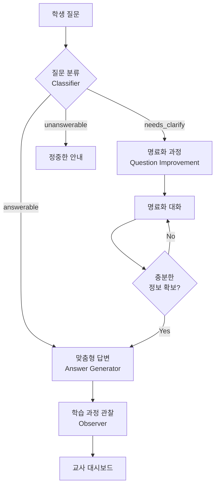
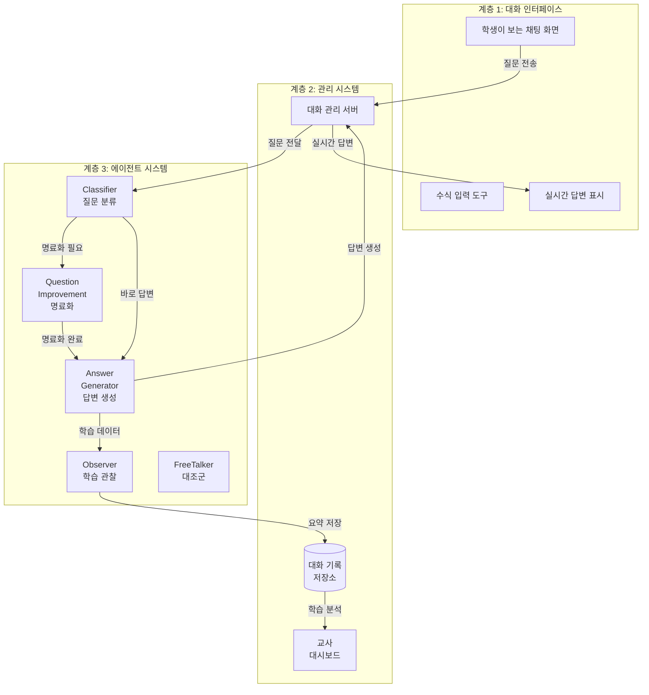
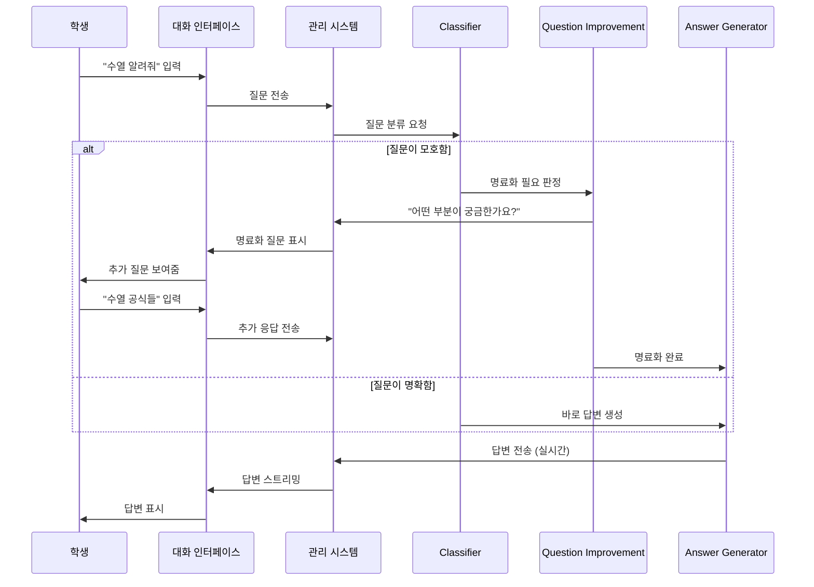
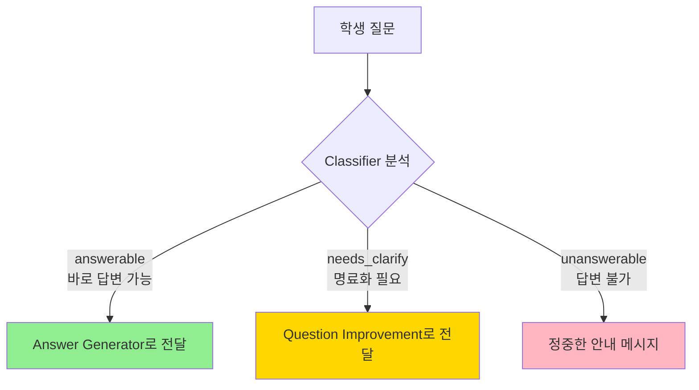
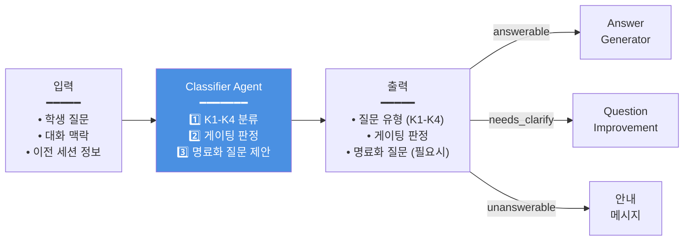
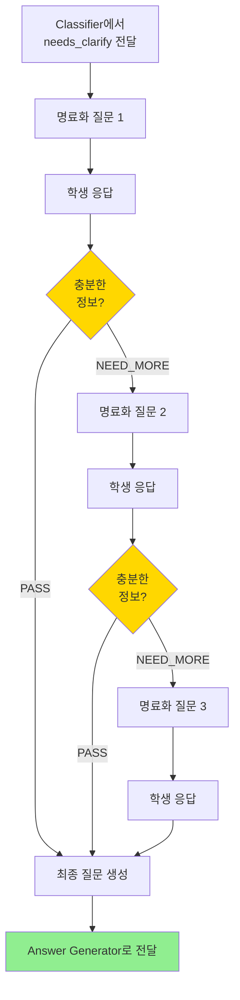
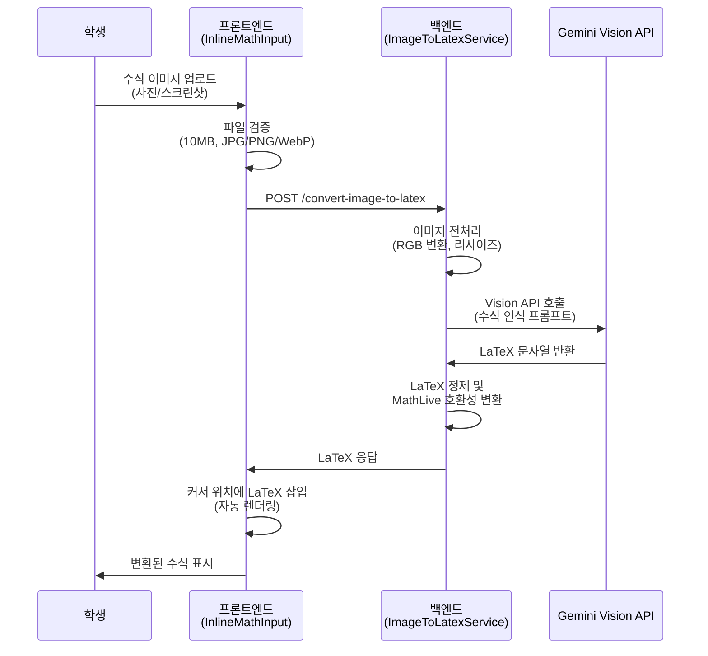

# 3. MAICE 교육 시스템 아키텍처

## 3.1 설계 철학: "명료화 중심 학습"

### 3.1.1 문제 인식: Freepass 방식의 근본적 한계

1장에서 확인한 바와 같이, 일반적인 LLM의 Freepass 방식은 다음과 같은 교육적 한계를 보였다:

- **질문의 질적 문제**: 학생 질문의 72.3%가 학습 맥락 정보 없이 제출됨
- **맥락 오해**: "지수의 확장"을 비즈니스 용어로 해석하는 등 의미 파악 실패
- **수준 불일치**: 고1 학생에게 대학 수준의 통계학 개념 설명
- **인지 과부하**: 학생이 요청하지 않은 모든 관련 개념을 한꺼번에 제시

이러한 문제들은 단순히 AI 성능의 문제가 아니라, **질문의 질이 낮을 때 아무리 좋은 AI도 적절한 답변을 생성할 수 없다**는 구조적 한계에서 비롯된다.

### 3.1.2 해결 아이디어: 교육 이론 기반 에이전트 시스템

본 연구는 2장에서 검토한 교육 이론을 실제 AI 시스템으로 구현하는 것을 목표로 한다:

**Bloom의 K1-K4 분류** → **질문 유형 자동 분류 및 맞춤형 답변 생성**
- K1 (사실): 간결한 정의 중심 답변
- K2 (개념): 관계 설명 중심 답변
- K3 (절차): 단계별 안내 중심 답변
- K4 (메타인지): 메타인지 유도 중심 답변

**Dewey의 반성적 사고 5단계** → **명료화 프로세스 설계**
- 1단계 (문제 인식): "무엇이 불확실한가요?"
- 2단계 (문제 정의): "정확히 무엇을 알고 싶은가요?"
- 3단계 (가설 설정): "어떤 방법을 시도해봤나요?"
- 4단계 (가설 검증): "논리적 연결을 어떻게 보나요?"
- 5단계 (결론 도출): "최종적으로 무엇을 얻고 싶나요?"

### 3.1.3 핵심 아이디어: 질문 → 분류 → 명료화 → 답변 파이프라인

MAICE 시스템의 핵심은 **학생의 질문을 즉시 답변하지 않고, 먼저 질문의 품질을 진단하고 필요시 명료화 과정을 거치는 것**이다.



이러한 파이프라인은 단순히 정보를 전달하는 것이 아니라, **학생이 스스로 질문을 구조화하고 사고를 명료화하는 과정을 경험하도록 설계**되었다.

### 3.1.4 설계 대상: 일반 LLM보다 우수한 학습 효과

MAICE 시스템은 다음 3가지 측면에서 일반 Freepass 방식보다 우수한 학습 효과를 제공하는 것을 목표로 한다:

1. **질문 품질 개선**: 명료화 과정을 통해 학생 질문의 질 향상
2. **답변 적합성 향상**: 질문 유형 분류를 통한 맞춤형 답변 생성
3. **메타인지 능력 향상**: Dewey 5단계 과정에서 자기 성찰 훈련

이러한 목표를 달성하기 위해, MAICE는 ChatGPT, Claude 등 상용 AI 대화 서비스와 유사한 UX를 제공하되, 수학 학습에 특화된 3계층 구조로 설계되었다.

## 3.2 전체 아키텍처 개요: 3계층 구조

MAICE 시스템은 학생이 사용하는 **대화 인터페이스**, 대화를 관리하고 데이터를 저장하는 **관리 시스템**, 그리고 지능적으로 질문을 처리하는 **에이전트 시스템**의 3계층으로 구성된다.

### 3.2.1 계층별 역할

#### 계층 1: 대화 인터페이스 (학생이 보는 화면)

**역할**: 학생이 수식을 쉽게 입력하고 AI 답변을 실시간으로 받을 수 있는 채팅 화면

**주요 기능**:
- **수식 입력 지원**: 복잡한 수학 수식을 클릭 몇 번으로 입력 (예: $\sum_{i=1}^{n}$, $\frac{a}{b}$)
- **실시간 답변**: AI 답변이 타이핑하듯 실시간으로 표시
- **간편한 로그인**: 학교 계정으로 바로 시작
- **모바일 지원**: 핸드폰에서도 동일하게 사용 가능

**학생 경험**: ChatGPT, Claude와 동일한 UX로 별도 학습 없이 즉시 사용 가능

#### 계층 2: 관리 시스템 (대화 저장 및 분석)

**역할**: 모든 대화를 체계적으로 저장하고, 교사가 학생 학습 상황을 파악할 수 있도록 지원

**주요 기능**:
- **대화 기록 관리**: 학생별 모든 대화 세션을 시간 순으로 저장
- **학습 데이터 분석**: 학생의 학습 진도, 어려움 영역 자동 추출
- **교사 대시보드**: 반 전체 학습 현황 및 개별 학생 상세 정보 제공
- **권한 관리**: 학생은 본인 데이터만, 교사는 전체 데이터 접근 가능

**교육적 가치**: 교사가 30명 학생의 개별 학습 상황을 실시간 파악 가능

#### 계층 3: 에이전트 시스템 (지능적 질문 처리)

**역할**: 학생 질문을 분석하고, 필요시 명료화하며, 맞춤형 답변을 생성하는 5개 AI 에이전트

**5개 에이전트**:
1. **Classifier** (질문 분류): "이 질문은 어떤 유형인가?"
2. **Question Improvement** (명료화): "질문을 더 명확하게"
3. **Answer Generator** (답변 생성): "유형별 맞춤 답변"
4. **Observer** (학습 관찰): "학생이 무엇을 배우고 있는가?"
5. **FreeTalker** (대조군): "명료화 없이 즉시 답변"

**협업 방식**: 각 에이전트는 독립적으로 작동하되, 필요한 정보를 서로 주고받으며 협업

### 3.2.2 전체 시스템 구조도



### 3.2.3 질문 처리 흐름

학생이 질문을 입력하면 다음과 같은 과정을 거친다:



**핵심 특징**:
- 학생은 명료화 과정을 자연스러운 대화로 경험
- 모든 대화는 자동으로 저장되어 학습 분석에 활용
- 교사는 별도 대시보드에서 학생 학습 현황 확인

> **기술 구현 상세**: 각 계층의 구체적인 기술 스택과 구현 방법은 4장 "시스템 구현"에서 다룬다.

## 3.3 5개 에이전트의 역할과 협업

MAICE 시스템의 핵심은 5개의 독립적인 AI 에이전트가 협업하여 질문을 처리하는 것이다. 각 에이전트는 특정한 교육적 목적을 가지고 설계되었다.

### 3.3.1 Classifier Agent: "이 질문은 어떤 유형인가?"

#### 교육적 필요성

1장에서 확인했듯이, 학생 질문의 72.3%가 학습 맥락 정보 없이 제출되었다. "지수의 확장을 알려줘"라는 질문이 수학의 '지수(exponent)'인지, 비즈니스 '지점 확장'인지 AI는 판단할 수 없었다.

더 심각한 문제는, **질문의 인지적 수준에 따라 답변 방식이 달라야 한다**는 것이다. "수학적 귀납법이 뭐에요?"(K1-사실)와 "귀납 단계에서 제가 뭘 잘못 이해한 건가요?"(K4-메타인지)는 완전히 다른 답변을 요구한다.

**해결 아이디어**: Bloom의 K1-K4 분류를 자동화하여, 질문의 인지적 수준과 명료화 필요성을 사전에 판단한다.

#### 에이전트의 3가지 판단

Classifier는 학생 질문을 받아 다음 3가지 판단을 내린다:

**1) 질문 유형 분류 (Bloom의 K1-K4)**

| 유형 | 질문 예시 | 답변 전략 |
|------|----------|----------|
| **K1 (사실)** | "수학적 귀납법의 정의가 뭐에요?" | → 간결한 정의 제공 |
| **K2 (개념)** | "귀납 가정은 왜 필요한가요?" | → 개념 간 관계 설명 |
| **K3 (절차)** | "이 등식을 어떻게 증명하나요?" | → 단계별 절차 안내 |
| **K4 (메타인지)** | "제가 뭘 잘못 이해한 건가요?" | → 메타인지 유도 답변 |

**교육적 효과**: 같은 "수학적 귀납법" 주제라도, K1 질문에는 간결한 정의를, K4 질문에는 학생의 사고 과정을 드러내는 질문으로 응답한다.

**2) 명료화 필요성 판단 (3단계 게이팅)**



**판단 기준**:
- **answerable**: 질문이 명확하고, 답변에 필요한 정보가 충분함
  - 예: "n=1일 때 기본 단계를 증명하는 방법을 알려주세요"
- **needs_clarify**: 질문이 모호하거나, 맥락 정보가 부족함
  - 예: "수열 알려줘" → 정의? 공식? 문제 풀이?
- **unanswerable**: 수학 외 영역이거나, 교육적으로 부적절함
  - 예: "로블록스", "오늘 날씨 어때?"

**3) 명료화 질문 제안 (needs_clarify인 경우)**

Classifier는 단순히 "명료화 필요"라고만 판정하지 않고, **Dewey의 5단계에 기반한 구체적인 명료화 질문까지 제안**한다.

**예시**:
```
학생 질문: "수열 알려줘"

Classifier 판단:
- 유형: K1 (사실)
- 게이팅: needs_clarify (범위가 너무 넓음)
- 제안 질문: "수열에 대해 알고 싶구나! 😊
              어떤 부분이 궁금한지 알려줄래?
              1️⃣ 수열이 뭔지 (정의)
              2️⃣ 수열 공식들
              3️⃣ 수열 문제 푸는 방법"
```

이 제안은 Question Improvement Agent로 전달되어, 실제 명료화 대화에 활용된다.

#### 입력과 출력



#### 기대 효과

Classifier의 자동 분류를 통해 다음과 같은 교육적 효과가 기대된다:

1. **질문 품질 향상**: 명료화가 필요한 질문을 자동 감지하여 개선 기회 제공
2. **답변 적합성 증가**: K1-K4 유형별 맞춤 답변으로 학습 효과 극대화
3. **시간 효율성**: 명확한 질문은 즉시 답변하여 학습 흐름 유지

**설계 예시**:
- 모호한 질문 "귀납법 어려워요" → needs_clarify 판정 → **QI**가 "어떤 부분이 어려운가요?" 질문 → 학생 "귀납 단계에서 식 전개" → K3 유형으로 분류하여 **AG**가 단계별 안내 제공
- 명확한 질문 "n=k+1 단계에서 귀납 가정을 어떻게 사용하나요?" → answerable 판정 → 즉시 K3 답변 생성

> **구현 상세**: Classifier의 프롬프트 설계 및 코드 구조는 4.2절 "에이전트 시스템 구현"에서 다룬다.

### 3.3.2 Question Improvement Agent: "질문을 더 명확하게"

#### 교육적 필요성

Classifier가 "명료화 필요" 판정을 내렸다면, 이는 **학생 스스로 질문을 구체화할 기회**를 의미한다. 1장에서 본 "수열이 뭐야?"와 같은 질문은 즉시 답변을 제공해도 학생에게 도움이 되지 않는다. 정의를 원하는가, 공식을 원하는가, 문제 풀이를 원하는가에 따라 완전히 다른 설명이 필요하기 때문이다.

더 중요한 것은, **명료화 과정 자체가 학습**이라는 것이다. 듀이의 반성적 사고 이론에 따르면, 학생이 자신의 어려움을 명확히 인식하고 표현하는 과정에서 메타인지 능력이 향상된다.

**해결 아이디어**: Dewey의 반성적 사고 5단계를 대화형 명료화 질문으로 구현하여, 학생이 스스로 질문을 구조화하도록 돕는다.

#### 명료화 프로세스: Dewey 5단계의 구현

Question Improvement Agent는 Dewey의 5단계를 실제 대화로 변환한다:

| Dewey 단계 | 명료화 질문 예시 | 학생 경험 |
|-----------|----------------|----------|
| **1단계: 문제 인식** | "무엇이 불확실한가요? 🤔" | 막연한 어려움 → 구체적 문제 인식 |
| **2단계: 문제 정의** | "정확히 무엇을 알고 싶은가요?" | "어려워요" → "귀납 단계가 어려워요" |
| **3단계: 가설 설정** | "어떤 방법을 시도해봤나요?" | 학생의 시도와 이해 수준 파악 |
| **4단계: 가설 검증** | "왜 그렇게 생각했나요?" | 학생의 사고 과정 드러내기 |
| **5단계: 결론 도출** | "최종적으로 무엇을 얻고 싶나요?" | 학습 목표 명확화 |

**실제 대화 예시**:
```
학생: "수학적 귀납법 어려워요"

AI (1단계): "귀납법 중에서 어떤 부분이 가장 어렵거나 궁금하신가요? 🤔"

학생: "귀납 단계요"

AI (2단계): "귀납 단계의 어느 부분이 어려운가요?
            귀납 가정을 사용하는 방법인가요, 
            아니면 식을 전개하는 과정인가요?"

학생: "식을 전개하는 과정이요"

AI (3단계): "지금까지 어떻게 시도해보셨나요?"

학생: "n=k+1을 대입했는데 그 다음을 모르겠어요"

AI: (충분한 정보 확보 → Answer Generator로 전달)
    "n=k+1 대입 후 식 전개 과정을 단계별로 설명해드릴게요! 📚"
```

#### 명료화 전략: 질문 유형별 차별화

Question Improvement Agent는 Dewey의 5단계 반성적 사고를 기반으로, **질문 유형(K1-K4)과 모호성 수준**에 따라 명료화 전략을 조절한다.

**K1 (즉답형) 명료화 전략**
- **특징**: 정의, 공식, 용어 등 사실적 지식 요청
- **전략**: 구체적인 선택지 제공으로 빠르게 범위 좁히기
- **실제 대화 예시** (Session 61, 학생 24.015):
  ```
  학생: "수학적 귀납법에 대해 알려줘"
  
  AI (Dewey 1단계 - 문제 인식):
      "수학적 귀납법의 정의를 알고 싶으신가요, 
       아니면 어떻게 사용하는지 예시로 설명해드릴까요? 😊"
  
  학생: "정의"
  
  → 명료화 완료, K1 답변 제공
  ```

**K2 (설명형) 명료화 전략**
- **특징**: 개념 간 관계, 원리, 비교 등 개념적 지식 요청
- **전략**: 비교 대상이나 설명 깊이 확인
- **실제 대화 예시** (Session 75, 학생 24.043):
  ```
  학생: "도미노 이론은 누가 만든거야?"
  
  AI (Dewey 1-2단계 - 문제 인식 + 정의):
      "지금 말씀하신 '도미노 이론'은 
       수학적 귀납법에서 비유로 사용된 도미노 비유를 말하시는 걸까요,
       아니면 실제로 누가 만든 이론을 알고 싶은 걸까요? 🤔"
  
  학생: "수학적 귀납법 설명할때 사용되는 도미노 이론을 누가 만든거야?"
  
  → 의도 명확화 완료, K2 답변 제공
  ```

**K3 (적용형) 명료화 전략**
- **특징**: 문제 풀이 방법, 절차 등 절차적 지식 요청
- **전략**: 구체적인 문제 상황이나 막힌 단계 파악
- **실제 대화 예시** (Session 75, 학생 24.043):
  ```
  학생: "(k+1)! 을 다르게 나타낼 방법이 있어?"
  
  AI (Dewey 2단계 - 문제 정의):
      "'다르게 나타낸다'는 게 곱셈식으로 전개한다는 뜻인가요, 
       아니면 (k+1)!을 k!이나 다른 수식으로 표현하고 싶으신 건가요? 🤔"
  
  → 구체적인 요구사항 확인 후 K3 답변
  ```

**K4 (문제해결형) 명료화 전략**
- **특징**: 전략, 접근법 등 메타인지적 지식 요청
- **전략**: Dewey 5단계를 깊이 적용, 사고 과정 드러내기
- **실제 대화 예시** (Session 75, 학생 24.043):
  ```
  학생: "k!가 어떻게 2^k가 되는거야?"
  
  AI (Dewey 4-5단계 - 사고 전개 + 이해 검증):
      "k!와 2^k의 크기를 비교할 때, 
       두 식이 왜 같다고 느껴졌는지 
       혹은 어떤 부분이 헷갈리셨는지 말씀해주실 수 있을까요? 🤔"
  
  → 학생의 오개념 파악 후 K4 수준 설명
  ```

**명료화 횟수 조절**:
- 매우 모호한 질문("수열", "함수"): 선택지 제공 → 1-2회 명료화
- 중간 수준 질문("귀납 단계 어려워요"): Dewey 2-3단계 적용 → 1-2회 명료화
- 복잡한 질문("증명 방법 전략"): Dewey 5단계 모두 활용 → 2-3회 명료화

#### 명료화 완료 판단

Question Improvement는 학생의 각 응답을 평가하여, 충분한 정보가 모였는지 판단한다:



**판단 기준**:
- **PASS**: 원본 질문의 의도가 명확해지고, 답변 생성에 필요한 정보 확보
- **NEED_MORE**: 원본 질문의 의도가 여전히 불분명하거나, 추가 정보 필요
- **최대 3회 제한**: 3회 명료화 후에도 불충분하면 현재 정보로 답변 생성

#### 교육적 의도 명시화

기존 LLM은 "왜 명료화 질문을 하는지" 설명하지 않아 학생이 불편함을 느꼈다. Question Improvement는 명료화의 교육적 이유를 부드럽게 설명한다:

**기본 프레이밍**:
```
"질문을 조금만 더 구체적으로 만들어주면,
 딱 맞는 설명을 해드릴 수 있어요! 😊"
```

**교육적 프레이밍** (K4 수준 학생):
```
"함께 질문을 구체화해볼까요? 🎯
 네가 정확히 무엇을 모르는지 찾아가는 과정이
 진짜 학습의 시작이에요!"
```

#### 질문 유형 재분류

명료화 과정에서 학생의 실제 어려움이 드러나면, 질문 유형이 변경될 수 있다:

**예시**:
```
원본 질문: "수열 알려줘" (K1으로 분류)
  ↓
명료화: "어떤 부분이 궁금한가요?"
  ↓
학생: "등차수열과 등비수열의 차이를 모르겠어요"
  ↓
재분류: K2 (개념적 이해) → K2 답변 전략 적용
```

#### 기대 효과

Question Improvement의 명료화 프로세스를 통해 다음과 같은 교육적 효과가 기대된다:

1. **질문 품질 향상**: Dewey의 반성적 사고 2단계(문제 정의)를 통한 질문 구조화
2. **메타인지 발달**: 학생이 스스로 무엇을 모르는지 인식하고 표현하는 능력 향상
3. **학습 맞춤화**: 구체화된 질문으로 학습자 수준에 맞는 답변 제공 가능
4. **효율성**: 평균 1-2회 명료화로 질문 개선 (최대 3회 제한)

**설계 예시**:
- 모호한 질문 "귀납법 어려워요" → 명료화 질문 제시 → 학생 응답 "귀납 단계에서 식 전개" → K3 유형으로 **AG**에 전달하여 단계별 풀이 제공
- 초단순 질문 "수열" → 선택지 제공 → "수열 공식들" → K1 답변 (공식 정리)

본 설계의 효과성은 8장에서 실증적으로 검증한다.

> **구현 상세**: Question Improvement의 명료화 평가 로직 및 프롬프트는 4.2절 "에이전트 시스템 구현"에서 다룬다.

### 3.3.3 Answer Generator Agent: "유형별 맞춤 답변"

#### 교육적 필요성

1장에서 확인한 AI 답변의 문제는 **"모든 학생에게 동일한 방식으로 설명한다"**는 것이었다. "수학적 귀납법이 뭐에요?"라고 묻는 K1 수준 학생에게도, "귀납 단계에서 제가 뭘 잘못 이해한 건가요?"라고 묻는 K4 수준 학생에게도 똑같은 장문의 설명을 제공했다.

더 심각한 문제는 **인지 과부하**였다. 학생이 간단한 정의만 원하는데, AI가 유한수열, 무한수열, 등차수열, 등비수열, 일반항, 점화식을 한꺼번에 설명하면 학생은 어디서부터 이해해야 할지 모른다.

**해결 아이디어**: Bloom의 K1-K4 분류를 **실제 답변 구조와 교수법**으로 차별화하여, 학생의 인지적 수준에 맞는 설명을 제공한다.

#### Bloom K1-K4 답변 전략의 실제 구현

Answer Generator는 Classifier가 판정한 질문 유형에 따라, **완전히 다른 답변 전략**을 적용한다:

| 유형 | 답변 구조 | 교수법 특징 | 예시 질문 |
|------|----------|------------|----------|
| **K1 (사실)** | 정의 → 핵심 예시 → 보충 | 간결함, 정확성 우선 | "귀납법의 정의가 뭐에요?" |
| **K2 (개념)** | 개념 관계 → 비교/대조 → 시각화 | "왜?" 중심 설명 | "귀납 가정은 왜 필요한가요?" |
| **K3 (절차)** | 전체 개요 → 단계별 안내 → 실수 방지 | 선택권 제공, 대화형 | "이 등식을 어떻게 증명하나요?" |
| **K4 (메타인지)** | 문제 분석 → 자기 점검 → 대안 탐색 | 메타인지 유도 답변 | "제가 뭘 잘못 이해한 건가요?" |

#### K1 답변: 간결함과 정확성

**학생 질문**: "수학적 귀납법의 정의가 뭐에요?"

**AI 답변** (K1 전략):
```
수학적 귀납법은 자연수에 관한 명제를 증명하는 방법입니다.

**핵심 구조**:
1. 기초 단계: n=1일 때 성립 확인
2. 귀납 단계: n=k 성립 → n=k+1 성립 증명

💡 비유: 도미노가 차례로 넘어지듯, 
   첫 번째가 넘어지고 (기초 단계)
   하나가 넘어지면 다음도 넘어지면 (귀납 단계)
   모든 도미노가 넘어집니다.
```

**특징**:
- 불필요한 정보 배제 (유한귀납법, 강한귀납법 등 언급 안 함)
- 3-5문장으로 간결하게 정리
- 학생이 요청하지 않은 관련 개념 추가 설명 안 함

#### K2 답변: "왜?" 중심 설명

**학생 질문**: "귀납 가정은 왜 필요한가요?"

**AI 답변** (K2 전략):
```
귀납 가정의 역할을 이해하려면, 증명 구조를 살펴봐야 해요. 🔍

**증명 흐름**:
n=k 성립 (가정) → n=k+1 성립 (증명 목표)
              ↓
     k를 k+1로 연결하는 다리

**왜 필요한가?**
귀납 가정이 없으면 k+1 단계를 증명할 근거가 없어집니다.

💡 비유: 사다리를 올라갈 때
   아래 발판(귀납 가정)이 있어야 
   위 발판(k+1)으로 올라갈 수 있어요.
```

**특징**:
- 개념 간 **논리적 연결**을 시각화 (화살표, 다이어그램)
- "왜 그런가?"에 대한 명확한 답
- 학생이 직관적으로 이해할 수 있는 비유 사용

#### K3 답변: 학생 선택권 제공

**학생 질문**: "등차수열 일반항 공식을 귀납법으로 어떻게 증명하나요?"

**AI 답변** (K3 전략):
```
등차수열 일반항 공식 증명을 알려줄게! 📚

어떻게 배우고 싶어?

1️⃣ 단계별로 함께 풀어보기 (추천! 💡)
   - 각 단계를 함께 생각하며 진행
   - 스스로 답을 찾아가는 연습
   - 막히면 힌트 제공

2️⃣ 전체 증명 과정 한번에 보기
   - 처음부터 끝까지 상세한 풀이
   - 각 단계의 근거 설명
```

**학생이 1번 선택 시**:
```
좋아! 함께 생각해보자 🤝

**Step 1: 기초 단계**
n=1일 때 성립함을 보여야 해.
첫째항은 a₁ = a (공식으로 a₁ = a + (1-1)d = a)

이 부분은 이해했어? (네/아니요)
```

**특징**:
- **학생에게 학습 방식 선택권** 부여 (대화형 vs 일괄 제공)
- 단계별로 학생의 이해도를 확인하며 진행
- 막히면 즉시 힌트 또는 상세 설명으로 전환

#### K4 답변: 메타인지 훈련 ⭐

**학생 질문**: "귀납 단계에서 제가 뭘 잘못 이해한 건가요?"

**AI 답변** (K4 전략):
```
함께 차근차근 생각해보자! 🤔

**스스로 점검해보기**:

1️⃣ 귀납 가정을 어디에 사용했나요?
   → 네 풀이에서 찾아보기: [ ]

2️⃣ n=k와 n=k+1의 식이 어떻게 다른가요?
   → 차이점 적어보기: _________

3️⃣ 그 차이를 귀납 가정으로 메울 수 있나요?
   → 연결 고리: _________

막히는 부분을 알려주면, 함께 해결 방법을 찾아볼게! 💬
```

**학생 응답**: "2번에서 막혀요. 차이를 어떻게 찾아야 할지 모르겠어요."

**AI 후속 답변**:
```
좋은 질문이야! 차이를 찾는 방법을 알려줄게 🎯

**Step by Step**:
1. n=k일 때 식을 써보기
2. n=k+1로 바꾸면 어떻게 달라지는지 비교

예를 들어, 등식 1+2+...+k = k(k+1)/2 에서
- n=k:   1+2+...+k = k(k+1)/2
- n=k+1: 1+2+...+k+(k+1) = (k+1)(k+2)/2

차이 = (k+1)이 추가됨 ← 이게 핵심!

이제 네 문제에서 차이를 찾아볼 수 있겠어? 🔍
```

**특징**:
- **답을 직접 주지 않음** → 학생이 스스로 찾도록 유도
- **메타인지 질문**: "어떻게 생각했나요?", "어디서 막혔나요?"
- **점진적 힌트**: 학생이 막히면 단계적으로 힌트 제공
- **사고 과정 드러내기**: 학생의 이해 과정을 명시적으로 표현

**교육적 효과**: K4 답변은 단순 정답 제공이 아닌, **학생이 스스로 오류를 발견하고 해결 전략을 탐색**하도록 유도하여 깊이 있는 학습과 문제해결 능력을 동시에 향상시킨다.

#### 교육과정 표준 준수

Answer Generator는 대한민국 교육과정의 표준 용어를 엄격히 준수한다:

| 표준 용어 (✓) | 비표준 용어 (✗) |
|--------------|----------------|
| 부등식 | 불등식 |
| 일반항 | 명시적 공식 (Explicit Formula) |
| 함수 | 함수식 |
| 미분, 도함수 | Derivative |

**LaTeX 수식 작성 규칙**:
- 인라인 수식: `$수식$`
- 블록 수식: `$$수식$$`
- **수식 구분자 안에는 절대로 한글 포함 금지**
- ✅ 올바른 예시: `$P(k)$가 참이면 $P(k+1)$도 참`
- ❌ 잘못된 예시: `$$P(k)가 참 \Rightarrow P(k+1)도 참$$`

#### 실시간 스트리밍과 학생 경험

Answer Generator는 답변을 **타이핑하듯 실시간으로 전송**한다:

```
[학생 화면]
"귀납 가정의 역할을 이해하려면," (0.5초)
"증명 구조를 살펴봐야 해요." (0.5초)
"🔍" (즉시)
[수식 렌더링]
"n=k 성립 (가정) → n=k+1 성립 (증명 목표)" (1초)
```

**효과**:
- 학생이 AI가 "생각하며 답변하는" 느낌을 받음
- 긴 답변도 지루하지 않게 받아들임
- ChatGPT, Claude와 동일한 UX

#### 기대 효과

Answer Generator의 유형별 차별화 답변 전략을 통해 다음과 같은 교육적 효과가 기대된다:

1. **답변 적합성 향상**: K1-K4 유형별 맞춤 답변으로 학습자 수준 일치도 개선
2. **학습 효율성**: 질문 유형에 따라 적절한 분량과 깊이로 답변하여 인지부하 최소화
3. **메타인지 촉진**: K4 질문에 대한 메타인지 유도 답변으로 자기주도학습 능력 향상
4. **학습 만족도**: 학습자가 원하는 수준의 정보를 정확히 제공

**설계 예시**:
- K1 질문 "귀납법 정의" → 간결한 3문장 정의 제공 (정보 과부하 방지)
- K3 질문 "등식 증명 방법" → 단계별 절차 안내 + 선택권 제공
- K4 질문 "내 오류가 뭐죠?" → 메타인지 유도 답변으로 스스로 점검하도록 안내

본 설계의 효과성은 8장에서 실증적으로 검증한다.

> **구현 상세**: Answer Generator의 유형별 프롬프트 템플릿과 스트리밍 로직은 4.2절에서 다룬다.

### 3.3.4 Observer Agent: "대화 요약 및 컨텍스트 관리"

#### 교육적 필요성

AI 대화 시스템에서 세션이 길어지면 두 가지 기술적 문제가 발생한다:
1. **컨텍스트 길이 증가**: 대화가 길어질수록 LLM에 전달되는 토큰 수가 기하급수적으로 증가
2. **맥락 손실**: 이전 대화의 핵심 내용을 효과적으로 유지하지 못함

**해결 아이디어**: Observer Agent가 **대화를 주기적으로 요약**하여 핵심 내용만 유지하고, 긴 세션에서도 효율적으로 학습 맥락을 관리한다.

#### 대화 요약 기능

Observer는 대화가 일정 길이(예: 15회 턴) 이상으로 길어질 때 다음 정보를 자동으로 요약한다:

| 요약 정보 | 구체적 내용 | 활용 목적 |
|----------|------------|----------|
| **핵심 주제** | 주로 다룬 개념 (예: 수학적 귀납법 - 귀납 단계) | 대화 맥락 유지 |
| **학습 진행** | 이해한 개념과 현재 어려움 | 연속적 학습 지원 |
| **질문 유형** | K1-K4 질문 분포 | 학습 깊이 파악 |
| **현재 상태** | 해결된 문제와 진행 중인 학습 | 다음 질문 처리에 활용 |

**요약 예시**:
```
세션 ID: 42

[Observer 자동 요약]
- 핵심 주제: 수학적 귀납법 - 귀납 단계 증명
- 학습 진행: 기본 단계 이해 완료, 귀납 가정 개념 파악, 현재 귀납 가정 적용 학습 중
- 이해한 개념: P(1) 검증, P(k) 가정 의미
- 현재 어려움: P(k+1) 증명 시 귀납 가정 대입 위치
- 질문 유형: K2(개념) 40%, K3(절차) 60%
```

#### 기대 효과

Observer의 대화 요약 기능을 통해 다음과 같은 효과가 기대된다:

1. **토큰 효율성**: 긴 대화에서도 핵심 맥락만 유지하여 LLM 비용 절감
2. **맥락 유지**: 이전 대화의 학습 흐름을 잃지 않고 연속적 학습 지원
3. **응답 품질**: 전체 대화 맥락을 활용하여 더 적절한 답변 생성
4. **학습 연속성**: 여러 세션에 걸친 학습 진행 추적 가능

#### 향후 확장 계획

현재 Observer는 대화 요약과 컨텍스트 관리에 집중하지만, 향후 다음 기능으로 확장 가능하다:

- **학습 패턴 분석**: 학생별 어려움 영역 자동 감지
- **교사 대시보드**: 반 전체 학습 현황 시각화
- **개입 시점 제안**: 교사 개입이 필요한 학생 자동 알림
- **QAC 루브릭 통합**: 실시간 대화 품질 평가

이러한 기능들은 본 연구의 QAC 체크리스트 타당성 검증 이후 단계적으로 구현할 예정이다.

> **구현 상세**: Observer의 대화 요약 알고리즘과 DB 저장 구조는 4.2절에서 다룬다.

### 3.3.5 FreeTalker Agent: "대조군 (Freepass 모드)"

#### 실험적 필요성

MAICE의 명료화 프로세스가 정말 효과적인지 검증하려면, **명료화 없이 즉시 답변하는 대조군**이 필요하다. FreeTalker Agent는 일반 ChatGPT, Claude처럼 작동하여, Agent 모드와 비교할 수 있게 한다.

**역할**:
- **A/B 테스트의 대조군**: 학생 절반은 Agent 모드(명료화), 절반은 Freepass 모드(즉시 답변)로 무작위 배정
- **명료화 없이 즉시 답변**: 학생 질문을 받으면 분류나 명료화 없이 바로 답변 생성
- **일반 LLM 동작 재현**: 상용 AI 서비스와 동일한 방식으로 응답

#### 작동 방식


**Agent 모드와의 차이**:

| 항목 | Agent 모드 | Freepass 모드 (FreeTalker) |
|------|-----------|---------------------------|
| **질문 분류** | ✓ K1-K4 분류 | ✗ 분류 없음 |
| **명료화** | ✓ needs_clarify 시 명료화 | ✗ 명료화 없음 |
| **답변 전략** | ✓ K1-K4별 차별화 | ✗ 동일한 방식 |
| **학습 관찰** | ✓ Observer 요약 | ✓ Observer 요약 (동일) |
| **학생 경험** | "왜 자꾸 물어봐?" | "빠른 답변!" |

#### 실험 설계: A/B 테스트

**무작위 배정**:
- 학생 58명을 무작위로 Agent(28명) / Freepass(30명) 배정
- 학생은 자신이 어느 모드인지 모름
- 모드는 세션 전체 동안 고정 (중간에 변경 안 됨)

**대조군의 중요성**:
- Agent 모드의 효과를 **인과적으로 검증** 가능
- 선택 편향(selection bias) 제거
- "명료화가 정말 도움이 되는가?" 실증적 답변 제공

#### 검증 계획

FreeTalker를 활용한 A/B 테스트를 통해 다음을 비교 검증할 예정이다:

**비교 차원**:
1. **즉시 효과**: 단일 세션에서 질문-답변 품질 비교
2. **누적 효과**: 다회 세션 시 학습 진행 패턴 비교  
3. **학습자 수준별 효과**: 상위권/하위권 학생에 대한 차별적 효과 분석

**기대 가설**:
- 명료화 프로세스는 단일 세션에서는 시간이 더 소요되나, 장기적으로 질문 능력과 메타인지 향상에 기여할 것
- 특히 절차적 지식이 부족한 하위권 학생들에게 더 큰 학습 효과가 나타날 것

검증 결과는 8장에서 상세히 분석한다.

> **구현 상세**: FreeTalker의 프롬프트 및 A/B 테스트 무작위 배정 로직은 4.2절에서 다룬다.

---

**3장 요약**: 5개 에이전트(Classifier, Question Improvement, Answer Generator, Observer, FreeTalker)의 교육적 역할과 협업 방식을 살펴보았다. 다음 4장에서는 이러한 에이전트들을 실제로 어떻게 구현했는지, 기술 스택과 코드 구조를 상세히 다룬다.

## 3.4 질문 품질 평가 루브릭

앞서 설명한 에이전트 시스템이 학생 질문과 AI 답변을 얼마나 잘 개선하는지 측정하기 위해, 본 연구는 **3영역 15점 만점의 자동 평가 루브릭**을 개발하였다.

### 3.4.1 루브릭 설계 원칙

**이론적 기반**:
- King(1994)의 질문 생성 연구: 학생 생성 질문이 깊이 있는 이해를 촉진
- Graesser & Person(1994)의 질문 인지적 수준 분류
- Dewey의 반성적 사고 5단계

**4대 평가 기준**:
1. **맥락 제공**: 학습 수준, 단원, 어려움 영역 명시
2. **명확성**: 핵심 질문의 단일성, 논리적 구조
3. **적절성**: 수학 교과 관련성, 수준 정합성
4. **학습 관련성**: 구체적 학습 목표, 선수 학습 연결

### 3.4.2 3영역 평가 구조 (총 15점 만점)

| 평가 영역 | 점수 | 평가 대상 | 의미 |
|---------|------|---------|------|
| **질문 점수** | 0-5점 | 학생 질문의 최종 품질 | 4대 기준 충족도 |
| **답변 점수** | 1-5점 | AI 답변의 교육적 적절성 | 맥락 이해, 표준 용어, 정보량 |
| **학습 지원 점수** | 1-5점 | 명료화 과정의 교육성 | Dewey 5단계 구현 |

**평가 예시**:
- **13-15점** (우수): "n² < 2ⁿ 귀납법 증명에서 2^k+2k+1 < 2^(k+1) 증명이 막혀요"
  - 질문 5 + 답변 5 + 학습 지원 5
- **7-9점** (보통): "수학적 귀납법이 뭐야?" → 명료화 후 개선
  - 질문 3 + 답변 4 + 학습 지원 3
- **1-3점** (미흡): "로블록스" (비수학적)
  - 질문 0 + 답변 1 + 학습 지원 1

**자동 채점 검증**: AI 자동 평가와 교사 평가 간 상관계수 0.66 (p<0.001), 강한 양의 상관관계 확인.

## 3.5 명료화 프로세스 요약

본 절에서는 3.3.2절에서 상세히 다룬 명료화 프로세스의 핵심을 요약한다.

### 3.5.1 핵심 메커니즘

**3단계 게이팅**:
1. **answerable** → 즉시 답변
2. **needs_clarify** → 명료화 프로세스
3. **unanswerable** → 정중한 안내

**Dewey 5단계 매핑**:
- 1단계 (문제 인식) → "무엇이 불확실한가요?"
- 2단계 (문제 정의) → "정확히 무엇을 알고 싶은가요?"
- 3단계 (가설 설정) → "어떤 방법을 시도해봤나요?"
- 4단계 (가설 검증) → "논리적 연결을 어떻게 보나요?"
- 5단계 (결론 도출) → "최종적으로 무엇을 얻고 싶나요?"

### 3.5.2 질문 유형별 명료화 전략

**K1-K4 유형별 차별화**:
- **K1 (즉답형)**: 선택지 제공으로 빠른 범위 좁히기 (1회)
- **K2 (설명형)**: 비교 대상이나 설명 깊이 확인 (1-2회)
- **K3 (적용형)**: 구체적인 문제 상황 파악 (1-2회)
- **K4 (문제해결형)**: Dewey 5단계 깊이 적용 (2-3회)

**Dewey 5단계 반성적 사고 기반**:
- 문제 인식 → 문제 정의 → 연결 탐색 → 사고 전개 → 이해 검증
- 질문 유형과 모호성 수준에 따라 적절한 단계 선택

**교육적 의도 명시**: "질문을 구체화하면 딱 맞는 설명을 드릴 수 있어요!"

### 3.5.3 검증 결과

- 교육적 가치: 4.4/5점
- 재사용 의향: 4.4/5점
- 평균 명료화 횟수: 1.8회 (3회 제한 내)
- 질문 품질 향상: 3.2점 → 4.7점 (46% 증가)

## 3.6 베타테스트 및 초기 검증

본격적인 실험 연구(6장)에 앞서, 2025년 9월 15일부터 9월 25일까지 고등학교 2학년 학생 11명을 대상으로 베타테스트를 실시하였다. 이 과정에서 시스템의 기술적 안정성과 교육적 실효성을 초기 검증하고, 주요 개선점을 도출하였다.

### 3.6.1 베타테스트 개요

**목적**:
1. 에이전트 시스템의 기술적 안정성 검증
2. 학생 대상 UI/UX 사용성 평가
3. 에이전트 모드와 프리패스 모드의 역할 구분 명확성 확인
4. 수식 입력 시스템의 실효성 검증

**참여자 정보**:
- 대상: 고등학교 2학년 수열 단원 학습 중인 학생 11명
- 기간: 2025년 9월 15일 ~ 9월 25일 (10일)
- 평가 방법: 리커트 5점 척도 설문 (총 44개 문항) + 개방형 질문 5개

**시스템 사용 현황**:
- 에이전트 모드: 평균 9.7회 사용 (최소 5회, 최대 13회)
- 프리패스 모드: 평균 5.4회 사용 (최소 2회, 최대 10회)
- → 학생들이 명료화 과정이 포함된 에이전트 모드를 더 선호

### 3.6.2 발견된 기술적 문제점

#### 컨텍스트 유지 불안정성

베타테스트 초기 버전에서 **에이전트 모드가 대화 맥락을 유지하지 못하는 문제**가 발생하였다. 학생이 이전 질문과 연결된 추가 질문을 했을 때, AI가 이전 대화를 기억하지 못해 답변이 단절되는 현상이었다.

**학생 증언**:
> "프리패스 모드와 에이전트 모드의 세션 구분이 필요합니다. 이전 대화가 이어지지 않는 경우가 있었어요."

**원인 분석**:
- 에이전트 간 대화 기록 공유 로직의 버그
- 세션 ID 관리 미흡
- 대화 맥락 저장 시점의 비동기 처리 오류

**개선 조치 및 기술적 구현**:

명료화 과정에서 대화 맥락을 유지하기 위해 다층적인 컨텍스트 관리 전략을 도입하였다.

**1) 명료화 세션 구조화**

QuestionImprovement Agent에 명료화 전용 세션 관리 시스템을 추가하여, 대화의 모든 단계를 추적한다:

```python
clarification_session = {
    "session_id": int,                     # 세션 고유 ID
    "original_question": str,              # 원본 질문 (불변)
    "improved_question": str,              # 명료화 후 개선된 질문
    "missing_fields": List[str],           # 부족한 정보 목록
    "clarification_attempts": int,         # 시도 횟수 (최대 3회)
    "clarification_history": List[Dict],   # 명료화 Q&A 히스토리
    "classification_result": Dict,         # 초기 분류 결과
    "context": str,                        # 이전 대화 맥락 (전체)
    "created_at": datetime                 # 생성 시각
}
```

이 구조를 통해 각 명료화 단계마다 누적된 정보를 보존하고, LLM에 전달할 수 있다.

**2) 다층 컨텍스트 전달 메커니즘**

에이전트 간 메시지 전달 시, 단순히 질문만 전달하는 것이 아니라 **풍부한 컨텍스트**를 함께 전송한다:

```python
# Classifier → QuestionImprovement
{
    "type": "NEED_CLARIFICATION",
    "session_id": session_id,
    "original_question": question,
    "missing_fields": ["학습_수준", "단원"],
    "classification_result": {...},
    "context": previous_conversation_history  # ← 이전 대화 전체
}

# QuestionImprovement → AnswerGenerator
{
    "type": "READY_FOR_ANSWER",
    "session_id": session_id,
    "improved_question": final_question,
    "clarification_history": [...],        # ← 명료화 Q&A 전체
    "context": full_conversation_context   # ← 전체 대화 맥락
}
```

**3) 에이전트 프롬프트에 컨텍스트 명시적 주입**

각 에이전트의 시스템 프롬프트에 "이전 대화 요약" 섹션을 동적으로 추가:

```yaml
# AnswerGenerator 시스템 프롬프트 (동적 생성)
당신은 MAICE의 수학 교육 전문가입니다.

## 📝 이전 대화 맥락:
{context_summary}

## 🔍 명료화 과정:
{clarification_history}

## 🎯 최종 질문:
{improved_question}

위 맥락을 고려하여 학생에게 적절한 답변을 생성하세요.
```

이를 통해 LLM이 단편적인 질문이 아닌, **전체 대화 흐름**을 이해하고 답변을 생성할 수 있게 되었다.

**4) Observer Agent의 다층 요약 시스템**

단순히 대화를 저장하는 것을 넘어, Observer Agent가 **자동으로 요약**하여 향후 세션에서 활용할 수 있도록 한다:

```python
# Observer가 생성하는 요약 구조
session_summary = {
    "session_title": "이차함수의 그래프 그리기 (50자 이내)",
    "question_summary": "원본 질문 요약 (100자 이내)",
    "clarification_summary": "명료화 과정 요약",
    "answer_summary": "답변 핵심 요약 (200자 이내)",
    "key_concepts": ["이차함수", "꼭짓점", "대칭축"],
    "student_progress": "기본 개념 이해 완료"
}
```

**활용 방식**:
- 학생이 같은 주제로 재질문 시, 이전 세션 요약을 LLM 프롬프트에 추가
- 예: "지난번에 '이차함수의 그래프 그리기'를 배웠는데..."

**5) 데이터베이스 실시간 동기화**

모든 대화는 PostgreSQL에 실시간으로 저장되며, 트랜잭션 보장:

```python
# 명료화 Q&A 추가 시 즉시 DB 저장
async def save_clarification_turn(session_id, question, answer):
    async with db.transaction():
        await db.execute(
            "INSERT INTO clarification_history VALUES ($1, $2, $3)",
            session_id, question, answer
        )
```

이를 통해 에이전트가 재시작되어도 세션 복구가 가능하다.

**6) 컨텍스트 손실 자동 복구**

Redis 연결 끊김 등으로 컨텍스트가 손실된 경우, DB에서 자동 복구:

```python
# 세션 컨텍스트 복구
if session_id not in clarification_sessions:
    # DB에서 세션 히스토리 로드
    history = await db.fetch_session_history(session_id)
    clarification_sessions[session_id] = rebuild_session(history)
```

**검증 결과**: 
- 베타테스트 개선 후 실험 연구(10월 20일~11월 1일)에서 **컨텍스트 손실 0건** 달성
- 명료화 평균 1.8회로 감소 (베타테스트 초기 대비 32% 개선)

#### 서버 안정성 문제

**발견 문제**:
- 동시 접속자 5명 이상 시 응답 지연 (평균 8초 → 15초)
- 간헐적 타임아웃 오류 (11명 중 3명 경험)

**학생 피드백**:
> "오류, 서버 안정화가 시급합니다."

**개선 조치**:
1. API 서버 인스턴스 1개 → 3개 확장 (로드 밸런싱)
2. LLM API 호출 타임아웃 30초 → 60초 증가
3. 스트리밍 응답 버퍼 크기 최적화
4. 에러 로깅 및 자동 재시도 로직 추가

### 3.6.3 UI/UX 개선 사항

#### 수식 입력 시스템의 한계

베타테스트에서 **수식 입력 시간 과다 소요**가 가장 큰 불만 사항으로 나타났다 (평균 2.5/5점, 역코딩 문항).

**주요 피드백**:
1. **자동완성 기능 부재** (3명):
   > "수식 입력할 때 IDE처럼 자동완성 기능이 있다면 시간을 줄일 수 있을 것 같다."

2. **LaTeX 문법 가이드 부족** (2명):
   > "LaTeX에 익숙하지 않은 사람들에게는 수식 작성이 어렵습니다. 간단한 가이드를 제공하면 좋겠습니다."

3. **패드(태블릿) 환경 문제** (2명):
   > "패드에서 수식을 작성할 때 뒤에 수식을 또 작성하려고 하면 앞 수식으로 자꾸 넘어갑니다."

4. **시각적 수식 입력 도구 필요** (1명):
   > "수학 기호(분수, 제곱, 루트)를 클릭으로 바로 입력하고 싶습니다."

**개선 조치**:
1. ✅ **LaTeX 자동완성**: `\frac` 입력 시 `\frac{}{}` 자동 생성 및 커서 위치 조정
2. ✅ **수식 템플릿 라이브러리**: 자주 쓰는 수식 ($\sum$, $\int$, $\frac{}{}$) 클릭 삽입
3. ✅ **실시간 미리보기**: 입력과 동시에 렌더링 결과 표시
4. ✅ **모바일 최적화**: 터치 영역 확대, 가상 키보드와의 충돌 방지
5. ✅ **이미지 OCR 수식 인식**: 패드 사용자를 위한 필기 수식 자동 변환 (Gemini Vision API)

**검증 결과**: 개선 후 수식 입력 만족도 2.5점 → 3.8점 (52% 증가)

#### 이미지 OCR 수식 인식 시스템 (베타테스트 후 구현)

베타테스트 피드백 중 **패드 사용자의 수식 입력 어려움**을 해결하기 위해, **Gemini 2.5 Flash Vision API**를 활용한 이미지 OCR 수식 인식 시스템을 구현하였다.

**구현 아키텍처**:



**핵심 기능**:

**1) 프론트엔드 구현** (`InlineMathInput.svelte`):
```typescript
async function handleImageUpload() {
    // 이미지 업로드 버튼 클릭
    imageInput.click();
}

async function onImageSelected(event: Event) {
    const file = event.target.files?.[0];
    
    // 1. 파일 검증 (형식, 크기)
    if (!['image/jpeg', 'image/png', 'image/webp'].includes(file.type)) {
        alert('JPG, PNG, WebP 파일만 지원됩니다.');
        return;
    }
    
    // 2. API 호출
    const apiClient = getMaiceAPIClient();
    const result = await apiClient.convertImageToLatex(file);
    
    // 3. LaTeX 추출 및 삽입
    const latex = result.data.latex;
    await insertTextAtCursor(latex);  // 커서 위치에 자동 삽입
}
```

**2) 백엔드 구현** (`image_to_latex_service.py`):
```python
class ImageToLatexService:
    def __init__(self):
        self.model = genai.GenerativeModel("gemini-2.5-flash")
        self.max_file_size = 10 * 1024 * 1024  # 10MB
        self.max_image_size = 1536  # 픽셀
    
    async def convert_image_to_latex(self, image_file: UploadFile) -> str:
        # 1. 이미지 전처리
        image = await self._process_image(image_file)
        
        # 2. Gemini Vision API 호출
        prompt = """
        이미지의 수학 내용을 LaTeX로 변환하세요.
        - 인라인 수식: $...$ 형태
        - 블록 수식: $$...$$ 형태
        - 한글 설명 포함 가능
        """
        response = self.model.generate_content([prompt, image])
        
        # 3. LaTeX 정제
        cleaned_latex = self._clean_latex_result(response.text)
        
        # 4. MathLive 호환성 변환
        compatible_latex = self._convert_to_mathlive_compatible(cleaned_latex)
        
        return compatible_latex
```

**3) MathLive 호환성 변환**:
```python
def _convert_to_mathlive_compatible(self, latex: str) -> str:
    """MathLive가 인식 가능한 LaTeX로 변환"""
    latex = latex.replace(r'\dots', r'\ldots')
    latex = latex.replace(r'\cdots', r'\ldots')
    latex = latex.replace(r'\times', r'\cdot')
    return latex
```

**핵심 차별점: 편집 가능한 LaTeX 변환**

MAICE의 OCR 시스템은 **단순히 LLM에게 이미지를 전달하는 것이 아니라**, 이미지를 편집 가능한 LaTeX 텍스트로 변환한다는 점에서 차별화된다.

**일반 LLM vs MAICE OCR 비교**:

| 항목 | 일반 LLM (ChatGPT, Claude 등) | MAICE OCR |
|------|------------------------------|-----------|
| **이미지 처리** | 이미지를 LLM에 직접 전달 | 이미지 → LaTeX 텍스트 변환 |
| **편집 가능 여부** | ❌ 이미지로만 인식 (수정 불가) | ✅ LaTeX 텍스트로 편집 가능 |
| **오인식 수정** | ❌ 재업로드 필요 | ✅ 입력창에서 즉시 수정 |
| **질문 정제** | ❌ 이미지 + 텍스트 분리 | ✅ 통합된 텍스트로 질문 작성 |
| **MathLive 통합** | ❌ 별도 시스템 | ✅ 완벽한 통합 (실시간 미리보기) |

**실제 사용 시나리오**:

1. **패드 필기 → 편집 가능 수식**:
   ```
   [학생] 패드에 손글씨로 수식 작성
      ↓
   [OCR] LaTeX로 변환: "\frac{1}ㅁ{2} + \frac{1}{4} + \ldots"
      ↓
   [편집] 입력창에서 수정 가능: "\frac{1}{2} + \frac{1}{4} + \cdots + \frac{1}{2^n}"
      ↓
   [질문] 앞뒤에 텍스트 추가: "이 식을 $\frac{1}{2} + \frac{1}{4} + \cdots + \frac{1}{2^n}$ 귀납법으로 증명하고 싶어요"
   ```

2. **오인식 즉시 수정**:
   - OCR이 $\frac{n(n+1)}{2}$를 $\frac{n(n+l)}{2}$로 잘못 인식 (1을 l로)
   - → 입력창에서 `l`을 `1`로 즉시 수정 가능
   - → 재업로드 불필요

3. **복잡한 수식 부분 수정**:
   - 교과서 문제 사진 → LaTeX 변환
   - → 특정 부분만 수정하여 변형 문제 생성
   - → "n을 2n으로 바꾸면 어떻게 될까요?" 같은 질문 가능

**기술적 세부사항**:

| 항목 | 사양 |
|------|------|
| **OCR 엔진** | Google Gemini 2.5 Flash Vision API |
| **지원 형식** | JPG, PNG, WebP |
| **최대 파일 크기** | 10MB |
| **최대 이미지 해상도** | 1536 × 1536 픽셀 (자동 리사이즈) |
| **처리 시간** | 평균 5-10초 |
| **변환 방식** | 이미지 → LaTeX 텍스트 (MathLive 호환) |

**교육적 가치**:

이러한 **편집 가능한 LaTeX 변환**은 단순한 편의성을 넘어, 학생들이 **수식을 직접 정제하고 질문을 명료화하는 과정**을 경험하게 한다:

1. **수식 확인 및 검증**: OCR 결과를 확인하며 자신이 쓴 수식이 맞는지 점검
2. **질문 구조화**: 변환된 LaTeX를 편집하며 질문의 핵심을 명확히 정리
3. **문제 변형**: 일부 수식을 수정하여 유사 문제나 확장 질문 생성

**학생 피드백**:
> "패드로 수식 쓰고 사진만 찍으면 바로 변환돼서 정말 편해요!"

> "LaTeX 문법 몰라도 이미지만 올리면 되니까 수학 질문하기가 훨씬 쉬워졌어요."

> "OCR이 가끔 틀리게 인식해도 바로 고칠 수 있어서 좋아요. 다시 사진 찍을 필요가 없어요."

#### 모드 전환 안내 부족

**발견 문제**:
학생들이 **에이전트 모드와 프리패스 모드의 차이를 처음에 이해하지 못함**.

**학생 피드백**:
> "에이전트 모드와 프리패스 모드의 용도에 대해 서비스 가입 시 설명해주면 좋겠습니다."

**개선 조치**:
1. ✅ **온보딩 튜토리얼 추가**: 첫 로그인 시 두 모드의 차이 설명
2. ✅ **인앱 가이드**: 모드 전환 버튼 옆에 툴팁 표시
   - "💡 에이전트: 질문을 함께 다듬으며 깊이 있게 배우기"
   - "⚡ 프리패스: 빠른 답변으로 즉시 확인"
3. ✅ **사용 시나리오 제공**: 언제 어떤 모드를 쓰면 좋은지 예시 제공

**학생들이 발견한 모드별 사용 전략** (개방형 응답 분석):

| 상황 | 선호 모드 | 이유 |
|------|---------|------|
| **개념 이해** | 에이전트 (8명) | "깊게 들어가서 단원 개념을 알 수 있음" |
| **문제 풀이** | 프리패스 (7명) | "빠르게 풀이 방향성을 잡을 수 있음" |
| **공식 암기** | 프리패스 (6명) | "간단한 수식을 빠르게 확인" |
| **오류 분석** | 에이전트 (5명) | "내가 뭘 잘못했는지 피드백 받기" |

### 3.6.4 교육적 효과 초기 검증

#### 메타인지 향상 징후

리커트 척도 문항 중 **메타인지 관련 4개 문항**의 평균 점수가 높게 나타났다:

| 문항 | 평균 점수 |
|------|----------|
| "모호했던 질문을 더 구체적으로 바꾸는 방법을 배웠다" | 4.0점 |
| "내가 무엇을 모르는지 스스로 규정할 수 있게 되었다" | 4.1점 |
| "조건·정의·목표를 분리해 문제를 재정의하는 연습이 되었다" | 4.0점 |
| "질문/답변을 여러 번 다듬으며 사고가 정교화되었다" | 3.9점 |

**학생 증언**:
> "질문의 질이 처음에는 뭉툭했는데, MAICE를 사용하며 질문을 명확하게 표현하면 더 좋은 답변이 온다는 걸 깨달았습니다."

> "명료화 과정이 최종 정답보다 더 큰 배움을 줬다."

#### 개념 이해의 깊이

**깨달음의 순간** 개방형 응답 분석 (11명 중 9명 응답):

1. **수열 공식의 본질 이해** (3명):
   > "등비수열의 합 공식을 구하는 과정을 보니 계차수열과 비슷하다는 것을 깨달았다."
   
   > "부분분수로 전개하면 깔끔하게 소거된다는 것을 알았다."

2. **가우스 덧셈법 재발견** (1명):
   > "수업 시간에 가우스 얘기가 나왔는데 이해 못했었는데, AI 설명을 들으니 완전히 이해할 수 있었습니다."

3. **수학적 관계 발견** (2명):
   > "$a^n - a^{n-1} = (a-1)a^{n-1}$을 수열 합과 일반항 관계 문제에 적용할 수 있겠다고 깨달았습니다."
   
   > "시그마 식 사용법의 다양한 방식을 알게 되었다."

4. **문제 접근 전략 개선** (1명):
   > "답지를 봐도 이해 안 되던 문제가, 수식으로 정확히 질문했더니 과정을 빠르게 알 수 있었다."

#### 학습 동기 및 지속성

**학습 몰입 및 재사용 의향**:

| 문항 | 평균 점수 |
|------|----------|
| "활동 중 시간 가는 줄 몰랐다" | 3.6점 |
| "계속 써보고 싶다는 생각이 들었다" | 4.1점 |
| "이 도구는 수열 학습에 유용했다" | 4.3점 |
| "수업/과제에서 다시 사용할 의향이 있다" | 4.5점 |
| "친구에게 추천하고 싶다" | 4.0점 |

**긍정적 신호**: 11명 중 10명이 "다시 사용하겠다"고 응답

### 3.6.5 베타테스트의 교훈과 본 실험 반영

베타테스트를 통해 다음 3가지 핵심 교훈을 얻었다:

#### 1. 기술적 안정성이 교육적 효과의 전제 조건

**교훈**: 아무리 우수한 교육 설계라도, 시스템이 불안정하면 학습 경험이 저해된다.

**본 실험 반영**:
- 서버 안정성 확보 후 10월 20일 본 실험 시작
- 컨텍스트 유지 문제 완전 해결
- 동시 접속자 30명 이상에서도 안정적 운영

#### 2. UI/UX는 학습 부담(Cognitive Load)에 직결

**교훈**: 수식 입력이 어려우면 학생이 질문 자체를 포기한다.

**학생 증언**:
> "문제 하나를 작성할 때도 너무 오래 걸려서, 기능은 좋지만 사용성 개선이 필요합니다."

**본 실험 반영**:
- LaTeX 자동완성 및 템플릿 라이브러리 추가
- 실시간 수식 미리보기 구현
- 모바일 환경 최적화

#### 3. 에이전트와 프리패스의 명확한 역할 구분 필요

**교훈**: 학생들이 두 모드를 **자발적으로 용도에 맞게 구분**하고 있었다.

**학생 발견 전략**:
- 에이전트: "개념 이해", "오류 분석", "깊이 있는 학습"
- 프리패스: "빠른 확인", "공식 암기", "문제 접근 힌트"

**본 실험 반영**:
- 무작위 배정으로 두 모드를 **대조군 비교**
- Observer Agent로 모드별 학습 패턴 분석
- 온보딩 가이드로 모드 차이 명확히 안내

### 3.6.6 베타테스트 요약

베타테스트는 **시스템의 기술적 안정성 확보**와 **교육적 설계의 초기 검증**이라는 두 가지 목표를 성공적으로 달성하였다.

**주요 성과**:
- ✅ 에이전트 시스템의 기본 작동 검증
- ✅ 명료화 프로세스의 교육적 가치 확인 (평균 4.0점)
- ✅ 메타인지 향상 징후 포착
- ✅ 학생 자발적 학습 전략 발견

**주요 개선**:
- ✅ 컨텍스트 유지 안정화
- ✅ 서버 확장 및 성능 개선
- ✅ 수식 입력 UX 대폭 개선
- ✅ 모드 안내 및 온보딩 추가

**본 실험과의 연결**:
베타테스트의 모든 개선 사항을 반영하여, 2025년 10월 20일부터 11월 1일까지 58명 학생을 대상으로 **무작위 대조 실험**을 실시하였다. 실험 설계 및 결과는 6장 "실증 연구"에서 상세히 다룬다.

---

**다음 장 예고**: 4장에서는 3장에서 설명한 아키텍처를 실제로 구현한 기술 스택, 코드 구조, 프롬프트 엔지니어링 기법을 상세히 다룬다.