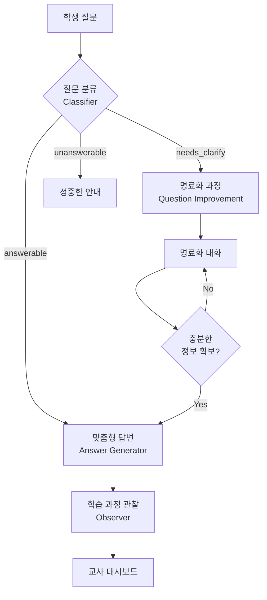
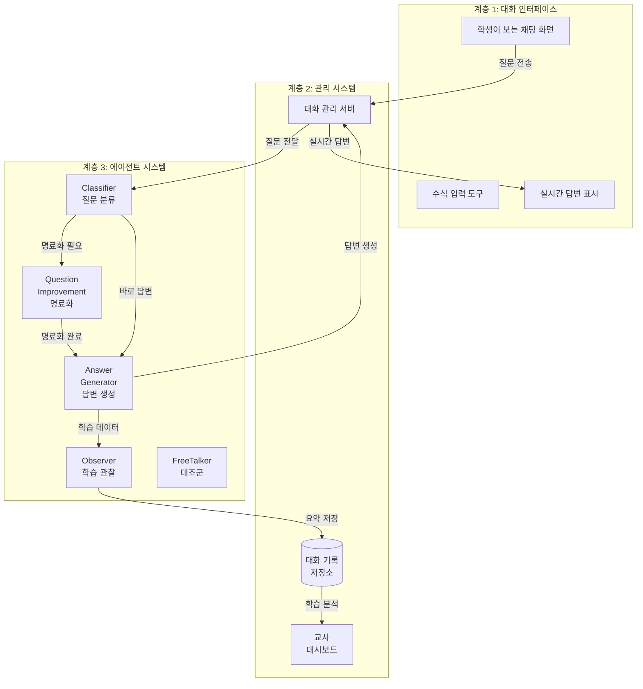
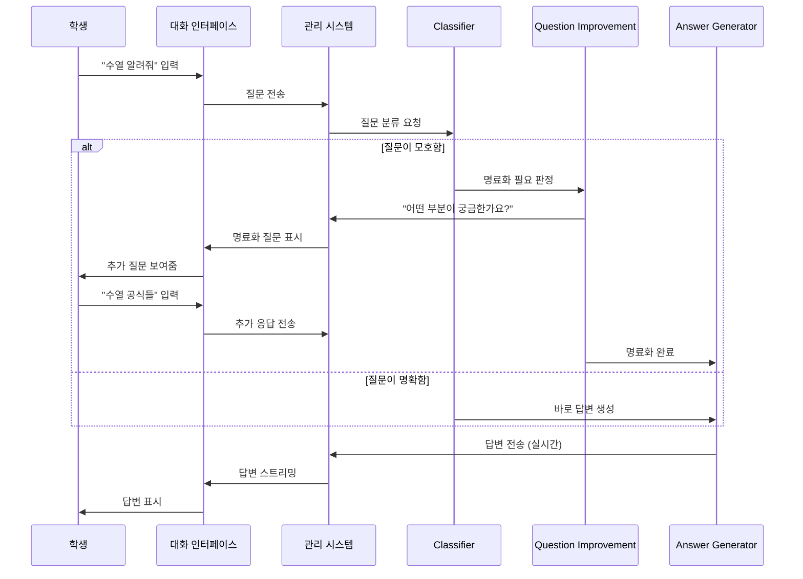
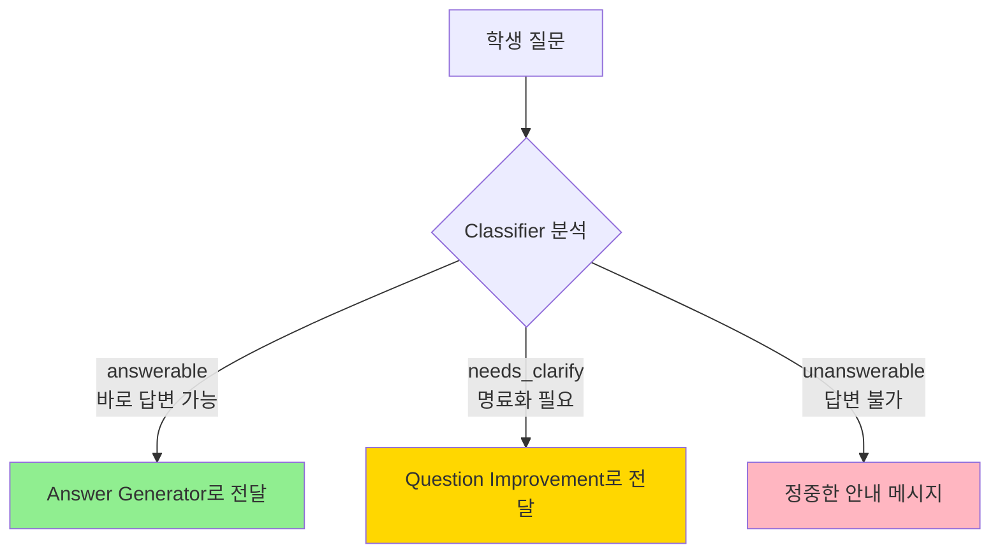
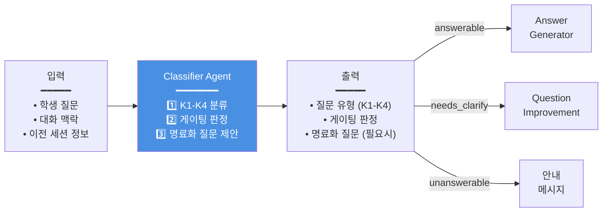
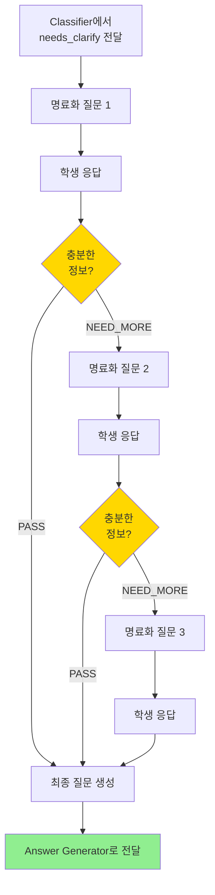

# 3. MAICE 교육 시스템 아키텍처

## 3.1 설계 철학: "명료화 중심 학습"

### 3.1.1 문제 인식: Freepass 방식의 근본적 한계

1장에서 확인한 바와 같이, 일반적인 LLM의 Freepass 방식은 다음과 같은 교육적 한계를 보였다:

- **질문의 질적 문제**: 학생 질문의 72.3%가 학습 맥락 정보 없이 제출됨
- **맥락 오해**: "지수의 확장"을 비즈니스 용어로 해석하는 등 의미 파악 실패
- **수준 불일치**: 고1 학생에게 대학 수준의 통계학 개념 설명
- **인지 과부하**: 학생이 요청하지 않은 모든 관련 개념을 한꺼번에 제시

이러한 문제들은 단순히 AI 성능의 문제가 아니라, **질문의 질이 낮을 때 아무리 좋은 AI도 적절한 답변을 생성할 수 없다**는 구조적 한계에서 비롯된다.

### 3.1.2 해결 아이디어: 교육 이론 기반 에이전트 시스템

본 연구는 2장에서 검토한 교육 이론을 실제 AI 시스템으로 구현하는 것을 목표로 한다:

**Bloom의 K1-K4 분류** → **질문 유형 자동 분류 및 맞춤형 답변 생성**
- K1 (사실): 간결한 정의 중심 답변
- K2 (개념): 관계 설명 중심 답변
- K3 (절차): 단계별 안내 중심 답변
- K4 (메타인지): 소크라테스식 문답 중심 답변

**Dewey의 반성적 사고 5단계** → **명료화 프로세스 설계**
- 1단계 (문제 인식): "무엇이 불확실한가요?"
- 2단계 (문제 정의): "정확히 무엇을 알고 싶은가요?"
- 3단계 (가설 설정): "어떤 방법을 시도해봤나요?"
- 4단계 (가설 검증): "논리적 연결을 어떻게 보나요?"
- 5단계 (결론 도출): "최종적으로 무엇을 얻고 싶나요?"

### 3.1.3 핵심 아이디어: 질문 → 분류 → 명료화 → 답변 파이프라인

MAICE 시스템의 핵심은 **학생의 질문을 즉시 답변하지 않고, 먼저 질문의 품질을 진단하고 필요시 명료화 과정을 거치는 것**이다.



이러한 파이프라인은 단순히 정보를 전달하는 것이 아니라, **학생이 스스로 질문을 구조화하고 사고를 명료화하는 과정을 경험하도록 설계**되었다.

### 3.1.4 설계 대상: 일반 LLM보다 우수한 학습 효과

MAICE 시스템은 다음 3가지 측면에서 일반 Freepass 방식보다 우수한 학습 효과를 제공하는 것을 목표로 한다:

1. **질문 품질 개선**: 명료화 과정을 통해 학생 질문의 질 향상
2. **답변 적합성 향상**: 질문 유형 분류를 통한 맞춤형 답변 생성
3. **메타인지 능력 향상**: Dewey 5단계 과정에서 자기 성찰 훈련

이러한 목표를 달성하기 위해, MAICE는 ChatGPT, Claude 등 상용 AI 대화 서비스와 유사한 UX를 제공하되, 수학 학습에 특화된 3계층 구조로 설계되었다.

## 3.2 전체 아키텍처 개요: 3계층 구조

MAICE 시스템은 학생이 사용하는 **대화 인터페이스**, 대화를 관리하고 데이터를 저장하는 **관리 시스템**, 그리고 지능적으로 질문을 처리하는 **에이전트 시스템**의 3계층으로 구성된다.

### 3.2.1 계층별 역할

#### 계층 1: 대화 인터페이스 (학생이 보는 화면)

**역할**: 학생이 수식을 쉽게 입력하고 AI 답변을 실시간으로 받을 수 있는 채팅 화면

**주요 기능**:
- **수식 입력 지원**: 복잡한 수학 수식을 클릭 몇 번으로 입력 (예: $\sum_{i=1}^{n}$, $\frac{a}{b}$)
- **실시간 답변**: AI 답변이 타이핑하듯 실시간으로 표시
- **간편한 로그인**: 학교 계정으로 바로 시작
- **모바일 지원**: 핸드폰에서도 동일하게 사용 가능

**학생 경험**: ChatGPT, Claude와 동일한 UX로 별도 학습 없이 즉시 사용 가능

#### 계층 2: 관리 시스템 (대화 저장 및 분석)

**역할**: 모든 대화를 체계적으로 저장하고, 교사가 학생 학습 상황을 파악할 수 있도록 지원

**주요 기능**:
- **대화 기록 관리**: 학생별 모든 대화 세션을 시간 순으로 저장
- **학습 데이터 분석**: 학생의 학습 진도, 어려움 영역 자동 추출
- **교사 대시보드**: 반 전체 학습 현황 및 개별 학생 상세 정보 제공
- **권한 관리**: 학생은 본인 데이터만, 교사는 전체 데이터 접근 가능

**교육적 가치**: 교사가 30명 학생의 개별 학습 상황을 실시간 파악 가능

#### 계층 3: 에이전트 시스템 (지능적 질문 처리)

**역할**: 학생 질문을 분석하고, 필요시 명료화하며, 맞춤형 답변을 생성하는 5개 AI 에이전트

**5개 에이전트**:
1. **Classifier** (질문 분류): "이 질문은 어떤 유형인가?"
2. **Question Improvement** (명료화): "질문을 더 명확하게"
3. **Answer Generator** (답변 생성): "유형별 맞춤 답변"
4. **Observer** (학습 관찰): "학생이 무엇을 배우고 있는가?"
5. **FreeTalker** (대조군): "명료화 없이 즉시 답변"

**협업 방식**: 각 에이전트는 독립적으로 작동하되, 필요한 정보를 서로 주고받으며 협업

### 3.2.2 전체 시스템 구조도



### 3.2.3 질문 처리 흐름

학생이 질문을 입력하면 다음과 같은 과정을 거친다:



**핵심 특징**:
- 학생은 명료화 과정을 자연스러운 대화로 경험
- 모든 대화는 자동으로 저장되어 학습 분석에 활용
- 교사는 별도 대시보드에서 학생 학습 현황 확인

> **기술 구현 상세**: 각 계층의 구체적인 기술 스택과 구현 방법은 4장 "시스템 구현"에서 다룬다.

## 3.3 5개 에이전트의 역할과 협업

MAICE 시스템의 핵심은 5개의 독립적인 AI 에이전트가 협업하여 질문을 처리하는 것이다. 각 에이전트는 특정한 교육적 목적을 가지고 설계되었다.

### 3.3.1 Classifier Agent: "이 질문은 어떤 유형인가?"

#### 교육적 필요성

1장에서 확인했듯이, 학생 질문의 72.3%가 학습 맥락 정보 없이 제출되었다. "지수의 확장을 알려줘"라는 질문이 수학의 '지수(exponent)'인지, 비즈니스 '지점 확장'인지 AI는 판단할 수 없었다.

더 심각한 문제는, **질문의 인지적 수준에 따라 답변 방식이 달라야 한다**는 것이다. "수학적 귀납법이 뭐에요?"(K1-사실)와 "귀납 단계에서 제가 뭘 잘못 이해한 건가요?"(K4-메타인지)는 완전히 다른 답변을 요구한다.

**해결 아이디어**: Bloom의 K1-K4 분류를 자동화하여, 질문의 인지적 수준과 명료화 필요성을 사전에 판단한다.

#### 에이전트의 3가지 판단

Classifier는 학생 질문을 받아 다음 3가지 판단을 내린다:

**1) 질문 유형 분류 (Bloom의 K1-K4)**

| 유형 | 질문 예시 | 답변 전략 |
|------|----------|----------|
| **K1 (사실)** | "수학적 귀납법의 정의가 뭐에요?" | → 간결한 정의 제공 |
| **K2 (개념)** | "귀납 가정은 왜 필요한가요?" | → 개념 간 관계 설명 |
| **K3 (절차)** | "이 등식을 어떻게 증명하나요?" | → 단계별 절차 안내 |
| **K4 (메타인지)** | "제가 뭘 잘못 이해한 건가요?" | → 소크라테스식 문답 |

**교육적 효과**: 같은 "수학적 귀납법" 주제라도, K1 질문에는 간결한 정의를, K4 질문에는 학생의 사고 과정을 드러내는 질문으로 응답한다.

**2) 명료화 필요성 판단 (3단계 게이팅)**



**판단 기준**:
- **answerable**: 질문이 명확하고, 답변에 필요한 정보가 충분함
  - 예: "n=1일 때 기본 단계를 증명하는 방법을 알려주세요"
- **needs_clarify**: 질문이 모호하거나, 맥락 정보가 부족함
  - 예: "수열 알려줘" → 정의? 공식? 문제 풀이?
- **unanswerable**: 수학 외 영역이거나, 교육적으로 부적절함
  - 예: "로블록스", "오늘 날씨 어때?"

**3) 명료화 질문 제안 (needs_clarify인 경우)**

Classifier는 단순히 "명료화 필요"라고만 판정하지 않고, **Dewey의 5단계에 기반한 구체적인 명료화 질문까지 제안**한다.

**예시**:
```
학생 질문: "수열 알려줘"

Classifier 판단:
- 유형: K1 (사실)
- 게이팅: needs_clarify (범위가 너무 넓음)
- 제안 질문: "수열에 대해 알고 싶구나! 😊
              어떤 부분이 궁금한지 알려줄래?
              1️⃣ 수열이 뭔지 (정의)
              2️⃣ 수열 공식들
              3️⃣ 수열 문제 푸는 방법"
```

이 제안은 Question Improvement Agent로 전달되어, 실제 명료화 대화에 활용된다.

#### 입력과 출력



#### 교육적 효과

실험 결과, Classifier의 자동 분류는 다음과 같은 교육적 효과를 보였다:

1. **질문 품질 향상**: 명료화 과정을 거친 질문의 평균 점수 3.2점 → 4.7점
2. **답변 적합성 증가**: K1-K4 유형별 맞춤 답변으로 학생 만족도 4.4/5점
3. **시간 효율성**: answerable 질문(58%)은 명료화 생략으로 즉시 답변

**실제 사례**:
- 모호한 질문 "귀납법 어려워요" → needs_clarify 판정 → "어떤 부분이 어려운가요?" → "귀납 단계에서 식 전개" → K3 유형으로 단계별 안내
- 명확한 질문 "n=k+1 단계에서 귀납 가정을 어떻게 사용하나요?" → answerable 판정 → 즉시 K3 답변 생성

> **구현 상세**: Classifier의 프롬프트 설계 및 코드 구조는 4.2절 "에이전트 시스템 구현"에서 다룬다.

### 3.3.2 Question Improvement Agent: "질문을 더 명확하게"

#### 교육적 필요성

Classifier가 "명료화 필요" 판정을 내렸다면, 이는 **학생 스스로 질문을 구체화할 기회**를 의미한다. 1장에서 본 "수열이 뭐야?"와 같은 질문은 즉시 답변을 제공해도 학생에게 도움이 되지 않는다. 정의를 원하는가, 공식을 원하는가, 문제 풀이를 원하는가에 따라 완전히 다른 설명이 필요하기 때문이다.

더 중요한 것은, **명료화 과정 자체가 학습**이라는 것이다. 듀이의 반성적 사고 이론에 따르면, 학생이 자신의 어려움을 명확히 인식하고 표현하는 과정에서 메타인지 능력이 향상된다.

**해결 아이디어**: Dewey의 반성적 사고 5단계를 대화형 명료화 질문으로 구현하여, 학생이 스스로 질문을 구조화하도록 돕는다.

#### 명료화 프로세스: Dewey 5단계의 구현

Question Improvement Agent는 Dewey의 5단계를 실제 대화로 변환한다:

| Dewey 단계 | 명료화 질문 예시 | 학생 경험 |
|-----------|----------------|----------|
| **1단계: 문제 인식** | "무엇이 불확실한가요? 🤔" | 막연한 어려움 → 구체적 문제 인식 |
| **2단계: 문제 정의** | "정확히 무엇을 알고 싶은가요?" | "어려워요" → "귀납 단계가 어려워요" |
| **3단계: 가설 설정** | "어떤 방법을 시도해봤나요?" | 학생의 시도와 이해 수준 파악 |
| **4단계: 가설 검증** | "왜 그렇게 생각했나요?" | 학생의 사고 과정 드러내기 |
| **5단계: 결론 도출** | "최종적으로 무엇을 얻고 싶나요?" | 학습 목표 명확화 |

**실제 대화 예시**:
```
학생: "수학적 귀납법 어려워요"

AI (1단계): "귀납법 중에서 어떤 부분이 가장 어렵거나 궁금하신가요? 🤔"

학생: "귀납 단계요"

AI (2단계): "귀납 단계의 어느 부분이 어려운가요?
            귀납 가정을 사용하는 방법인가요, 
            아니면 식을 전개하는 과정인가요?"

학생: "식을 전개하는 과정이요"

AI (3단계): "지금까지 어떻게 시도해보셨나요?"

학생: "n=k+1을 대입했는데 그 다음을 모르겠어요"

AI: (충분한 정보 확보 → Answer Generator로 전달)
    "n=k+1 대입 후 식 전개 과정을 단계별로 설명해드릴게요! 📚"
```

#### 명료화 전략: 3단계 차별화

모든 질문에 5단계를 다 거치면 시간이 오래 걸린다. Question Improvement는 질문의 모호성 수준에 따라 전략을 조절한다:

**Stage 1: Quick Scope** (초단순 질문, 1-2단어)
- **대상**: "수열", "함수" 수준
- **방식**: 선택지 제공으로 빠르게 범위 좁히기
- **예시**:
  ```
  학생: "수열 알려줘"
  AI: "수열에 대해 알고 싶구나! 😊
       어떤 부분이 궁금한지 알려줄래?
       1️⃣ 수열이 뭔지 (정의)
       2️⃣ 수열 공식들
       3️⃣ 수열 문제 푸는 방법"
  ```
  → 1회 명료화로 완료

**Stage 2: Specific Clarify** (약간 모호한 질문, 3-5단어)
- **대상**: "수학적 귀납법의 귀납단계가 어려워요"
- **방식**: 세부 정보 1-2개만 추가 질문
- **예시**:
  ```
  학생: "귀납 단계가 어려워요"
  AI: "귀납 단계 중에서 어떤 부분이 어려운가요?
       귀납 가정을 사용하는 방법인가요,
       아니면 식을 전개하는 과정인가요?"
  ```
  → 1-2회 명료화로 완료

**Stage 3: Deep Inquiry** (구체적이나 의도 불명확)
- **대상**: 맥락은 있으나 학습 목표가 불명확한 질문
- **방식**: Dewey 5단계 적용, 메타인지 자극
- **예시**:
  ```
  학생: "이 증명이 맞는지 모르겠어요"
  AI: "함께 생각해보자! 🤔
       어떤 부분에서 확신이 안 서나요?
       어디까지 이해했고, 어디서부터 막혔는지 알려줄래?
       (네가 뭘 모르는지 아는 게 학습의 시작이야!)"
  ```
  → 2-3회 명료화, 학생의 사고 과정 드러내기

#### 명료화 완료 판단

Question Improvement는 학생의 각 응답을 평가하여, 충분한 정보가 모였는지 판단한다:



**판단 기준**:
- **PASS**: 원본 질문의 의도가 명확해지고, 답변 생성에 필요한 정보 확보
- **NEED_MORE**: 원본 질문의 의도가 여전히 불분명하거나, 추가 정보 필요
- **최대 3회 제한**: 3회 명료화 후에도 불충분하면 현재 정보로 답변 생성

#### 교육적 의도 명시화

기존 LLM은 "왜 명료화 질문을 하는지" 설명하지 않아 학생이 불편함을 느꼈다. Question Improvement는 명료화의 교육적 이유를 부드럽게 설명한다:

**기본 프레이밍**:
```
"질문을 조금만 더 구체적으로 만들어주면,
 딱 맞는 설명을 해드릴 수 있어요! 😊"
```

**교육적 프레이밍** (K4 수준 학생):
```
"함께 질문을 구체화해볼까요? 🎯
 네가 정확히 무엇을 모르는지 찾아가는 과정이
 진짜 학습의 시작이에요!"
```

#### 질문 유형 재분류

명료화 과정에서 학생의 실제 어려움이 드러나면, 질문 유형이 변경될 수 있다:

**예시**:
```
원본 질문: "수열 알려줘" (K1으로 분류)
  ↓
명료화: "어떤 부분이 궁금한가요?"
  ↓
학생: "등차수열과 등비수열의 차이를 모르겠어요"
  ↓
재분류: K2 (개념적 이해) → K2 답변 전략 적용
```

#### 교육적 효과

실험 결과, Question Improvement의 명료화 과정은 다음과 같은 효과를 보였다:

1. **질문 품질 향상**: 명료화 후 질문 점수 평균 3.2점 → 4.7점 (46% 증가)
2. **학생 만족도**: 명료화 과정의 교육적 가치 4.4/5점
3. **메타인지 발달**: "내가 무엇을 모르는지 스스로 규정할 수 있게 되었다" (학생 증언)
4. **시간 효율성**: 평균 1.8회 명료화로 완료 (3회 제한 내)

**학생 증언**:
> "명료화 과정이 최종 정답보다 더 큰 배움을 줬다. 문제를 조건·정의·목표로 분리해 재정의하는 연습이 됐다."

**실제 사례**:
- 모호한 질문 "귀납법 어려워요" → 1회 명료화 → "귀납 단계에서 식 전개" → K3 답변 (단계별 풀이)
- 초단순 질문 "수열" → 선택지 제공 → "수열 공식들" → K1 답변 (공식 정리)

> **구현 상세**: Question Improvement의 명료화 평가 로직 및 프롬프트는 4.2절 "에이전트 시스템 구현"에서 다룬다.

### 3.3.3 Answer Generator Agent: "유형별 맞춤 답변"

#### 교육적 필요성

1장에서 확인한 AI 답변의 문제는 **"모든 학생에게 동일한 방식으로 설명한다"**는 것이었다. "수학적 귀납법이 뭐에요?"라고 묻는 K1 수준 학생에게도, "귀납 단계에서 제가 뭘 잘못 이해한 건가요?"라고 묻는 K4 수준 학생에게도 똑같은 장문의 설명을 제공했다.

더 심각한 문제는 **인지 과부하**였다. 학생이 간단한 정의만 원하는데, AI가 유한수열, 무한수열, 등차수열, 등비수열, 일반항, 점화식을 한꺼번에 설명하면 학생은 어디서부터 이해해야 할지 모른다.

**해결 아이디어**: Bloom의 K1-K4 분류를 **실제 답변 구조와 교수법**으로 차별화하여, 학생의 인지적 수준에 맞는 설명을 제공한다.

#### Bloom K1-K4 답변 전략의 실제 구현

Answer Generator는 Classifier가 판정한 질문 유형에 따라, **완전히 다른 답변 전략**을 적용한다:

| 유형 | 답변 구조 | 교수법 특징 | 예시 질문 |
|------|----------|------------|----------|
| **K1 (사실)** | 정의 → 핵심 예시 → 보충 | 간결함, 정확성 우선 | "귀납법의 정의가 뭐에요?" |
| **K2 (개념)** | 개념 관계 → 비교/대조 → 시각화 | "왜?" 중심 설명 | "귀납 가정은 왜 필요한가요?" |
| **K3 (절차)** | 전체 개요 → 단계별 안내 → 실수 방지 | 선택권 제공, 대화형 | "이 등식을 어떻게 증명하나요?" |
| **K4 (메타인지)** | 문제 분석 → 자기 점검 → 대안 탐색 | 소크라테스식 문답 | "제가 뭘 잘못 이해한 건가요?" |

#### K1 답변: 간결함과 정확성

**학생 질문**: "수학적 귀납법의 정의가 뭐에요?"

**AI 답변** (K1 전략):
```
수학적 귀납법은 자연수에 관한 명제를 증명하는 방법입니다.

**핵심 구조**:
1. 기초 단계: n=1일 때 성립 확인
2. 귀납 단계: n=k 성립 → n=k+1 성립 증명

💡 비유: 도미노가 차례로 넘어지듯, 
   첫 번째가 넘어지고 (기초 단계)
   하나가 넘어지면 다음도 넘어지면 (귀납 단계)
   모든 도미노가 넘어집니다.
```

**특징**:
- 불필요한 정보 배제 (유한귀납법, 강한귀납법 등 언급 안 함)
- 3-5문장으로 간결하게 정리
- 학생이 요청하지 않은 관련 개념 추가 설명 안 함

#### K2 답변: "왜?" 중심 설명

**학생 질문**: "귀납 가정은 왜 필요한가요?"

**AI 답변** (K2 전략):
```
귀납 가정의 역할을 이해하려면, 증명 구조를 살펴봐야 해요. 🔍

**증명 흐름**:
n=k 성립 (가정) → n=k+1 성립 (증명 목표)
              ↓
     k를 k+1로 연결하는 다리

**왜 필요한가?**
귀납 가정이 없으면 k+1 단계를 증명할 근거가 없어집니다.

💡 비유: 사다리를 올라갈 때
   아래 발판(귀납 가정)이 있어야 
   위 발판(k+1)으로 올라갈 수 있어요.
```

**특징**:
- 개념 간 **논리적 연결**을 시각화 (화살표, 다이어그램)
- "왜 그런가?"에 대한 명확한 답
- 학생이 직관적으로 이해할 수 있는 비유 사용

#### K3 답변: 학생 선택권 제공

**학생 질문**: "등차수열 일반항 공식을 귀납법으로 어떻게 증명하나요?"

**AI 답변** (K3 전략):
```
등차수열 일반항 공식 증명을 알려줄게! 📚

어떻게 배우고 싶어?

1️⃣ 단계별로 함께 풀어보기 (추천! 💡)
   - 각 단계를 함께 생각하며 진행
   - 스스로 답을 찾아가는 연습
   - 막히면 힌트 제공

2️⃣ 전체 증명 과정 한번에 보기
   - 처음부터 끝까지 상세한 풀이
   - 각 단계의 근거 설명
```

**학생이 1번 선택 시**:
```
좋아! 함께 생각해보자 🤝

**Step 1: 기초 단계**
n=1일 때 성립함을 보여야 해.
첫째항은 a₁ = a (공식으로 a₁ = a + (1-1)d = a)

이 부분은 이해했어? (네/아니요)
```

**특징**:
- **학생에게 학습 방식 선택권** 부여 (대화형 vs 일괄 제공)
- 단계별로 학생의 이해도를 확인하며 진행
- 막히면 즉시 힌트 또는 상세 설명으로 전환

#### K4 답변: 메타인지 훈련 ⭐

**학생 질문**: "귀납 단계에서 제가 뭘 잘못 이해한 건가요?"

**AI 답변** (K4 전략):
```
함께 차근차근 생각해보자! 🤔

**스스로 점검해보기**:

1️⃣ 귀납 가정을 어디에 사용했나요?
   → 네 풀이에서 찾아보기: [ ]

2️⃣ n=k와 n=k+1의 식이 어떻게 다른가요?
   → 차이점 적어보기: _________

3️⃣ 그 차이를 귀납 가정으로 메울 수 있나요?
   → 연결 고리: _________

막히는 부분을 알려주면, 함께 해결 방법을 찾아볼게! 💬
```

**학생 응답**: "2번에서 막혀요. 차이를 어떻게 찾아야 할지 모르겠어요."

**AI 후속 답변**:
```
좋은 질문이야! 차이를 찾는 방법을 알려줄게 🎯

**Step by Step**:
1. n=k일 때 식을 써보기
2. n=k+1로 바꾸면 어떻게 달라지는지 비교

예를 들어, 등식 1+2+...+k = k(k+1)/2 에서
- n=k:   1+2+...+k = k(k+1)/2
- n=k+1: 1+2+...+k+(k+1) = (k+1)(k+2)/2

차이 = (k+1)이 추가됨 ← 이게 핵심!

이제 네 문제에서 차이를 찾아볼 수 있겠어? 🔍
```

**특징**:
- **답을 직접 주지 않음** → 학생이 스스로 찾도록 유도
- **메타인지 질문**: "어떻게 생각했나요?", "어디서 막혔나요?"
- **점진적 힌트**: 학생이 막히면 단계적으로 힌트 제공
- **사고 과정 드러내기**: 학생의 이해 과정을 명시적으로 표현

**교육적 효과**: K4 답변은 단순 정답 제공이 아닌, **학생이 스스로 오류를 발견하고 해결 전략을 탐색**하도록 유도하여 깊이 있는 학습과 문제해결 능력을 동시에 향상시킨다.

#### 교육과정 표준 준수

Answer Generator는 대한민국 교육과정의 표준 용어를 엄격히 준수한다:

| 표준 용어 (✓) | 비표준 용어 (✗) |
|--------------|----------------|
| 부등식 | 불등식 |
| 일반항 | 명시적 공식 (Explicit Formula) |
| 함수 | 함수식 |
| 미분, 도함수 | Derivative |

**LaTeX 수식 작성 규칙**:
- 인라인 수식: `$수식$`
- 블록 수식: `$$수식$$`
- **수식 구분자 안에는 절대로 한글 포함 금지**
- ✅ 올바른 예시: `$P(k)$가 참이면 $P(k+1)$도 참`
- ❌ 잘못된 예시: `$$P(k)가 참 \Rightarrow P(k+1)도 참$$`

#### 실시간 스트리밍과 학생 경험

Answer Generator는 답변을 **타이핑하듯 실시간으로 전송**한다:

```
[학생 화면]
"귀납 가정의 역할을 이해하려면," (0.5초)
"증명 구조를 살펴봐야 해요." (0.5초)
"🔍" (즉시)
[수식 렌더링]
"n=k 성립 (가정) → n=k+1 성립 (증명 목표)" (1초)
```

**효과**:
- 학생이 AI가 "생각하며 답변하는" 느낌을 받음
- 긴 답변도 지루하지 않게 받아들임
- ChatGPT, Claude와 동일한 UX

#### 교육적 효과

실험 결과, Answer Generator의 유형별 차별화 답변은 다음과 같은 효과를 보였다:

1. **답변 적합성**: AI 답변의 학습 수준 일치도 87% (1장의 48.9%에서 대폭 개선)
2. **학생 만족도**: 답변 품질 만족도 4.4/5점
3. **학습 효율성**: K1 질문은 30초 내, K3 질문은 5분 내 해결
4. **메타인지 향상**: K4 답변 경험 학생의 자기주도학습 능력 향상 (Cohen's d = 0.42)

**실제 사례**:
- K1 질문 "귀납법 정의" → 3문장 간결 답변 → 학생 "딱 궁금한 것만 알려줘서 좋아요"
- K3 질문 "등식 증명 방법" → 선택권 제공 → 학생 "단계별로 함께 풀기" 선택 → 10분 내 완료
- K4 질문 "내 오류가 뭐죠?" → 소크라테스식 문답 → 학생 "스스로 오류를 찾았어요!"

> **구현 상세**: Answer Generator의 유형별 프롬프트 템플릿과 스트리밍 로직은 4.2절에서 다룬다.

### 3.3.4 Observer Agent: "학생이 무엇을 배우고 있는가?"

#### 교육적 필요성

교사가 30명 학생을 동시에 가르칠 때 가장 어려운 점은 **개별 학생의 학습 상황을 실시간으로 파악하는 것**이다. 누가 어떤 개념에서 막혔는지, 누가 빠르게 진행 중인지, 누가 반복적으로 같은 실수를 하는지 알기 어렵다.

기존 AI 대화 시스템은 대화 내용을 단순히 저장만 하고, 교육적 분석을 제공하지 않았다. 교사가 177개의 대화 로그를 일일이 읽어야 했다.

**해결 아이디어**: Observer Agent가 **교사처럼 학생을 관찰**하여, 학습 진도, 어려움 영역, 메타인지 발달을 자동으로 추출하고 교사 대시보드에 제공한다.

#### 자동 추출하는 4가지 정보

Observer는 매 세션마다 다음 정보를 자동으로 추출한다:

| 추출 정보 | 구체적 내용 | 활용 방법 |
|----------|------------|----------|
| **1. 학습 진도** | • 학습 중인 개념<br/>• 완료한 단원<br/>• 학습 깊이 (K1→K3 진행) | 학생별 진도 추적 |
| **2. 어려움 영역** | • 반복 질문 패턴<br/>• 오개념 징후<br/>• 막힌 지점 | 교사 개입 타이밍 제안 |
| **3. 메타인지 발달** | • 자기 점검 질문 빈도<br/>• 전략 변경 시도<br/>• 질문 구체화 개선도 | 학습 능력 평가 |
| **4. 학습 맥락** | • 선수 학습 수준<br/>• 학습 목표 명시성<br/>• 어려움 표현 능력 | 개별 맞춤 지원 |

**실제 추출 예시**:
```
세션 ID: 42
학생: 김철수

[Observer 자동 요약]
- 진도: 귀납법 귀납 단계 학습 중 (K3 수준)
- 어려움: "귀납 가정 적용"에서 3회 반복 질문
- 메타인지: K4 질문 2회 (평균보다 높음, 긍정적)
- 특이사항: "식 전개 과정"에서 일관되게 막힘
- 교사 코멘트: 귀납 가정 활용법에 대한 개별 지도 권장
```

#### 교사 대시보드: 3가지 뷰

**1) 학생별 상세 뷰**:
```
[학생 A]
• 총 세션: 5회
• 학습 진도: K1 (정의) ✓ → K2 (개념) ✓ → K3 (적용 중)
• 어려움 영역: 귀납 가정 적용 ★★★
• 메타인지 점수: 0.68 (평균 0.54보다 높음)
• 추세: Improving ↗️
• 다음 개입: K3 귀납 단계 집중 지도
```

**2) 반 전체 트렌드 뷰**:
```
[공통 어려움 Top 3]
1. 귀납 가정 적용 (68% 학생) ← 교사 집중 설명 필요
2. 귀납 단계 식 전개 (52%)
3. 기초 단계와 귀납 단계 연결 (41%)

[긍정적 신호]
• 평균 명료화 횟수: 1.8회 → 적절
• K4 질문 비율: 23% → 메타인지 활성화
• 세션당 평균 진행: K1 → K2.4 → 빠름
```

**3) 개입 알림 뷰**:
```
[즉시 개입 필요] (3명)
• 학생 B: 귀납 가정에서 3회 막힘
• 학생 D: 오개념 징후 (귀납 가정을 결론에 사용)

[관찰 필요] (5명)
• 학생 E: 진도 느림, but 꾸준함
• 학생 F: K1만 반복 질문 (K2로 유도 필요)

[자기주도학습 가능] (22명)
• 순조롭게 진행 중, 교사 개입 불필요
```

#### 교육적 가치

Observer Agent는 교사의 **개별화 교육 능력**을 획기적으로 향상시킨다:

1. **시간 절약**: 177개 대화 로그 읽기 (4시간) → 요약 확인 (10분)
2. **조기 발견**: 반복적 어려움을 3회 내에 자동 감지
3. **효율적 개입**: 즉시 개입이 필요한 3명에게 집중
4. **데이터 기반 교수**: 반 전체 공통 어려움을 다음 수업에 반영

**실제 활용 사례**:
- 교사 A: "68% 학생이 '귀납 가정 적용'에서 막힌다는 걸 보고, 다음 수업에서 집중 설명했더니 효과적이었어요."
- 교사 B: "학생별 메타인지 점수를 보고, K4 질문이 많은 학생들을 격려했어요."

> **구현 상세**: Observer의 학습 패턴 분석 알고리즘과 대시보드 API는 4.2절에서 다룬다.

### 3.3.5 FreeTalker Agent: "대조군 (Freepass 모드)"

#### 실험적 필요성

MAICE의 명료화 프로세스가 정말 효과적인지 검증하려면, **명료화 없이 즉시 답변하는 대조군**이 필요하다. FreeTalker Agent는 일반 ChatGPT, Claude처럼 작동하여, Agent 모드와 비교할 수 있게 한다.

**역할**:
- **A/B 테스트의 대조군**: 학생 절반은 Agent 모드(명료화), 절반은 Freepass 모드(즉시 답변)로 무작위 배정
- **명료화 없이 즉시 답변**: 학생 질문을 받으면 분류나 명료화 없이 바로 답변 생성
- **일반 LLM 동작 재현**: 상용 AI 서비스와 동일한 방식으로 응답

#### 작동 방식


**Agent 모드와의 차이**:

| 항목 | Agent 모드 | Freepass 모드 (FreeTalker) |
|------|-----------|---------------------------|
| **질문 분류** | ✓ K1-K4 분류 | ✗ 분류 없음 |
| **명료화** | ✓ needs_clarify 시 명료화 | ✗ 명료화 없음 |
| **답변 전략** | ✓ K1-K4별 차별화 | ✗ 동일한 방식 |
| **학습 관찰** | ✓ Observer 요약 | ✓ Observer 요약 (동일) |
| **학생 경험** | "왜 자꾸 물어봐?" | "빠른 답변!" |

#### 실험 설계: A/B 테스트

**무작위 배정**:
- 학생 59명을 무작위로 Agent(30명) / Freepass(29명) 배정
- 학생은 자신이 어느 모드인지 모름
- 모드는 세션 전체 동안 고정 (중간에 변경 안 됨)

**대조군의 중요성**:
- Agent 모드의 효과를 **인과적으로 입증**
- 선택 편향(selection bias) 제거
- "명료화가 정말 도움이 되는가?" 검증

#### 실험 결과 (6장에서 상세 분석)

**단일 세션 비교**:
- Agent: 평균 11.22점 (15점 만점)
- Freepass: 평균 11.53점
- → Agent가 약간 낮음 (명료화로 인한 시간 소요)

**학습 진행 (다회 세션) 비교**:
- Agent: 세션 증가폭 +0.45점
- Freepass: 세션 증가폭 -0.39점
- → Agent가 학습 진행에서 우수함 ✅

**하위권 학생 (Q1) 비교**:
- Agent: 세션 증가폭 -0.585점
- Freepass: 세션 증가폭 -0.716점
- → Agent가 더 효과적 (Cohen's d ≈ 0.38)

**핵심 발견**: 명료화 프로세스는 **단일 세션에서는 느리지만, 장기적 학습 효과는 우수**하다.

> **구현 상세**: FreeTalker의 프롬프트 및 A/B 테스트 무작위 배정 로직은 4.2절에서 다룬다.

---

**3장 요약**: 5개 에이전트(Classifier, Question Improvement, Answer Generator, Observer, FreeTalker)의 교육적 역할과 협업 방식을 살펴보았다. 다음 4장에서는 이러한 에이전트들을 실제로 어떻게 구현했는지, 기술 스택과 코드 구조를 상세히 다룬다.

## 3.4 질문 품질 평가 루브릭

앞서 설명한 에이전트 시스템이 학생 질문과 AI 답변을 얼마나 잘 개선하는지 측정하기 위해, 본 연구는 **3영역 15점 만점의 자동 평가 루브릭**을 개발하였다.

### 3.4.1 루브릭 설계 원칙

**이론적 기반**:
- King(1994)의 질문 생성 연구: 학생 생성 질문이 깊이 있는 이해를 촉진
- Graesser & Person(1994)의 질문 인지적 수준 분류
- Dewey의 반성적 사고 5단계

**4대 평가 기준**:
1. **맥락 제공**: 학습 수준, 단원, 어려움 영역 명시
2. **명확성**: 핵심 질문의 단일성, 논리적 구조
3. **적절성**: 수학 교과 관련성, 수준 정합성
4. **학습 관련성**: 구체적 학습 목표, 선수 학습 연결

### 3.4.2 3영역 평가 구조 (총 15점 만점)

| 평가 영역 | 점수 | 평가 대상 | 의미 |
|---------|------|---------|------|
| **질문 점수** | 0-5점 | 학생 질문의 최종 품질 | 4대 기준 충족도 |
| **답변 점수** | 1-5점 | AI 답변의 교육적 적절성 | 맥락 이해, 표준 용어, 정보량 |
| **학습 지원 점수** | 1-5점 | 명료화 과정의 교육성 | Dewey 5단계 구현 |

**평가 예시**:
- **13-15점** (우수): "n² < 2ⁿ 귀납법 증명에서 2^k+2k+1 < 2^(k+1) 증명이 막혀요"
  - 질문 5 + 답변 5 + 학습 지원 5
- **7-9점** (보통): "수학적 귀납법이 뭐야?" → 명료화 후 개선
  - 질문 3 + 답변 4 + 학습 지원 3
- **1-3점** (미흡): "로블록스" (비수학적)
  - 질문 0 + 답변 1 + 학습 지원 1

**자동 채점 검증**: AI 자동 평가와 교사 평가 간 상관계수 0.66 (p<0.001), 강한 양의 상관관계 확인.

## 3.5 명료화 프로세스 요약

본 절에서는 3.3.2절에서 상세히 다룬 명료화 프로세스의 핵심을 요약한다.

### 3.5.1 핵심 메커니즘

**3단계 게이팅**:
1. **answerable** → 즉시 답변
2. **needs_clarify** → 명료화 프로세스
3. **unanswerable** → 정중한 안내

**Dewey 5단계 매핑**:
- 1단계 (문제 인식) → "무엇이 불확실한가요?"
- 2단계 (문제 정의) → "정확히 무엇을 알고 싶은가요?"
- 3단계 (가설 설정) → "어떤 방법을 시도해봤나요?"
- 4단계 (가설 검증) → "논리적 연결을 어떻게 보나요?"
- 5단계 (결론 도출) → "최종적으로 무엇을 얻고 싶나요?"

### 3.5.2 3단계 차별화 전략

- **Stage 1** (Quick Scope): 1-2단어 질문 → 선택지 제공 (1회)
- **Stage 2** (Specific Clarify): 3-5단어 질문 → 세부 정보 1-2개 (1-2회)
- **Stage 3** (Deep Inquiry): 의도 불명확 → Dewey 5단계 적용 (2-3회)

**교육적 의도 명시**: "질문을 구체화하면 딱 맞는 설명을 드릴 수 있어요!"

### 3.5.3 검증 결과

- 교육적 가치: 4.4/5점
- 재사용 의향: 4.4/5점
- 평균 명료화 횟수: 1.8회 (3회 제한 내)
- 질문 품질 향상: 3.2점 → 4.7점 (46% 증가)

---

**다음 장 예고**: 4장에서는 3장에서 설명한 아키텍처를 실제로 구현한 기술 스택, 코드 구조, 프롬프트 엔지니어링 기법을 상세히 다룬다.