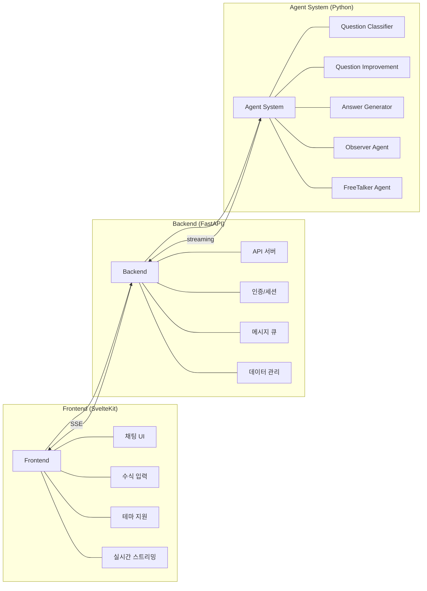
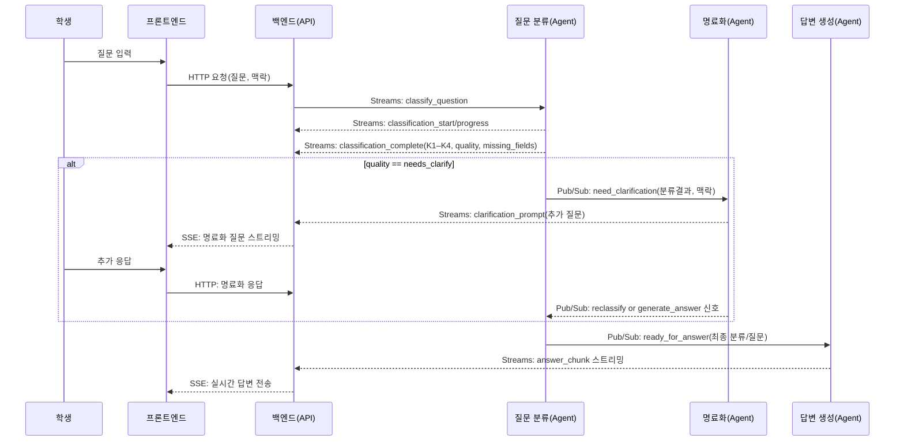

# 3. MAICE Agent 시스템 설계 및 개발

## 3.1 시스템 설계 원리

MAICE 시스템은 ChatGPT, Claude 등 상용 AI 대화 서비스와 유사한 UX를 제공하되, 수학 학습에 특화된 3계층 구조로 설계되었다.

### 3.1.1 프론트엔드: 수식 친화적 대화 인터페이스

**설계 목표**: 복잡한 수식을 간편하게 입력하고 편집할 수 있는 직관적인 UI 제공

**핵심 구현**:
- **MathLive 기반 수식 입력**: 가상 키보드와 LaTeX 편집기를 통합하여 고등학교 수학 수준의 복잡한 수식(시그마, 분수, 지수 등)을 클릭 몇 번으로 입력 가능
- **실시간 스트리밍 렌더링**: Server-Sent Events(SSE)를 통해 AI 답변을 타이핑하듯 실시간으로 표시하고, LaTeX 수식은 MathJax로 즉시 렌더링
- **반응형 채팅 UI**: SvelteKit 2.0 기반으로 데스크톱/모바일 모두 지원하며, Tailwind CSS로 라이트/다크 테마 자동 전환
- **Google OAuth 소셜 로그인**: 별도 가입 절차 없이 학교 계정으로 즉시 시작

### 3.1.2 백엔드: 대화 관리 및 학습 데이터 분석

**설계 목표**: 학생들의 모든 대화를 체계적으로 저장·관리하고, 교육적 분석이 가능한 구조 제공

**핵심 구현**:
- **세션 기반 대화 관리**: PostgreSQL 15에 사용자-세션-메시지-에이전트응답의 4단계 계층 구조로 저장하여, 학생별 학습 이력을 시간 순으로 추적
- **RESTful API 서버**: FastAPI 0.104.1로 질문 제출, 세션 조회, 학습 요약 등 20여 개 엔드포인트 제공
- **JWT 인증 및 권한 관리**: 학생/교사 역할 구분으로 교사는 전체 세션 분석 가능, 학생은 본인 데이터만 접근
- **Redis Streams 메시지 큐**: 프론트엔드 요청을 비동기로 에이전트에 전달하고, 에이전트 응답을 SSE로 실시간 중계
- **학습 분석 파이프라인**: ObserverAgent가 생성한 요약(학습 진도, 어려움 영역, 키워드)을 DB에 저장하여 교사 대시보드에서 조회 가능

### 3.1.3 에이전트: 지능적 질문 처리 파이프라인

**설계 목표**: 단순 답변이 아닌, 질문을 분류하고 필요시 명료화를 거쳐 교육적으로 최적화된 답변 생성

**핵심 구현**:
- **질문 분류 선행(QuestionClassifierAgent)**: Bloom K1~K4 유형 분류 및 answerable/needs_clarify/unanswerable 게이팅으로 후속 흐름 결정
- **듀이 이론 기반 명료화(QuestionImprovementAgent)**: 모호한 질문에는 듀이의 5단계 반성적 사고 템플릿으로 추가 질문을 생성하여 질문 품질 향상
- **유형별 맞춤 답변 생성(AnswerGeneratorAgent)**: K1은 간결한 정의, K2는 개념 관계도, K3는 단계별 풀이, K4는 메타인지 촉진 대화로 차별화
- **학습 관찰 및 요약(ObserverAgent)**: 전체 대화를 분석하여 학습 맥락, 진도, 어려움 영역을 자동으로 추출
- **프롬프트 정책 분리**: 각 에이전트의 역할·규칙·출력 형식을 YAML 설정 파일로 관리하여 코드 수정 없이 프롬프트 튜닝 가능
- **Redis Streams/PubSub 통신**: 백엔드↔에이전트는 Streams로 신뢰성 보장, 에이전트↔에이전트는 PubSub으로 느슨한 결합 실현

## 3.2 전체 시스템 구조

MAICE 시스템은 프론트엔드(Frontend), 백엔드(Backend), 에이전트 시스템(Agent System)의 3계층 구조로 설계되었다.


```mermaid
flowchart LR
  %% Define subgraphs and hub nodes
  subgraph FE["Frontend (SvelteKit)"]
    feHub[Frontend]
    fe1[채팅 UI]
    fe2[수식 입력]
    fe3[테마 지원]
    fe4[실시간 스트리밍]
    feHub --- fe1
    feHub --- fe2
    feHub --- fe3
    feHub --- fe4
  end

  subgraph BE["Backend (FastAPI)"]
    beHub[Backend]
    be1[API 서버]
    be2[인증/세션]
    be3[메시지 큐]
    be4[데이터 관리]
    beHub --- be1
    beHub --- be2
    beHub --- be3
    beHub --- be4
  end

  subgraph AG["Agent System (Python)"]
    agHub[Agent System]
    ag1[Question Classifier]
    ag2[Question Improvement]
    ag3[Answer Generator]
    ag4[Observer Agent]
    ag5[FreeTalker Agent]
    agHub --- ag1
    agHub --- ag2
    agHub --- ag3
    agHub --- ag4
    agHub --- ag5
  end

  %% Interactions
  feHub --> beHub
  beHub --> agHub
  agHub -->|streaming| beHub
  beHub -->|SSE| feHub
```

### 3.2.1 프론트엔드 (Frontend)
- **기술**: SvelteKit 2.0, TypeScript, Tailwind CSS 4.x
- **주요 기능**: 
  - 실시간 채팅 인터페이스
  - MathLive 기반 수식 입력
  - Server-Sent Events(SSE) 기반 스트리밍
  - Google OAuth 2.0 소셜 로그인

### 3.2.2 백엔드 (Backend)
- **기술**: FastAPI 0.104.1, SQLAlchemy 2.0.23, PostgreSQL 15, Redis 7
- **주요 기능**:
  - RESTful API 서버
  - JWT 기반 인증
  - 세션 및 메시지 관리
  - Redis Streams 메시지 큐 관리

### 3.2.3 에이전트 시스템 (Agent System)
- **기술**: Python 3.11+, OpenAI GPT-4o-mini, Redis Streams/Pub/Sub
- **주요 기능**:
  - 5개 독립 agent의 멀티프로세스 실행
  - Redis를 통한 agent 간 통신
  - 비동기 메시지 처리

### 3.2.4 상호작용 시퀀스(질문→분류→명료화→답변)

```mermaid
sequenceDiagram
  participant U as 학생
  participant FE as 프론트엔드
  participant BE as 백엔드(API)
  participant QS as 질문 분류(Agent)
  participant QI as 명료화(Agent)
  participant AN as 답변 생성(Agent)

  U->>FE: 질문 입력
  FE->>BE: HTTP 요청(질문, 맥락)
  BE->>QS: Streams: classify_question
  QS-->>BE: Streams: classification_start/progress
  QS-->>BE: Streams: classification_complete(K1–K4, quality, missing_fields)
  alt quality == needs_clarify
    QS->>QI: Pub/Sub: need_clarification(분류결과, 맥락)
    QI-->>BE: Streams: clarification_prompt(추가 질문)
    BE-->>FE: SSE: 명료화 질문 스트리밍
    U->>FE: 추가 응답
    FE->>BE: HTTP: 명료화 응답
    QI-->>QS: Pub/Sub: reclassify or generate_answer 신호
  end
  QS->>AN: Pub/Sub: ready_for_answer(최종 분류/질문)
  AN-->>BE: Streams: answer_chunk 스트리밍
  BE-->>FE: SSE: 실시간 답변 전송
```

### 3.2.5 통신 채널과 메시지 모델
- **백엔드↔에이전트(신뢰성)**: Redis Streams 사용
  - 요청: classify_question, clarification_prompt 등
  - 진행/완료 이벤트: classification_start/progress/complete, answer_chunk 등
  - 특성: 지속성·순서·재처리 보장(ACK 기반)
- **에이전트↔에이전트(오케스트레이션)**: Redis Pub/Sub 사용
  - 이벤트: need_clarification, ready_for_answer, generate_answer 등
  - 특성: 낮은 지연, 느슨한 결합, 다대다 브로드캐스트
- **프론트엔드↔백엔드**: HTTP 입력 + SSE 출력(실시간 스트리밍)

### 3.2.6 신뢰성·보안·검증 전략
- **입력 정제와 유효성 검사**: 위험 패턴 차단, 내용 정제, 세션 잠금으로 중복 처리 방지
- **출력 형식 강제**: JSON-only 응답과 필수 필드 검증으로 일관성 확보(knowledge_code, quality, missing_fields 등)
- **보안 구분자**: 프롬프트 경계 구분자와 해시 검증으로 임베딩·주입 공격에 대응
- **실패 복구**: 파싱 실패/빈 응답 시 즉시 오류 이벤트 전송 및 안전한 롤백·재시도

### 3.2.7 관측(Observability)과 운영
- **메트릭**: 요청/오류 카운터, 활성 세션 게이지, 처리 시간 분포 수집
- **로그**: 단계별 진행 로그(분류 시작/진행/완료, 명료화 라운드, 답변 청크)
- **확장성**: 각 에이전트는 독립 프로세스로 실행·감시되며 비정상 종료 시 재시작

## 3.3 멀티 에이전트 아키텍처

MAICE 시스템의 핵심은 5개의 독립적인 AI agent가 협업하는 멀티 에이전트 아키텍처이다.

### 3.3.1 QuestionClassifierAgent (질문 분류 에이전트)
**역할**: 학생의 질문을 분석하여 유형을 분류하고 후속 처리 방향을 결정

**주요 기능**:
- 질문을 K1(사실적), K2(개념적), K3(절차적), K4(메타인지적) 4가지 유형으로 분류
- 12개 세부 항목으로 질문 품질 자동 평가 (15점 만점)
- answerable/needs_clarify/unanswerable 3단계 게이팅 판정
- 명료화가 필요한 경우 구체적인 명료화 질문 생성

**통신 방식**:
- 입력: Redis Streams (백엔드 → 에이전트)
- 출력: Redis Streams (에이전트 → 백엔드) + Pub/Sub (에이전트 → 에이전트)

### 3.3.2 QuestionImprovementAgent (명료화 에이전트)
**역할**: 분류된 질문이 명료하지 않은 경우 듀이의 반성적 사고 이론을 기반으로 추가 정보를 수집하여 질문을 개선

**주요 기능**:
- 듀이의 5단계 반성적 사고 과정을 지원하는 명료화 질문 생성
  - 1단계: 문제 상황 인식 지원 (무엇이 불확실한가?)
  - 2단계: 문제 정의 지원 (정확히 무엇을 알고 싶은가?)
  - 3단계: 가설 설정 지원 (어떤 방법을 시도해봤는가?)
  - 4단계: 가설 검증 지원 (논리적 연결을 어떻게 보는가?)
  - 5단계: 결론 도출 지원 (최종적으로 무엇을 얻고 싶은가?)
- 사용자의 답변을 LLM으로 평가하여 충분한지 판단
- 질문 유형 재분류 (K1→K2, K2→K3 등)
- 명료화 완료 시 최종 질문 생성

**통신 방식**:
- 입력: Redis Streams + Pub/Sub
- 출력: Redis Streams + Pub/Sub

### 3.3.3 AnswerGeneratorAgent (답변 생성 에이전트): Bloom 분류의 실제 구현
**역할**: 분류되고 명료화된 질문에 대해 교육적이고 체계적인 답변을 생성

AnswerGeneratorAgent는 Bloom의 K1-K4 분류를 단순 라벨링이 아닌 **답변 구조와 교수법의 실제 차별화**로 구현한다.

**K1 (즉답형) - 정확성 우선 전략**:
- **구조**: 정의 → 핵심 예시 → 보충 설명
- **톤**: 간결하고 명확, 불필요한 정보 배제
- **예시**:
  ```
  Q: "수학적 귀납법의 정의가 뭐에요?"
  A: "수학적 귀납법은 자연수에 관한 명제를 증명하는 방법입니다.
      
      **핵심**:
      1. 기초 단계: n=1일 때 성립 확인
      2. 귀납 단계: n=k 성립 → n=k+1 성립 증명
      
      도미노가 차례로 넘어지듯, 모든 자연수에서 성립함을 보입니다."
  ```

**K2 (설명형) - 관계 이해 강조 전략**:
- **구조**: 개념 A → 개념 B → 비교/대조 → 관계도/시각화
- **초점**: 개념 간 논리적 연결, "왜?"에 대한 답
- **예시**:
  ```
  Q: "귀납 가정은 왜 필요한가요?"
  A: "귀납 가정의 역할을 이해하려면, 증명 구조를 살펴봐야 해요.
      
      **증명 흐름**:
      n=k 성립 (가정) → n=k+1 성립 (증명 목표)
                ↓
      k를 k+1로 연결하는 다리
      
      귀납 가정이 없으면 k+1 단계를 증명할 근거가 없어집니다.
      마치 사다리에서 아래 발판(가정) 없이 위로 올라갈 수 없는 것과 같아요."
  ```

**K3 (적용형) - 단계별 안내 + 학생 선택권 전략**:
- **구조**: 전체 절차 개요 → 단계별 상세 → 실수 방지법 → 검증 방법
- **특징**: 학생에게 학습 방식 선택권 제공
- **예시**:
  ```
  Q: "등차수열 일반항 공식을 귀납법으로 어떻게 증명하나요?"
  A: "등차수열 일반항 공식 유도 과정을 알려줄게! 📚
      
      어떻게 배우고 싶어?
      
      1️⃣ 단계별로 함께 풀어보기 (추천! 💡)
         - 각 단계를 함께 생각하며 진행
         - 스스로 답을 찾아가는 연습
         
      2️⃣ 전체 증명 과정 한번에 보기
         - 처음부터 끝까지 상세한 풀이"
  ```

**K4 (문제해결형) - 메타인지 훈련 + 소크라테스식 문답** ⭐:
- **구조**: 문제 분석 촉진 → 다양한 접근법 제시 → 자기 점검 유도 → 대안 탐색
- **핵심**: 답을 주는 것이 아닌 "생각하는 법" 가르치기
- **메타인지 프롬프트**: "어떤 전략을 시도했나요?", "왜 그렇게 생각했나요?"
- **예시**:
  ```
  Q: "귀납 단계에서 제가 뭘 잘못 이해한 건가요?"
  A: "함께 차근차근 생각해보자! 🤔
      
      **먼저 확인해볼 점**:
      1. 귀납 가정을 어디에 사용했나요?
         → 스스로 체크: [ ]
      
      2. n=k와 n=k+1의 식이 어떻게 다른가요?
         → 차이점: _________
      
      3. 그 차이를 귀납 가정으로 메울 수 있나요?
         → 생각해보기: _________
      
      (막히는 부분을 알려주면, 함께 해결 방법을 찾아볼게!)"
  ```

**교육적 효과**: K4는 단순 정답 제공이 아닌 학생의 사고 과정을 드러내고 스스로 오류를 발견하도록 유도하여, 깊이 있는 학습과 메타인지 능력 향상을 동시에 달성한다.

**기술 구현**:
- LaTeX 수식 실시간 렌더링
- 15자 단위 청크 스트리밍으로 타이핑 효과
- YAML 기반 프롬프트 관리로 유형별 템플릿 분리

**통신 방식**:
- 입력: Pub/Sub (에이전트 → 에이전트)
- 출력: Redis Streams + Pub/Sub

### 3.3.4 ObserverAgent (학습 관찰 에이전트): 교육적 진단 시스템
**역할**: 전체 대화 과정을 관찰하고 분석하여 교육적으로 의미 있는 정보를 자동 추출

ObserverAgent는 단순 로깅을 넘어 **교사가 학생을 관찰하듯** 학습 패턴, 어려움 영역, 메타인지 발달을 진단한다.

**자동 추출 정보**:

1. **학습 진도 추적**
   - 현재 학습 중인 개념: ["귀납법-기초단계", "귀납법-귀납단계"]
   - 완료한 단원: ["수열-등차수열", "수열-등비수열"]
   - 학습 깊이: K1(정의 수준) → K3(적용 수준) 진행 상황

2. **어려움 영역 식별**
   - 반복 질문 패턴: "귀납 가정 적용"에서 3회 질문
   - 오개념 징후: "귀납 가정을 결론에 사용" (잘못된 이해)
   - 막힌 지점: 귀납 단계에서 식 변형 과정

3. **메타인지 발달 지표**
   - 자기 점검 질문 빈도: 세션당 2.3회 (K4 유형)
   - 전략 변경 시도: "이 방법이 안 되면 다른 방법은?" 
   - 질문 구체화 개선도: 3점 → 5점 (명료화 후)

4. **학습 맥락 정보**
   - 선수 학습 수준: 등차수열 이해도 높음, 증명 경험 부족
   - 학습 목표 명시성: "귀납법 증명을 혼자 할 수 있게" (명확)
   - 어려움 표현 능력: "귀납 가정을 어디에 쓰는지 모름" (구체적)

**교사 지원 기능**:

**학생별 대시보드** (PostgreSQL 저장):
```sql
learning_summaries (
  session_id INT,
  progress_keywords TEXT[],        -- 학습 진도 키워드
  difficulty_areas TEXT[],         -- 반복 어려움 영역
  metacognitive_score FLOAT,       -- 0-1: 메타인지 질문 비율
  improvement_trend VARCHAR,       -- "improving", "struggling", "stable"
  key_questions TEXT[],            -- 핵심 질문 3개 추출
  teacher_notes TEXT              -- AI 생성 교사용 코멘트
)
```

**개입 타이밍 제안**:
- "학생 A: 귀납 가정에서 3회 막힘 → 교사 개입 권장"
- "학생 B: K1→K2 진행 순조로움, K3 시작 단계"
- "학생 C: 메타인지 질문 증가 추세 → 긍정적 신호"

**반 전체 트렌드 시각화**:
- 공통 어려움 Top 3: 
  1. 귀납 가정 적용 (68% 학생)
  2. 귀납 단계 식 전개 (52%)
  3. 기초 단계와 귀납 단계 연결 (41%)
- 평균 명료화 횟수: 1.8회/세션
- K4 질문 비율: 23% (메타인지 활성화 지표)

**교육적 가치**: 교사가 30명 학생의 개별 학습 상황을 실시간으로 파악하여, 즉각적 개입이 필요한 학생과 자기주도학습이 가능한 학생을 구분할 수 있다. 이는 개별화 교육과 효율적 교실 관리를 동시에 달성한다.

**통신 방식**:
- 입력: Pub/Sub (에이전트 → 에이전트)
- 출력: Redis Streams (에이전트 → 백엔드) → PostgreSQL 저장 → 교사 대시보드

### 3.3.5 FreeTalkerAgent (자유 대화 에이전트)
**역할**: FreePass 모드에서 즉각적인 답변을 제공하거나 일반 대화 처리

**주요 기능**:
- 명료화 과정 없이 빠른 답변 제공
- A/B 테스트의 대조군 역할
- 일반적인 수학 질문 처리

**통신 방식**:
- 입력: Redis Streams
- 출력: Redis Streams

### 3.3.6 MAICE 에이전트별 실제 코드 아키텍처와 프롬프트 시스템 구체 해설

MAICE 시스템은 질문 분류, 명료화, 답변 생성, 학습 관찰(freetalk 포함) 각 단계의 에이전트들을 단순 규칙 기반이 아니라, 실제 Python class 중심 객체지향적 구조와 YAML 기반 프롬프트/설정 분리, 스트림/이벤트 pub/sub, 동적 프롬프트 생성·적용·검증 로직으로 실행된다.

#### 1) 공통 시스템 구조(코드)
- **BaseAgent(공통슈퍼클래스)**에서 세션 관리, 백엔드 Streams/pubsub 동시지원, 중복 요청 방지(asyncio lock), LLM 호출 프레임워크 제공
- 모든 에이전트는 PromptConfigLoader(설정 로더)와 PromptBuilder(동적 프롬프트 생성기) 필수 사용. 각 agent 폴더 `prompts/config.yaml`에서 역할별 템플릿·룰만 별도 분리
- **프롬프트 검증 및 보안**: dangerous patterns(역할 변경/시스템 해킹 문구 등), separator 해시, sanitize_text 등 강제

#### 2) 주요 에이전트별 실제 동작 패턴(코드 순서대로)

##### A. QuestionClassifierAgent
- Streams(backend_to_agent)에서 메시지 수신시 `_handle_classify_question_stream` 실행→질문, context, session id, etc. 파싱
- 프롬프트 생성:
  - `PromptBuilder.build_prompt('classification', variables, agent_name='question_classifier')` (YAML의 템플릿+설정치+실제 context 채움)
  - dangerous pattern/구분자 체크→LLM 호출→JSON only, 필수 필드·게이팅/quality 처리
- 응답 파싱/오류시 강제 리턴. 최종 결과에서 `quality`에 따라
  - needs_clarify→QuestionImprovementAgent로 pub/sub 전송(type=NEED_CLARIFICATION), answerable→AnswerGeneratorAgent로 type=READY_FOR_ANSWER

##### B. QuestionImprovementAgent
- Streams/pubsub에서 clarification 메시지(분류결과+학생응답) 수신
- 명료화 세션 개체(session_id별 dict/최대3회 관리): 히스토리, missing_fields, context, 분류결과 등 저장
- 명료화 질문 생성
  - 분류agent 제안 있으면 우선 사용, 없으면 PromptBuilder 통해 'clarification_question_generation'템플릿 기반 명료화 질문 LLM 생성
  - 학생 답변 오면 프롬프트 빌드('clarification_evaluation'), 답변 LLM 평가→PASS/NEED_MORE 판정(JSON)
    - PASS 시 재분류/질문생성 LLM 호출→AnswerGenerator로 직접 개선질문/유형전달(type=GENERATE_ANSWER)
    - NEED_MORE 시 몇회 반복, 초과시 unanswerable로 처리

##### C. AnswerGeneratorAgent
- Streams/pubsub에서 READY_FOR_ANSWER/GENERATE_ANSWER 수신(분류/명료화 어느 방향이든)
- 핵심:
  - PromptBuilder로 'answer_generation' 템플릿과 유형별 구조, 설정(tone, 용어, chunk 등)을 variables와 함께 마크다운 프롬프트 동적 생성
  - context/clarification 등도 concat, 직접 system+user role 프롬프트로 LLM 호출
  - 답변은 스트리밍 청크 전송(e.g. 15자 단위), 백엔드/ObserverAgent에 실시간 연결
  - unanswerable 등 특수 케이스는 하드코딩된 응답, 일반은 마크다운 최적화(수식, 제목, 예시, 이모지, 구조 엄격)

##### D. ObserverAgent
- AnswerGenerator 혹은 중간 요약 요청(pub/sub/streams) 수신→질문/명료화/답변/전체대화 LLM 요약 생성(각각 별도의 템플릿)
- 요약 파이프라인:
  - Streams 실시간 진행상황 전송+최종 요약/키워드/진도 평가 등 summary 결과 생성
  - 실패시 fallback(간략 자동요약) 로직 내장

##### E. FreetalkerAgent
- Freepass 모드 전담 agent로 Streams 통해 질문/컨텍스트 전체 수신, 프롬프트는 config.yaml단일 프롬프트만(필요 시 LaTeX 강조)
- 청크 스트리밍/실험데이터 기록/지연 등 공통 패턴 사용자 경험 최적화까지 코드단에서 직접 구현

#### 3) 프롬프트 코드-템플릿 연결 구조(실행 예시)
- `PromptBuilder.build_prompt`는 agent별 'template_name'(e.g. classification, answer_generation)과 인스턴스별 context 데이터를 변수 dict로 넘겨 실제 system+user 프롬프트를 동적으로 생성
- 예시: `prompt = self.prompt_builder.build_prompt('answer_generation', agent_name='answer_generator', variables=variables)`
- 결과: strict한 템플릿-응답 검증(형식, 키 필드 등) 후 LLM 실행/청크 전송/Fallback 분기 모두 연계
- 모든 프롬프트 및 응답 형식은 config.yaml 변경만으로 무중단 업그레이드 가능

#### 4) 보안·모니터링·로깅(중요)
- separator(=구분자) 해시, dangerous 패턴, 시스템 역할고정 등 코드 단에서 강제(프롬프트 해킹 방지)
- LLM 응답에서 separator/금칙어 대응, 응답 검증/실패시 롤백
- Task별 세션별 DEBUG 수준 상세 로깅(프롬프트, 입력, 분류/명료화/답변/스트림 단계별), 실사용시 fallback, 실험데이터 자동저장

#### 5) 예시 코드 추출(부분)
```python
# 분류 프롬프트 빌드 및 실행
prompt_data = self.prompt_builder.build_prompt('classification', variables, agent_name='question_classifier')
# LLMTool 실행 및 JSON 파싱
result = await self.llm_tool.execute(prompt=prompt_data, variables={}, session_id=session_id)
data = json.loads(result["content"])

# 답변 생성기에 context, 유형, 명료화 정보 함께 전달
prompt = self.prompt_builder.build_prompt('answer_generation', agent_name='answer_generator', variables=variables)
full_answer = await self.llm_tool.execute(prompt=prompt, ...)
```

---
실제 MAICE agent 코드와 프롬프트 구조는 위와 같이 완전히 분리되어 있으면서, 실행시점에 통합/동적 생성되는 구조(최신 LLM 체계적 적용 사례). 모든 프롬프트와 출력을 에이전트 종류별, 상황별, 보안/품질 정책에 따라 계속 발전·관리할 수 있도록 설계되었음을 명시한다.

## 3.4 질문 분류 및 평가 체계

### 3.4.1 질문 유형 분류
Bloom의 학습 목표 분류법을 기반으로 4단계 지식 분류 체계를 구성하였다:

| 유형 | 명칭 | 설명 | 예시 |
|------|------|------|------|
| K1 | 사실적 지식 | 단순 정보 확인 | "수학적 귀납법의 정의가 뭐에요?" |
| K2 | 개념적 이해 | 개념 간 관계 이해 | "귀납 가정은 왜 필요한가요?" |
| K3 | 절차적 적용 | 문제 해결 절차 | "이 등식을 귀납법으로 어떻게 증명하나요?" |
| K4 | 메타인지적 성찰 | 자기 이해 점검 | "귀납 단계에서 제가 뭘 잘못 이해한 건가요?" |

### 3.4.2 질문 품질 평가 체계의 교육학적 설계

본 연구는 질문 생성 연구(King, 1994; Graesser & Person, 1994)와 Dewey의 반성적 사고 이론을 통합하여 3영역 15점 만점의 자동 평가 체계를 개발하였다.

**이론적 근거**:
- **질문 생성 연구**: King(1994)은 학생 생성 질문이 깊이 있는 이해를 촉진한다고 보고했으며, Graesser & Person(1994)은 질문의 인지적 수준 분류 체계를 제시하였다.
- **Dewey 반성적 사고**: 문제 인식 → 명료화 → 가설 → 검증 → 결론의 5단계를 질문 평가에 반영하였다.

**본 연구의 질문 품질 4대 기준** (선행 연구 종합):
1. **맥락 제공**(Context): 학습 수준, 단원, 어려움 영역 등 배경 정보 제공
2. **명확성**(Clarity): 핵심 질문의 단일성, 문장 구조의 논리성
3. **적절성**(Relevance): 수학 교과 관련성, 학습 수준과의 정합성
4. **학습 관련성**(Educational Value): 구체적 학습 목표, 선수 학습 연결

**평가 영역 구성** (총 15점 만점):

| 평가 영역 | 점수 범위 | 평가 대상 | 이론적 기반 |
|---------|---------|---------|----------|
| **질문 점수** | 0-5점 | 학생 질문의 최종 품질 | 4대 기준 충족도 |
| **답변 점수** | 1-5점 | AI 답변의 교육적 적절성 | 맥락 이해, 수준 일치, 표준 용어, 적절 정보량 |
| **학습 지원 점수** | 1-5점 | 명료화 과정의 교육성 | Dewey 반성적 사고 5단계 |

**질문 점수 채점 예시**:
- **5점** (4가지 모두 충족): "n² < 2ⁿ 귀납법 증명에서 2^k+2k+1 < 2^(k+1) 증명이 막혀요"
  - ✅ 맥락(귀납법 증명, k→k+1 단계), ✅ 명확(구체적 식), ✅ 적절(수학 관련), ✅ 학습 관련(증명 과정)
- **3점** (2가지 충족): "수학적 귀납법이 뭐야?"
  - ✅ 명확, ✅ 적절, ❌ 맥락 부족, ❌ 학습 목표 불명
- **0점** (비수학적): "로블록스", "ㅎㅇ"

**검증 결과**: AI 자동 평가(15점 척도)와 교사 평가(3영역 총합) 간 상관계수 0.66(p<0.001)으로 강한 양의 상관관계 확인. 이는 자동화된 질문 품질 평가의 타당성을 입증한다.

## 3.5 명료화 프로세스 설계: Dewey 이론의 구현

명료화 프로세스는 단순 정보 수집이 아닌, Dewey의 반성적 사고 5단계를 학생이 체험하도록 설계된 **메타인지 훈련 과정**이다.

### 3.5.1 3단계 게이팅 메커니즘
질문은 3단계 게이팅을 통해 처리된다:

1. **answerable**: 질문이 명확하고 답변 가능 → 즉시 답변 생성
2. **needs_clarify**: 질문이 모호하여 명료화 필요 → 명료화 프로세스 시작
3. **unanswerable**: 수학 외 영역이거나 답변 불가 → 정중히 안내

### 3.5.2 Dewey 5단계와 명료화 질문 매핑

명료화 질문은 Dewey의 반성적 사고 5단계를 직접적으로 구현한다:

| Dewey 단계 | 명료화 질문 예시 | 교육적 목적 |
|-----------|----------------|-----------|
| **1단계: 문제 상황 인식** | "무엇이 불확실한가요?" | 학생이 자신의 어려움을 인식하도록 유도 |
| **2단계: 문제 정의** | "정확히 무엇을 알고 싶은가요?" | 막연한 질문을 구체적 학습 목표로 전환 |
| **3단계: 가설 설정** | "어떤 방법을 시도해봤나요?" | 학생의 기존 이해와 시도를 파악 |
| **4단계: 가설 검증** | "논리적 연결을 어떻게 보나요?" | 학생의 사고 과정을 드러내도록 촉진 |
| **5단계: 결론 도출** | "최종적으로 무엇을 얻고 싶나요?" | 학습 목표를 명확히 하고 방향 설정 |

### 3.5.3 3단계 명료화 전략 (시간 효율성 개선)

학생 설문 결과, 명료화 과정의 교육적 가치는 높게 평가되었으나(4.4/5점) 시간 효율성에서는 불만이 있었다(3.1/5점). 이를 개선하기 위해 질문의 모호성 수준에 따라 차별화된 전략을 적용한다.

**Stage 1: Quick Scope** (초단순 질문)
- **대상**: "수학", "함수" 수준의 1-2단어 질문
- **방식**: 2-3개 구체적 선택지 제공
- **예시**:
  ```
  학생: "수열 알려줘"
  AI: "수열에 대해 알고 싶구나! 😊
       어떤 부분이 궁금한지 알려줄래?
       1️⃣ 수열이 뭔지 (정의)
       2️⃣ 수열 공식들
       3️⃣ 수열 문제 푸는 방법"
  ```

**Stage 2: Specific Clarify** (약간 모호한 질문)
- **대상**: "이차함수 공식" 수준의 3-5단어 질문
- **방식**: 세부 정보 1-2개 질문
- **예시**:
  ```
  학생: "수학적 귀납법의 귀납단계가 어려워요"
  AI: "귀납단계 중에서 어떤 부분이 어려운가요?
       귀납 가정을 사용하는 방법인가요,
       아니면 식을 전개하는 과정인가요?"
  ```

**Stage 3: Deep Inquiry** (구체적이나 의도 불명확)
- **대상**: 맥락은 있으나 학습 목표가 불명확한 질문
- **방식**: 열린 질문 + 메타인지 자극
- **예시**:
  ```
  학생: "이 증명이 맞는지 모르겠어요"
  AI: "함께 생각해보자! 🤔
       어떤 부분에서 확신이 안 서나요?
       어디까지 이해했고, 어디서부터 막혔는지 알려줄래?
       (네가 뭘 모르는지 아는 게 학습의 시작이야!)"
  ```

### 3.5.4 교육적 의도 명시화

기존에는 명료화 질문만 던져 학생 입장에서 "왜 자꾸 물어봐?"라는 불만이 있었다. 개선안에서는 명료화의 교육적 이유를 부드럽게 설명한다:

**개선 전**:
```
"어떤 부분이 더 궁금하신가요?"
```

**개선 후** (레벨별 프레이밍):
```
Level A (간결): 
"질문을 조금만 더 구체적으로 만들어주면,
 딱 맞는 설명을 해드릴 수 있어요! 😊"

Level B (교육적):
"함께 질문을 구체화해볼까요? 🎯
 네가 정확히 무엇을 모르는지 찾아가는 과정이
 진짜 학습의 시작이에요!"

Level C (메타인지 강조):
"좋은 질문은 좋은 답변을 만들어요! 💡
 스스로 생각해보는 연습을 해볼까요?"
```

### 3.5.5 명료화 효과성 검증

**학생 증언** (정성적):
- "명료화 과정이 최종 정답보다 더 큰 배움을 줬다"
- "내가 무엇을 모르는지 스스로 규정할 수 있게 되었다"
- "문제를 조건·정의·목표로 분리해 재정의하는 연습이 됨"

**만족도** (정량적):
- 명료화 과정의 교육적 가치: 4.4/5점
- 재사용 의향: 4.4/5점
- 추천 의향: 4.3/5점

## 3.6 기술 구현

### 3.6.1 데이터베이스 설계
PostgreSQL 15를 사용하여 다음과 같은 주요 테이블을 구성하였다:

```
users (사용자)
├── sessions (대화 세션)
│   ├── messages (메시지)
│   ├── agent_responses (agent 응답)
│   └── learning_summaries (학습 요약)
└── ab_test_sessions (A/B 테스트 세션)
```

### 3.6.2 Redis 통신 아키텍처
**Redis Streams**: 백엔드와 agent 간 신뢰성 있는 메시지 전달
- 메시지 지속성 보장
- 순서 보장
- 재처리 가능

**Redis Pub/Sub**: Agent 간 실시간 협업 통신
- 낮은 지연시간
- 이벤트 기반 통신
- 워크플로우 오케스트레이션

### 3.6.3 실시간 스트리밍
Server-Sent Events(SSE)를 활용하여 AI 답변을 실시간으로 스트리밍한다:

```
사용자 질문 → 백엔드 API → Redis Streams → Agent 처리 
→ Redis Streams → SSE → 프론트엔드 실시간 업데이트
```
