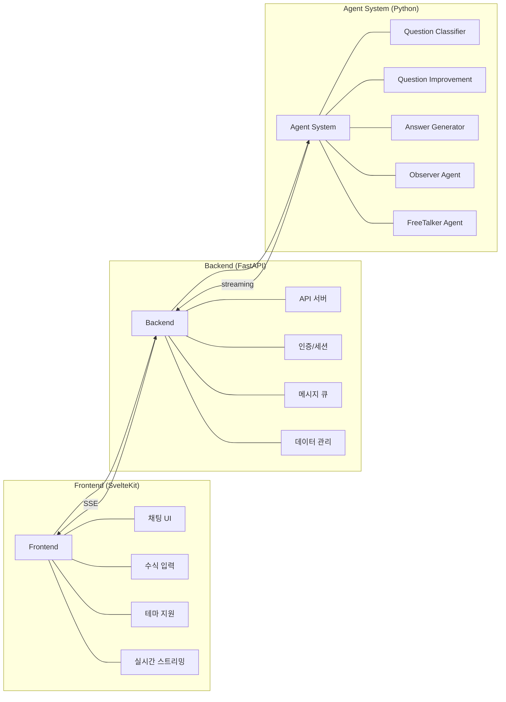
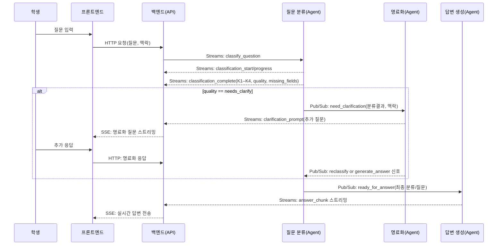

# 3. MAICE Agent 시스템 설계 및 개발

## 3.1 시스템 설계 원리

본 시스템은 “실제 작동하는 코드”를 기준으로 다음의 원칙을 따른다.

- **질문 우선, 분류 선행**: 답변 생성에 앞서 블룸 K1–K4 기준으로 질문을 체계적으로 분류하고, 응답 가능성(예: answerable, needs_clarify)에 따라 후속 흐름을 결정한다.
- **명료화는 듀이 이론으로**: 명료화가 필요한 경우에만 듀이의 5단계 반성적 사고를 적용해 추가 정보를 수집하고 질문을 개선한다.
- **프롬프트-설정 분리, 정책 중심**: 역할·규칙·출력 형식을 설정 파일로 선언하고 런타임에 동적으로 조합하여, 코드 수정 없이 정책을 교체·튜닝할 수 있도록 한다.
- **보안과 정합성 우선**: 입력은 정제·검증을 거치고, 출력은 JSON 전용 형식과 필수 필드 검증을 통해 일관된 파이프라인으로 처리한다.
- **스트림 우선, 느슨한 결합**: 구성 요소 간 통신을 스트림/이벤트 기반으로 설계해 확장성과 재처리 가능성을 확보한다.
- **관측 가능성과 회귀 내성**: 공통 계층에서 메트릭·로그·세션 동시성 제어를 제공하여, 실패 시 안전한 롤백과 재시도를 보장한다.

### 3.1.1 구현 개요(역할 매핑)
- **분류(선행)**: 질문을 K1–K4로 분류하고 JSON 검증 및 게이팅 후 다음 단계로 라우팅
- **명료화(조건부)**: 듀이 5단계 템플릿으로 추가 질의를 수행해 질문을 개선·재분류
- **답변 생성**: 질문 유형에 맞춰 구조화된 답변을 생성하고 스트리밍으로 전송
- **관찰/요약**: 대화 전 과정을 분석하여 요약·키워드·진도 등 메타 정보를 생성
- **실행/확장**: 각 에이전트를 독립 프로세스로 실행·모니터링하여 탄력적 확장성 확보

## 3.2 전체 시스템 구조

MAICE 시스템은 프론트엔드(Frontend), 백엔드(Backend), 에이전트 시스템(Agent System)의 3계층 구조로 설계되었다.


```mermaid
flowchart LR
  %% Define subgraphs and hub nodes
  subgraph FE["Frontend (SvelteKit)"]
    feHub[Frontend]
    fe1[채팅 UI]
    fe2[수식 입력]
    fe3[테마 지원]
    fe4[실시간 스트리밍]
    feHub --- fe1
    feHub --- fe2
    feHub --- fe3
    feHub --- fe4
  end

  subgraph BE["Backend (FastAPI)"]
    beHub[Backend]
    be1[API 서버]
    be2[인증/세션]
    be3[메시지 큐]
    be4[데이터 관리]
    beHub --- be1
    beHub --- be2
    beHub --- be3
    beHub --- be4
  end

  subgraph AG["Agent System (Python)"]
    agHub[Agent System]
    ag1[Question Classifier]
    ag2[Question Improvement]
    ag3[Answer Generator]
    ag4[Observer Agent]
    ag5[FreeTalker Agent]
    agHub --- ag1
    agHub --- ag2
    agHub --- ag3
    agHub --- ag4
    agHub --- ag5
  end

  %% Interactions
  feHub --> beHub
  beHub --> agHub
  agHub -->|streaming| beHub
  beHub -->|SSE| feHub
```

### 3.2.1 프론트엔드 (Frontend)
- **기술**: SvelteKit 2.0, TypeScript, Tailwind CSS 4.x
- **주요 기능**: 
  - 실시간 채팅 인터페이스
  - MathLive 기반 수식 입력
  - Server-Sent Events(SSE) 기반 스트리밍
  - Google OAuth 2.0 소셜 로그인

### 3.2.2 백엔드 (Backend)
- **기술**: FastAPI 0.104.1, SQLAlchemy 2.0.23, PostgreSQL 15, Redis 7
- **주요 기능**:
  - RESTful API 서버
  - JWT 기반 인증
  - 세션 및 메시지 관리
  - Redis Streams 메시지 큐 관리

### 3.2.3 에이전트 시스템 (Agent System)
- **기술**: Python 3.11+, OpenAI GPT-4o-mini, Redis Streams/Pub/Sub
- **주요 기능**:
  - 5개 독립 agent의 멀티프로세스 실행
  - Redis를 통한 agent 간 통신
  - 비동기 메시지 처리

### 3.2.4 상호작용 시퀀스(질문→분류→명료화→답변)

```mermaid
sequenceDiagram
  participant U as 학생
  participant FE as 프론트엔드
  participant BE as 백엔드(API)
  participant QS as 질문 분류(Agent)
  participant QI as 명료화(Agent)
  participant AN as 답변 생성(Agent)

  U->>FE: 질문 입력
  FE->>BE: HTTP 요청(질문, 맥락)
  BE->>QS: Streams: classify_question
  QS-->>BE: Streams: classification_start/progress
  QS-->>BE: Streams: classification_complete(K1–K4, quality, missing_fields)
  alt quality == needs_clarify
    QS->>QI: Pub/Sub: need_clarification(분류결과, 맥락)
    QI-->>BE: Streams: clarification_prompt(추가 질문)
    BE-->>FE: SSE: 명료화 질문 스트리밍
    U->>FE: 추가 응답
    FE->>BE: HTTP: 명료화 응답
    QI-->>QS: Pub/Sub: reclassify or generate_answer 신호
  end
  QS->>AN: Pub/Sub: ready_for_answer(최종 분류/질문)
  AN-->>BE: Streams: answer_chunk 스트리밍
  BE-->>FE: SSE: 실시간 답변 전송
```

### 3.2.5 통신 채널과 메시지 모델
- **백엔드↔에이전트(신뢰성)**: Redis Streams 사용
  - 요청: classify_question, clarification_prompt 등
  - 진행/완료 이벤트: classification_start/progress/complete, answer_chunk 등
  - 특성: 지속성·순서·재처리 보장(ACK 기반)
- **에이전트↔에이전트(오케스트레이션)**: Redis Pub/Sub 사용
  - 이벤트: need_clarification, ready_for_answer, generate_answer 등
  - 특성: 낮은 지연, 느슨한 결합, 다대다 브로드캐스트
- **프론트엔드↔백엔드**: HTTP 입력 + SSE 출력(실시간 스트리밍)

### 3.2.6 신뢰성·보안·검증 전략
- **입력 정제와 유효성 검사**: 위험 패턴 차단, 내용 정제, 세션 잠금으로 중복 처리 방지
- **출력 형식 강제**: JSON-only 응답과 필수 필드 검증으로 일관성 확보(knowledge_code, quality, missing_fields 등)
- **보안 구분자**: 프롬프트 경계 구분자와 해시 검증으로 임베딩·주입 공격에 대응
- **실패 복구**: 파싱 실패/빈 응답 시 즉시 오류 이벤트 전송 및 안전한 롤백·재시도

### 3.2.7 관측(Observability)과 운영
- **메트릭**: 요청/오류 카운터, 활성 세션 게이지, 처리 시간 분포 수집
- **로그**: 단계별 진행 로그(분류 시작/진행/완료, 명료화 라운드, 답변 청크)
- **확장성**: 각 에이전트는 독립 프로세스로 실행·감시되며 비정상 종료 시 재시작

## 3.3 멀티 에이전트 아키텍처

MAICE 시스템의 핵심은 5개의 독립적인 AI agent가 협업하는 멀티 에이전트 아키텍처이다.

### 3.3.1 QuestionClassifierAgent (질문 분류 에이전트)
**역할**: 학생의 질문을 분석하여 유형을 분류하고 후속 처리 방향을 결정

**주요 기능**:
- 질문을 K1(사실적), K2(개념적), K3(절차적), K4(메타인지적) 4가지 유형으로 분류
- 12개 세부 항목으로 질문 품질 자동 평가 (15점 만점)
- answerable/needs_clarify/unanswerable 3단계 게이팅 판정
- 명료화가 필요한 경우 구체적인 명료화 질문 생성

**통신 방식**:
- 입력: Redis Streams (백엔드 → 에이전트)
- 출력: Redis Streams (에이전트 → 백엔드) + Pub/Sub (에이전트 → 에이전트)

### 3.3.2 QuestionImprovementAgent (명료화 에이전트)
**역할**: 분류된 질문이 명료하지 않은 경우 듀이의 반성적 사고 이론을 기반으로 추가 정보를 수집하여 질문을 개선

**주요 기능**:
- 듀이의 5단계 반성적 사고 과정을 지원하는 명료화 질문 생성
  - 1단계: 문제 상황 인식 지원 (무엇이 불확실한가?)
  - 2단계: 문제 정의 지원 (정확히 무엇을 알고 싶은가?)
  - 3단계: 가설 설정 지원 (어떤 방법을 시도해봤는가?)
  - 4단계: 가설 검증 지원 (논리적 연결을 어떻게 보는가?)
  - 5단계: 결론 도출 지원 (최종적으로 무엇을 얻고 싶은가?)
- 사용자의 답변을 LLM으로 평가하여 충분한지 판단
- 질문 유형 재분류 (K1→K2, K2→K3 등)
- 명료화 완료 시 최종 질문 생성

**통신 방식**:
- 입력: Redis Streams + Pub/Sub
- 출력: Redis Streams + Pub/Sub

### 3.3.3 AnswerGeneratorAgent (답변 생성 에이전트)
**역할**: 분류되고 명료화된 질문에 대해 교육적이고 체계적인 답변을 생성

**주요 기능**:
- 질문 유형별 맞춤형 답변 생성 (K1-K4)
- 한국 고등학교 수학Ⅰ 수학적 귀납법 수준에 맞는 답변
- LaTeX 수식 지원
- 실시간 스트리밍 답변 생성
- 7개 Desmos 통합 도구 활용

**통신 방식**:
- 입력: Pub/Sub (에이전트 → 에이전트)
- 출력: Redis Streams + Pub/Sub

### 3.3.4 ObserverAgent (학습 관찰 에이전트)
**역할**: 전체 대화 과정을 관찰하고 분석하여 학습 요약을 생성

**주요 기능**:
- 질문, 명료화 과정, 답변을 종합 분석
- 학습 맥락 정보 추출
- 세션별 요약 생성
- 학습 진도 추적
- 어려움 영역 식별

**통신 방식**:
- 입력: Pub/Sub (에이전트 → 에이전트)
- 출력: Redis Streams (에이전트 → 백엔드)

### 3.3.5 FreeTalkerAgent (자유 대화 에이전트)
**역할**: FreePass 모드에서 즉각적인 답변을 제공하거나 일반 대화 처리

**주요 기능**:
- 명료화 과정 없이 빠른 답변 제공
- A/B 테스트의 대조군 역할
- 일반적인 수학 질문 처리

**통신 방식**:
- 입력: Redis Streams
- 출력: Redis Streams

### 3.3.6 MAICE 에이전트별 실제 코드 아키텍처와 프롬프트 시스템 구체 해설

MAICE 시스템은 질문 분류, 명료화, 답변 생성, 학습 관찰(freetalk 포함) 각 단계의 에이전트들을 단순 규칙 기반이 아니라, 실제 Python class 중심 객체지향적 구조와 YAML 기반 프롬프트/설정 분리, 스트림/이벤트 pub/sub, 동적 프롬프트 생성·적용·검증 로직으로 실행된다.

#### 1) 공통 시스템 구조(코드)
- **BaseAgent(공통슈퍼클래스)**에서 세션 관리, 백엔드 Streams/pubsub 동시지원, 중복 요청 방지(asyncio lock), LLM 호출 프레임워크 제공
- 모든 에이전트는 PromptConfigLoader(설정 로더)와 PromptBuilder(동적 프롬프트 생성기) 필수 사용. 각 agent 폴더 `prompts/config.yaml`에서 역할별 템플릿·룰만 별도 분리
- **프롬프트 검증 및 보안**: dangerous patterns(역할 변경/시스템 해킹 문구 등), separator 해시, sanitize_text 등 강제

#### 2) 주요 에이전트별 실제 동작 패턴(코드 순서대로)

##### A. QuestionClassifierAgent
- Streams(backend_to_agent)에서 메시지 수신시 `_handle_classify_question_stream` 실행→질문, context, session id, etc. 파싱
- 프롬프트 생성:
  - `PromptBuilder.build_prompt('classification', variables, agent_name='question_classifier')` (YAML의 템플릿+설정치+실제 context 채움)
  - dangerous pattern/구분자 체크→LLM 호출→JSON only, 필수 필드·게이팅/quality 처리
- 응답 파싱/오류시 강제 리턴. 최종 결과에서 `quality`에 따라
  - needs_clarify→QuestionImprovementAgent로 pub/sub 전송(type=NEED_CLARIFICATION), answerable→AnswerGeneratorAgent로 type=READY_FOR_ANSWER

##### B. QuestionImprovementAgent
- Streams/pubsub에서 clarification 메시지(분류결과+학생응답) 수신
- 명료화 세션 개체(session_id별 dict/최대3회 관리): 히스토리, missing_fields, context, 분류결과 등 저장
- 명료화 질문 생성
  - 분류agent 제안 있으면 우선 사용, 없으면 PromptBuilder 통해 'clarification_question_generation'템플릿 기반 명료화 질문 LLM 생성
  - 학생 답변 오면 프롬프트 빌드('clarification_evaluation'), 답변 LLM 평가→PASS/NEED_MORE 판정(JSON)
    - PASS 시 재분류/질문생성 LLM 호출→AnswerGenerator로 직접 개선질문/유형전달(type=GENERATE_ANSWER)
    - NEED_MORE 시 몇회 반복, 초과시 unanswerable로 처리

##### C. AnswerGeneratorAgent
- Streams/pubsub에서 READY_FOR_ANSWER/GENERATE_ANSWER 수신(분류/명료화 어느 방향이든)
- 핵심:
  - PromptBuilder로 'answer_generation' 템플릿과 유형별 구조, 설정(tone, 용어, chunk 등)을 variables와 함께 마크다운 프롬프트 동적 생성
  - context/clarification 등도 concat, 직접 system+user role 프롬프트로 LLM 호출
  - 답변은 스트리밍 청크 전송(e.g. 15자 단위), 백엔드/ObserverAgent에 실시간 연결
  - unanswerable 등 특수 케이스는 하드코딩된 응답, 일반은 마크다운 최적화(수식, 제목, 예시, 이모지, 구조 엄격)

##### D. ObserverAgent
- AnswerGenerator 혹은 중간 요약 요청(pub/sub/streams) 수신→질문/명료화/답변/전체대화 LLM 요약 생성(각각 별도의 템플릿)
- 요약 파이프라인:
  - Streams 실시간 진행상황 전송+최종 요약/키워드/진도 평가 등 summary 결과 생성
  - 실패시 fallback(간략 자동요약) 로직 내장

##### E. FreetalkerAgent
- Freepass 모드 전담 agent로 Streams 통해 질문/컨텍스트 전체 수신, 프롬프트는 config.yaml단일 프롬프트만(필요 시 LaTeX 강조)
- 청크 스트리밍/실험데이터 기록/지연 등 공통 패턴 사용자 경험 최적화까지 코드단에서 직접 구현

#### 3) 프롬프트 코드-템플릿 연결 구조(실행 예시)
- `PromptBuilder.build_prompt`는 agent별 'template_name'(e.g. classification, answer_generation)과 인스턴스별 context 데이터를 변수 dict로 넘겨 실제 system+user 프롬프트를 동적으로 생성
- 예시: `prompt = self.prompt_builder.build_prompt('answer_generation', agent_name='answer_generator', variables=variables)`
- 결과: strict한 템플릿-응답 검증(형식, 키 필드 등) 후 LLM 실행/청크 전송/Fallback 분기 모두 연계
- 모든 프롬프트 및 응답 형식은 config.yaml 변경만으로 무중단 업그레이드 가능

#### 4) 보안·모니터링·로깅(중요)
- separator(=구분자) 해시, dangerous 패턴, 시스템 역할고정 등 코드 단에서 강제(프롬프트 해킹 방지)
- LLM 응답에서 separator/금칙어 대응, 응답 검증/실패시 롤백
- Task별 세션별 DEBUG 수준 상세 로깅(프롬프트, 입력, 분류/명료화/답변/스트림 단계별), 실사용시 fallback, 실험데이터 자동저장

#### 5) 예시 코드 추출(부분)
```python
# 분류 프롬프트 빌드 및 실행
prompt_data = self.prompt_builder.build_prompt('classification', variables, agent_name='question_classifier')
# LLMTool 실행 및 JSON 파싱
result = await self.llm_tool.execute(prompt=prompt_data, variables={}, session_id=session_id)
data = json.loads(result["content"])

# 답변 생성기에 context, 유형, 명료화 정보 함께 전달
prompt = self.prompt_builder.build_prompt('answer_generation', agent_name='answer_generator', variables=variables)
full_answer = await self.llm_tool.execute(prompt=prompt, ...)
```

---
실제 MAICE agent 코드와 프롬프트 구조는 위와 같이 완전히 분리되어 있으면서, 실행시점에 통합/동적 생성되는 구조(최신 LLM 체계적 적용 사례). 모든 프롬프트와 출력을 에이전트 종류별, 상황별, 보안/품질 정책에 따라 계속 발전·관리할 수 있도록 설계되었음을 명시한다.

## 3.4 질문 분류 및 평가 체계

### 3.4.1 질문 유형 분류
Bloom의 학습 목표 분류법을 기반으로 4단계 지식 분류 체계를 구성하였다:

| 유형 | 명칭 | 설명 | 예시 |
|------|------|------|------|
| K1 | 사실적 지식 | 단순 정보 확인 | "수학적 귀납법의 정의가 뭐에요?" |
| K2 | 개념적 이해 | 개념 간 관계 이해 | "귀납 가정은 왜 필요한가요?" |
| K3 | 절차적 적용 | 문제 해결 절차 | "이 등식을 귀납법으로 어떻게 증명하나요?" |
| K4 | 메타인지적 성찰 | 자기 이해 점검 | "귀납 단계에서 제가 뭘 잘못 이해한 건가요?" |

### 3.4.2 질문 품질 평가 체계
학생 질문은 3개 영역 12개 세부 항목으로 평가된다 (각 항목 1-5점, 총 15점 만점):

**영역 1: 수학적 전문성 (4개 항목)**
- 수학적 개념/원리의 정확성
- 교과과정 내 위계성 파악
- 수학적 용어 사용의 적절성
- 문제해결 방향의 구체성

**영역 2: 질문 구조 (4개 항목)**
- 핵심 질문의 단일성
- 조건 제시의 완결성
- 문장 구조의 논리성
- 질문 의도의 명시성

**영역 3: 학습 맥락 (4개 항목)**
- 현재 학습 단계 설명
- 선수학습 내용 언급
- 구체적 어려움 명시
- 학습 목표 제시

AI 평가(12척도 총점)와 교사 평가(3척도 총점) 간 상관계수는 0.66(p<0.001)으로, 강한 양의 상관관계를 보였다.

## 3.5 명료화 프로세스 설계

### 3.5.1 3단계 게이팅 메커니즘
질문은 3단계 게이팅을 통해 처리된다:

1. **answerable**: 질문이 명확하고 답변 가능 → 즉시 답변 생성
2. **needs_clarify**: 질문이 모호하여 명료화 필요 → 명료화 프로세스 시작
3. **unanswerable**: 수학 외 영역이거나 답변 불가 → 정중히 안내

### 3.5.2 명료화 대화 흐름
```
학생 질문 입력
      ↓
QuestionClassifierAgent 분류
      ↓
needs_clarify 판정
      ↓
명료화 질문 생성 및 제시
      ↓
학생 응답 수집
      ↓
QuestionImprovementAgent 평가
      ↓
├─ 충분함 → AnswerGeneratorAgent
└─ 불충분함 → 추가 명료화 질문
```

### 3.5.3 명료화 질문 설계 원칙
- **구체성**: "어느 단계에서 막혔나요?"
- **맥락 파악**: "어디까지 이해했나요?"
- **목표 확인**: "무엇을 알고 싶은가요?"
- **선수 지식 확인**: "관련된 개념을 알고 있나요?"

## 3.6 기술 구현

### 3.6.1 데이터베이스 설계
PostgreSQL 15를 사용하여 다음과 같은 주요 테이블을 구성하였다:

```
users (사용자)
├── sessions (대화 세션)
│   ├── messages (메시지)
│   ├── agent_responses (agent 응답)
│   └── learning_summaries (학습 요약)
└── ab_test_sessions (A/B 테스트 세션)
```

### 3.6.2 Redis 통신 아키텍처
**Redis Streams**: 백엔드와 agent 간 신뢰성 있는 메시지 전달
- 메시지 지속성 보장
- 순서 보장
- 재처리 가능

**Redis Pub/Sub**: Agent 간 실시간 협업 통신
- 낮은 지연시간
- 이벤트 기반 통신
- 워크플로우 오케스트레이션

### 3.6.3 실시간 스트리밍
Server-Sent Events(SSE)를 활용하여 AI 답변을 실시간으로 스트리밍한다:

```
사용자 질문 → 백엔드 API → Redis Streams → Agent 처리 
→ Redis Streams → SSE → 프론트엔드 실시간 업데이트
```
