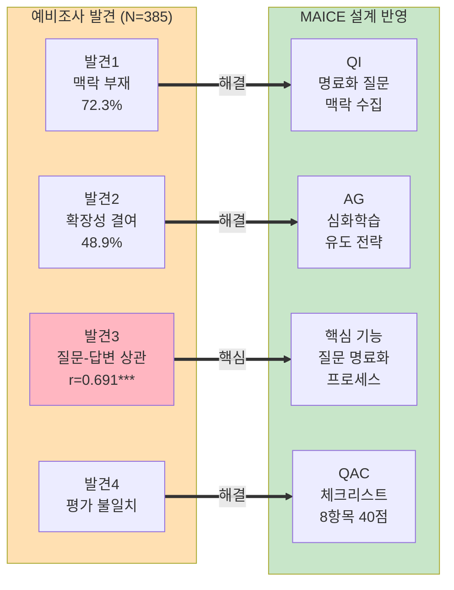
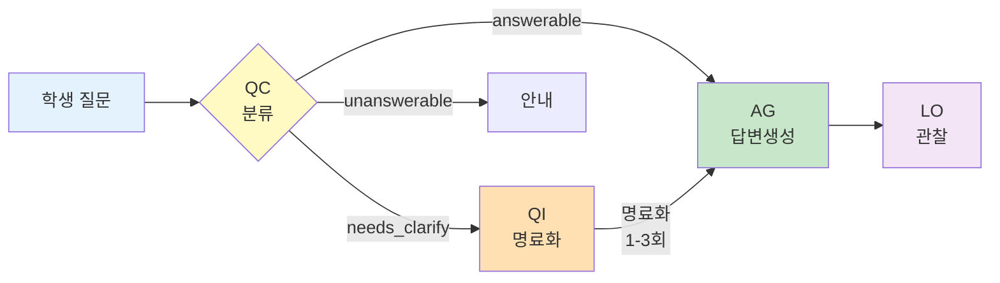
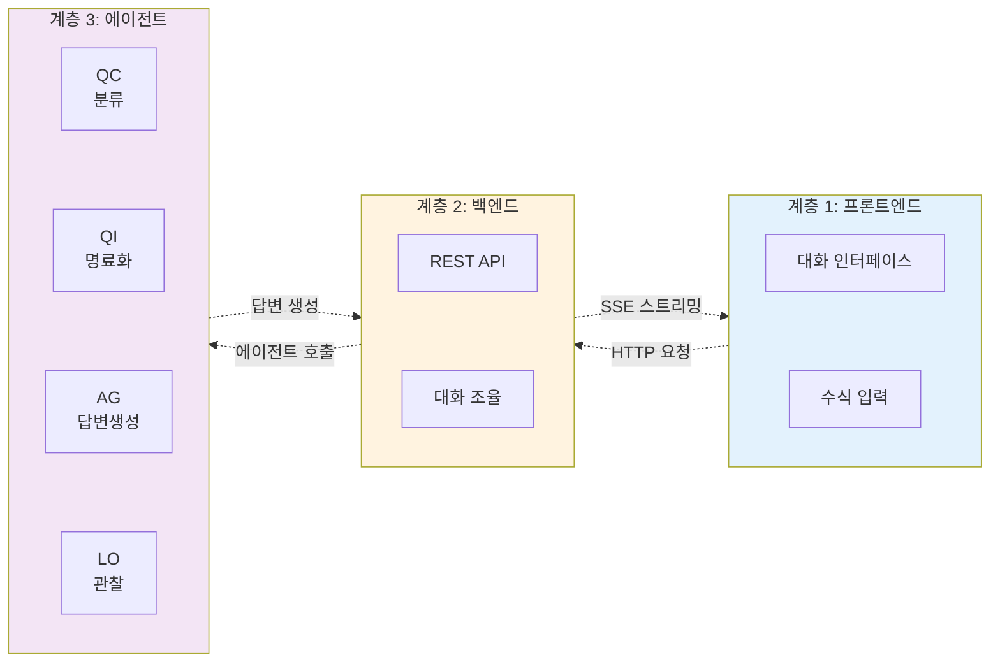
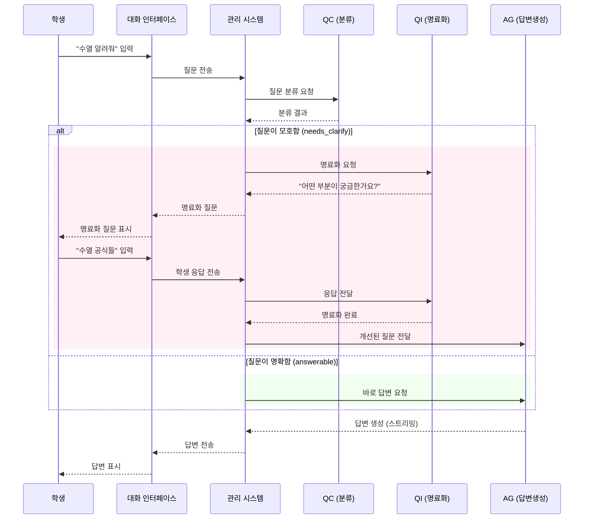
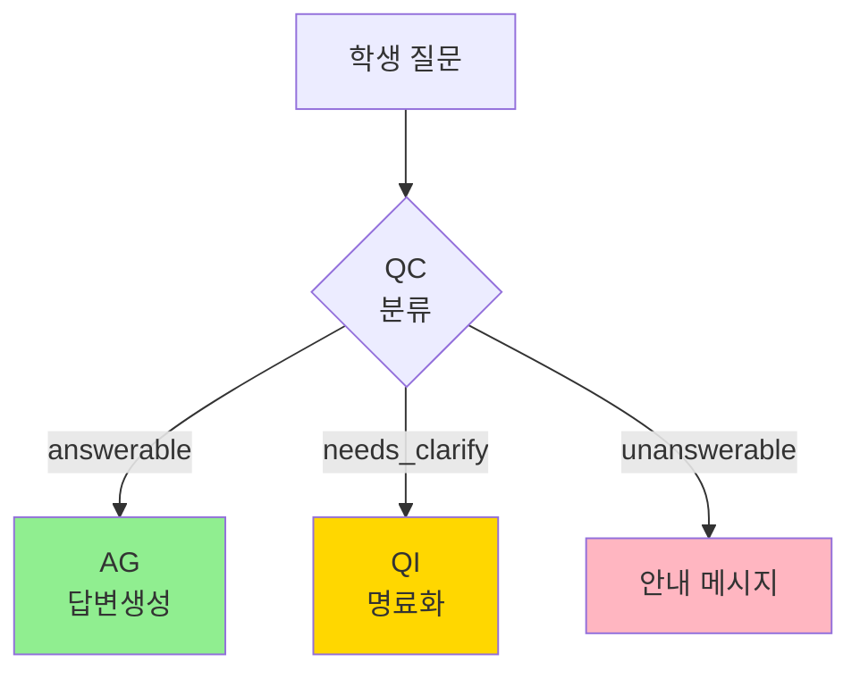
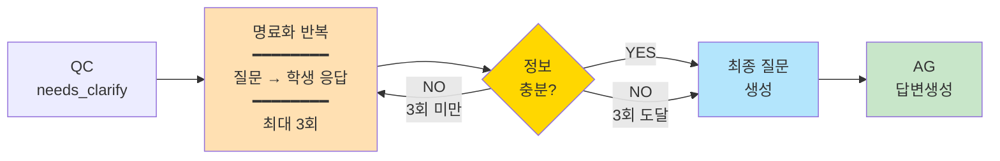
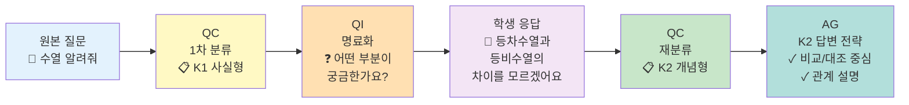

# III. MAICE 시스템 설계 및 구현

본 연구는 I장과 II장에서 확인된 문제점과 이론적 기반 위에 **MAICE(Mathematical AI Chatbot for Education)** 시스템을 설계·개발하였다. MAICE는 질문 명료화를 핵심으로 하는 AI 멀티 에이전트 시스템으로, Dewey의 반성적 사고와 Bloom의 지식 분류를 실제 학습 환경에 구현한 것이다.

## 1. 예비 연구: 문제 분석 및 설계 근거

I장에서 언급한 바와 같이, 본 연구는 AI 에이전트 시스템 설계에 앞서 2025년 5월 실제 고등학교 수학 수업에서 385건의 학생-AI 대화를 수집하여 현재 LLM 사용 방식의 교육적 문제점을 실증적으로 분석하였다. 본 절에서는 그 상세 내용을 제시한다.

### 가. 예비 조사 절차

**1단계: 데이터 수집** - 고등학교 수학 수업 환경에서 학생들에게 ChatGPT와 동일한 사용자 인터페이스를 제공하는 간단한 웹앱을 배포하였다. 수업 시간 동안 학생들이 자유롭게 질문하고 AI 답변을 받을 수 있도록 하여 총 385건의 실제 질문-답변 쌍을 수집하였다.

**2단계: 루브릭 개발** - 수집된 데이터를 분석한 결과, 학생 질문과 AI 답변에서 반복적으로 나타나는 질적 문제 패턴들이 관찰되었다. 전통적 교육학 이론(Dewey, Bloom 등)과 최신 AI 교육 평가 연구를 종합하여 체계적인 분석적 채점 기준(analytic rubric)을 개발하였다.

**[표Ⅳ-1] 예비조사 루브릭 6개 평가 영역**

| 구분 | 평가 영역 | 코드 | 평가 내용 |
|------|----------|:----:|----------|
| **질문 평가** | 수학적 전문성 | A1 | 수학 개념의 정확성, 용어 사용 |
| | 질문 구조화 | A2 | 질문 대상·범위·초점의 명확성 |
| | 학습 맥락 적용 | A3 | 학습자 수준, 목적, 이해 상태 |
| **답변 평가** | 학습자 맞춤도 | B1 | 학습자 수준 파악, 난이도 조절 |
| | 설명의 체계성 | B2 | 개념 위계, 단계별 논리 전개 |
| | 학습 내용 확장성 | B3 | 심화학습 유도, 자기주도 학습 촉진 |

각 영역은 5점 리커트 척도로 평가 (총 30점 만점).

**3단계: 교사 평가** - 중등 수학교사 4명이 독립적으로 385건을 평가하였다.

### 나. 예비 조사 핵심 발견

**[표Ⅳ-2] 예비조사 평가 결과 (N=385)**

| 평가 영역 | 평균 (5점) | 최저점 비율 | 문제 |
|----------|:--------:|:----------:|------|
| A3 학습 맥락 | **1.500** | **72.3%** | 가장 심각 |
| A2 질문 구조 | 2.049 | 45.8% | 심각 |
| A1 수학 전문성 | 2.277 | 45.5% | 심각 |
| B3 학습 확장성 | **1.832** | **48.9%** | 가장 심각 |
| B1 학습자 맞춤도 | 2.474 | 27.6% | 중간 |
| B2 설명 체계성 | 2.765 | 23.9% | 중간 |
| **질문-답변 상관** | - | - | **r=0.691*** |

주: ***p<0.001. 질문 품질이 높을수록 AI 답변 품질도 유의하게 향상.

**핵심 발견**:
1. **학습 맥락 부재** (72.3%): 학생들이 자신의 수준·목적을 명시하지 않음
2. **학습 확장성 결여** (48.9%): AI가 심화학습을 유도하지 못함
3. **강한 질문-답변 상관** (r=0.691): 질문 개선이 학습 효과의 핵심

**대표 사례**:
- **불량 질문** (ID 294): "근데 어떻게 증명한거야?" → AI도 답변 불가
- **우수 질문** (ID 358): "소프트웨어마이스터고 2학년인데 0!이 1인 이유를..." → AI 맞춤 답변

### 다. MAICE 설계에의 반영

예비 조사 발견은 다음과 같이 MAICE 설계에 직접 반영되었다:

**[그림Ⅳ-2] 예비조사 발견에서 MAICE 설계로의 반영**




예비조사에서 발견된 4가지 핵심 문제가 MAICE 시스템의 설계 원칙으로 직접 반영되었다.

---

## 2. 설계 철학: "명료화 중심 학습"

### 가. 해결 아이디어: 교육 이론 기반 에이전트 시스템

본 연구는 II장에서 검토한 교육 이론을 실제 AI 시스템으로 구현하는 것을 목표로 한다:

**Bloom의 K1-K4 분류** → **질문 유형 자동 분류 및 맞춤형 답변 생성**
- K1 (사실): 간결한 정의 중심 답변
- K2 (개념): 관계 설명 중심 답변
- K3 (절차): 단계별 안내 중심 답변
- K4 (메타인지): 메타인지 유도 중심 답변

**Dewey의 반성적 사고 5단계** → **명료화 프로세스 설계**
- 1단계 (문제 인식): "무엇이 불확실한가요?"
- 2단계 (문제 정의): "정확히 무엇을 알고 싶은가요?"
- 3단계 (가설 설정): "어떤 방법을 시도해봤나요?"
- 4단계 (가설 검증): "논리적 연결을 어떻게 보나요?"
- 5단계 (결론 도출): "최종적으로 무엇을 얻고 싶나요?"

### 나. 핵심 아이디어: 질문 → 분류 → 명료화 → 답변 파이프라인

MAICE 시스템의 핵심은 **학생의 질문을 즉시 답변하지 않고, 먼저 질문의 품질을 진단하고 필요시 명료화 과정을 거치는 것**이다.

**[그림Ⅳ-1] MAICE 질문 처리 파이프라인**



이러한 파이프라인은 단순히 정보를 전달하는 것이 아니라, **학생이 스스로 질문을 구조화하고 사고를 명료화하는 과정을 경험하도록 설계**되었다.

### 라. 설계 대상: 일반 LLM보다 우수한 학습 효과

**[표Ⅳ-3] MAICE 시스템의 설계 목표**

| 목표 | Freepass 한계 | MAICE 해결책 | 기대 효과 |
|------|--------------|-------------|----------|
| 질문 품질 개선 | 맥락 72.3% 부재 | 명료화 프로세스 | 질문의 질 향상 |
| 답변 적합성 향상 | 맥락 오해, 수준 불일치 | 질문 유형 분류 (K1-K4) | 맞춤형 답변 |
| 메타인지 향상 | 사고 과정 부재 | Dewey 5단계 유도 | 자기 성찰 훈련 |

MAICE 시스템은 위 3가지 측면에서 일반 Freepass 방식보다 우수한 학습 효과를 제공하는 것을 목표로 한다.

이러한 목표를 달성하기 위해, MAICE는 ChatGPT, Claude 등 상용 AI 대화 서비스와 유사한 UX를 제공하되, 수학 학습에 특화된 3계층 구조로 설계되었다.

## 3. 전체 아키텍처 개요: 3계층 구조

MAICE 시스템은 학생이 사용하는 **대화 인터페이스**, 대화를 관리하고 데이터를 저장하는 **관리 시스템**, 그리고 지능적으로 질문을 처리하는 **에이전트 시스템**의 3계층으로 구성된다.

### 가. 계층별 역할

#### 계층 1: 대화 인터페이스 (학생이 보는 화면)

**역할**: 학생이 수식을 쉽게 입력하고 AI 답변을 실시간으로 받을 수 있는 채팅 화면

**주요 기능**:
- **수식 입력 지원**: 복잡한 수학 수식을 클릭 몇 번으로 입력 (예: $\sum_{i=1}^{n}$, $\frac{a}{b}$)
- **실시간 답변**: AI 답변이 타이핑하듯 실시간으로 표시
- **간편한 로그인**: 학교 계정으로 바로 시작
- **모바일 지원**: 핸드폰에서도 동일하게 사용 가능

**학생 경험**: ChatGPT, Claude와 동일한 UX로 별도 학습 없이 즉시 사용 가능

**[그림Ⅳ-8] MAICE 대화 인터페이스 실제 화면**

_(그림 위치: 학생이 보는 실제 채팅 화면 - 수식 입력 버튼, 실시간 답변 스트리밍, LaTeX 렌더링 포함)_

#### 계층 2: 관리 시스템 (대화 저장 및 분석)

**역할**: 모든 대화를 체계적으로 저장하고, 교사가 학생 학습 상황을 파악할 수 있도록 지원

**주요 기능**:
- **대화 기록 관리**: 학생별 모든 대화 세션을 시간 순으로 저장
- **학습 데이터 분석**: 학생의 학습 진도, 어려움 영역 자동 추출
- **교사 대시보드**: 반 전체 학습 현황 및 개별 학생 상세 정보 제공
- **권한 관리**: 학생은 본인 데이터만, 교사는 전체 데이터 접근 가능

**교육적 가치**: 교사가 30명 학생의 개별 학습 상황을 실시간 파악 가능

#### 계층 3: 에이전트 시스템 (지능적 질문 처리)

**역할**: 학생 질문을 분석하고, 필요시 명료화하며, 맞춤형 답변을 생성하는 5개 AI 에이전트

**5개 에이전트**:
1. **Question Classifier (QC)**: "이 질문은 어떤 유형인가?"
2. **Question Improver (QI)**: "질문을 더 명확하게"
3. **Answer Generator (AG)**: "유형별 맞춤 답변"
4. **Learning Observer (LO)**: "학생이 무엇을 배우고 있는가?"
5. **Free Talker (FT)**: "명료화 없이 즉시 답변"

**협업 방식**: 각 에이전트는 독립적으로 작동하되, 필요한 정보를 서로 주고받으며 협업

### 나. 전체 시스템 구조도

**[그림Ⅳ-3] MAICE 3계층 아키텍처**



### 다. 질문 처리 흐름

학생이 질문을 입력하면 다음과 같은 과정을 거친다:

**[그림Ⅳ-4] 질문 처리 시퀀스**



**핵심 특징**:
- 학생은 명료화 과정을 자연스러운 대화로 경험
- 모든 대화는 자동으로 저장되어 학습 분석에 활용
- 교사는 별도 대시보드에서 학생 학습 현황 확인

> **기술 구현 상세**: 각 계층의 구체적인 기술 스택과 구현 방법은 부록 A "기술적 구현"에서 다룬다.

## 4. 에이전트별 설계 및 구현

MAICE 시스템의 핵심은 5개의 독립적인 AI 에이전트가 협업하여 질문을 처리하는 것이다. 각 에이전트는 특정한 교육적 목적을 가지고 설계되었으며, 이 절에서는 각 에이전트의 **설계 → 구현**을 연속적으로 제시한다. (기술적 상세 내용은 부록 A 참조)

### 가. Question Classifier (QC): "이 질문은 어떤 유형인가?"

#### 설계 목적

I장에서 확인했듯이, 학생 질문의 72.3%가 학습 맥락 정보 없이 제출되었다. 질문의 인지적 수준에 따라 답변 방식이 달라야 하므로(K1 사실형 vs K4 메타인지형), QC는 질문을 자동으로 분류하고 명료화 필요성을 판단한다.

#### 핵심 기능

**1) 질문 유형 분류 (K1-K4)**
- K1 (사실): "수학적 귀납법의 정의가 뭐에요?" → 간결한 정의 제공
- K2 (개념): "귀납 가정은 왜 필요한가요?" → 개념 간 관계 설명
- K3 (절차): "이 등식을 어떻게 증명하나요?" → 단계별 절차 안내
- K4 (메타인지): "제가 뭘 잘못 이해한 건가요?" → 메타인지 유도 답변

**2) 명료화 필요성 판단 (3단계 게이팅)**
- **answerable**: 질문이 명확함 → AG로 전달
- **needs_clarify**: 질문이 모호함 → QI로 전달
- **unanswerable**: 답변 불가능 → 정중한 안내

**3) 명료화 질문 제안**
- needs_clarify인 경우, Dewey 5단계 기반 구체적 질문 제안
- 예: "수열 알려줘" → "어떤 부분이 궁금한지 알려줄래? 1️⃣ 정의 2️⃣ 공식 3️⃣ 문제 풀이"

#### 설계 흐름

**[그림Ⅳ-5] QC 3단계 게이팅**



#### 구현: 프롬프트 전략

QC의 교육적 설계는 다음 프롬프트로 구현된다:

**System 메시지 핵심**:
```
당신은 대한민국 고등학교 수학 교육과정 전문 분류기입니다.
질문을 정확히 분석하여 4가지 유형과 3단계 품질로 분류하고, 
필요한 경우 **학생에게 직접 묻는** 명료화 질문까지 생성하세요.

## 질문 유형 (K1-K4)
- K1 (즉답형): 정의, 용어, 기호, 공식, 값, 단위
- K2 (설명형): 개념 간 관계, 분류, 원리, 이론
- K3 (적용형): 수행 방법, 알고리즘, 단계별 과정
- K4 (문제해결형): 전략적 사고, 문제 접근법, 반성

## 명료화 질문 생성 원칙 (Dewey 5단계)
1. 문제 인식: "어떤 부분이 가장 어렵거나 궁금하셨나요? 🤔"
2. 문제 정의: "지금까지 이해한 부분과 헷갈리는 부분을 나누어볼까요?"
3. 연결 탐색: "이미 알고 있는 개념과 비교하면 어떤 점이 다른가요?"
4. 사고 전개: "왜 이 부분이 궁금하신지 조금 더 설명해주실 수 있나요?"
5. 이해 검증: "어디까지 이해했고, 어디서부터 막히셨는지 말씀해주세요"
```

**구현 특징**:
- Dewey 5단계를 명료화 질문 전략으로 직접 구현
- Bloom K1-K4 분류로 질문 유형 자동 차별화
- 학생 친화적 톤 ("🤔", 존댓말)으로 심리적 장벽 완화

> **프롬프트 구조 및 설계 예시**: 부록 B 참조

---

### 나. Question Improver (QI): "질문을 더 명확하게"

#### 설계 목적

QC가 "명료화 필요" 판정을 내리면, QI는 학생이 스스로 질문을 구체화하도록 돕는다. Dewey의 반성적 사고 이론에 따르면, 학생이 자신의 어려움을 명확히 인식하고 표현하는 과정에서 메타인지 능력이 향상된다.

#### 핵심 설계: Dewey 5단계 기반 명료화

QI는 Dewey의 5단계를 대화형 질문으로 변환하여, 질문 유형(K1-K4)과 모호성 수준에 따라 1-3회 명료화를 수행한다:

**[표Ⅳ-4] Dewey 5단계 기반 명료화 전략**

| Dewey 단계 | 명료화 질문 예시 | 학생 경험 |
|-----------|----------------|----------|
| **1단계: 문제 인식** | "무엇이 불확실한가요?" | 막연한 어려움 → 구체적 문제 인식 |
| **2단계: 문제 정의** | "정확히 무엇을 알고 싶은가요?" | "어려워요" → "귀납 단계가 어려워요" |
| **3단계: 가설 설정** | "어떤 방법을 시도해봤나요?" | 학생의 시도와 이해 수준 파악 |
| **4단계: 가설 검증** | "왜 그렇게 생각했나요?" | 학생의 사고 과정 드러내기 |
| **5단계: 결론 도출** | "최종적으로 무엇을 얻고 싶나요?" | 학습 목표 명확화 |

#### 명료화 전략: 질문 유형별 차별화

질문 유형(K1-K4)과 모호성 수준에 따라 명료화 전략을 조절한다:

- **K1 (즉답형)**: 선택지 제공으로 빠르게 범위 좁히기 (1회)
- **K2 (설명형)**: 비교 대상이나 설명 깊이 확인 (1-2회)
- **K3 (적용형)**: 구체적인 문제 상황이나 막힌 단계 파악 (1-2회)
- **K4 (문제해결형)**: Dewey 5단계를 깊이 적용, 사고 과정 드러내기 (2-3회)

#### 명료화 완료 판단

QI는 학생의 각 응답을 평가하여, 충분한 정보가 모였는지 판단한다:

**[그림Ⅳ-6] 명료화 프로세스 흐름**



**판단 기준**:
- **PASS**: 원본 질문의 의도가 명확해지고, 답변 생성에 필요한 정보 확보
- **NEED_MORE**: 원본 질문의 의도가 여전히 불분명하거나, 추가 정보 필요
- **최대 3회 제한**: 3회 명료화 후에도 불충분하면 현재 정보로 답변 생성

#### 교육적 의도 명시화

기존 LLM은 "왜 명료화 질문을 하는지" 설명하지 않아 학생이 불편함을 느꼈다. QI는 명료화의 교육적 이유를 부드럽게 설명한다:

**기본 프레이밍**:
```
"질문을 조금만 더 구체적으로 만들어주면,
 딱 맞는 설명을 해드릴 수 있어요! 😊"
```

**교육적 프레이밍** (K4 수준 학생):
```
"함께 질문을 구체화해볼까요? 🎯
 네가 정확히 무엇을 모르는지 찾아가는 과정이
 진짜 학습의 시작이에요!"
```

#### 질문 유형 재분류

명료화 과정에서 학생의 실제 어려움이 드러나면, 질문 유형이 변경될 수 있다:

**[그림Ⅳ-7] 질문 유형 재분류 예시**



#### 구현: 명료화 평가 로직

QI의 핵심 설계는 다음과 같이 구현된다:

**평가 로직**:
```
학생 응답 → 평가 (PASS/NEED_MORE) → 판단
- PASS: 원본 질문의 의도가 명확해짐 → AG 실행
- NEED_MORE: 추가 정보 필요 → 재질문 (최대 3회)
- 3회 초과: 현재 정보로 진행
```

**구현 특징**:
- PASS/NEED_MORE 이진 판단으로 명료성 평가
- 최대 3회 제한으로 무한 루프 방지
- 질문 유형별 차별적 명료화 전략 (K1: 1회, K4: 2-3회)

> **프롬프트 구조 및 설계 예시**: 부록 B 참조

---

### 다. Answer Generator (AG): "유형별 맞춤 답변"

#### 설계 목적

I장에서 확인한 AI 답변의 문제는 "모든 학생에게 동일한 방식으로 설명"하여 인지 과부하를 유발했다. AG는 Bloom의 K1-K4 분류에 따라 답변 구조와 교수법을 차별화한다.

#### 핵심 설계: K1-K4별 답변 차별화

**[표Ⅳ-5] K1-K4별 답변 구조 및 교수법**

| 유형 | 답변 구조 | 교수법 특징 |
|------|----------|------------|
| **K1 (사실)** | 정의 → 핵심 예시 → 보충 | 간결함, 정확성 우선 (3-5문장) |
| **K2 (개념)** | 개념 관계 → 비교/대조 → 시각화 | "왜?" 중심 설명, 논리적 연결 |
| **K3 (절차)** | 전체 개요 → 단계별 안내 → 실수 방지 | 선택권 제공, 대화형 진행 |
| **K4 (메타인지)** | 문제 분석 → 자기 점검 → 대안 탐색 | 답 직접 제공 X, 사고 과정 유도 |

#### 주요 설계 특징

**교육과정 표준 준수**: 대한민국 교육과정 표준 용어 사용 (부등식, 일반항, 도함수 등)

**실시간 스트리밍**: 답변을 타이핑하듯 실시간 전송하여 학생이 자연스러운 대화 경험

**LaTeX 수식 렌더링**: 인라인(`$수식$`) 및 블록(`$$수식$$`) 수식 지원

#### 구현: K1-K4 템플릿 선택 로직

AG는 질문 유형에 따라 완전히 다른 프롬프트 템플릿을 선택한다:

**템플릿 구조적 차이**:
- **K1**: 정의 → 예시 → 보충 (간결함 우선)
- **K2**: 개념 관계 → 비교 → 시각화 (연결성 강조)
- **K3**: 전체 개요 → 단계별 안내 → 실수 방지 (절차 명확성)
- **K4**: 문제 분석 → 다양한 접근 → 자기 점검 (메타인지 자극)

**코드 구현**:
```python
# 질문 유형에 따른 템플릿 선택
template_name = f"answer_{knowledge_code.lower()}"
prompt = await self.prompt_builder.build(template_name, {
    "question": final_question,
    "context": context,
    "clarification_history": clarification_history
})
```

> **프롬프트 템플릿 구조**: 부록 B 참조

---

### 라. Learning Observer (LO): "대화 요약 및 컨텍스트 관리"

#### 설계 목적

긴 대화 세션에서 컨텍스트 길이 증가와 맥락 손실을 방지하기 위해, LO는 대화를 주기적으로 요약하여 핵심 내용만 유지한다.

#### 핵심 기능

**2단계 요약 전략**: 
1. **기본 요약** 즉시 생성 및 백엔드 전송 (빠른 응답)
2. **LLM 향상 요약** 백그라운드에서 비동기 생성 (품질 향상, 30초 타임아웃)

**맥락 유지**: 토큰 효율성 확보 + 학습 연속성 지원

**[표Ⅳ-6] LO 관찰 및 추출 정보**


| 관찰 항목 | 설명 | 예시 |
|----------|------|------|
| **세션 제목** | 대화의 핵심 주제 요약 | "수학적 귀납법 귀납 단계 증명" |
| **질문 요약** | 학생이 궁금해한 내용 | "n² < 2ⁿ을 수학적 귀납법으로 증명하는 방법" |
| **명료화 과정** | 명료화 진행 여부 및 내용 | "2회 명료화: 증명 단계 → 귀납 가정 적용" |
| **답변 요약** | 제공된 학습 내용 핵심 | "기본 단계(n=1)와 귀납 단계(n=k→k+1) 설명" |
| **핵심 개념** | 학습한 주요 수학 개념 | 수학적 귀납법, 귀납 가정, 귀납 단계 |
| **학습 진행 상태** | 학생 이해도 변화 추적 | "기본 단계 이해 → 귀납 단계 적용 학습 중" |

#### 구현: 학습 요약 전략

LO는 다음 전략으로 학습 관찰을 구현한다:

**요약 전략**:
- **대화 패턴 감지**: 반복 질문, 유형 변화, 이해 수준 추적
- **학습 상태 요약**: 5-7회 대화마다 학습 진행 상황 요약
- **교사 보고**: 학생별 학습 현황을 교사 대시보드에 제공

**구현 특징**:
- 세션 기반 컨텍스트 관리 (PostgreSQL 저장)
- 학습 패턴 자동 감지 알고리즘
- 개인정보 보호를 위한 익명화 처리

> **프롬프트 구조 및 설계 예시**: 부록 B 참조

---

### 마. Free Talker (FT): "대조군 (Freepass 모드)"

#### 설계 목적

명료화 프로세스의 효과를 검증하기 위한 A/B 테스트 대조군. 일반 ChatGPT, Claude처럼 명료화 없이 즉시 답변한다.

#### 핵심 특징

**즉시 답변**: 질문 분류, 명료화 없이 바로 답변 생성

**A/B 테스트**: 학생 58명을 무작위로 Agent(28명) / Freepass(30명) 배정

**[표Ⅳ-7] Agent vs Freepass 모드 기능 비교**

| 항목 | Agent 모드 | Freepass 모드 |
|------|-----------|---------------|
| **질문 분류** | ✓ K1-K4 분류 | ✗ 분류 없음 |
| **명료화** | ✓ needs_clarify 시 명료화 | ✗ 명료화 없음 |
| **답변 전략** | ✓ K1-K4별 차별화 | ✗ 동일한 방식 |

**대조군의 중요성**:
- Agent 모드의 효과를 **인과적으로 검증** 가능
- 선택 편향(selection bias) 제거
- "명료화가 정말 도움이 되는가?" 실증적 답변 제공

#### 검증 계획

FT를 활용한 A/B 테스트를 통해 다음을 비교 검증할 예정이다:

**비교 차원**:
1. **즉시 효과**: 단일 세션에서 질문-답변 품질 비교
2. **누적 효과**: 다회 세션 시 학습 진행 패턴 비교  
3. **학습자 수준별 효과**: 상위권/하위권 학생에 대한 차별적 효과 분석

**기대 가설**:
- 명료화 프로세스는 단일 세션에서는 시간이 더 소요되나, 장기적으로 질문 능력과 메타인지 향상에 기여할 것
- 특히 절차적 지식이 부족한 하위권 학생들에게 더 큰 학습 효과가 나타날 것

검증 결과는 V장에서 상세히 분석한다.

#### 구현: A/B 배정 로직

FT의 A/B 테스트는 다음과 같이 구현된다:

**무작위 배정**:
```python
def assign_mode(student_id):
    # 학번 해시 기반 50:50 배정
    return "agent" if hash(student_id) % 2 == 0 else "freepass"
```

**구현 특징**:
- 가입 시점에 모드 자동 배정 (변경 불가)
- PostgreSQL에 모드 필드 자동 저장
- 데이터 수집 시 모드별 비교 분석 가능

**A/B 배정 구조**:
- Agent: 28명 (명료화 O)
- Freepass: 30명 (명료화 X)
- 분석: V장에서 모드별 효과 비교

> **프롬프트 구조 및 설계 예시**: 부록 B 참조

---

**III장 요약**: 본 장에서는 MAICE 시스템의 설계 철학, 3계층 아키텍처, 5개 에이전트(QC, QI, AG, LO, FT)의 **설계 → 구현**을 연속적으로 제시하였다. 각 에이전트의 교육적 설계 원리와 핵심 프롬프트 구현 전략을 확인할 수 있다. 기술적 세부사항(기술 스택, 배포, 보안 등)은 **부록 A**를, 프롬프트 설계 및 실제 세션 예시는 **부록 B**를 참조하라.

---

