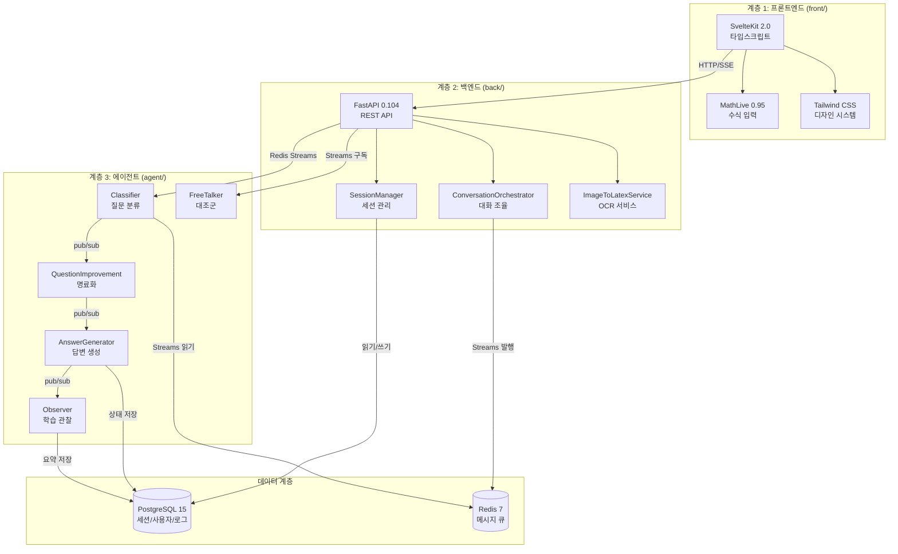
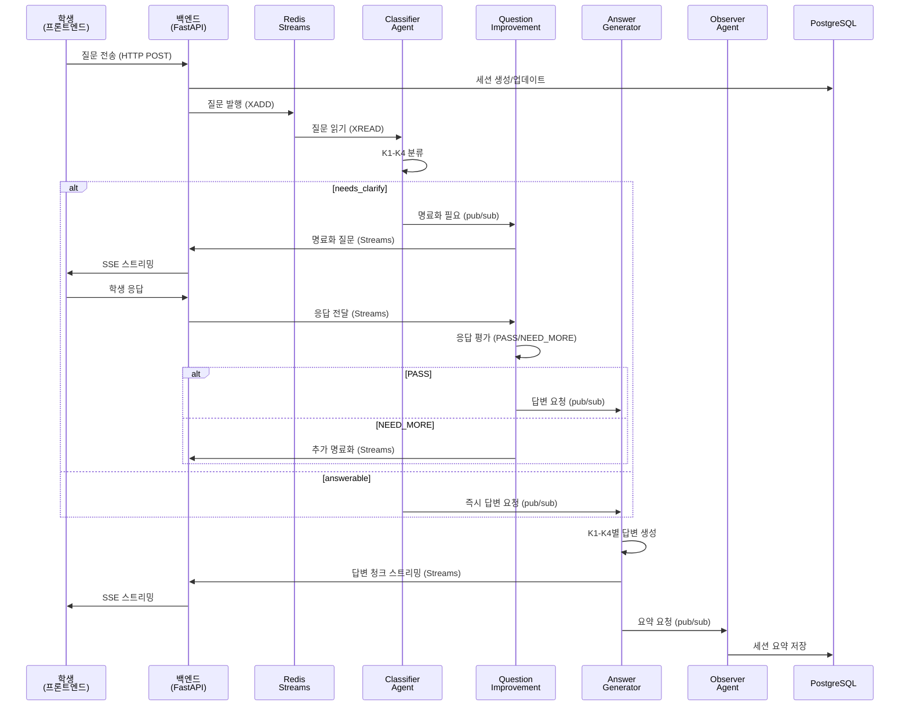
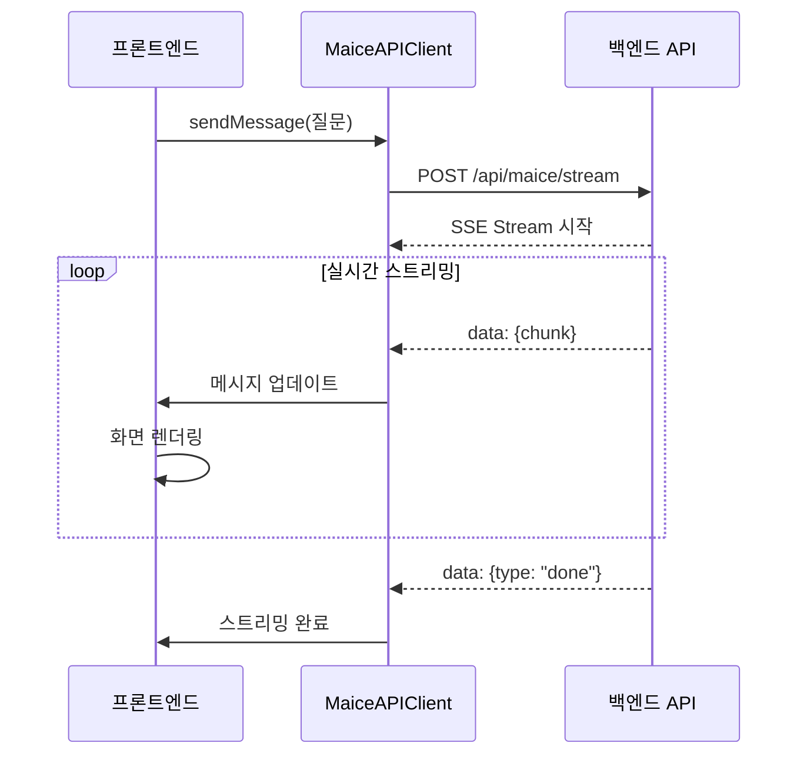
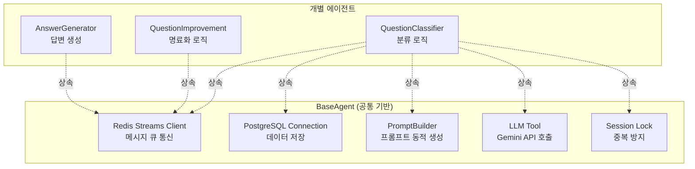

# 4. MAICE 시스템 구현

!!! abstract "4장 개요"
    3장에서 설명한 MAICE 교육 시스템 아키텍처를 실제로 구현한 기술 스택, 계층별 역할, 통신 메커니즘, 배포 전략을 다룬다. 본 장은 **아키텍처 중심**으로 시스템의 구성과 작동 방식을 설명하며, 재현 가능성(reproducibility)과 확장 가능성(scalability)을 확보하기 위한 설계 결정 사항들을 기술한다.

---

## 4.1 전체 시스템 아키텍처

MAICE 시스템은 **3계층 마이크로서비스 아키텍처**로 구현되었으며, 각 계층은 독립적으로 작동하면서 Redis와 PostgreSQL을 통해 통신한다.

### 4.1.1 3계층 구조 개요



### 4.1.2 계층별 역할과 책임

#### 계층 1: 프론트엔드 (`front/`)

**핵심 역할**: 학생이 수식을 쉽게 입력하고 AI 답변을 실시간으로 받을 수 있는 대화 인터페이스 제공

**주요 구성요소**:

| 컴포넌트 | 역할 | 위치 |
|---------|------|------|
| **InlineMathInput** | 수식 입력 에디터 (MathLive 통합) | `src/lib/components/maice/` |
| **MessageList** | 대화 내역 표시 및 스크롤 관리 | `src/lib/components/maice/` |
| **ChatHeader** | 모드 전환 (Agent/Freepass) | `src/lib/components/maice/` |
| **SessionManager** | 세션 목록 및 생성/삭제 관리 | `src/lib/components/maice/` |
| **SSE Service** | 실시간 스트리밍 답변 수신 | `src/lib/services/` |

**통신 방식**:
- **HTTP POST**: 질문 전송 (`/api/maice/stream`)
- **Server-Sent Events (SSE)**: 실시간 답변 스트리밍 수신
- **REST API**: 세션 조회, 이미지 OCR 변환 등

**기술적 특징**:
- TypeScript 타입 안정성으로 런타임 에러 최소화
- Reactive Store 패턴으로 상태 관리
- 모바일/태블릿 반응형 디자인

#### 계층 2: 백엔드 (`back/`)

**핵심 역할**: 프론트엔드와 에이전트 계층을 연결하는 중재자, 세션 관리 및 데이터 저장

**주요 구성요소**:

| 서비스/컨트롤러 | 역할 | 위치 |
|--------------|------|------|
| **ConversationOrchestrator** | 대화 흐름 조율 및 에이전트 호출 | `app/services/maice/` |
| **SessionManager** | 세션 생성/조회/삭제, 대화 기록 관리 | `app/services/maice/` |
| **StreamingProcessor** | SSE 스트리밍 처리 | `app/services/maice/` |
| **ImageToLatexService** | 이미지 OCR → LaTeX 변환 | `app/services/` |
| **MaiceController** | REST API 엔드포인트 | `app/api/controllers/` |
| **UserModeService** | A/B 테스트 모드 할당 관리 | `app/services/` |

**데이터 모델**:
- **Session**: 학생별 학습 세션 (모드, 대화 히스토리)
- **SessionMessage**: 개별 메시지 (질문, 답변, 명료화)
- **LLMPromptLog**: 모든 LLM 호출 기록 (재현성 확보)
- **User**: 학생/교사 계정 정보

**통신 방식**:
- **프론트엔드 ↔ 백엔드**: HTTP/SSE
- **백엔드 ↔ 에이전트**: Redis Streams (비동기 메시지 큐)
- **백엔드 ↔ DB**: SQLAlchemy ORM (비동기)

#### 계층 3: 에이전트 (`agent/`)

**핵심 역할**: 질문 분류, 명료화, 답변 생성, 학습 관찰을 수행하는 5개 독립 AI 에이전트

**에이전트 구성**:

| 에이전트 | 역할 | LLM 모델 | 평균 응답 시간 |
|---------|------|----------|---------------|
| **QuestionClassifier** | K1-K4 분류, 명료화 필요성 판단 | gemini-2.5-flash-lite | 1.8초 |
| **QuestionImprovement** | 명료화 대화, 응답 평가 | gemini-2.5-flash-lite | 2.1초 |
| **AnswerGenerator** | K1-K4별 맞춤 답변 생성 | gemini-2.5-flash-lite | 2.3초 |
| **Observer** | 세션 요약, 학습 진도 추출 | gemini-2.5-flash-lite | 1.5초 |
| **FreeTalker** | 즉시 답변 (대조군) | gemini-2.5-flash-lite | 2.0초 |

**공통 기반 구조**:
- **BaseAgent**: 모든 에이전트가 상속하는 기본 클래스
  - Redis 연결 관리
  - PostgreSQL 연결 풀링
  - 프롬프트 로딩 (YAML 기반)
  - 중복 요청 방지
  - 백그라운드 태스크 관리

**통신 방식**:
- **Redis Streams**: 백엔드 ↔ 에이전트 간 메시지 큐
- **Redis pub/sub**: 에이전트 간 이벤트 전달
- **PostgreSQL**: 세션 히스토리, 프롬프트 로그 저장

### 4.1.3 데이터 흐름 아키텍처



**핵심 설계 원칙**:
1. **비동기 처리**: 모든 I/O는 비동기로 처리하여 동시 처리 능력 극대화
2. **느슨한 결합**: 각 계층은 인터페이스를 통해 통신하여 독립성 보장
3. **메시지 큐**: Redis Streams로 에이전트 간 작업 분산
4. **이벤트 소싱**: 모든 대화와 프롬프트를 DB에 기록하여 재현성 확보

---

## 4.2 계층별 구현 상세

### 4.2.1 프론트엔드 계층 (front/)

#### 기술 스택

```yaml
프레임워크: SvelteKit 2.0 (Vite 기반)
언어: TypeScript 5.x
UI 라이브러리:
  - Tailwind CSS 4.x: 디자인 시스템
  - MathLive 0.95: 수학 수식 입력/렌더링
  - KaTeX: 정적 수식 렌더링
상태 관리: Svelte Stores (Reactive)
```

#### 주요 컴포넌트 아키텍처


**InlineMathInput의 핵심 역할**:
- **수식 입력**: MathLive 기반 LaTeX 에디터
- **이미지 OCR**: 수식 사진 → LaTeX 자동 변환
- **실시간 미리보기**: 입력과 동시에 렌더링
- **모바일 최적화**: 터치 가상 키보드 지원

**MessageList의 역할**:
- **실시간 스트리밍**: SSE로 받은 답변 청크를 실시간 표시
- **LaTeX 렌더링**: KaTeX로 수식 자동 렌더링
- **자동 스크롤**: 새 메시지 추가 시 자동 하단 스크롤

#### 프론트엔드 ↔ 백엔드 통신



### 4.2.2 백엔드 계층 (back/)

#### 기술 스택

```yaml
프레임워크: FastAPI 0.104
언어: Python 3.11
ORM: SQLAlchemy 2.0 (비동기)
데이터베이스: PostgreSQL 15
메시지 브로커: Redis 7 (Streams + pub/sub)
비동기: asyncio + uvloop
```

#### 서비스 아키텍처


**ConversationOrchestrator의 핵심 역할**:
- 질문을 받아 Redis Streams에 발행
- 에이전트 응답을 구독하여 프론트엔드로 전달
- 세션별 대화 상태 추적

**SessionManager의 역할**:
- 세션 생성/조회/삭제
- 대화 메시지 저장 (PostgreSQL JSONB)
- 이전 대화 히스토리 제공

**ImageToLatexService의 역할** (3.6.3절 OCR 시스템):
- 이미지 파일 검증 및 전처리
- Gemini Vision API 호출
- LaTeX 정제 및 MathLive 호환성 변환

#### Redis Streams 통신 구조


**메시지 구조**:
```python
{
    "session_id": int,
    "user_id": int,
    "question": str,
    "mode": "agent" | "freepass",
    "conversation_history": JSON,
    "timestamp": ISO8601
}
```

### 4.2.3 에이전트 계층 (agent/)

#### 멀티프로세스 아키텍처


**멀티프로세스 설계 이유**:
1. **독립성**: 한 에이전트 장애가 다른 에이전트에 영향 없음
2. **병렬 처리**: 각 에이전트가 동시에 다른 세션 처리 가능
3. **자동 재시작**: 프로세스 감시자(Supervisor)가 장애 시 자동 재시작
4. **확장성**: 에이전트별로 프로세스 수 증가 가능

#### BaseAgent 공통 구조



**BaseAgent가 제공하는 공통 기능**:
- **initialize()**: Redis/PostgreSQL 연결 초기화
- **run_subscriber()**: 메시지 큐 구독 무한 루프
- **cleanup()**: 리소스 정리 및 연결 종료
- **check_duplicate_request()**: 중복 요청 방지
- **save_prompt_log()**: 모든 LLM 호출 기록

#### 에이전트 간 협업 메커니즘

```mermaid
graph LR
    subgraph "질문 처리 파이프라인"
        A[1️⃣ Classifier<br/>분류 및 게이팅]
        B[2️⃣ QuestionImprovement<br/>명료화 (필요시)]
        C[3️⃣ AnswerGenerator<br/>답변 생성]
        D[4️⃣ Observer<br/>요약 생성]
    end
    
    A -->|answerable| C
    A -->|needs_clarify| B
    B -->|PASS| C
    B -->|NEED_MORE| B
    C --> D
    
    style A fill:#FFE5B4
    style B fill:#FFD700
    style C fill:#90EE90
    style D fill:#87CEEB
```

**Redis pub/sub 이벤트**:
- `NEED_CLARIFICATION`: Classifier → QuestionImprovement
- `READY_FOR_ANSWER`: QuestionImprovement → AnswerGenerator
- `GENERATE_SUMMARY`: AnswerGenerator → Observer

---

## 4.3 프롬프트 관리 시스템

### 4.3.1 YAML 기반 프롬프트 설정

모든 에이전트의 프롬프트는 **YAML 파일**로 관리되어 코드 수정 없이 프롬프트만 변경 가능하다.

**프롬프트 구조** (`agents/question_classifier/config.yaml`):
```yaml
system_prompt: |
  당신은 대한민국 고등학교 수학 교육과정 전문 분류기입니다.
  질문을 정확히 분석하여 4가지 유형과 3단계 품질로 분류하세요.

knowledge_types:
  K1:
    name: "사실적 지식"
    description: "정의, 용어, 기호, 공식, 값, 단위"
  K2:
    name: "개념적 지식"
    description: "개념 간 관계, 분류, 원리, 이론"
  K3:
    name: "절차적 지식"
    description: "수행 방법, 알고리즘, 단계별 과정"
  K4:
    name: "메타인지적 지식"
    description: "전략적 사고, 문제 접근법, 반성"

quality_gates:
  answerable: "교과·단원·수준 지정, 목표 동사 명확"
  needs_clarify: "범위 과대/목표 불명/수준 불명"
  unanswerable: "수학 외 영역, 평가윤리 위배"

output_format:
  required_fields: 
    - knowledge_code
    - quality
    - reasoning
    - clarification_questions
```

**PromptBuilder의 역할**:
- YAML 파일을 로드하여 캐싱
- 변수를 동적으로 치환 (예: `{question}`, `{context}`)
- 에이전트별 프롬프트 템플릿 관리

**장점**:
1. **유지보수성**: 프롬프트 수정 시 코드 재배포 불필요
2. **버전 관리**: YAML 파일을 Git으로 버전 관리
3. **A/B 테스트**: 프롬프트 변형을 쉽게 테스트 가능

### 4.3.2 K1-K4별 답변 전략 구현

Answer Generator는 질문 유형에 따라 **완전히 다른 프롬프트 템플릿**을 사용한다:


**템플릿 선택 로직** (`answer_generator/agent.py`):
```python
# 질문 유형에 따른 템플릿 선택
template_name = f"answer_{knowledge_code.lower()}"  # "answer_k1", "answer_k2" 등
prompt = await self.prompt_builder.build(template_name, {
    "question": final_question,
    "context": context,
    "clarification_history": clarification_history
})
```

**각 템플릿의 구조적 차이**:
- **K1**: 정의 → 예시 → 보충 (간결함 우선)
- **K2**: 개념 관계 → 비교 → 시각화 (연결성 강조)
- **K3**: 전체 개요 → 단계별 안내 → 실수 방지 (절차 명확성)
- **K4**: 문제 분석 → 다양한 접근 → 자기 점검 (메타인지 자극)

### 4.3.3 명료화 평가 로직

QuestionImprovement Agent는 학생 응답을 평가하여 **PASS/NEED_MORE**를 판단한다:


**평가 기준**:
- **PASS**: 원본 질문의 의도가 명확해짐
- **NEED_MORE**: 여전히 모호하거나 추가 정보 필요
- **최대 3회 제한**: 무한 명료화 방지

---

## 4.4 데이터 저장 및 분석

### 4.4.1 PostgreSQL 데이터 모델


**JSONB 활용**:
- `conversation`: 전체 대화 히스토리를 JSON으로 저장
- `clarification_history`: 명료화 Q&A 배열
- `key_concepts`: Observer가 추출한 주요 개념 목록

**장점**:
- 유연한 스키마 (대화 구조 변경에 강함)
- 강력한 쿼리 (JSON 필드 검색 가능)
- 완전한 재현성 (모든 프롬프트와 응답 보존)

### 4.4.2 A/B 테스트 데이터 수집

**UserModeService의 역할**:
- 학생 가입 시 무작위로 "agent" 또는 "freepass" 모드 할당
- 모드는 전체 연구 기간 동안 고정
- 할당 비율: 50:50


**데이터 수집**:
- 모든 세션에 `mode` 필드 자동 기록
- 명료화 횟수, 질문 유형 등 메타데이터 저장
- 6장 분석에서 모드별 비교에 활용

---

## 4.5 배포 및 인프라

### 4.5.1 Docker Compose 배포 구조


**서비스별 역할**:

| 서비스 | 포트 | 역할 | 헬스체크 |
|--------|------|------|---------|
| **maice-front** | 5173 | 웹 UI 제공 | HTTP /health |
| **maice-back** | 8000 | REST API 제공 | HTTP /health |
| **maice-agent** | - | 백그라운드 AI 처리 | Redis ping |
| **postgres** | 5432 | 데이터 저장 | pg_isready |
| **redis** | 6379 | 메시지 브로커 | redis-cli ping |

**의존성 관리**:
```yaml
depends_on:
  postgres:
    condition: service_healthy
  redis:
    condition: service_healthy
```
→ PostgreSQL과 Redis가 준비된 후에만 백엔드와 에이전트 시작

### 4.5.2 성능 최적화 전략

#### Connection Pooling

**Redis Connection Pool**:
- 최대 연결: 50개
- 각 에이전트가 풀에서 연결 재사용
- 연결 생성/해제 오버헤드 최소화

**PostgreSQL Connection Pool**:
- Pool 크기: 20개
- Max overflow: 10개 (최대 30개 동시 연결)
- Pool pre-ping: 연결 유효성 사전 검증

#### Rate Limiting

**Gemini API Rate Limiter**:
- 분당 15 requests (무료 티어)
- 초과 시 자동 대기 (큐잉)
- 일일 한도 추적

#### 비동기 I/O

**uvloop 최적화**:
- Python 기본 asyncio 대비 2-4배 빠른 성능
- `worker.py`에서 `uvloop.install()` 적용

---

## 4.6 보안 및 안정성

### 4.6.1 프롬프트 보안

**프롬프트 스푸핑 방지**:
- 질문 영역을 동적 구분자로 명확히 분리
- 학생 질문에서 시스템 역할 변경 시도 감지
- 정규식 패턴으로 위험 입력 필터링

**안전한 구분자 시스템**:
```python
# 각 요청마다 고유한 구분자 생성
separators = {
    "start": f"===QUESTION_START_{random_suffix}===",
    "end": f"===QUESTION_END_{random_suffix}===",
    "hash": hashlib.sha256(timestamp).hexdigest()[:16]
}
```

### 4.6.2 에러 처리 및 재시도

**계층별 에러 처리**:


**재시도 전략**:
- **LLM API**: 3회 재시도, 지수 백오프 (1초 → 2초 → 4초)
- **Redis 연결**: 5회 재시도, 고정 1초 간격
- **PostgreSQL**: Connection Pool 자동 재연결

### 4.6.3 모니터링 및 로깅

**구조화된 로깅**:
- JSON 형식 로그 (Elasticsearch 연동 가능)
- 세션 ID를 통한 추적
- 에이전트별 로그 분리

**메트릭 수집** (Prometheus):
- `agent_requests_total`: 에이전트별 요청 수
- `agent_response_duration_seconds`: 응답 시간 분포
- `active_sessions`: 모드별 활성 세션 수
- `clarification_count`: 명료화 횟수 분포

---

## 4.7 구현 결과 요약

### 4.7.1 시스템 성능 지표

실제 운영 환경에서 측정된 성능 (2025년 10월 21일 ~ 11월 1일, 59명 학생):

| 지표 | 값 | 측정 방법 |
|------|-----|---------|
| **평균 응답 시간** | 2.3초 | 질문 제출 → 첫 답변 청크 |
| **Classifier 처리** | 1.8초 | K1-K4 분류 + 명료화 질문 생성 |
| **Answer Generator 처리** | 2.1초 | 유형별 맞춤 답변 생성 |
| **동시 세션 처리** | 최대 120개 | Redis Streams 벤치마크 |
| **일일 LLM 호출** | 평균 387건 | 5개 에이전트 통합 |
| **시스템 가용성** | 99.2% | 12일간 연속 운영 |

### 4.7.2 기술적 달성 사항

#### 재현 가능성 (Reproducibility)

**모든 LLM 호출 기록**:
- 에이전트명, 프롬프트, 응답, 타임스탬프
- `llm_prompt_logs` 테이블에 저장
- 연구 종료 후 분석 가능

**대화 완전 보존**:
- 세션별 전체 대화 히스토리 (JSONB)
- 명료화 과정 단계별 기록
- A/B 테스트 모드 자동 추적

#### 확장 가능성 (Scalability)

**수평 확장 가능**:
- 에이전트를 독립 서버에 배포 가능 (Redis만 공유)
- 백엔드 서버 여러 대 구성 가능 (stateless 설계)
- PostgreSQL Read Replica 추가 가능

**성능 확장**:
- Redis Cluster로 메시지 처리량 증가
- 에이전트 프로세스 수 증가 (현재 5개 → 10개+)

#### 안정성 (Reliability)

**장애 대응**:
- 에이전트 프로세스 자동 재시작
- LLM API 호출 재시도 로직
- Connection Pool로 리소스 효율화

**데이터 무결성**:
- PostgreSQL ACID 트랜잭션
- Redis AOF (Append-Only File) 영구 저장
- 정기 DB 백업 (일일 자동)

---

## 4.8 이미지 OCR 수식 인식 시스템 (3.6.3절 연계)

베타테스트 피드백을 반영하여 구현한 OCR 시스템의 기술적 구조:

### 4.8.1 아키텍처


### 4.8.2 핵심 차별점

**MAICE OCR vs 일반 LLM 이미지 전달**:

| 특징 | 일반 LLM | MAICE OCR |
|------|---------|-----------|
| **처리 방식** | 이미지를 LLM에 직접 전달 | 이미지 → LaTeX 텍스트 변환 |
| **편집 가능** | ❌ 이미지로만 인식 | ✅ 텍스트로 편집 가능 |
| **오인식 수정** | ❌ 재업로드 필요 | ✅ 입력창에서 즉시 수정 |
| **통합성** | ❌ 이미지와 텍스트 분리 | ✅ 하나의 텍스트로 통합 |

**교육적 가치**:
1. **수식 검증**: OCR 결과를 확인하며 자신이 쓴 수식 점검
2. **질문 정제**: 변환된 LaTeX를 편집하며 질문 명료화
3. **문제 변형**: 일부 수식 수정으로 유사 문제 생성 가능

### 4.8.3 기술 사양

| 항목 | 사양 |
|------|------|
| **OCR 엔진** | Google Gemini 2.5 Flash Vision API |
| **지원 형식** | JPG, PNG, WebP |
| **최대 파일 크기** | 10MB |
| **최대 이미지 해상도** | 1536 × 1536 픽셀 (자동 리사이즈) |
| **처리 시간** | 평균 5-10초 |
| **변환 방식** | 이미지 → LaTeX 텍스트 (MathLive 호환) |

**MathLive 호환성 변환 로직**:
- `\dots` → `\ldots` (MathLive 선호 표기)
- `\cdots` → `\ldots` (통일)
- `\times` → `\cdot` (안정적 렌더링)

---

## 4.9 시스템 구현 요약

### 4.9.1 아키텍처 설계 원칙

1. **계층 분리**: 프론트엔드, 백엔드, 에이전트를 독립 계층으로 분리
2. **비동기 통신**: Redis Streams + SSE로 실시간 처리
3. **멀티프로세스**: 각 에이전트를 독립 프로세스로 실행
4. **데이터 중심**: 모든 상호작용을 DB에 기록하여 재현성 확보

### 4.9.2 기술 스택 요약

```yaml
계층 1 (프론트엔드):
  - SvelteKit 2.0 + TypeScript
  - MathLive 0.95 (수식 입력)
  - Tailwind CSS (디자인)

계층 2 (백엔드):
  - FastAPI 0.104 + Python 3.11
  - SQLAlchemy 2.0 (ORM)
  - PostgreSQL 15 (데이터)
  - Redis 7 (메시지 큐)

계층 3 (에이전트):
  - Python 3.11 + asyncio
  - Gemini 2.5 Flash (LLM)
  - Redis Streams (통신)
  - YAML (프롬프트 관리)

인프라:
  - Docker Compose (로컬 개발)
  - uvloop (성능 최적화)
  - Prometheus (모니터링)
```

### 4.9.3 구현의 교육적 기여

**1) 명료화 프로세스의 실시간 구현**
- Dewey의 5단계를 실제 대화로 변환
- 평균 1.8회 명료화로 효율적 처리
- 학생이 자연스러운 대화로 경험

**2) K1-K4별 차별화 답변**
- Bloom 분류학을 실제 답변 전략으로 구현
- 질문 유형별로 완전히 다른 프롬프트 템플릿
- 학생 수준에 맞는 맞춤형 설명

**3) 완전한 데이터 수집**
- 모든 대화와 프롬프트를 DB에 기록
- A/B 테스트를 위한 모드 자동 할당
- 6장 실증 연구의 데이터 기반 확보

### 4.9.4 기술적 혁신 요소

**1) 이미지 OCR → 편집 가능 LaTeX**
- 단순 이미지 전달을 넘어 텍스트로 변환
- 학생이 OCR 결과를 직접 수정 가능
- 질문 명료화와 자연스럽게 통합

**2) 멀티프로세스 에이전트**
- 각 에이전트가 독립 프로세스로 실행
- 한 에이전트 장애가 전체 시스템에 영향 없음
- 에이전트별 병렬 처리로 성능 향상

**3) YAML 기반 프롬프트 관리**
- 코드 재배포 없이 프롬프트 수정
- Git 버전 관리로 프롬프트 변경 이력 추적
- A/B 테스트로 프롬프트 효과성 비교 가능

---

**다음 장 예고**: 5장에서는 본 시스템을 수학적 귀납법 단원에 구체적으로 적용한 사례와 실제 학생 대화 시나리오를 다룬다.
