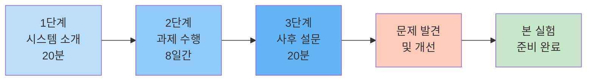

# V. 베타테스트 및 시스템 안정화

본 장에서는 본격적인 교육 현장 실험(VII-VIII장) 이전에 수행한 베타테스트 과정을 기술한다. 베타테스트는 시스템의 기술적 안정성과 교육적 유용성을 사전 검증하고, 발견된 문제를 개선하기 위해 실시되었다.

---

## 1. 베타테스트 설계

### 가. 목적 및 필요성

MAICE 시스템은 2-4장에서 제시한 교육 이론과 기술 설계를 실제 교육 환경에서 구현한 시스템이다. 본격적인 A/B 테스트 실험 전, 다음 사항을 검증하기 위해 베타테스트를 실시하였다:

**검증 목표**:
1. **시스템 안정성**: 기술적 안정성 및 실제 환경에서의 작동 확인
2. **명료화 프로세스 효과**: 학생들이 명료화 과정을 자연스럽게 수용하는지 확인
3. **학생 사용성(UX)**: 수식 입력, 대화 인터페이스의 편의성 확인
4. **교육적 효과 초기 검증**: 메타인지 향상 등 교육적 가치 탐색

### 나. 참여자 및 절차

**[표 5-1] 베타테스트 개요**

| 항목 | 내용 |
|------|------|
| **기간** | 2025년 9월 15일 ~ 9월 25일 (10일간) |
| **참여자** | 고등학교 2학년 학생 10명 (자발적 참여, 사후 설문 응답자) |
| **학습 단원** | 수열 단원 (등차수열, 등비수열, 수열의 합) |
| **평균 세션 수** | Agent 9.7회/인, Freepass 5.4회/인 |
| **시스템 모드** | Agent 모드와 Freepass 모드 (학생이 자유롭게 선택) |
| **사용 환경** | 수업 시간 + 쉬는 시간, 개인 기기 |
| **데이터 수집** | 대화 세션 로그, 사후 설문 (리커트 5점 척도 + 개방형) |

**사후 설문 구성**:

**[표 5-2] 베타테스트 설문 문항 (총 49개)**

| 분류 | 번호 | 문항 내용 | 척도 |
|------|:----:|-----------|:----:|
| **사용 현황** | 1 | 수열 단원 사전 이해도를 평가해주세요. | 5점 척도 |
| | 2 | 이번 활동에서 에이전트 질문을 실제로 몇 회 사용했나요? | 숫자 입력 |
| | 3 | 이번 활동에서 프리패스 모드를 실제로 몇 회 사용했나요? | 숫자 입력 |
| **UI/UX** | 4 | 화면 구성(버튼·입력창·피드백)의 배치가 직관적이었다. | 5점 척도 |
| | 5 | 글꼴·대비·여백 등 가독성이 충분했다. | 5점 척도 |
| | 6 | 수학기호/식 입력이 시각적으로 명확히 보였다. | 5점 척도 |
| | 7 | 원하는 기능(수정·되돌리기·제출)을 쉽게 찾을 수 있었다. | 5점 척도 |
| | 8 | 오류 메시지나 경고가 이해하기 쉬웠다. | 5점 척도 |
| | 9 | 전반적으로 사용하기 쉬웠다. | 5점 척도 |
| | 10 | 기능이 너무 많아 헷갈렸다. (역) | 5점 척도 |
| | 11 | 수학식을 입력·편집하는 과정이 자연스러웠다. | 5점 척도 |
| | 12 | 수식 자동정렬/표현이 입력 의도와 일치했다. | 5점 척도 |
| | 13 | 복잡한 수열 표기도 무리 없이 입력 가능했다. | 5점 척도 |
| | 14 | 수식 입력에 시간이 과도하게 소요되었다. (역) | 5점 척도 |
| **모드 평가** | 15 | 에이전트의 질문은 내 생각을 확장하게 만들었다. | 5점 척도 |
| | 16 | 에이전트의 피드백은 구체적이었다. | 5점 척도 |
| | 17 | 에이전트의 질문 흐름이 논리적이었다. | 5점 척도 |
| | 18 | 프리패스 모드는 내가 주도적으로 시도·탐색하게 했다. | 5점 척도 |
| | 19 | 프리패스 모드에서 최소한의 힌트가 도움이 되었다. | 5점 척도 |
| | 20 | 두 모드 간 전환이 목적에 맞게 자연스러웠다. | 5점 척도 |
| | 21 | 대화 템포(반응속도·타이밍)가 학습에 적절했다. | 5점 척도 |
| **메타인지** | 22 | 모호했던 질문을 더 구체적으로 바꾸는 방법을 배웠다. | 5점 척도 |
| | 23 | 내가 무엇을 모르는지 스스로 규정할 수 있게 되었다. | 5점 척도 |
| | 24 | 조건·정의·목표를 분리해 문제를 재정의하는 연습이 되었다. | 5점 척도 |
| | 25 | 질문/답변을 여러 번 다듬으며 사고가 정교화되었다. | 5점 척도 |
| | 26 | 혼란스러움이 이해로 전환되는 순간을 경험했다. | 5점 척도 |
| | 27 | 명료화 과정이 최종 정답보다 더 큰 배움을 줬다. | 5점 척도 |
| **인지부하** | 28 | 화면/인터페이스 때문에 불필요하게 정신적 노력이 들었다. (역) | 5점 척도 |
| | 29 | 수열 과제 자체가 본질적으로 어려웠다. | 5점 척도 |
| | 30 | 안내·예시가 과제 이해를 돕는 데 충분했다. | 5점 척도 |
| | 31 | 여러 정보를 동시에 처리하느라 과부하를 느꼈다. (역) | 5점 척도 |
| | 32 | 필요한 정보가 한곳에 정리되어 있어 부담이 줄었다. | 5점 척도 |
| **자기조절학습** | 33 | 이해한 것과 모르는 것을 구분할 수 있었다. | 5점 척도 |
| | 34 | 다음에 무엇을 시도할지 계획을 세울 수 있었다. | 5점 척도 |
| | 35 | 스스로 오류를 찾아 수정했다. | 5점 척도 |
| | 36 | 목표 달성 여부를 스스로 판단했다. | 5점 척도 |
| | 37 | 내가 선택/결정하고 있다는 느낌이 있었다. | 5점 척도 |
| | 38 | 시도할수록 해낼 수 있겠다는 감각이 들었다. | 5점 척도 |
| **학습 몰입/동기** | 39 | 활동 중 시간가는 줄 몰랐다. | 5점 척도 |
| | 40 | 계속 써보고 싶다는 생각이 들었다. | 5점 척도 |
| | 41 | 이 도구는 수열 학습에 유용했다. | 5점 척도 |
| | 42 | 배우지 않고도 쉽게 사용할 수 있다. | 5점 척도 |
| | 43 | 수업/과제에서 다시 사용할 의향이 있다. | 5점 척도 |
| | 44 | 친구에게 추천하고 싶다. | 5점 척도 |
| **개방형 질문** | 45 | 명료화 과정에서 '깨달음의 순간'이 있었다면 구체적으로 적어주세요. | 자유 서술 |
| | 46 | 수식 입력/표현과 관련해 개선이 필요하다고 느낀 점은? | 자유 서술 |
| | 47 | 에이전트와 프리패스는 각각 언제 도움이 되었나요? | 자유 서술 |
| | 48 | 다음 활동에서 달리하고 싶은 전략이 있다면? | 자유 서술 |
| | 49 | 설문 문항에 대해 긍정적 변화를 위해서는 어떤 부분의 개선이 시급할까요? | 자유 서술 |

**설문 설계 특징**:
- UI/UX, 모드별 평가, 메타인지, 인지부하, 자기조절학습, 학습동기 등 **6개 이론적 영역** 포괄
- 리커트 5점 척도 (1=전혀 그렇지 않다 ~ 5=매우 그렇다)
- 역문항 포함 (10, 28, 31번)으로 응답 신뢰성 확보
- 개방형 질문으로 정성적 피드백 수집

**참여자 특성**:
- 등차수열, 등비수열, 수열의 합 단원까지 학습 완료
- 개인 노트북/태블릿 보유
- 자발적 참여 의사 (수행평가 외 추가 학습 활동)

**베타테스트 특징**:
- 학생들이 Agent 모드와 Freepass 모드를 상황에 따라 **자유롭게 선택** 사용
- 본 실험(10월)과의 차이: 본 실험에서는 무작위 배정으로 한 모드만 사용

**베타테스트 절차**:

**[그림 5-1] 베타테스트 절차**

**절차 요약**:
- **1단계**: 시스템 소개 및 사용법 안내 (20분)
- **2단계**: 개별 과제 수행 중 MAICE 활용 (8일간)
  - 학생들이 수열 단원 문제를 풀며 자유롭게 질문
  - Agent 모드: 명료화 질문 → 문제 구체화 → 맞춤 답변
- **3단계**: 사후 설문 및 피드백 수집 (20분)
  - 리커트 척도 문항 (15개)
  - 개방형 질문 (5개)

---

## 2. 학생 피드백 및 시스템 개선

베타테스트 사후 설문(리커트 척도 + 개방형 질문)을 통해 학생들이 제기한 문제점과 개선 요청사항을 수집하였다.

### 가. 수식 입력의 어려움

**학생 피드백** (개방형 응답):

> "수식 입력이 너무 어려워요. 분수 하나 쓰는데 3분 걸렸어요."

> "문제 하나를 작성할 때도 너무 오래 걸려서, 기능은 좋지만 사용성 개선이 필요합니다."

> "수학 기호(분수, 제곱, 루트 등)를 바로 입력하기 불편함"

> "패드로 이 서비스를 사용했는데 수식을 작성할 때 뒤에 수식을 또 작성하려고 수식을 누르고 작성하려는데 앞에 수식으로 자꾸 넘어가서 뒤에 수식을 여러번 쓸 수 없었다."

> "수식 입력할때 ide처럼 자동완성 기능이 있다면 수식 입력하는데에서 시간을 줄일 수 있을 것 같다."

> "LaTeX에 익숙하지 않은 사람들에게는 수식을 작성하기 어려울 것 같습니다. 따라서 수식 사용 방법이나 간단한 가이드를 함께 제공하면 수식을 입력할 때 훨씬 더 편리할 것 같습니다."

**개선 요청사항**:
- 자동완성 기능
- 수식 템플릿 제공
- LaTeX 가이드
- 필기 인식 또는 이미지 업로드

**[표 5-3] 수식 입력 UI/UX 개선 내역**

| 항목 | 베타테스트 | 본 실험 | 개선 내용 |
|------|----------|--------|----------|
| **LaTeX 자동완성** | ❌ | ✅ | `\frac`, `\sum` 등 자주 쓰는 명령어 제안 |
| **수식 템플릿** | ❌ | ✅ | 15개 자주 쓰는 수식 클릭만으로 삽입 |
| **실시간 미리보기** | ❌ | ✅ | 입력과 동시 렌더링, 오류 즉시 확인 |
| **이미지 OCR** | ❌ | ✅ | 종이 수식 사진 → LaTeX 자동 변환 |
| **LaTeX 가이드** | ❌ | ✅ | 초기 화면에 사용법 안내 |

---

### 나. 시스템 안정성 및 오류

**학생 피드백**:

> "기능은 좋은데, 가끔 멈추거나 느려서 답답했어요. 안정적이면 더 좋을 것 같아요."

> "처음에는 내 질문을 잘 이해했는데, 계속 대화하다 보니 처음 질문을 까먹은 것처럼 동문서답했어요."

> "이전에 물어본 내용을 기억하지 못해요. 같은 얘기를 다시 해야 하니 불편했어요."

**개선 요청사항** (설문):
- "오류, 서버 안정화"
- "질문수 줄이기" (대화 효율성)

**적용한 개선사항**:
- FastAPI Workers 증설 (1개 → 3개)
- 컨텍스트 유지 로직 강화
- Redis Connection Pool 확대 (10개 → 50개)
- 자동 재시도 메커니즘 추가

---

### 다. 사용자 경험 개선 요청

**학생 피드백** (기타 개선 제안):

> "처음 시작할 때 어떻게 사용하는지 설명이 있으면 좋겠어요."

> "수식 입력 버튼을 처음에 못 찾았어요. 가이드가 있었으면..."

> "에이전트 모드와 프리패스 모드의 용도에 대해 서비스를 가입했을 때, 설명해주면 좋겠다."

> "최종 피드백을 받을 수 있는 문항을 넣으면 좋을것 같아요. 사진이나 영상으로 문제가 있거나 개선해야 할 부분도 받으면 도움이 될 것 같습니다."

**적용한 개선사항**:
- 첫 로그인 시 온보딩 튜토리얼 추가
- 수식 입력 가이드 툴팁 표시
- 예시 질문 제공
- 모드별 설명 강화

---

### 라. 학생 사용 패턴 분석

베타테스트에서 학생들은 Agent 모드와 Freepass 모드를 상황에 따라 자유롭게 선택하여 사용하였다.

**모드별 사용 현황 (설문 응답 기반)**:
- Agent 모드: 평균 9.7회/인 (최소 5회, 최대 13회)
- Freepass 모드: 평균 5.4회/인 (최소 2회, 최대 10회)

**학생들이 발견한 모드별 활용 전략** (개방형 응답):

> "에이전트는 기초개념으로 문제를 풀어가는 과정을 알려줘서 기초를 다질 때 좋았고, 프리패스는 공식같은 걸 잘 알려줘서 문제 푸는 요령을 배울 때 좋았습니다."

> "에이전트는 내가 물어본 수식의 상세한 피드백을 주며, 그 수식을 설명하는 반면, 프리패스는 물어본 수식을 내가 알아가며 이해할수있는 쪽으로 치우쳐져있는것 같았음."

> "프리패스는 내가 아예 감도 잡히지 않는 문제를 에이전트한테 전부 다 물어보긴 그렇지만 어느정도 문제의 풀이 방향성을 잡고 싶을 때 좀 더 유용했던 것 같다."

**교육적 시사점**:
- 학생들이 자발적으로 상황에 맞는 모드를 선택
- 깊이 있는 이해에는 Agent, 빠른 확인에는 Freepass 활용
- 이는 본 실험의 A/B 테스트 설계에 중요한 근거 제공

---

## 3. 교육적 효과 초기 검증

### 가. 메타인지 향상 징후

베타테스트 사후 설문에서 **메타인지 관련 4개 문항**의 평균 점수가 높게 나타났다:

**[표 5-4] 메타인지 발달 평가 (베타테스트, n=10)**

| 문항 | 평균 점수 (5점 만점) |
|------|:------------------:|
| "모호했던 질문을 더 구체적으로 바꾸는 방법을 배웠다" | **3.6점** |
| "내가 무엇을 모르는지 스스로 규정할 수 있게 되었다" | **4.2점** |
| "조건·정의·목표를 분리해 문제를 재정의하는 연습이 되었다" | **3.9점** |
| "질문/답변을 여러 번 다듬으며 사고가 정교화되었다" | **4.1점** |

**학생 응답** (설문 원문):

> "질문의 질이 처음에는 뭉툭하고, 질문의 틀이 넓었어서 다른 ai들은 질문의 의도를 못잡고 이상한 답을 하는 경우가 있었는데, maice를 사용하며 이질문에는 이렇게 명확하게 표현하면 더 좋고 상세한 답변이 오는구나를 깨닳았음."

이러한 응답들은 학생들이 질문 명료화의 중요성을 체험적으로 학습했음을 보여준다.

**교육적 의미**:
- Dewey의 "문제 정의" 단계를 실제로 경험
- 자신의 어려움을 언어화하는 메타인지 능력 향상
- 질문 명료화가 학습 전략으로 인식됨

---

### 나. 개념 이해의 깊이

**"깨달음의 순간" 개방형 응답 분석** (10명 응답):

베타테스트 사후 설문의 개방형 질문 "명료화 과정에서 '깨달음의 순간'이 있었다면 구체적으로 적어주세요"에 대한 학생들의 응답을 분석하였다.

**학생 응답 (원문 인용)**:

> "등비 수열의 합 공식을 구하는 과정을 보니 계차 수열과 비슷하다는 것을 깨닫게 되었다."

> "수업시간에 가우스 얘기가 나오면서 이걸 뒤집어서 더하면 (n+1)이 n개가 있고 여기에 나누기 2를 해줘야 한다는 내용이 있었습니다. 그런데 사실 잘 이해하지 못했었습니다. 그런데 이게 왜 이렇게 되는지 AI가 설명하는 것을 한 번 더 들으니 이제 완전히 이해를 할 수 있었습니다."

> "a^n - a^(n-1) = (a-1)a^(n-1), n^2 - (n-1)^2 = 2n - 1이 된다는 것을 알고 있기 때문에 수열의 합과 일반항의 관계에 대한 문제에서 적용시킬 수 있겠구나 라는 것을 깨닫게 되었습니다."

> "시그마 식의 사용법을 수열에 적용하는 방법을 최소한의 방법으로 밖에 알지 못했지만 다양한 예시를 들어줘서 색다른 방식이 있다는 것도 깨달았다."

> "부분분수로 전개하면 깔끔하게 소거된다는 것을 알았다."

> "어려운 문제가 나와서 풀 때 틀리면 답지를 봐도 이해가 안되는 경우가 있다. 다음 식으로 넘어갈 때 그 과정이 어떻게 된건지 이해가 안됐었는데 챗지피티는 수식 작성을 못해서 항상 이해하는데 오래걸렸었는데 여기는 수식을 작성할 수 있어서 안되는 부분을 정확히 작성했더니 과정을 알려줘서 빠르게 알 수 있었다."

> "질문의 질이 처음에는 뭉툭하고, 질문의 틀이 넓었어서 다른 ai들은 질문의 의도를 못잡고 이상한 답을 하는 경우가 있었는데, maice를 사용하며 이질문에는 이렇게 명확하게 표현하면 더 좋고 상세한 답변이 오는구나를 깨닳았음."

**교육적 의미**:
- 단순 공식 암기 → 개념 간 연결 이해
- 답지로 이해 못했던 과정을 AI와의 대화로 이해
- 질문 명료화의 중요성 자각
- 자기주도적 발견 학습 경험

---

### 다. 학습 동기 및 지속성

**[표 5-5] 학습 몰입 및 재사용 의향 (베타테스트, n=10)**

| 문항 | 평균 점수 |
|------|:--------:|
| "활동 중 시간 가는 줄 몰랐다" | 3.3점 |
| "계속 써보고 싶다는 생각이 들었다" | **4.1점** |
| "이 도구는 수열 학습에 유용했다" | **3.8점** |
| "수업/과제에서 다시 사용할 의향이 있다" | **4.5점** |
| "친구에게 추천하고 싶다" | 4.2점 |

**긍정적 신호**:
- 10명 중 **9명**이 "다시 사용하겠다"고 응답 (90%)
- 자발적 재방문: Agent 평균 9.7회, Freepass 평균 5.4회
- 학습 지속 의지 확인

**학생 응답** (설문):
- 10명 중 9명이 "수업/과제에서 다시 사용할 의향이 있다"에 4-5점 응답
- "계속 써보고 싶다는 생각이 들었다" 평균 4.1점
- 학습 도구로서의 가치를 긍정적으로 인식

---

## 4. 베타테스트 발견사항 및 본 실험 설계 반영

베타테스트를 통해 다음과 같은 발견사항을 도출하고, 이를 본 실험 설계에 반영하였다.

### 가. 시스템 안정성의 중요성

베타테스트 과정에서 일부 학생들이 시스템 안정성 관련 피드백을 제공하였다:

> "기능은 좋은데, 가끔 멈추거나 느려서 답답했어요. 안정적이면 더 좋을 것 같아요."

> "오류, 서버 안정화."

이러한 피드백을 바탕으로 본 실험 전 다음과 같은 기술적 개선을 수행하였다:

- FastAPI Workers 증설 (단일 인스턴스 → 3개 워커)
- 컨텍스트 유지 메커니즘 강화
- Redis Connection Pool 확대
- 자동 재시도 로직 추가

---

### 나. UI/UX 개선의 필요성

수식 입력 관련하여 다수의 학생들이 사용성 개선을 요청하였다:

> "문제 하나를 작성할 때도 너무 오래 걸려서, 기능은 좋지만 사용성 개선이 필요합니다."

> "수학 기호(분수, 제곱, 루트 등)를 바로 입력 가능하게 하는 것"

> "수식 입력할때 ide처럼 자동완성 기능이 있다면 수식 입력하는데에서 시간을 줄일 수 있을 것 같다."

본 실험 전 다음과 같은 UI/UX 개선을 적용하였다:

- LaTeX 자동완성 기능 추가
- 수식 템플릿 라이브러리 (15개 자주 쓰는 수식)
- 이미지 OCR 수식 인식 구현 (Gemini Vision API)
- 실시간 수식 미리보기
- LaTeX 사용 가이드 제공

---

### 다. 명료화 프로세스의 교육적 가능성

베타테스트 설문 결과, 메타인지 관련 문항에서 비교적 높은 점수가 나타났다:

- "내가 무엇을 모르는지 스스로 규정할 수 있게 되었다": 4.2/5점
- "질문/답변을 여러 번 다듬으며 사고가 정교화되었다": 4.1/5점
- "조건·정의·목표를 분리해 문제를 재정의하는 연습이 되었다": 3.9/5점

이러한 결과는 명료화 프로세스가 학생들의 메타인지 발달에 긍정적 영향을 미칠 가능성을 시사한다. 다만, 베타테스트는 소규모 예비 연구로서, 명료화 프로세스의 효과를 엄밀하게 검증하기 위해서는 통제된 실험 설계가 필요하다.

**본 실험 설계 방향**:

이에 따라 본 실험에서는 다음과 같은 연구 설계를 채택하였다:

1. **무작위 대조 시험(RCT)**: Agent 모드(명료화 포함) vs Freepass 모드(즉시 답변)를 무작위 배정하여 명료화 프로세스의 효과를 직접 비교

2. **객관적 측정 도구**: QAC 체크리스트를 개발하여 질문-답변 품질을 정량화

3. **다면적 평가**: 학생 자기보고(설문) + 교사 루브릭 평가 + 학업 성취도(과제 점수)를 종합하여 교육적 효과 측정

---

## 5. 소결

본 장에서는 2025년 9월 15일부터 25일까지 10일간 진행된 베타테스트 결과를 기술하였다. 고등학교 2학년 학생 10명을 대상으로 수열 단원 학습 과정에서 MAICE 시스템을 사용하게 하고, 사후 설문(리커트 척도 44문항 + 개방형 5문항)을 통해 피드백을 수집하였다.

**주요 발견사항**:

1. **사용 패턴**: 학생들은 Agent 모드(평균 9.7회)와 Freepass 모드(평균 5.4회)를 상황에 따라 자유롭게 선택하여 사용하였으며, 깊이 있는 이해에는 Agent, 빠른 확인에는 Freepass를 활용하는 경향을 보였다.

2. **메타인지 관련 긍정적 응답**: "내가 무엇을 모르는지 스스로 규정할 수 있게 되었다"(4.2점), "질문/답변을 여러 번 다듬으며 사고가 정교화되었다"(4.1점) 등 메타인지 관련 문항에서 비교적 높은 점수가 나타났다.

3. **사용성 개선 요구**: 수식 입력의 어려움, 시스템 안정성, 사용 안내 부족 등에 대한 구체적 개선 요청이 다수 제기되었다.

**본 실험 설계에의 반영**:

베타테스트 결과는 다음과 같이 본 실험 설계에 반영되었다:

- **시스템 개선**: 수식 입력 UI/UX 개선(OCR, 자동완성, 템플릿), 서버 안정성 강화, 온보딩 튜토리얼 추가

- **연구 설계**: 베타테스트에서 관찰된 명료화 프로세스의 긍정적 가능성을 엄밀하게 검증하기 위해, 본 실험에서는 Agent 모드와 Freepass 모드를 무작위 배정하는 A/B 테스트 설계를 채택하였다.

- **측정 도구**: 학생 설문 외에도 교사 루브릭 평가, 학업 성취도 측정 등 다면적 평가 체계를 구축하였다.

다음 VI장에서는 본 실험의 연구 방법론과 측정 도구를 상세히 기술한다.

---

