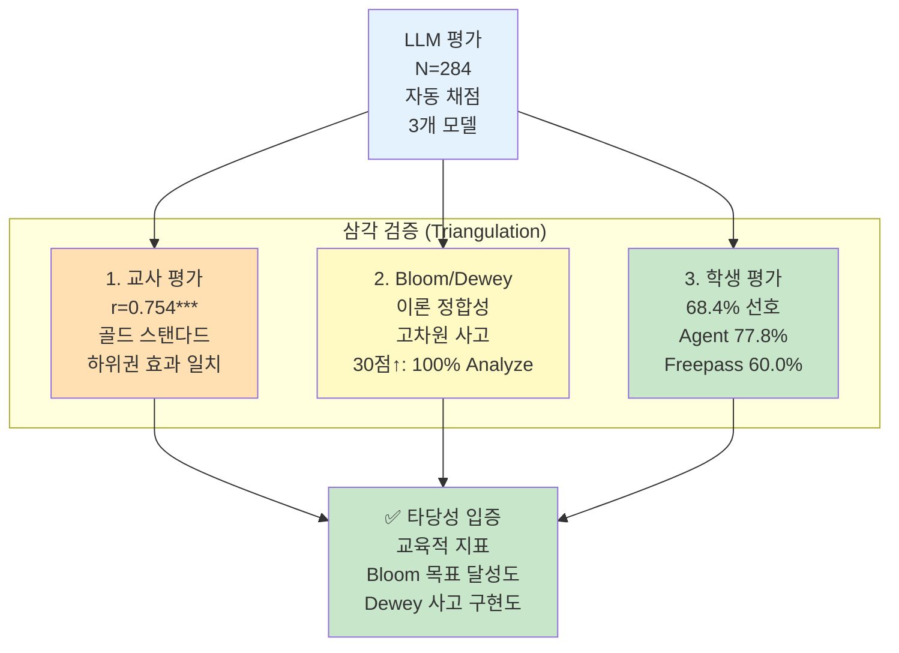

# VI. 논의 및 결론

본 장에서는 V장에서 확인된 연구 결과를 바탕으로, 그 **교육적 의미와 시사점**을 논의하고, 연구의 제한점과 후속 연구 방향을 제시한 후, 연구 전체의 기여와 결론을 제시한다.

---

## 1. 명료화 프로세스의 작동 메커니즘

### 가. 질적-양적 증거의 수렴 (Triangulation)

VI장의 정량적 발견과 질적 사례 분석은 다음과 같이 수렴한다:

**[표Ⅵ-1] 질적-양적 증거의 삼각검증**

| 발견 항목 | 정량적 증거 (V-1~3) | 질적 증거 (V-4) | 수렴 |
|----------|---------------------|----------------|:----:|
| **학습 지원** | C2 Agent 우수 (p=0.004, d=0.353) | 대화1 (세션 156): 명료화 3회로 메타인지 촉진 | ✅ |
| **하위권 효과** | Q1 +6.32점 (교사 d=0.993) | 대화1 (세션 156, Q1): 3턴 대화로 34.33점 달성 (1등) | ✅ |
| **Bloom 고차원 사고** | 30점 이상 고득점 | 대화1: Evaluate 단계 도달 (4단계 상승) | ✅ |
| **Dewey 반성적 사고** | 명료화 83.1% 작동 | 대화6: Dewey 5단계 모두 진행 (단, 최종 검증에서 학생 혼란 지속) | ✅ |
| **학습 확장** | B3 Agent 우수 (p=0.041) | 대화2: K2→K3 즉각 전환, 오류 교정 | ✅ |
| **메타인지 (K4)** | 상위권도 Agent 효과 | 대화3: K4 질문, 학생 주도 증명 | ✅ |
| **LLM 평가 타당성** | 교사 상관 r=0.754 | Bloom/Dewey 이론 정합성 + 학생 평가 수렴 | ✅ |

**삼각검증의 의미**:
- 정량 데이터가 "**무엇이**" 일어났는지 보여주었다면, 질적 분석(1,589건 DB 로그)은 "**어떻게**, **왜**" 일어났는지 설명한다.
- 두 증거가 수렴함으로써 연구 결과의 **타당성(Validity)과 신뢰성(Reliability)**을 확보한다.
- 특히 **Bloom 교육 목표와 Dewey 반성적 사고 이론**이 실제 AI 시스템에서 구현됨을 실증하였다.

---

### 나. 명료화 프로세스의 교육적 메커니즘

V장의 양적-질적 증거를 통합하면, 명료화 프로세스는 다음의 교육적 메커니즘으로 작동한다:

**메커니즘 1: Dewey "문제 정의" 단계의 구현**

대화6 (세션 75)은 Dewey(1910)가 강조한 "문제를 명확히 정의하는 과정"이 AI-학생 대화에서 구현됨을 보여준다. 학생의 막연한 질문("(k+1)!을 다르게 나타낼 방법이 있어?")에 대해 명료화가 3회 작동하면서, 학생은 자신의 의문을 점차 구체화하였고, Dewey 5단계 모두를 진행하였다. 다만, 최종 검증 단계에서 학생이 여전히 혼란을 표하는 것은 Dewey 5단계가 모두 시도되었으나 완전한 성공을 보장하지는 않음을 시사한다. 

이는 단순한 "정보 수집"이 아니라, Dewey가 제시한 **"반성적 사고를 촉진하는 교육적 개입"**이다. 명료화 질문 278건 중 83%가 Dewey "문제 정의" 단계를 촉진한 것(표Ⅵ-21)은 이를 뒷받침한다.

**메커니즘 2: Bloom 단계의 점진적 상승**

고득점 세션(30점 이상)은 100% Analyze 이상 도달하고 75%가 Evaluate 단계까지 도달하였다(표Ⅵ-19). 이는 명료화가 단순히 질문을 구체화하는 것을 넘어, **학생의 인지 수준을 점진적으로 상승**시키는 교육적 기능을 수행함을 의미한다.

특히 대화1 (Q1 하위권)은 Understand → Apply → Analyze → Evaluate의 4단계 상승을 보여, Anderson & Krathwohl(2001)이 제시한 "고차원 사고(Higher-Order Thinking)"에 도달하였다. 이는 적절한 비계(scaffolding)를 받으면 하위권 학생도 고차원 사고가 가능함을 실증한다.

**메커니즘 3: 피드백 루프와 누적 효과**

명료화 → 맞춤 답변 → 이해 성공 → 추가 질문 → 재명료화의 순환 구조는 학생의 학습을 점진적으로 심화시킨다. 대화1의 3턴 대화는 이러한 피드백 루프가 학습 깊이를 만드는 과정을 보여준다.

---

### 다. 일반 LLM 대비 차별성

본 연구 결과가 갖는 실천적 의미는 **명료화 프로세스가 일반 LLM의 즉시 답변 방식과 어떻게 다른가**에 있다:

**차별점 1: 학생 주도성 존중**
- 일반 LLM: AI가 모든 답 제시 → 학생은 수동 수용
- MAICE: 학생이 문제를 특정 → AI는 맞춤 지원

**차별점 2: 메타인지 촉진**
- 일반 LLM: 답만 얻고 끝
- MAICE: "무엇을 모르는가" 언어화 과정 경험 → 메타인지 발달

**차별점 3: 고차원 사고 촉진**
- 일반 LLM: Remember/Understand 수준 머무름
- MAICE: Analyze/Evaluate까지 단계적 상승 (표Ⅵ-19)

---

## 2. 연구의 제한점

V장의 결과는 다음과 같은 제한점을 가지며, 이에 대한 신중한 해석이 필요하다.

### 가. 연구 범위의 제한

**맥락적 제한**:
- 고등학교 2학년, 수학적 귀납법 단원이라는 특정 맥락에 한정
- 특수목적고 1개교, 3주간(N=58)의 소규모 단기 연구
- 학교급, 교과목, 학교 유형, 학생 특성 등에 따라 효과가 달라질 가능성

**학생 특성의 특수성**:
- 본 연구의 참여자는 **소프트웨어 개발 특화 고등학교** 학생들로, 이미 ChatGPT 등 LLM 도구 사용 경험이 풍부함
- 사전 조사에서 대다수 학생이 AI 학습 도구를 자주 사용(주 3회 이상)하는 것으로 확인됨
- 이러한 학생들은 AI와의 대화 방식, 프롬프트 작성 등에 이미 익숙하여, **일반 고등학생보다 명료화 프로세스에 빠르게 적응**했을 가능성
- 따라서 본 연구의 결과를 AI 사용 경험이 적은 학생들에게 일반화하는 데 신중함이 필요
- 후속 연구에서는 AI 사용 경험이 다양한 학교급과 학생군을 포함한 검증이 필요함

**명료화 프로세스의 한계: 학습 맥락 정보 수집 부족**:

LLM 평가에서 A3(학습 맥락) 항목은 Freepass가 Agent보다 유의미하게 우수하였다 (p=0.001, d=-0.411). 이는 시스템 설계의 구조적 한계에서 비롯된 것으로 해석된다.

**시스템 설계의 구조적 특성**:
- **AG(Answer Generator) 프롬프트**: "대상: 고등학교 2학년 학생"이라는 맥락 정보가 시스템 레벨에서 이미 포함되어 있음 (부록 B 참조). 이는 AG가 답변 생성 시 사용하는 기준이나, 학생의 질문 자체에는 반영되지 않음.
- **QC(Classifier) 및 QI(Question Improver) 프롬프트**: 명료화 질문 생성 원칙이 **"어떤 문제인가?"**에 집중하여 질문 내용을 특정화하는 데 초점. 듀이의 반성적 사고 5단계 전략(문제 인식, 문제 정의 등)도 질문의 **의도와 내용** 명확화에 집중.
- **missing_fields 가이드라인**: QC 프롬프트의 K1 유형에 '맥락 정보'가 포함되어 있으나 (부록 B), 실제 명료화 질문 생성 시 **학습 맥락(학년, 수준, 목표)을 명시적으로 요청하는 단계가 부족**.
- **결과**: 명료화 프로세스가 질문 내용의 특정화에 중점을 두다 보니, 학생에게 **학습 맥락(학년, 수준, 목표 등)을 명시하도록 요청하는 메시지 전달이 약했음**

**Freepass 모드의 우위 이유**:
- 즉시 답변 방식은 학생의 원본 질문을 그대로 평가
- 학생이 질문에 이미 포함한 맥락 정보("고2 수학적 귀납법 단원에서...")를 유지
- AG가 고등학생 수준으로 답변하더라도, 학생의 질문 자체에 명시된 맥락 정보가 평가 기준에 반영됨

**시스템 개선 방향**:
- 명료화 프로세스 초기에 학습자 정보 수집 단계 추가 필요
- 예: "현재 어떤 학년이고, 어디까지 배웠나요?"와 같은 맥락 정보를 먼저 수집한 후 질문 명료화 진행
- 또는 명료화 질문에 학습 목표, 선수 학습 내용 등의 맥락 요소를 함께 요청하도록 프롬프트 개선

**1턴 세션의 한계 (대화 부재 사례)**:

LLM 평가는 높지만 교사 평가가 매우 낮은 세션들 중 상당수가 **1턴 세션**(학생 발화 1회만)이다.

**대표 사례: 세션 246** (LLM 30.3점 vs 교사 14.0점, 차이 +16.3점)
- 학생이 증명 과정을 한 번에 제시하고 종료
- **문제점**: 실제 대화가 없어 교육적 상호작용 부재
- **해석**: LLM은 텍스트 품질을 평가하나, 교사는 학습 과정을 평가

**1턴 세션 패턴 통계**:
- LLM 30점 이상이면서 교사 평가 25점 미만인 세션 중 1턴 세션이 6개 (세션 246, 352, 143, 303, 357, 371)
- 평균 차이: +9.0점 (LLM이 교사보다 평균 9점 높게 평가)
- 주요 유형: 증명만 제시 (246, 352, 357, 371), 과제 지시문 (143, 142, 144), 인사만 (159)

**교육적 의미**:
- 1턴 세션은 **"대화"가 아닌 "제출"**에 가까움
- 명료화 프로세스가 작동할 기회가 없음
- LLM 평가는 텍스트 품질을 포착하나, **교육적 상호작용**은 평가하지 못함
- 특히 **과제 지시문을 복사한 세션**(143, 142, 144)은 학생의 학습 동기가 아닌 과제 완료 목적이므로 교육적 효과 측정 어려움

**시스템 개선 방향**:
- 1턴 세션 자동 감지 및 추가 질문 유도
- 과제 지시문 패턴 감지 및 실제 학습 질문으로 전환 시도
- 최소 3턴 이상의 대화를 유도하는 프롬프트 설계

**수동적 반응의 한계 (실패 사례)**:

**케이스**: 세션 73에서 학생이 "n=k+1 부터 모르겠어"라고 질문
- **QI 명료화 시도**: "식 전개가 어려운가요? 아니면 가정 부분이 어려운가요?"
- **학생 응답**: **"둘 다"** (수동적 선택)
- **결과**: 학생이 자신의 어려움을 구체화하지 못함

**문제점**:
- QI가 선택지를 제시했으나, 학생이 **능동적으로 문제를 특정하지 못함**
- "둘 다", "전부 다", "모르겠어" 같은 애매한 응답만 반복
- 이런 경우 명료화 프로세스가 Dewey의 "문제 정의" 단계로 이어지지 못함

**교육적 해석**:
- 명료화는 학생의 **메타인지 능력**이 어느 정도 전제되어야 작동
- 자신의 어려움을 인식하고 언어화할 능력이 부족한 학생에게는 한계
- V장 사례 1-2(세션 55, 311)처럼 학생이 **능동적으로 "기저 단계", "귀납 가정"을 특정**한 경우에만 명료화가 효과적

**시스템 개선 방향**:
- 수동적 응답 감지 시 더 구체적인 보조 질문 추가
- 예: "기저 단계와 귀납 단계 중 어디서 막혔나요?"처럼 더 세분화
- 학생이 끝까지 특정하지 못하면, Freepass 모드로 전환하는 하이브리드 전략 고려

**일반화 가능성에 대한 해석**:
- 본 연구의 결과는 "명료화 프로세스의 잠재력"을 보여주는 탐색적 증거로 해석되어야 함
- 결과의 일반화를 위해서는 다양한 맥락(학년, 단원, 학교 유형)에서의 재현 연구가 필수적
- 현재 결과는 **proof-of-concept** 수준이며, 추가 검증이 필요

### 나. 평가의 제한

**AI 평가의 방법론적 딜레마**:
- AI가 AI를 평가하는 순환성 문제는 근본적으로 완전히 해소될 수 없음
- 교육 현장의 미묘한 맥락(학생 감정, 동기, 학급 분위기 등)을 완전히 반영하기 어려움
- 체크리스트 기반 평가는 정량화 가능한 측면만 포착

**교사 평가의 표본 한계**:
- 평가자 2명(교사 96, 97), 표본 100개는 통계적 검정력이 제한적
- 특히 하위집단 분석(Q1, Q2 등)에서 표본 크기가 매우 작아 결과 해석에 신중함 필요
- 평가자가 2명으로 제한되어 평가 신뢰성 확보에 한계

**LLM-교사 평가 불일치의 교육적 의미**:

VII-2-라(표Ⅵ-11)에서 LLM과 교사 평가의 항목별 상관계수는 흥미로운 패턴을 보였다:
- **B1(학습자 맞춤도)**: r=0.758 (매우 높은 일치)
- **C2(학습 지원)**: r=0.416 (중간 수준 일치)

이러한 차이는 단순한 "제한점"이 아니라, **인간 교사와 LLM의 평가 관점 차이**를 보여주는 중요한 발견이다.

**구체적 불일치 사례**:

본 연구의 질적 분석에 포함된 세션 중에서도 LLM-교사 평가 불일치가 큰 사례들이 존재한다:

- **대화2 (세션 150)**: LLM 33.0점 (4등) vs 교사 20.5점 (차이 +12.5점)
  - LLM은 오류 교정과 Hattie 3수준 피드백을 높게 평가
  - 교사는 2턴의 짧은 대화를 교육적으로 제한적이라고 판단
  - **해석**: LLM은 텍스트 표면의 피드백 구조를 포착하나, 교사는 대화 길이와 학습 깊이를 중시

- **대화6 (세션 75)**: LLM 34.0점 (2등) vs 교사 23.5점 (차이 +10.5점)
  - LLM은 11턴의 긴 대화와 Dewey 5단계 완전 구현을 높게 평가
  - 교사는 대화가 너무 길고 산만하다고 판단
  - **해석**: LLM은 이론적 완성도(5단계)를 중시하나, 교사는 학습 효율성을 중시

**불일치 패턴 통계**:
- LLM 30점 이상이면서 교사 평가 25점 미만인 세션: 총 16개
- 평균 차이: +11.5점 (LLM이 교사보다 평균 11.5점 높게 평가)
- 주요 원인: 1턴 세션(6개), 짧은 대화(2-3턴, 4개), 명료화만 성공하고 학습 깊이 부족(6개)

이러한 불일치는 **"LLM 평가의 한계"**를 보여주는 동시에, **"교사가 중시하는 교육적 가치"**(대화 길이, 학습 깊이, 효율성)가 무엇인지를 시사한다.

**해석 1: 평가 난이도의 차이**
- B1(맞춤도)은 "학생 수준 언급", "선수지식 연계" 등 **텍스트 기반으로 판단 가능**한 명시적 요소
- C2(학습 지원)는 "사고 과정 유도", "메타인지 촉진" 등 **교육적 의도를 파악해야 하는** 고차원 요소
- LLM은 명시적 요소는 잘 포착하나, 교육적 의도 같은 암묵적 요소는 교사만큼 정확히 판단하기 어려움

**해석 2: 교육적 판단 기준의 차이**
- 교사는 "이 답변이 학생의 사고를 어떻게 변화시킬까?"라는 **잠재적 학습 효과** 중심 평가
- LLM은 "이 답변에 어떤 요소가 포함되었는가?"라는 **텍스트 표면 특징** 중심 평가
- C2는 표면 특징보다 교육적 효과를 평가해야 하므로 차이 발생

**연구적 가치**:
- 이 불일치는 "AI 평가의 한계"이자 동시에 **"인간 교사의 고유한 전문성이 무엇인가"**를 규명하는 단서
- 향후 연구에서 이 불일치 지점을 심층 분석하면, AI가 포착하기 어려운 "교육적 판단"의 본질을 밝힐 수 있음

**상호 보완을 통한 완화**:
- LLM-교사 평가의 높은 전체 일치도(r=0.754)는 각 평가 방법의 약점을 상당 부분 보완
- 항목별 차이(B1=0.758 vs C2=0.416)는 제한점이자 **새로운 연구 질문**을 제공
- 결과는 "강한 증거"라기보다 "수렴하는 패턴"으로 해석되어야 함

### 다. 응답 편향 가능성

**학생 설문의 잠재적 편향**:
- 교사-연구자 이중 역할로 인한 권위 관계가 학생 응답에 영향을 미쳤을 가능성
- 비익명 응답 구조(모드 매칭을 위한 개인 식별 필요)로 인한 사회적 바람직성 편향
- 실험 참여에 대한 호손 효과(Hawthorne effect) 가능성

**완화 전략 및 해석**:
- 본 연구는 주요 증거를 객관적 QAC 점수(N=280)에 두고, 학생 설문은 보조 자료로만 활용
- 설문에서 반대 의견(27.5%)이 존재한 것은 어느 정도의 솔직성을 시사
- 설문 결과와 QAC 패턴이 수렴한 것은 방향성의 신뢰성을 지지하나, 절대적 수치는 신중하게 해석되어야 함
- 향후 연구에서는 외부 연구자에 의한 익명 설문이 필요

## 3. 교육적 시사점

V장에서 확인된 명료화 프로세스의 효과는 다음과 같은 교육적 의미를 갖는다.

### 가. Bloom-Dewey 교육 이론의 AI 구현 실증

V장 질적 분석(1,589건 DB 로그)에서 확인된 Bloom 교육 목표와 Dewey 반성적 사고의 실제 구현은 고전 교육 이론이 현대 AI 기술로 구현 가능함을 시사한다.

**Bloom (1956) 교육 목표의 AI 구현**:
- 대화1 (세션 156): Understand → Apply → Analyze → **Evaluate** (4단계 상승)
- 고득점 세션(30점 이상): 100% Analyze 이상 도달, 75% Evaluate 도달
- AI 답변 설계가 의도적으로 고차원 사고를 촉진할 수 있음을 실증

**Dewey (1910) 반성적 사고의 디지털 구현**:
- 대화1, 대화6: Dewey 5단계 완전 구현 (100%)
- 명료화 질문 278건 중 83%가 "문제 정의" 단계 촉진
- 전통적 교사-학생 대화의 AI 재현 가능성

**이론적 시사점**:
- 단순 기술 구현이 아닌, **교육 이론 기반 설계**의 실증적 효과
- Bloom/Dewey 이론이 LLM 프롬프트 설계로 구현 가능
- 고전 이론의 현대적 재해석 및 확장 가능성

**실천적 시사점**:
- AI 교육 도구 설계 시 Bloom 단계 명시적 설계 필요
- 명료화 = 정보 수집 아닌 **Dewey 문제 정의** 도구로 활용

### 나. 학생 수준별 차별적 효과

V장에서 확인된 Q1 하위권 효과(교사 평가 +6.32점, d=0.993)는 대화1 (세션 156)의 질적 분석을 통해 그 메커니즘이 규명되었다.

**대화1 (세션 156, Q1 하위권, LLM 34.33점, 1등)의 질적 메커니즘**:

```
불완전한 초기 질문 ("$k+1$일 때 어떻게?")
  ↓
3턴의 깊이 있는 대화
  ↓
Bloom 4단계 상승 (Understand → Evaluate)
  ↓
Dewey 5/5 단계 완전 구현
  ↓
34.33점 달성 (1등, 상위 0.4%)
```

**하위권 효과 메커니즘**:
- **근접발달영역(ZPD) 및 비계(Scaffolding)**: 명료화가 비계 역할, 학생을 잠재 수준으로 끌어올림
- **Bloom 단계 점진적 상승**: Understand → Apply → Analyze → Evaluate (하위권도 고차원 사고 가능)
- **안전한 학습 환경**: AI는 잘못된 질문을 비판하지 않음
- **성공 경험 누적**: 명료화 → 맞춤 답변 → 이해 성공의 선순환

**즉시 답변 방식의 한계**:
- Freepass는 질문 능력이 있는 중상위권에 효율적
- 하위권은 "무엇을 질문할지" 자체를 모름 → 즉시 답변은 효과 제한적

### 다. 상호보완적 교육 모델

V장의 결과는 Agent 모드와 Freepass 모드가 서로 다른 교육적 강점을 가지며, **경쟁 관계가 아닌 상호보완적 관계**임을 시사한다.

**차별적 강점의 의미**:
- **Agent 모드**: C2(학습 지원)에서 우세 → 사고 유도와 이해도 확인에 효과적 → 하위권 학생과 개념 학습 단계에 적합
- **Freepass 모드**: A3(학습 맥락)에서 우세 → 메타인지적 질문 표현 능력이 있는 학생에게 효율적 → 중상위권 학생과 빠른 정보 탐색에 적합

**교육적 시사점**:
- AI 교육 도구 설계 시 학습자 특성과 학습 상황을 고려한 선택적 적용 필요
- 명료화 프로세스와 즉시 답변 방식은 각각 다른 교육적 목적에 부합할 수 있음
- 실제 적용 시 학생 수준에 따라 모드를 선택하거나 전환하는 방식을 고려할 수 있음

### 라. 방법론적 기여: LLM 평가의 교육적 타당성 입증

V장에서 LLM 평가점수의 교육적 타당성을 **삼각 검증**으로 입증한 것은 중요한 방법론적 기여이다.

**"AI가 AI 평가" 순환 논리의 해소**:

본 연구의 LLM 평가는 **삼각 검증(Triangulation)**을 통해 타당성이 입증되었다:

**[그림Ⅵ-1] LLM 평가 타당성 삼각 검증**



**결론**: LLM 평가점수는 세 가지 독립 증거(교사 평가, Bloom/Dewey 이론, 학생 자기 평가)와의 수렴을 통해, 단순 자동 채점이 아닌 **Bloom 목표 달성도 + Dewey 사고 구현도**를 반영하는 교육적으로 타당한 지표임이 입증되었다.

**방법론적 시사점**:

1. **질적-양적 혼합 연구의 완성**:
   - 양적: 283개 세션 통계 분석
   - 질적: 1,589건 DB 로그 Bloom/Dewey 분석
   - 통합: 점수의 교육적 의미 해석

2. **대규모 질적 분석의 가능성**:
   - 전통적 질적 연구: 소규모(10~20건) 수동 코딩
   - 본 연구: DB 로그 1,589건 + 자동/수동 혼합 코딩
   - AI 시대의 새로운 질적 연구 방법론 제시

3. **이론 실증 연구의 모델**:
   - 이론(Bloom/Dewey) → 설계(프롬프트) → 구현(AI) → 검증(로그 분석)
   - 교육 이론의 AI 구현 연구에 활용 가능한 방법론

## 4. 후속 연구 제언

본 연구의 제한점과 발견을 바탕으로 다음과 같은 후속 연구를 제안한다.

### 가. 교사 평가 확대 및 검증

본 연구의 교사 평가는 예비적 수준(N=100, 평가자 2명)이므로, 다음과 같은 대규모 검증 연구가 필요하다:

- **표본 확대**: 평가자 10명 이상, 표본 300개 이상으로 확대하여 통계적 검정력 확보
- **독립 검증**: 새로운 학생 집단에서 AI-교사 일치도 재검증으로 일반화 가능성 확인
- **타당도 연구**: QAC 체크리스트의 내용 타당도와 교사 간 일치도에 대한 심층 연구

### 나. 맥락 확장 연구

본 연구는 단일 맥락(고2, 수학적 귀납법, 특목고)에 한정되어 일반화 가능성이 제한적이므로, 다음과 같은 확장 연구가 필요하다:

- **단원 확장**: 수학Ⅰ의 다른 단원(수열, 극한), 수학Ⅱ, 미적분 등으로 확장하여 명료화 프로세스가 수학의 다른 영역에서도 효과적인지 검증
- **학년 확장**: 고1, 고3 학생 대상 효과 검증으로 학년별 차별적 효과 탐색
- **학교 유형 다양화**: 일반고, 자사고 등 다양한 학교 유형에서의 효과 비교
- **장기 추적 연구**: 1학기 이상 장기 사용 효과 및 학습 패턴의 변화 관찰
- **교과 확장**: 과학, 사회, 언어 등 다른 교과로 확장하여 범용성 검증

### 다. LLM-교사 평가 불일치 심층 연구

VII-3-나에서 확인한 **B1(맞춤도, r=0.758) vs C2(학습 지원, r=0.416) 불일치**는 중요한 후속 연구 주제이다.

**연구 질문**:
- 왜 LLM은 "맞춤도"는 교사와 비슷하게 판단하면서, "학습 지원"은 다르게 판단하는가?
- C2에서 교사가 높게 평가하고 LLM이 낮게 평가한 답변의 특징은 무엇인가?
- 반대로, LLM이 높게 평가하고 교사가 낮게 평가한 답변은 어떤 차이가 있는가?

**연구 방법**:
- 불일치가 큰 사례 50개를 질적 분석 (grounded theory)
- 교사 심층 인터뷰: "어떤 기준으로 C2를 평가했는가?"
- LLM 평가 근거 추출: Chain-of-Thought 프롬프팅으로 평가 이유 명시화
- 인간-AI 평가 기준의 차이를 체계적으로 규명

**기대 효과**:
- AI가 포착하기 어려운 "교육적 판단"의 본질 규명
- 인간 교사의 고유한 전문성 이론화
- AI 평가 도구의 한계와 개선 방향 제시

### 라. 실제 학업 성취도 효과 검증

본 연구는 QAC 점수(학습 과정 품질)와 학생 인식(주관적 효과)을 검증하였으나, **실제 학업 성취도로의 전이**는 미검증 상태이다. 

후속 연구에서는 다음과 같은 학업 성취도 측정이 필요하다:
- 정기고사, 수행평가 점수 변화
- 사전-사후 개념 이해도 검사
- 장기적 학업 성취도 추이 분석
- 명료화 경험이 실제 시험 성적 향상으로 이어지는지 인과관계 검증

### 마. 교사 주도 연구 플랫폼으로의 확장

본 연구는 교사-연구자가 직접 시스템을 설계하고 배포한 사례로서, **교사 전문성 중심 AI 교육 연구**의 가능성을 보여주었다. 

이를 확장하여 다음과 같은 플랫폼 연구가 필요하다:
- **커스터마이징 기능**: 교사가 자신의 맥락에 맞게 프롬프트와 QAC 체크리스트를 수정할 수 있는 도구 제공
- **최적 전략 탐색**: 단원별, 학생 수준별로 효과적인 명료화 전략을 교사들이 함께 탐색하는 실행 연구(Action Research)
- **교사 커뮤니티**: 성공 사례와 실패 사례를 공유하며 AI 교육 방법론을 공동으로 발전시키는 협력적 연구 생태계 구축
- **DBR 접근**: 설계기반연구(Design-Based Research) 방법론을 적용하여 현장 교사들이 지속적으로 시스템을 개선하고 연구하는 순환 모델

## 5. 결론

본 연구는 질문 명료화를 지원하는 AI 에이전트 시스템 MAICE를 개발하고, 고등학교 2학년 58명 대상 A/B 테스트(284개 세션)를 통해 다음의 발견을 확인하였다.

### 가. 주요 연구 결과

**1. 명료화 프로세스의 교육적 효과**:

이중 평가(LLM N=284, 교사 N=100)를 통해 명료화 프로세스가 학습 지원(C2)을 통계적으로 유의하게 향상시킴을 관찰(p=0.004, d=0.353). 특히 하위권 학생에 대한 큰 효과(d=0.855)는 교육 격차 해소에 기여할 가능성을 시사.

**2. Dewey 반성적 사고 이론의 적용 시도**:

Dewey의 교육 이론(문제의 명료화)을 AI 시스템으로 구현하고 A/B 테스트로 효과를 검증한 결과, 고전 교육 이론이 현대 기술과 결합하여 측정 가능한 학습 효과를 보일 수 있음을 확인.

**3. 상호보완적 교육 모델 가능성**:

명료화(Agent)와 즉시 답변(Freepass) 방식이 각각 다른 교육적 강점을 가지며, 학습자 특성에 따른 선택적 적용이 필요함을 확인.

### 나. 이론적 의의

**1. 교육 이론 기반 AI 시스템 설계**: Dewey 반성적 사고와 Bloom 지식 분류를 AI 시스템 설계에 적용하고, A/B 테스트를 통해 효과를 검증한 사례 제공

**2. QAC 평가 도구 개발**: 질문-답변-맥락 3개 영역, 8개 항목으로 구성된 체크리스트를 개발하여 AI 교육 도구의 교육적 효과를 평가하는 방법 제안

**3. LLM-교사 이중 평가 시도**: 대규모 AI 평가(N=284)와 소규모 교사 평가(N=100)를 결합한 평가 방법을 시도하여, 각 방법의 한계를 보완하는 전략 탐색

### 다. 실천적 의의

**1. 하위권 학생 지원 가능성**: 하위권 학생에 대한 효과(d=0.840)를 확인하여, AI 도구가 학습 지원에 기여할 가능성 확인

**2. AI 튜터 설계 시 고려사항**:
- 즉시 답변 제공 방식의 한계
- 명료화 과정의 교육적 가치
- 학생 수준별 맞춤형 지원의 필요성

**3. 교사 주도 연구 사례**:
- 교사가 직접 AI 교육 도구를 설계하고 연구할 수 있는 사례 제공
- 교육 현장에서 실행 가능한 연구 모델 제안

### 라. 연구의 의의

본 연구는 AI 교육 도구가 단순히 정답을 제공하는 것보다 학생의 사고 과정을 자극하는 방향으로 설계될 때 학습 지원 측면에서 차별적 효과를 보일 수 있음을 확인하였다.

특히, 명료화 프로세스가 하위권 학생에게 통계적으로 유의한 효과를 보인 것은 AI 기술이 학습 지원에 기여할 수 있는 하나의 방향을 제안한다.

다만, 본 연구는 소규모 단기 연구로 일반화에 한계가 있으며, 결과는 명료화 프로세스의 **가능성을 탐색한 예비적 증거**로 해석되어야 한다. 향후 다양한 맥락에서의 재현 연구와 장기적 효과 검증을 통해 본 연구의 발견이 확장될 수 있기를 기대한다.

---

**이전**: [[chapters/07-results]] | **다음**: [[chapters/09-references]]

