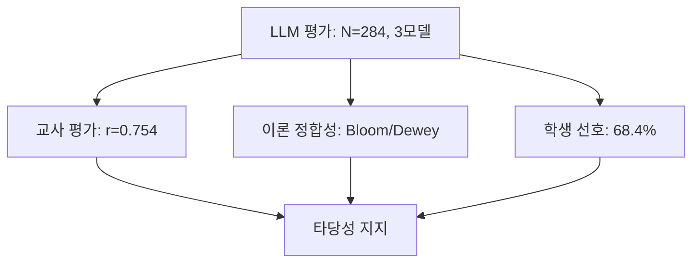

# VI. 논의 및 결론

본 장에서는 V장에서 확인된 연구 결과를 바탕으로, 그 **교육적 의미와 시사점**을 논의하고, 연구의 제한점과 후속 연구 방향을 제시한 후, 연구 전체의 기여와 결론을 제시한다.

---

## 1. 명료화 프로세스의 작동 메커니즘

### 가. 질적-양적 증거의 수렴

V장의 정량적 발견과 질적 사례 분석은 다음과 같이 수렴한다:

**[표Ⅵ-1] 질적-양적 증거의 수렴**

| 발견 항목 | 정량적 증거 (V장 1절~3절) | 질적 증거 (V장 4절) | 수렴 |
|----------|---------------------|----------------|:----:|
| **학습 지원** | C2 Agent 우수 (p=0.004, d=0.353) | 대화1 (세션 156): 명료화 3회로 메타인지 촉진 | ✅ |
| **하위권 효과** | Q1 +6.32점 (교사 d=0.992) | 대화1 (세션 156, Q1): 5턴 대화로 34.33점 달성 (상위 0.4%) | ✅ |
| **지식 차원 고단계 도달** | 30점 이상 고득점 | 대화1: 지식 차원 상승 (K2 → K3 → K4) | ✅ |
| **Dewey 반성적 사고** | 명료화 76.5% 작동 | 대화6: Dewey 5단계 모두 진행 (단, 최종 검증에서 학생 혼란 지속) | ✅ |
| **학습 확장** | B3 Agent 우수 (p=0.041) | 대화2: K2→K3 즉각 전환, 오류 교정 | ✅ |
| **메타인지 (K4)** | 상위권도 Agent 효과 | 대화3: K4 질문, 학생 주도 증명 | ✅ |
| **LLM 평가 타당성** | 교사 상관 r=0.754 | Bloom/Dewey 이론 정합성 + 학생 평가 수렴 | ✅ |

**삼각검증의 의미**:
- 정량 데이터가 "**무엇이**" 일어났는지 보여주었다면, 질적 분석(1,589건 DB 로그)은 "**어떻게**, **왜**" 일어났는지 설명한다.
- 두 증거가 수렴함으로써 연구 결과의 **타당성(Validity)과 신뢰성(Reliability)**을 확보한다.
- 특히 **Bloom 교육 목표와 Dewey 반성적 사고 이론**이 실제 AI 시스템에서 구현됨을 실증하였다.

---

### 나. 명료화 프로세스의 교육적 메커니즘

V장의 양적-질적 증거를 통합하면, 명료화 프로세스는 다음의 교육적 메커니즘으로 작동한다:

**메커니즘 1: Dewey "문제 정의" 단계의 구현**

대화6 (세션 75)은 Dewey(1910)가 강조한 "문제를 명확히 정의하는 과정"이 AI-학생 대화에서 구현됨을 보여준다. 학생의 막연한 질문("(k+1)!을 다르게 나타낼 방법이 있어?")에 대해 명료화가 3회 작동하면서, 학생은 자신의 의문을 점차 구체화하였고, Dewey 5단계 모두를 진행하였다. 다만, 최종 검증 단계에서 학생이 여전히 혼란을 표하는 것은 Dewey 5단계가 모두 시도되었으나 완전한 성공을 보장하지는 않음을 시사한다.

이는 단순한 "정보 수집"이 아니라, Dewey가 제시한 **"반성적 사고를 촉진하는 교육적 개입"**이다.

**메커니즘 2: 지식 차원의 점진적 상승**

V장 4절의 질적 분석에서는 II장 2절에서 제시한 **Bloom의 지식 차원 분류(K1-K4)**를 분석 틀로 사용하였다. 질적 분석 결과, 고득점 세션(32-34점) 6개는 모두 K4(메타인지적 지식), K3(절차적 지식), K2(개념적 지식) 수준을 포함하였다(V장 4절). 이는 명료화가 단순히 질문을 구체화하는 것을 넘어, **학생의 지식 차원을 점진적으로 상승**시키는 교육적 기능을 수행함을 의미한다.

특히 대화1 (Q1 하위권)은 K2(개념적 지식) → K3(절차적 지식) → K4(메타인지적 지식)의 3단계 상승을 보여, 지식 차원의 고단계에 도달하였다(V장 4절 나항). 이는 적절한 지원을 받으면 하위권 학생도 지식 차원 고단계(K4)에 도달할 수 있음을 실증한다.

**메커니즘 3: 피드백 루프와 누적 효과**

명료화 → 맞춤 답변 → 이해 성공 → 추가 질문 → 재명료화의 순환 구조는 학생의 학습을 점진적으로 심화시킨다. 대화1의 5턴 대화는 이러한 피드백 루프가 학습 깊이를 만드는 과정을 보여준다.

---

### 다. 일반 LLM 대비 차별성

본 연구 결과가 갖는 실천적 의미는 **명료화 프로세스가 일반 LLM의 즉시 답변 방식과 어떻게 다른가**에 있다:

**차별점 1: 학생 주도성 존중**
- 일반 LLM: AI가 모든 답 제시 → 학생은 수동 수용
- MAICE: 학생이 문제를 특정 → AI는 맞춤 지원

**차별점 2: 메타인지 촉진**
- 일반 LLM: 답만 얻고 끝
- MAICE: "무엇을 모르는가" 언어화 과정 경험 → 메타인지 발달

**차별점 3: 지식 차원 고단계 촉진**
- 일반 LLM: K1(사실적 지식)/K2(개념적 지식) 수준 머무름
- MAICE: K4(메타인지적 지식)까지 단계적 상승 (V장 4절)

---

## 2. 연구의 제한점

V장의 결과는 다음과 같은 제한점을 가지며, 이에 대한 신중한 해석이 필요하다.

### 가. 연구 맥락 및 일반화의 제한

**특정 맥락에 한정**:
- 고등학교 2학년, 수학적 귀납법 단원, 특수목적고 1개교, 3주간(N=58)의 소규모 단기 연구
- 학교급, 교과목, 학교 유형에 따라 효과가 달라질 가능성

**학생 특성의 특수성**:
- 소프트웨어 개발 특화 고등학교 학생들로 ChatGPT 등 LLM 도구 사용 경험이 풍부함
- 대다수 학생이 AI 학습 도구를 자주 사용(주 3회 이상)하여 명료화 프로세스에 빠르게 적응했을 가능성
- AI 사용 경험이 적은 일반 고등학생에게 결과를 일반화하는 데 신중함 필요

**일반화 가능성**:
- 본 연구 결과는 명료화 프로세스의 잠재력을 보여주는 **탐색적 증거**이자 **proof-of-concept** 수준
- 다양한 맥락(학년, 단원, 학교 유형, AI 경험 수준)에서의 재현 연구 필수

### 나. 명료화 시스템의 설계적 한계

**학습 맥락 정보 수집 부족**:
- V장 결과: A3(학습 맥락) 항목에서 Freepass가 Agent보다 유의미하게 우수 (p=0.001, d=-0.411)
- 교사 피드백: "학생들은 문제 해결에만 집중하여 단원, 교육과정 맥락을 드러내지 않음" (교사 96, 97)
- 시스템 설계: QC/QI 프롬프트가 "어떤 문제인가?" 내용 특정화에만 집중, 학습 맥락(학년, 수준, 목표) 명시 요청 단계 부족
- 개선 방향: 초기 맥락 수집 단계 추가, 명료화 질문에 맥락 요소 통합

**1턴 세션의 한계 (대화 부재)**:
- LLM 30점 이상 & 교사 25점 미만 세션 중 1턴 세션 6개 (평균 차이 +9.0점)
- 주요 유형: 증명만 제시, 과제 지시문 복사, 인사만
- 문제: 1턴 세션은 "대화"가 아닌 "제출", 명료화 프로세스가 작동할 기회 없음
- 개선 방향: 1턴 세션 자동 감지, 최소 3턴 이상 대화 유도 설계

**메타인지 능력 전제**:
- 실패 사례: 세션 73에서 학생이 "둘 다" 같은 수동적 응답 반복, 어려움 구체화 실패
- 명료화는 학생의 메타인지 능력(자신의 어려움 인식·언어화)이 어느 정도 전제되어야 작동
- 개선 방향: 수동적 응답 감지 시 더 구체적 보조 질문, Freepass 전환 하이브리드 전략

### 다. 평가 도구 및 방법의 한계

**QAC 루브릭의 한계**:
- 평가 어려움: 학습자 수준·맥락 정보 부재 시 A1, B1 평가 모호, "체계성" 등 기준 불명확 (교사 96, 97 피드백)
- 교사 간 해석 차이: 맥락 영역 ICC=0.408, 특히 C2(학습 지원)는 명시적 요소 vs 교육적 의도 해석에서 차이 (교사 96 vs 97)
- 이론적 기반 제한: Dewey, Bloom, Hattie 이론이 방향 제시했으나 실제 체크리스트는 "이론 참고" 수준, 실용성과 이론성의 타협점
- 종합: 교사 간 일치도 ICC=0.716 (양호) 달성했으나 평가 전제 조건 부족, 기준 모호성, 항목 중복 존재

**AI 평가의 방법론적 딜레마**:
- 순환 논리 문제: 평가 대상(Gemini 2.5 Flash)과 평가자 중 하나가 동일
- 완화 전략: 3개 독립 모델(Gemini, Claude, GPT-5) + 교사 평가와 높은 상관(r=0.754)으로 타당성 검증
- 한계: 완전한 순환 논리 해소 어려움, 교육 현장 미묘한 맥락(감정, 동기) 완전 반영 어려움

**교사 평가의 표본 한계**:
- 평가자 2명(교사 96, 97), 표본 100개로 통계적 검정력 제한적
- 하위집단 분석(Q1, Q2 등) 시 표본 크기 매우 작아 결과 해석에 신중함 필요

**LLM-교사 평가 불일치**:
- 항목별 차이: 전체 r=0.754 (높음) vs B1=0.758 (매우 높음) vs C2=0.416 (중간)
- 구체적 사례: 대화2(세션 150) LLM 33.0 vs 교사 20.5점, 대화6(세션 75) LLM 34.0 vs 교사 23.5점
- 해석: LLM은 텍스트 표면 특징 중심, 교사는 잠재적 학습 효과 중심 → 평가 기준 차이
- 연구적 가치: 이 불일치는 "AI 평가의 한계"이자 "인간 교사 고유 전문성" 규명의 단서
- 상호 보완: 높은 전체 일치도로 각 방법의 약점 보완, 결과는 "수렴하는 패턴"으로 해석

### 라. 학생 설문의 응답 편향

**잠재적 편향**:
- 교사-연구자 이중 역할로 인한 권위 관계
- 비익명 응답 구조(모드 매칭을 위한 개인 식별 필요)로 인한 사회적 바람직성 편향
- 실험 참여 자체의 호손 효과(Hawthorne effect)

**완화 전략 및 해석**:
- 객관적 QAC 점수(N=284)를 주요 증거로, 학생 설문은 보조 자료로만 활용
- 설문에서 반대 의견(27.5%) 존재는 어느 정도의 솔직성 시사
- 설문 결과와 QAC 패턴의 수렴은 방향성의 신뢰성 지지
- 절대적 수치는 신중하게 해석, 향후 외부 연구자에 의한 익명 설문 필요

## 3. 교육적 시사점

V장에서 확인된 명료화 프로세스의 효과는 다음과 같은 교육적 의미를 갖는다.

### 가. 객관적 측정과 주관적 체감의 일치

V장 3절에서 확인된 수렴 패턴을 보면, **객관적 측정**(LLM·교사 QAC)과 **주관적 체감**(학생 자기 평가)이 방향성에서 일치함을 확인할 수 있다:
- 양적 증거(QAC 점수, 설문 점수)와 질적 증거(서술형 응답)가 같은 방향을 지지
- 명료화 모드가 대화 품질뿐 아니라 **학습자가 체감하는 실제 학습 효과**도 향상
- 특히 하위권 학생에 대한 효과가 주요 증거에서 일관되게 확인
- 학생들 스스로 "사고력", "메타인지", "깊은 학습"의 가치를 인식

이는 명료화 프로세스가 단순히 통계적 지표상의 효과뿐만 아니라, 학습자에게 실제로 체감되는 교육적 가치를 제공함을 의미한다.

### 나. 이론적 시사점

V장 4절의 질적 분석(대화1-6)을 통해 확인된 바와 같이, **Bloom의 지식 차원(K1-K4)**와 **Dewey의 반성적 사고**가 실제 AI 시스템에서 구현 가능함을 실증하였다. 이는 고전 교육 이론이 현대 AI 기술로 구현될 수 있음을 보여주는 중요한 발견이다.

**교육 이론 기반 AI 설계의 실증**:
- 고득점 세션(32-34점) 6개는 모두 K2(개념적) → K3(절차적) → K4(메타인지적) 지식 차원을 포함 (V장 4절)
- 대화6에서 Dewey 5단계 모두 시도되어 반성적 사고 과정 구현 (V장 4절 다항)
- 명료화 프로세스가 단순 정보 수집이 아닌 **문제 정의 단계**를 촉진

**시사점**:
- **이론적**: Bloom/Dewey 이론이 LLM 프롬프트 설계로 구현 가능
- **실천적**: AI 교육 도구 설계 시 교육 이론을 명시적으로 반영해야 함
- **방법론적**: 고전 교육 이론이 현대 기술 평가 기준으로 활용 가능

### 다. 학생 수준별 차별적 효과

V장에서 확인된 Q1 하위권 효과(교사 평가 +6.32점, d=0.992)는 대화1 (세션 156)의 질적 분석을 통해 그 메커니즘이 규명되었다.

**[표Ⅵ-2] 대화1 (세션 156, Q1 하위권)의 학습 과정**

| 단계  | 내용              | 설명                            |
| :-: | --------------- | ----------------------------- |
|  1  | 불완전한 초기 질문      | "$k+1$일 때 어떻게?" (막연한 질문)      |
|  2  | 3턴의 깊이 있는 대화    | 명료화 → 맞춤 답변 → 추가 질문           |
|  3  | 지식 차원 3단계 상승    | K2(개념적) → K3(절차적) → K4(메타인지적) |
|  4  | Dewey 5단계 완전 구현 | 문제 인식 → 정의 → 가설 → 추론 → 검증     |
|  5  | 최고 수준 달성        | 34.33점 (284개 중 1등, 상위 0.4%)   |

주: 세션 156, Q1 하위권 학생, LLM 34.33점 (1등, 상위 0.4%)

**하위권 효과 메커니즘**:
- **맞춤 지원**: 명료화가 맞춤 지원 역할, 학생을 잠재 수준으로 끌어올림
- **지식 차원 점진적 상승**: K2(개념적) → K3(절차적) → K4(메타인지적) (하위권도 지식 차원 고단계(K4) 도달 가능)
- **안전한 학습 환경**: AI는 잘못된 질문을 비판하지 않음
- **성공 경험 누적**: 명료화 → 맞춤 답변 → 이해 성공의 선순환

**즉시 답변 방식의 한계**:
- Freepass는 질문 능력이 있는 중상위권에 효율적
- 하위권은 "무엇을 질문할지" 자체를 모름 → 즉시 답변은 효과 제한적

### 라. 상호보완적 교육 모델

V장의 결과는 Agent 모드와 Freepass 모드가 서로 다른 교육적 강점을 가지며, **경쟁 관계가 아닌 상호보완적 관계**임을 시사한다.

**차별적 강점의 의미**:
- **Agent 모드**: C2(학습 지원)에서 우세 → 사고 유도와 이해도 확인에 효과적 → 하위권 학생과 개념 학습 단계에 적합
- **Freepass 모드**: A3(학습 맥락)에서 우세 → 메타인지적 질문 표현 능력이 있는 학생에게 효율적 → 중상위권 학생과 빠른 정보 탐색에 적합

**교육적 시사점**:
- AI 교육 도구 설계 시 학습자 특성과 학습 상황을 고려한 선택적 적용 필요
- 명료화 프로세스와 즉시 답변 방식은 각각 다른 교육적 목적에 부합할 수 있음
- 실제 적용 시 학생 수준에 따라 모드를 선택하거나 전환하는 방식을 고려할 수 있음

### 마. 방법론적 기여: LLM 평가의 교육적 타당성 검증

V장에서 LLM 평가점수의 교육적 타당성을 **삼각검증**으로 검증한 것은 중요한 방법론적 기여이다.

**"AI가 AI 평가" 순환 논리의 완화**:

본 연구의 LLM 평가는 **삼각검증(Triangulation)**을 통해 타당성이 지지되었다:

**[그림Ⅵ-1] LLM 평가 타당성 삼각검증**

**결론**: LLM 평가점수는 세 가지 독립 증거(교사 평가, Bloom/Dewey 이론, 학생 자기 평가)와의 수렴을 통해, 단순 자동 채점이 아닌 **Bloom 목표 달성도 + Dewey 사고 구현도**를 반영하는 교육적 지표로서의 타당성이 지지되었다.

**방법론적 시사점**:

1. **질적-양적 혼합 연구의 완성**:
   - 양적: 284개 세션 통계 분석
   - 질적: 1,589건 DB 로그 Bloom/Dewey 분석
   - 통합: 점수의 교육적 의미 해석

2. **대규모 질적 분석의 가능성**:
   - 전통적 질적 연구: 소규모(10~20건) 수동 코딩
   - 본 연구: DB 로그 1,589건 + 자동/수동 혼합 코딩
   - AI 시대의 새로운 질적 연구 방법론 제시

3. **이론 실증 연구의 모델**:
   - 이론(Bloom/Dewey) → 설계(프롬프트) → 구현(AI) → 검증(로그 분석)
   - 교육 이론의 AI 구현 연구에 활용 가능한 방법론

## 4. 후속 연구 제언

본 연구의 제한점과 발견을 바탕으로 다음과 같은 후속 연구를 제안한다.

### 가. 교사 평가 확대 및 검증

본 연구의 교사 평가는 예비적 수준(N=100, 평가자 2명)이므로, 다음과 같은 대규모 검증 연구가 필요하다:

- **표본 확대**: 평가자 10명 이상, 표본 300개 이상으로 확대하여 통계적 검정력 확보
- **독립 검증**: 새로운 학생 집단에서 AI-교사 일치도 재검증으로 일반화 가능성 확인
- **타당도 연구**: QAC 체크리스트의 내용 타당도와 교사 간 일치도에 대한 심층 연구

### 나. 맥락 확장 연구

본 연구는 단일 맥락(고2, 수학적 귀납법, 특목고)에 한정되어 일반화 가능성이 제한적이므로, 다음과 같은 확장 연구가 필요하다:

- **단원 확장**: 수학Ⅰ의 다른 단원(수열, 극한), 수학Ⅱ, 미적분 등으로 확장하여 명료화 프로세스가 수학의 다른 영역에서도 효과적인지 검증
- **학년 확장**: 고1, 고3 학생 대상 효과 검증으로 학년별 차별적 효과 탐색
- **학교 유형 다양화**: 일반고, 자사고 등 다양한 학교 유형에서의 효과 비교
- **장기 추적 연구**: 1학기 이상 장기 사용 효과 및 학습 패턴의 변화 관찰
- **교과 확장**: 과학, 사회, 언어 등 다른 교과로 확장하여 범용성 검증

### 다. LLM-교사 평가 불일치 심층 연구

V장 2절 라항(표Ⅴ-11)에서 확인한 **B1(맞춤도, r=0.758) vs C2(학습 지원, r=0.416) 불일치**는 중요한 후속 연구 주제이다.

**연구 질문**:
- 왜 LLM은 "맞춤도"는 교사와 비슷하게 판단하면서, "학습 지원"은 다르게 판단하는가?
- C2에서 교사가 높게 평가하고 LLM이 낮게 평가한 답변의 특징은 무엇인가?
- 반대로, LLM이 높게 평가하고 교사가 낮게 평가한 답변은 어떤 차이가 있는가?

**연구 방법**:
- 불일치가 큰 사례 50개를 질적 분석 (grounded theory)
- 교사 심층 인터뷰: "어떤 기준으로 C2를 평가했는가?"
- LLM 평가 근거 추출: Chain-of-Thought 프롬프팅으로 평가 이유 명시화
- 인간-AI 평가 기준의 차이를 체계적으로 규명

**기대 효과**:
- AI가 포착하기 어려운 "교육적 판단"의 본질 규명
- 인간 교사의 고유한 전문성 이론화
- AI 평가 도구의 한계와 개선 방향 제시

### 라. 실제 학업 성취도 효과 검증

본 연구는 QAC 점수(학습 과정 품질)와 학생 인식(주관적 효과)을 검증하였으나, **실제 학업 성취도로의 전이**는 미검증 상태이다. 

후속 연구에서는 다음과 같은 학업 성취도 측정이 필요하다:
- 정기고사, 수행평가 점수 변화
- 사전-사후 개념 이해도 검사
- 장기적 학업 성취도 추이 분석
- 명료화 경험이 실제 시험 성적 향상으로 이어지는지 인과관계 검증

### 마. 교사 주도 연구 플랫폼으로의 확장

본 연구는 교사-연구자가 직접 시스템을 설계하고 배포한 사례로서, **교사 전문성 중심 AI 교육 연구**의 가능성을 보여주었다. 

이를 확장하여 다음과 같은 플랫폼 연구가 필요하다:
- **커스터마이징 기능**: 교사가 자신의 맥락에 맞게 프롬프트와 QAC 체크리스트를 수정할 수 있는 도구 제공
- **최적 전략 탐색**: 단원별, 학생 수준별로 효과적인 명료화 전략을 교사들이 함께 탐색하는 실행 연구(Action Research)
- **교사 커뮤니티**: 성공 사례와 실패 사례를 공유하며 AI 교육 방법론을 공동으로 발전시키는 협력적 연구 생태계 구축
- **DBR 접근**: 설계기반연구(Design-Based Research) 방법론을 적용하여 현장 교사들이 지속적으로 시스템을 개선하고 연구하는 순환 모델

## 5. 결론

본 연구는 질문 명료화를 지원하는 AI 에이전트 시스템 MAICE를 개발하고, 고등학교 2학년 58명 대상 A/B 테스트(284개 세션)를 통해 다음의 발견을 확인하였다.

### 가. 주요 연구 결과

**1. 명료화 프로세스의 교육적 효과**:

이중 평가(LLM N=284, 교사 N=100)를 통해 명료화 프로세스가 학습 지원(C2)을 통계적으로 유의하게 향상시킴을 관찰(p=0.004, d=0.353). 특히 하위권 학생에 대한 효과(LLM d=0.499, 교사 d=0.992)는 교육 격차 해소에 기여할 가능성을 시사.

**2. Dewey 반성적 사고 이론의 적용 시도**:

Dewey의 교육 이론(문제의 명료화)을 AI 시스템으로 구현하고 A/B 테스트로 효과를 검증한 결과, 고전 교육 이론이 현대 기술과 결합하여 측정 가능한 학습 효과를 보일 수 있음을 확인.

**3. 상호보완적 교육 모델 가능성**:

명료화(Agent)와 즉시 답변(Freepass) 방식이 각각 다른 교육적 강점을 가지며, 학습자 특성에 따른 선택적 적용이 필요함을 확인.

### 나. 이론적 의의

**1. 교육 이론 기반 AI 시스템 설계**: Dewey 반성적 사고와 Bloom 지식 분류를 AI 시스템 설계에 적용하고, A/B 테스트를 통해 효과를 검증한 사례 제공

**2. QAC 평가 도구 개발**: 질문-답변-맥락 3개 영역, 8개 항목으로 구성된 체크리스트를 개발하여 AI 교육 도구의 교육적 효과를 평가하는 방법 제안

**3. LLM-교사 이중 평가 시도**: 대규모 AI 평가(N=284)와 소규모 교사 평가(N=100)를 결합한 평가 방법을 시도하여, 각 방법의 한계를 보완하는 전략 탐색

### 다. 실천적 의의

**1. 하위권 학생 지원 가능성**: 하위권 학생에 대한 효과(LLM d=0.457, 교사 d=0.827)를 확인하여, AI 도구가 학습 지원에 기여할 가능성 확인

**2. AI 튜터 설계 시 고려사항**:
- 즉시 답변 제공 방식의 한계
- 명료화 과정의 교육적 가치
- 학생 수준별 맞춤형 지원의 필요성

**3. 교사 주도 연구 사례**:
- 교사가 직접 AI 교육 도구를 설계하고 연구할 수 있는 사례 제공
- 교육 현장에서 실행 가능한 연구 모델 제안

### 라. 연구의 의의

본 연구는 AI 교육 도구가 단순히 정답을 제공하는 것보다 학생의 사고 과정을 자극하는 방향으로 설계될 때 학습 지원 측면에서 차별적 효과를 보일 수 있음을 확인하였다.

특히, 명료화 프로세스가 하위권 학생에게 통계적으로 유의한 효과를 보인 것은 AI 기술이 학습 지원에 기여할 수 있는 하나의 방향을 제안한다.

다만, 본 연구는 소규모 단기 연구로 일반화에 한계가 있으며, 결과는 명료화 프로세스의 **가능성을 탐색한 예비적 증거**로 해석되어야 한다. 향후 다양한 맥락에서의 재현 연구와 장기적 효과 검증을 통해 본 연구의 발견이 확장될 수 있기를 기대한다.

---

**이전**: [[chapters/07-results]] | **다음**: [[chapters/09-references]]

