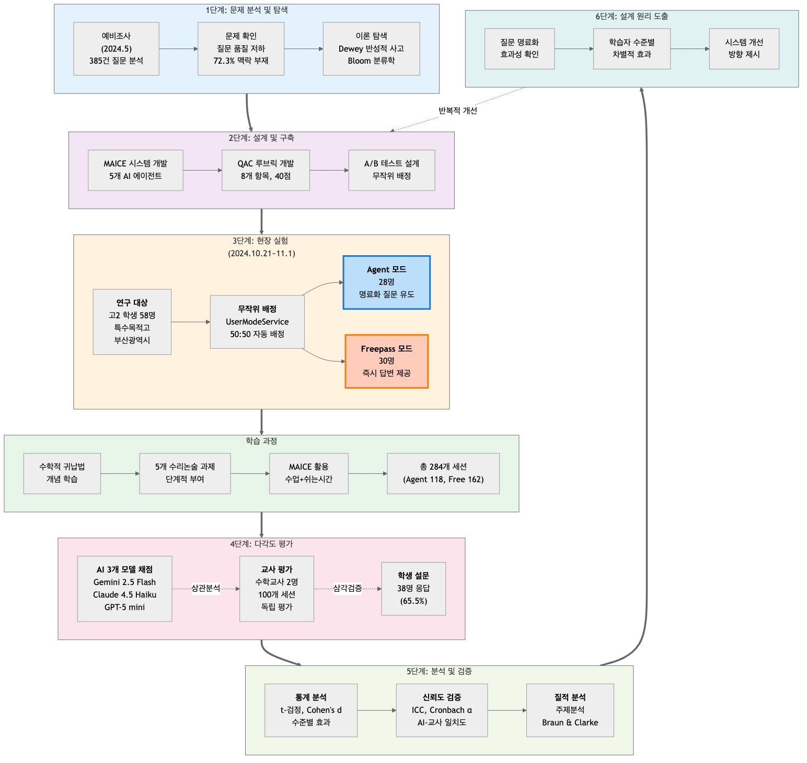

# VI. 연구 방법

## 1. 연구 방법론: Design-Based Research

본 연구는 설계 기반 연구(Design-Based Research, DBR) 방법론을 채택하였다. DBR은 교육 이론을 실제 교육 맥락에서 검증하고, 실용적 산출물을 개발하며, 반복적 개선을 통해 설계 원리를 도출하는 연구 방법이다(Collins, Joseph, & Bielaczyc, 2004). Wang과 Hannafin(2005)은 DBR의 핵심 특징으로 실용성(pragmatic), 이론 기반(grounded), 상호작용성(interactive), 반복성(iterative), 유연성(flexible), 통합성(integrative)을 제시하였다.

본 연구의 DBR 수행 과정은 다음과 같다:

**1단계: 문제 분석 및 탐색**
- 예비조사(2024년 5월): 학생 질문 385건 분석 (결과는 1장 참조)
- 문제 확인: 질문 품질의 구조적 문제 발견
- 이론 탐색: Dewey의 반성적 사고, Bloom의 교육목표분류학

**2단계: 설계 및 구축**
- 이론 기반 설계: Dewey 5단계 반성적 사고를 멀티 에이전트 구조로 구현
- 시스템 개발: 5개 AI 에이전트(QuestionClassifier, QuestionImprover, AnswerGenerator, LearningObserver, FreeTalker)
- 평가 도구: QAC 루브릭 개발 (8개 항목, 32개 체크리스트, 40점 만점)

**3단계: 평가 및 반성**
- 현장 실험: 무작위 배정 A/B 테스트 (58명, 2024.10.21~11.1, 284개 세션)
- 다각도 평가: AI 3개 모델 자동 채점 + 교사 2명 평가 + 학생 설문
- 분석 및 검증: 통계 분석, 신뢰도·타당도 검증, 질적 분석
- 설계 원리 도출: 양적·질적 데이터 통합 분석을 통한 설계 원리 도출

DBR의 반복적 특성에 따라, 도출된 설계 원리는 시스템 개선 및 추가 검증 연구에 활용될 수 있다.

## 2. 연구 대상

### 가. 표본 선정

본 연구는 부산광역시 소재 ○○고등학교 2학년 4개 학급을 대상으로 하였다. 표집 방법은 연구자의 접근 가능성을 고려한 편의 표집(convenience sampling)이었으며, 학교와 학급 선정 기준은 다음과 같다:

### 나. 참여자 특성

[표 6-1] 연구 대상 개요

| 구분 | 내용 |
|------|------|
| **총 인원** | 58명 |
| **학년** | 고등학교 2학년 |
| **학교 유형** | 특수목적고등학교(공업계열) |
| **지역** | 부산광역시 |
| **연구 기간** | 2025년 10월 20일 ~ 11월 8일 (약 3주) |

**실험군과 대조군 구성**:
- **Agent 모드**: 28명
- **Freepass 모드**: 30명

**학생 사전 성적 분포** (중간고사 기준):
- 서술형 점수 (30점 만점): 범위 0~30점
- 객관식 점수 (70점 만점): 범위 14.6~61.7점
- 총점 (100점 만점): 범위 17.9~89.9점 (상세 기술통계는 표 6-2 참조)

### 다. 예비 조사 (Pilot Study)

본 연구 설계에 앞서 2024년 5월에 예비 조사를 실시하여 프리패스 방식 LLM의 교육적 문제점을 파악하였다:

- **목적**: MAICE 시스템 설계의 필요성 검증
- **데이터**: 고등학교 수학 수업에서 수집한 385건의 질문-답변 쌍
- **평가단**: 현직 중등 수학교사 4명 (평균 경력 3.5년: 1년차 2명, 5년차 1명, 7년차 1명)
- **평가 방법**: 교육학 이론 기반 평가 기준 (6개 영역, 5점 척도)
- **총 평가 건수**: 1,012건 (교사 3-4명이 각 질문 평가)

예비 조사를 통해 학생 질문의 품질 문제와 질문-답변 품질 간 상관관계를 확인하여, 질문 명료화 기반 AI 에이전트 시스템의 필요성을 실증적으로 확인하였다. 이 결과는 MAICE 시스템 설계의 핵심 근거가 되었다.

(상세 분석 결과는 `analysis/proto/평가결과_핵심요약.md` 참조)

### 라. 무작위 배정

학급 내 학생들을 실험군과 대조군에 무작위 배정하기 위해 MAICE 백엔드 시스템의 UserModeService를 활용하였다. 이 서비스는 학생이 시스템에 가입할 때 Python의 `random` 모듈을 사용하여 "agent" 또는 "freepass" 모드를 50:50 비율로 자동 배정한다. 배정된 모드는 `users` 테이블의 `assigned_mode` 필드에 저장되며, 연구 기간 동안 고정된다.

무작위 배정 결과 Agent 모드 28명, Freepass 모드 30명이 배정되었다. 두 집단 간 사전 동질성은 중간고사 성적을 독립표본 t-검정으로 검증하였다.

[표 6-2] 실험군과 대조군의 사전 동질성 검증 (중간고사 기준)

| 변인 | Agent 모드 (n=28) | Freepass 모드 (n=30) | t | p | 해석 |
|------|------------------|---------------------|---|---|------|
| | M(SD) | M(SD) | | | |
| 중간고사 총점 (100점) | 56.8(16.7) | 51.4(18.1) | 1.18 | .242 | 동질 |
| - 서술형 점수 (30점) | 15.6(8.5) | 14.0(8.5) | 0.74 | .462 | 동질 |
| - 객관식 점수 (70점) | 41.2(9.4) | 37.4(12.4) | 1.30 | .199 | 동질 |

> **주**: 상세한 동질성 검증 결과 해석은 7장 참조

### 마. 연구 윤리

**1. 연구 참여 동의**
- 모든 참여 학생과 보호자에게 연구 목적, 절차, 데이터 활용 방법을 설명하였다
- 학생 및 보호자로부터 서면 동의를 받았다
- 참여 거부 및 중도 철회 권리를 명시하였다

**2. 개인정보 보호**
- 수집된 데이터는 연구 목적으로만 사용되었다
- 데이터는 암호화된 서버에 저장하고, 연구자만 접근 가능하도록 제한하였다

**3. 참여자 익명화**
- 모든 학생 학번(24.xxx)을 익명 ID(S01~S58)로 변환하여 사용하였다
- 익명화 규칙:
  - Agent 모드 학생: S01 ~ S28 (28명)
  - Freepass 모드 학생: S29 ~ S58 (30명)
- 익명화 매핑 테이블은 별도 암호화 파일로 관리하며, Git 저장소에서 제외하였다
- 논문 및 연구 보고서에는 익명 ID만 사용하여 개인 식별 불가능하도록 하였다

**4. 참여자 보호**
- 연구 참여로 인한 학업 불이익이 없음을 보장하였다
- 두 모드(Agent/Freepass) 모두 교육적 가치를 제공하도록 설계하였다
- 연구 종료 후 모든 참여자에게 두 모드의 사용 기회를 제공하였다

**5. 데이터 보관 및 폐기**
- 연구 데이터는 연구 종료 후 3년간 보관하며, 이후 안전하게 폐기한다
- 논문 출판 시 개인을 특정할 수 있는 정보는 일체 포함하지 않는다

**6. 설문 식별자 수집**

본 연구는 사후 설문조사에서 학생의 이메일 주소를 수집하였다. 이는 모드별 효과 비교를 위해 설문 응답과 객관적 데이터(QAC 점수, 교사 평가, 세션 사용 패턴)를 연계하기 위한 식별자로 활용되었다. 비익명 설문의 한계점 및 완화 전략은 9장 "연구의 한계" 섹션에서 논의한다.

### 바. 실험 설계 및 진행 절차

**1단계: 수학적 귀납법 개념 학습 (사전 교육)**

A/B 테스트 시작 전, 모든 학생에게 수학적 귀납법에 대한 수업을 진행하였다. 수업은 **학생 선행 학습 + 교사 해설** 방식으로 진행되었으며, 매 수업 해설마다 핵심 개념을 반복적으로 강조하였다:

**[표 6-3] 수학적 귀납법 수업 구조 및 핵심 개념**

| 단계 | 내용 | 강조 개념 | 교수법 |
|------|------|----------|--------|
| **첫 수업** | 수학적 귀납법의 원리와 구조 | **① 템플릿과 도미노 모델**<br>• 3단계 구조 (베이스, 가정, 결론)<br>• 도미노 비유: "첫 번째가 넘어지고, 하나가 넘어지면 다음도 넘어지면, 모두 넘어진다"<br>• 증명의 표준 형식 제공 | 강의 중심<br>개념 도입 |
| **매 수업<br>(과제 풀이)** | 학생들이 문제를 미리 풀고 제출 | - | 선행 학습<br>시행착오 경험 |
| **매 수업<br>(교사 해설)** | 제출된 문제를 해설하며<br>핵심 포인트 반복 강조 | **② 귀납가정 → 귀납결론 유도**<br>• k일 때 성립한 가정을 k+1 증명에 어떻게 활용하는가<br>• 논리적 연결고리 찾기<br><br>**③ 등식 vs 부등식 전략**<br>• 등식: "필요한 재료만 딱 맞게" (정확성 강조)<br>• 부등식: "스페어 부품도 있는" (부등호 여유 활용)<br>• 명제 유형별 차별적 접근 | 예제 중심<br>반복 강조 |

**수업의 핵심 특징**:

1. **선행 학습 기반 수업**:
   - 학생들이 먼저 문제를 풀어보고 제출 → 능동적 학습 경험
   - 교사는 학생들의 시도를 바탕으로 맞춤형 해설 제공
   - 시행착오를 통한 깊이 있는 이해 촉진

2. **비유적 접근의 반복**:
   - **도미노 모델**: 증명 원리의 직관적 이해 ("연쇄 반응")
   - **재료 비유**: 등식은 "딱 맞는 재료", 부등식은 "여유 있는 재료"
   - 매 해설마다 반복 강조하여 학생들의 **공통 언어**로 정착

3. **핵심 과정의 강조**:
   - 귀납가정(k일 때 참)을 귀납결론(k+1일 때 참) 증명에 **어떻게 연결**하는가
   - 단순 형식 암기가 아닌 **논리적 연결 과정** 이해

**AI 학습과의 연결**:
이러한 선행 학습 경험과 반복 강조된 개념들은 A/B 테스트 기간 동안 학생들이 AI와 대화할 때 **사고의 틀과 공통 언어**로 작용하였다. 특히 "도미노", "재료" 등의 비유가 학생들의 질문과 AI의 답변에서 자연스럽게 활용되었다.

**2단계: 수리논술 과제 단계적 부여 및 MAICE 활용 학습**

본 연구는 2025학년도 2학기 수학 수리논술 수행평가의 일환으로 총 5개의 수학적 귀납법 증명 과제를 단계적으로 부여하였다. 학생들은 각 과제를 해결하는 과정에서 **수업 시간**(40분) 및 **쉬는 시간**(10-15분)을 활용하여 MAICE 시스템에 자유롭게 접근하였다.

**과제 구성 및 진행 방식**:

[표 6-4] 수리논술 과제 세부 내용

| 과제 | 문제 1 | 문제 2 | 주요 개념 |
|:----:|--------|--------|----------|
| **과제 1** | 등비급수 합 공식<br/>$1+2+4+\cdots+2^{n-1} = 2^n-1$ | 팩토리얼 부등식<br/>$n! > 2^n$ (n≥4) | 기본 급수, 팩토리얼 |
| **과제 2** | 피보나치 수열 합<br/>$F_{n+2}=F_n+F_{n+1}$, $F_1=F_2=1$<br/>→ $\sum_{i=1}^{n} F_i = F_{n+2}-1$ | 지수 부등식<br/>$n^2 < 2^n$ (n≥5) | 점화식, 부등식 |
| **과제 3** | 팩토리얼 곱셈 공식<br/>$1×1!+2×2!+\cdots+n×n! = (n+1)!-1$ | 로그 부등식<br/>$\log_2 n < n$ | 곱셈 전개, 로그 |
| **과제 4** | 제곱수 합 공식<br/>$1^2+2^2+\cdots+n^2 = \frac{n(n+1)(2n+1)}{6}$ | 제곱 부등식<br/>$n < n^2$ (n≥2) | 제곱수 급수, 부등식 |
| **과제 5** | 하노이탑 점화식<br/>$a_{n+1}=2a_n+1$, $a_1=1$<br/>→ $a_n=2^n-1$ 증명 | 거듭제곱 부등식<br/>$n! < n^n$ (n≥2) | 점화식, 거듭제곱 |

**학습 과정 구조**:

**[그림 6-2] 학습 과정 구조**


학생들은 과제를 받고 개별 풀이를 시도하며 필요시 언제든지 MAICE 시스템을 활용한다. 막히는 부분이 있을 때뿐만 아니라, 풀이 과정 확인이나 자신의 풀이 검토 시에도 자유롭게 사용한다. Agent 모드(28명)는 명료화 질문을 통해 문제를 구체화하는 과정을 거치고, Freepass 모드(30명)는 즉시 답변을 받는다. AI 답변을 참고하여 풀이를 완성한 후 교사와 함께 검토하며, 이 과정을 5개 과제에 걸쳐 반복한다

**MAICE 활용 방식**:

학생들은 다음과 같은 상황에서 MAICE를 자유롭게 활용하였다:

1. **수업 시간 활용** (주 활용 시간):
   - 교사가 과제를 제시한 후 개별 풀이 시간 제공 (수업 40분 중 20-30분)
   - 개인 노트북/태블릿으로 AI와 대화하며 필요시 언제든지 접속
   - **막힐 때**: "귀납 가정을 어디에 사용하나요?", "이 식을 어떻게 전개하죠?"
   - **풀이 검토 시**: "제 풀이 맞나요?", "이렇게 증명해도 되나요?"
   - **과정 확인 시**: "이 단계가 왜 필요한가요?", "다른 방법도 있나요?"

2. **쉬는 시간 활용** (보조 활용):
   - 수업 시간에 완전히 해결하지 못한 부분을 쉬는 시간에 추가 질문
   - 완성한 풀이를 MAICE에 입력하여 검토 요청
   - 평균 2-3회의 짧은 대화 세션 (세션당 5-10분)

3. **과제 해결 패턴**:
   - **Agent 모드 학생**: 명료화 질문을 통해 문제를 단계별로 구체화하며 해결
   - **Freepass 모드 학생**: 즉시 제공되는 답변을 참고하여 풀이 작성

**교사 협력 학습**:
- 각 과제 제출 후 교사가 학급 전체와 함께 표준 풀이 과정 검토
- 학생들이 MAICE를 통해 얻은 인사이트를 수업 중 공유
- 일반적인 오류 및 개선 방향 논의

**데이터 수집**:
- 모든 학생-AI 대화 내용 자동 저장 (총 284개 세션)
- 세션별 질문 품질, 답변 품질, 학습 지원 수준 자동 평가
- 학생별 과제 완성도 및 제출 시간 기록

**실험 일정 및 기간**:

[표 6-5] 수리논술 과제 실시 일정

| 회차 | 과제 | 활동 내용 | 수업 시간 |
|:----:|:----:|----------|----------|
| **1회차** | - | 수학적 귀납법 개념 학습<br/>MAICE 시스템 사용법 안내 | 1교시 (40분) |
| **2회차** | 과제 1 | 등비급수, 팩토리얼 부등식<br/>+ 풀이 검토 및 피드백 | 1교시 (40분) |
| **3회차** | 과제 2 | 피보나치 수열, 지수 부등식<br/>+ 풀이 검토 및 피드백 | 1교시 (40분) |
| **4회차** | 과제 3 | 팩토리얼 곱셈, 로그 부등식<br/>+ 풀이 검토 및 피드백 | 1교시 (40분) |
| **5회차** | 과제 4 | 제곱수 합, 제곱 부등식<br/>+ 풀이 검토 및 피드백 | 1교시 (40분) |
| **6회차** | 과제 5 | 하노이탑, 거듭제곱 부등식<br/>+ 풀이 검토 및 피드백 | 1교시 (40분) |
| **7회차** | - | 전체 과제 종합 리뷰 및 심화 문제 풀이 | 1교시 (40분) |
| **8회차** | - | 사후 설문 및 연구 종료 | 1교시 (40분) |

**총 실험 기간**: 약 3주 (2025년 10월 20일~11월 8일, 총 12회차 수업)
- **개념 학습**: 1회차
- **과제 활동 및 풀이 검토**: 2~6회차 (각 과제 수행 + 수업 말미 검토)
- **종합 리뷰**: 7회차
- **사후 설문**: 8회차
- **MAICE 활용 가능 시간**: 수업 중 20-30분 + 쉬는 시간 10-15분
- **총 세션 수**: 284개 (Agent 모드 118개, Freepass 모드 162개)
- **유효 세션** (메시지 ≥2): 280개 (Agent 118개, Freepass 162개)
- **평균 세션 길이**: 약 15분 (최소 3분 ~ 최대 45분)

**3단계: 모드별 AI 활용 패턴 관찰**
- **Agent 모드**: 명료화 질문을 통한 질문 구체화 과정 경험
- **Freepass 모드**: 즉시 답변 제공 방식으로 학습

**4단계: 데이터 수집 및 평가**

본 연구는 수집된 세션 데이터를 다각도로 분석하여 신뢰성과 타당성을 확보하고자 하였다.

#### (1) 다중 AI 모델 채점 시스템

평가자 편향(rater bias)을 최소화하고 채점 신뢰성을 높이기 위해 3개의 독립적인 대규모 언어 모델을 평가자로 활용하여 교차 검증을 실시하였다:

[표 6-6] AI 모델 채점자 구성

| 모델 | 개발사 | 버전 | 선정 이유 |
|------|--------|------|----------|
| **Gemini 2.5 Flash** | Google | gemini-2.5-flash | 긴 맥락 처리 능력, Batch API 지원, 한국어 성능 우수 |
| **Claude 4.5 Haiku** | Anthropic | claude-haiku-4-5 | 빠른 처리 속도, 일관성 있는 평가, Message Batches 지원 |
| **GPT-5 mini** | OpenAI | gpt-5-mini | 범용적 평가 능력, 비용 효율성, Batch API 지원 (평가용) |

**채점 절차**:
1. 모든 세션 데이터를 JSON 형식으로 수집
2. 각 모델에 동일한 QAC 체크리스트와 평가 프롬프트 제공
3. 모델별로 독립적으로 채점 수행 (블라인드 평가)
4. 3개 모델 점수의 평균(Ensemble)과 개별 모델 점수 모두 분석

**실제 활용된 평가 프롬프트**:

3개 AI 모델에게 동일한 평가 프롬프트를 제공하였다. 프롬프트는 다음 구성요소를 포함한다:

1. **평가 대상 명시**: 학생 질문, MAICE 답변, 전체 대화 흐름
2. **루브릭 구조**: 
   - A영역 (질문): A1~A3, 각 4개 체크리스트
   - B영역 (답변): B1~B3, 각 4개 체크리스트
   - C영역 (맥락): C1~C2, 각 4개 체크리스트
3. **평가 방식**: 각 체크리스트 0(미충족) 또는 1(충족)
4. **응답 형식**: JSON 구조로 각 요소의 value(0/1)와 evidence(근거) 포함
5. **예시**: 실제 평가 예시를 통한 일관성 확보

**프롬프트 예시 (A1 영역)**:
```
### A1. 수학적 전문성 (5점)
다음 4가지 요소를 체크하세요 (0=미충족, 1=충족):
- A1-1. ☐ concept_accuracy (수학적 개념/원리의 정확성)
- A1-2. ☐ curriculum_hierarchy (교과과정 내 위계성 파악)
- A1-3. ☐ terminology_appropriateness (수학적 용어 사용의 적절성)
- A1-4. ☐ problem_direction_specificity (문제해결 방향의 구체성)
```

**응답 형식**:
```json
{
  "A1_math_expertise": {
    "concept_accuracy": {"value": 1, "evidence": "메시지[2]에서 ..."},
    "curriculum_hierarchy": {"value": 0, "evidence": "학년 정보 언급 없음"},
    ...
  }
}
```

> **상세 프롬프트 전문**: 부록 J 참조  
> **소스 코드**: `analysis/newtest/Gemini_배치채점_3모델.py` 내 `RUBRIC_TEXT` 변수

**QAC 점수 산출 방식**:
각 모델은 32개 체크리스트 요소를 0(미충족) 또는 1(충족)로 평가한 후, 자동으로 점수를 합산한다:
- A1~A3 각 영역: 4개 체크리스트 × 1.25점 = 5점 (A영역 합계 15점)
- B1~B3 각 영역: 4개 체크리스트 × 1.25점 = 5점 (B영역 합계 15점)
- C1~C2 각 영역: 4개 체크리스트 × 1.25점 = 5점 (C영역 합계 10점)
- **총점**: 40점 만점

각 모델은 JSON 형식으로 32개 체크리스트의 달성 여부(value)와 근거(evidence)를 출력하며, 점수는 시스템이 자동으로 계산한다.

**모델 간 신뢰도 검증 방법**:
- Pearson 상관계수: 모델 쌍별 점수 일치도
- 급내상관계수(ICC): 전체 평가자 간 신뢰도
- Cronbach's Alpha: 내적 일관성
- Bland-Altman plot: 모델 간 점수 차이 분포

#### (2) 교사 평가를 통한 타당도 검증

AI 채점의 타당성을 검증하기 위해 현직 교사 4명이 무작위로 선정된 세션을 독립적으로 평가하였다:

**[표 6-7] 교사 평가단 구성**

| 평가자 ID | 교과 | 교직 경력 | 평가 세션 수 | 비고 |
|---------|-----|----------|------------|------|
| 평가자 96 | 수학 | 5년 | 100개 | 외부 독립 평가자 |
| 평가자 97 | 수학 | 7년 | 100개 | 외부 독립 평가자 |
| **합계** | 수학 2명 | - | **200개 평가** | 대응 평가 (동일 100개 세션) |

> **주**: 연구 객관성 확보를 위해 연구자(평가자 16)와 정보교사(평가자 93)는 분석에서 제외하고, 수학 전공 교사 2명의 결과만 사용하였다. 두 평가자는 동일한 100개 세션을 독립적으로 평가하여 완벽한 대응 평가(paired evaluation)를 수행하였다.

**평가 절차**:
  - 동일한 100개 세션을 2명의 교사가 독립적으로 평가 (완벽한 대응 평가)
  - AI 모델과 동일한 QAC 체크리스트 사용 (부록 A 참조)
  - 학생 모드 정보 블라인드 처리로 평가 편향 방지
  - 교사 평가 완료 후 AI 채점 결과와 비교

**검증 방법**:
  - **교사 간 신뢰도**: Pearson 상관계수, Spearman 순위 상관
  - **AI-교사 일치도**: AI 채점 평균 vs 교사 평균 간 상관분석
  - **영역별 일치도**: A, B, C 영역별 상관계수 계산
  - **모드별 효과 수렴**: 교사와 AI가 Agent vs Freepass 차이를 동일하게 감지하는지 확인

> **결과**: 신뢰도 및 타당도 분석 결과는 7장 참조

#### (3) 다층적 분석 전략

수집된 데이터를 다음과 같은 다층적 기준으로 분석하여 종합적인 효과를 검증하고자 하였다:

**① 항목별 분석**:
- 8개 평가 영역별 점수 비교 (A1~A3, B1~B3, C2~C3)
- 32개 체크리스트 요소별 달성률 분석
- 질문 품질, 답변 품질, 학습 맥락 점수 독립 분석

**② 사전 성취도 수준별 분석**:
- **Quartile 분석**: 중간고사 점수 기준 4분위
  - Q1 (하위 25%), Q2, Q3, Q4 (상위 25%)
- **Tertile 분석**: 3분위로 구분
  - T1 (하위 33%), T2, T3 (상위 33%)
- **연속 구간 분석**: 10점 단위 구간별 비교
- 각 구간에서 Agent vs Freepass 효과 크기 계산

**③ 종단적 학습 효과 분석**:
- 복수 세션 참여 학생 대상 누적 변화 추적
- 각 학생의 첫 세션 점수 vs 마지막 세션 점수 비교
- 세션 순서에 따른 점수 변화 추이 분석
- 점수 변동성(표준편차) 변화 분석

**④ 질적 데이터 수집 및 분석**:

**사후 설문 조사**:

실험 종료 후 학생들의 주관적 경험을 파악하기 위해 사후 설문조사를 실시하였다:

- **응답 학생**: 40명 (응답률 69.0%, Agent 모드 및 Freepass 모드 경험자)
- **블라인드 설계**: 학생들은 자신이 Agent인지 Freepass인지 모르는 상태에서 응답
- **문항 구성**:
  - 리커트 척도 문항: 메타인지, 학습 효과, 시스템 만족도 등
  - 서술형 문항 5개: 경험 서술, 변화, 선호도, 기억에 남는 순간, 개선 제안

**질적 분석 절차**:

서술형 응답 중 의미 있는 응답을 제공한 17명(Agent 9명, Freepass 8명)의 데이터를 Braun & Clarke(2006)의 주제 분석(Thematic Analysis) 6단계 절차로 분석하였다:

1. 데이터 숙지 → 2. 초기 코딩 → 3. 테마 탐색 → 4. 테마 검토 → 5. 테마 정의 → 6. 보고서 작성

**분석 원칙**:
- 귀납적 접근: 데이터에서 테마를 도출 (이론 선행 없음)
- 모드별 비교: Agent vs Freepass 경험 차이 분석
- 학생 원문 인용: 익명 ID와 함께 실제 응답 제시

**삼각검증 전략** (Triangulation):

양적 데이터(QAC 점수 284개), 설문 리커트 척도(40명), 질적 데이터(서술형 응답 주제분석 17명)를 통합하여 연구 결과의 신뢰성과 타당성을 확보하였다.

> **결과**: 설문 리커트 척도 결과는 8장, 주제 분석 전문은 부록 E 참조

**⑤ 통계 분석 방법**:
- **독립표본 t-검정**: Agent vs Freepass 집단 간 비교
- **대응표본 t-검정**: 같은 학생의 세션 간 변화
- **Cohen's d**: 효과 크기 계산 (small: 0.2, medium: 0.5, large: 0.8)
- **Pearson 상관분석**: 변인 간 관계 분석
- **신뢰도 분석**: ICC, Cronbach's Alpha
- **유의수준**: α = .05 (양측검정)

> 주: QAC 체크리스트 세부 정의와 채점 기준은 `docs/부록_A_루브릭_상세설명서.md` 참조. 실제 분석 결과는 7장에서 제시한다.

## 3. 통제 변인

본 연구에서는 실험 처치(Agent 모드 vs Freepass 모드) 외에 학습 효과에 영향을 미칠 수 있는 변인들을 다음과 같이 통제하였다:

**[표 6-8] 통제 변인 및 통제 방법**

| 변인 범주 | 구체적 변인 | 통제 방법 |
|----------|-----------|----------|
| **학습 과제** | 과제 내용 | 동일한 수학적 귀납법 과제 5개 부여 |
| | 과제 난이도 | 동일한 순서와 난이도로 제시 |
| | 제출 기한 | 양 집단 동일한 제출 일정 |
| **교사 효과** | 수업 진행 | 동일 교사가 모든 학급 수업 진행 |
| | 수업 내용 | 수학적 귀납법 개념 학습 내용 동일 |
| | 풀이 검토 | 양 집단 동일한 방식으로 과제 검토 |
| **학습 자료** | 교과서 | 동일 교과서 사용 (수학Ⅰ) |
| | 과제 자료 | 동일한 수리논술 문제지 제공 |
| **기술 환경** | 접근 기기 | 개인 노트북 또는 태블릿 사용 |
| | 네트워크 | 학교 Wi-Fi 환경 |
| | MAICE 시스템 | 동일한 시스템 버전 및 UI |
| **사전 지식** | 선수 학습 | 수열 단원 선수 학습 완료 |
| | 기초 개념 | 1회차에 수학적 귀납법 개념 사전 교육 (양 집단 동일) |
| **평가 방법** | AI 채점 | 3개 AI 모델 + Ensemble 평균 (블라인드 채점) |
| | 채점 기준 | 동일 QAC 체크리스트 (40점 만점) |
| | 평가 시점 | 모든 세션 데이터 수집 후 일괄 채점 |

**통제되지 않은 변인 (연구 제한점)**:
- **MAICE 활용 시간**: 학생마다 수업 중/쉬는 시간 활용 정도 상이
- **세션 횟수**: 학생의 자발적 선택에 따라 사용 빈도 다름 (1~13회)
- **학습 습관**: 개인별 학습 전략 및 스타일 차이
- **가정 학습**: 학교 밖 추가 학습 시간 및 자료 사용
- **동료 효과**: 친구 간 정보 공유 및 상호작용
- 개인별 인지 능력 차이

이러한 통제되지 않은 변인들은 무작위 배정을 통해 두 집단에 균등하게 분산되도록 하였으며, 연구 결과 해석 시 한계점으로 고려되었다.

## 4. 연구 도구

### 가. 질문 품질 평가 도구

**QAC 체크리스트 (Question-Answer-Context Checklist)**

본 연구는 학생-MAICE 간 대화 세션의 질을 평가하기 위해 QAC 체크리스트를 개발하여 사용하였다:

- **구성**: 3개 영역(질문, 답변, 맥락), 8개 항목, 32개 체크리스트 요소
- **배점**: 40점 만점 (A영역 15점 + B영역 15점 + C영역 10점)
- **이론적 기반**: Dewey의 반성적 사고 이론, 질문 생성 이론
- **평가 방식**: 각 체크리스트 요소를 0(미충족) 또는 1(충족)로 이진 평가
- **평가자**: AI 3개 모델(Gemini 2.5 Flash, Claude 4.5 Haiku, GPT-5 mini) + 수학교사 2명
- **시스템 사용 LLM**: Gemini 2.5 Flash (Google) - 실제 학생 대화 처리

**타당도 및 신뢰도 확보 방법**:
- **내용 타당도**: 교육학 이론 기반 설계
- **전문가 타당도**: 현직 수학교사 4명 검토
- **평가자 간 신뢰도**: 3개 AI 모델 교차 검증, ICC 및 Cronbach's α 계산
- **준거 타당도**: 교사 평가와 AI 채점 간 상관분석

> **상세**: 개발 과정 및 전체 체크리스트는 부록 A 참조. 평가 프롬프트 전문은 부록 J 참조. **신뢰도 및 타당도 분석 결과는 7장 참조**.

### 나. 학생 수준 분류 기준

**중간고사 성적 활용 (수열 단원 선수 학습 수준)**

본 연구는 학생들의 사전 학업 수준을 파악하고 수준별 효과를 분석하기 위해, 수학적 귀납법 단원 학습 **이전에** 실시된 중간고사 성적을 활용하였다. 이 중간고사는 수학적 귀납법의 선수 학습 내용인 **수열 단원**(등차수열, 등비수열, 여러 가지 수열의 합)에 대한 이해도를 평가한 시험이다.

**성적 구성**:
- **서술형 문항** (30점 만점): 수열의 합, 등차/등비수열 증명 과정 서술
- **객관식 문항** (70점 만점): 수열 개념 이해 및 적용
- **총점** (100점 만점): 서술형 + 객관식

**평가 내용** (수학적 귀납법의 선수 학습):
- 등차수열의 일반항 및 합 공식
- 등비수열의 일반항 및 합 공식
- 여러 가지 수열의 합 (∑ 기호 활용)
- 수열의 귀납적 정의 (점화식)

**활용 목적**:
1. **학생 수준 분류**: 삼분위수로 하위 33%, 중위 33%, 상위 33% 구분
2. **사전 동질성 검증**: Agent vs Freepass 집단 간 선수 학습 수준 비교
3. **조절 변수**: 학업 수준별 차별적 효과 분석
4. **선수 학습 지표**: 수학적 귀납법 학습을 위한 기초 개념 이해도 대표

**중요**: 본 연구는 중간고사 성적을 사전-사후 비교에 사용한 것이 아니라, **수학적 귀납법 학습 전 선수 학습 수준을 나타내는 독립적 기준**으로 활용하였다. 실제 학습 효과는 **QAC 체크리스트 점수의 세션별 변화**로 측정하였다.

### 다. 시스템 로그 데이터

세션별 대화 내용과 상호작용 패턴을 분석하기 위해 PostgreSQL 데이터베이스에서 자동 수집된 로그 데이터를 활용하였다.

**Agent 모드 로그**:
- 명료화 대화 횟수 및 질문 개선 정도
- 에이전트별 응답 시간 및 처리 과정
- 학습자 질문 진화 추이
- 세션 단계별 전환 패턴

**Freepass 모드 로그**:
- 즉시 답변 횟수 및 대화 길이
- 후속 질문 발생 패턴
- 메시지 유형별 분포

**수집 데이터**:
- 세션 메시지 수, 평균 메시지 길이
- 세션 지속 시간 (추정)
- 사용자-AI 상호작용 횟수

## 5. 자료 수집 및 분석

### 가. 정량적 분석

**집단 간 비교 분석**:
- 독립표본 t-검정: Agent vs Freepass 모드 간 QAC 점수 차이 검증
- Welch's t-test: 등분산 가정 위배 시 사용
- Mann-Whitney U test: 비모수 검정

**세션 증가폭 분석**:
- 대응표본 t-검정: 각 학생의 1회차 vs 최종회차 QAC 점수 변화
- 천장효과 보정: proportional improvement = (후반 평균 - 전반 평균) / (15 - 전반 평균)

**효과 크기 계산**: 
- Cohen's d를 주 효과 크기 지표로 사용
- Hedge's g (소표본 보정)와 Cliff's delta (비모수 효과 크기)를 보조적으로 산출
- 평균 차이의 95% 신뢰구간은 Bootstrap 방법(재표본추출 1,000회)으로 추정
- 효과 크기 해석은 Cohen(1988)의 기준을 따름: d = 0.2 (작은 효과), 0.5 (중간 효과), 0.8 (큰 효과)
- Hattie (2009)는 교육 개입의 평균 효과크기가 d=0.4임을 제시하였으며, 이를 '힌지 포인트(hinge point)'로 명명하였다. 본 연구에서는 이를 참고하되, Cohen의 전통적 기준을 주요 해석 틀로 사용한다

**학업 수준별 차별적 효과 분석**:
- 중간고사 성적 기준 삼분위수(tertiles) 분류
- 각 수준별 Agent vs Freepass 효과 비교
- 상호작용 효과 검증

### 나. 질적 분석
- **대화 패턴 분석**: 명료화 유형, 학생 응답 패턴, 학습 진화 추이
- **세션 사례 분석**: 명료화 성공/실패 사례의 질적 코딩
- **로그 데이터 분석**: 메시지 유형, 세션 단계, 상호작용 길이

### 다. 데이터 수집 및 필터링 상세

**데이터 수집**:
- **수집 기간**: 2025년 10월 20일 ~ 11월 1일 (실험 기간과 동일)
- **수집 방법**: PostgreSQL 데이터베이스에서 학생 세션 자동 수집
- **수집 대상**: 고등학교 2학년 수학적 귀납법 학습 중 AI 활용 전체 대화 세션
- **원본 데이터**: 
  - 세션 데이터: `학생세션_수집_20251103_134440.json` (총 284개 세션, 58명 학생, 1407개 메시지)
  - AI 채점 데이터 (3개 모델 배치 채점):
    - Gemini 2.5 Flash: `gemini_results_20251105_174045.jsonl` (284개)
    - Claude 4.5 Haiku: `anthropic_batch_20251105_171246.jsonl` (284개)
    - GPT-5 mini: `openai_batch_20251105_171235.jsonl` (284개)

**데이터 필터링 (대화 유효성 검증)**:

본 연구는 학습 상호작용의 질을 정확히 측정하기 위해 다음 기준으로 유효 세션을 선별하였다:

1. **메시지 개수 ≥ 2**: 최소한의 상호작용이 존재하는 세션만 포함
2. **역할 공존**: `user` AND (`maice` OR `assistant`) 메시지가 모두 존재
   - 학생 질문과 AI 응답이 모두 있는 완전한 대화만 분석
3. **내용 유효성**: 모든 메시지 `content`가 공백이 아님
   - 기술적 오류나 빈 메시지가 없는 세션만 포함
4. **세션 완결성**: 마지막 발화자가 `user`가 아님
   - AI가 최종 응답을 제공한 완결된 세션만 분석

**필터링 결과**:
- **전체 세션**: 284개 (Agent 118개, Freepass 162개)
- **유효 세션** (메시지 ≥2): 280개 (Agent 118개, Freepass 162개)
  
  **참고**: 전체 세션과 유효 세션의 Agent 수가 동일한 이유는 Agent 모드의 모든 세션이 메시지 2개 이상을 충족했기 때문이다. Freepass 모드도 동일하게 모든 세션이 유효 세션 기준을 충족하였다.
  
- **분석 대상 학생**: 58명
  - Agent 모드: 28명
  - Freepass 모드: 30명
- **설문 응답자**: 40명 (응답률 69.0%)
- **다회 세션 학생**: 상당수 (2회 이상 세션 이용자, 학습 증가폭 분석 대상)

**AI 배치 채점 (Batch API)**:
- **채점 모델**: 3개 독립 AI 모델 (Gemini 2.5 Flash, Claude 4.5 Haiku, GPT-5 mini)
- **채점 방식**: Batch API를 통한 병렬 채점 (비용 효율적, 일관성 ⬆️)
- **주의**: 시스템 운영 LLM(Gemini 2.5 Flash)과 채점 평가 LLM(3개 모델)은 구분됨
- **채점 기준**: QAC 체크리스트 (A영역 15점 + B영역 15점 + C영역 10점 = 총 40점)
- **채점 대상**: 전체 284개 세션 (Agent 115개, Freepass 169개)
  - **Gemini 2.5 Flash**: 284개 전체 채점 완료
  - **Claude 4.5 Haiku**: 284개 전체 채점 완료
  - **GPT-5 mini**: 284개 전체 채점 완료
  - **신뢰도 분석용 공통 세션**: 284개 (100%, 3개 모델 모두 성공)
- **채점 스크립트**: `analysis/newtest/Gemini_배치채점_3모델.py`
- **결과 파일**: 
  - Gemini: `newtest/batch_results/gemini_results_20251105_174045.jsonl` (284개)
  - Claude: `newtest/batch_results/anthropic_haiku45_results_20251105.jsonl` (284개)
  - GPT-5: `newtest/batch_results/openai_gpt5mini_results_20251105.jsonl` (284개)

**재현 가능성**:
- **재현 스크립트**: `analysis/newtest/최종_3모델_통합분석.py`
- **산출 통계**: 
  - 3개 모델별 점수 및 Ensemble 평균
  - 모드별 비교 (전체, Quartile, Tertile)
  - Welch t-검정 및 효과크기(Cohen's d)
  - 평가자 간 신뢰도 (ICC, Cronbach's α, Pearson r)
  - 세션 누적 변화 분석

---


**[그림 6-1] 연구 설계 다이어그램 (A/B Test)**


본 연구는 Design-Based Research(DBR) 방법론에 따라 6단계로 진행되었다. 1단계에서 예비조사를 통해 문제를 분석하고, 2단계에서 MAICE 시스템과 QAC 루브릭을 설계·구축하였다. 3단계는 고2 학생 58명을 무작위로 Agent 모드와 Freepass 모드에 배정하여 현장 실험을 수행하였다. 4단계에서는 AI 3개 모델, 교사 2명, 학생 설문의 다각도 평가를 실시하였으며, 5단계 분석 및 검증을 거쳐 6단계에서 설계 원리를 도출하였다. DBR의 반복적 특성에 따라 도출된 원리는 시스템 개선에 환류된다.
