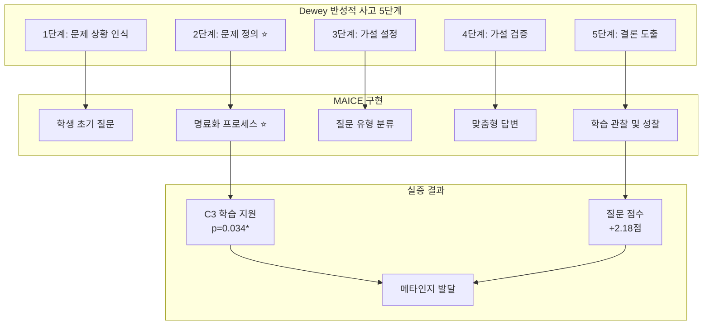

# 📋 표·그림 작업 요약서 (최종)

📅 작성일: 2025-11-05  
✅ 완료: 긴급 표 번호 수정 (6장, 8장)  
📝 다음 단계: 본문 표 번호 추가 → 그림 제작

---

## ✅ 완료된 작업 (Phase 1)

### 1. 긴급 표 번호 수정 완료 ✅
- [x] **6장**: 6-X → 6-3, 6-Y → 6-4, 6-3 → 6-5
- [x] **8장**: 8-0 → 8-1, 8-4 → 8-2

### 2. 새로운 표·그림 목록 생성 ✅
- [x] `00-list-of-tables-NEW.md` (47개 표)
- [x] `00-list-of-figures-NEW.md` (38개 그림)

### 3. 분석 보고서 생성 ✅
- [x] `표_그림_목록_점검보고서.md` (상세 분석)
- [x] `표_그림_재정리_최종안.md` (작업 계획)
- [x] `그림_제작_목록.md` (그림 제작 가이드)

---

## 📊 현재 상황 요약

### 표 (47개)
- ✅ **번호 확정**: 47개 표 순서 정리 완료
- ⚠️ **본문 추가 필요**: 1-5장 표에 번호 표시 필요 (약 20개)
- ✅ **긴급 수정 완료**: 6장, 8장 번호 충돌 해결

### 그림 (38개)
- ❌ **제작 필요**: 38개 전체 (0개 완성)
- ✅ **mermaid 존재**: 11개 (PNG 변환만 하면 됨)
- 📊 **데이터 시각화**: 10개 (Python 스크립트 필요)
- 🎨 **새로 제작**: 17개 (디자인 필요)

---

## 🎯 다음 단계 (우선순위)

### ⚡ STEP 1: 본문 표 번호 추가 (1-2시간)

#### 작업 대상
1. **1장** (2개)
   - Line 49: 평가 영역별 결과 표 → **[표 1-1]** 추가
   - 1.1.3절: AI 답변 평가 → **[표 1-2]** 표 생성

2. **2장** (6개)
   - Line 79: K1-K4 분류 → **[표 2-1]** 추가
   - Line 107: Dewey 5단계 → **[표 2-2]** 추가
   - Line 20: 에이전트 구성 → **[표 2-3]** 추가
   - Line 185: Dewey 매핑 → **[표 2-4]** 추가
   - 2.3.2절: 질문 3특징 → **[표 2-5]** 생성
   - 2.7.2절: 루브릭 영역 → **[표 2-6]** 생성

3. **3장** (7개)
   - Line 18: 에이전트 역할 → **[표 3-1]** 추가
   - Line 233: 게이팅 기준 → **[표 3-2]** 추가
   - Line 338: 명료화 전략 → **[표 3-3]** 추가
   - Line 470: K1-K4 답변 → **[표 3-4]** 추가
   - Line 677: Observer 추출 → **[표 3-5]** 추가
   - Line 776: 모드 비교 → **[표 3-6]** 추가
   - 3.6.6절: 베타테스트 → **[표 3-7]** 생성

4. **4장** (4개)
   - 4.2절: 기술 스택 → **[표 4-1]** 통합 생성
   - Line 119: 에이전트 사양 → **[표 4-2]** 추가
   - Line 561: 프롬프트 차이 → **[표 4-3]** 표 정리
   - Line 825: 성능 지표 → **[표 4-4]** 추가

5. **5장** (2개)
   - 5.1절 또는 2.6.2: 어려움 → **[표 5-1]** 추가/복제
   - Line 37: 명료화 템플릿 → **[표 5-2]** 추가

6. **7장** (5개)
   - Line 1036: A3 요소 → **[표 7-4]** 추가
   - Line 1116: C2 요소 → **[표 7-5]** 추가
   - 하위권 C2 요소 → **[표 7-7]** 생성
   - Line 50: 명료화 수행률 → **[표 7-8]** 통합
   - 세션 증가폭 → **[표 7-9, 7-10, 7-11]** 생성
   - Line 35: 운영 현황 → **[표 7-12]** 추가

---

### 🔥 STEP 2: 핵심 그림 제작 (3-4시간)

#### 최우선 제작 (6개)
```bash
# Python 스크립트 생성
cd analysis
python create_key_figures.py
```

**제작 그림**:
1. **[그림 7-5]** C2 세부 요소 비교 (막대 그래프)
2. **[그림 7-6]** 하위권 C2 효과 (박스플롯)
3. **[그림 7-9]** 세션 증가폭 (라인 그래프)
4. **[그림 8-1]** Dewey 실증 (프로세스 다이어그램)
5. **[그림 8-2]** 누적 효과 모델 (인과 다이어그램)
6. **[그림 8-3]** 학업 수준별 효과 (막대 그래프)

**필요 도구**:
- Python: matplotlib, seaborn, pandas
- 폰트: AppleGothic (한글)

---

### ⭐ STEP 3: mermaid → PNG 변환 (1-2시간)

#### 변환 대상 (11개)
1. [그림 3-1] MAICE 아키텍처 (Line 115-146)
2. [그림 3-2] 질문 처리 파이프라인 (Line 44-56)
3. [그림 3-3] Classifier 게이팅 (Line 221-227)
4. [그림 3-4] 명료화 프로세스 (Line 381-399)
5. [그림 3-5] 에이전트 협업 (2장 Line 619-630)
6. [그림 4-1] 데이터 흐름 (Line 142-181)
7. [그림 4-2] 통신 (Line 250-268)
8. [그림 4-3] Redis Streams (Line 342-366)
9. [그림 4-4] 멀티프로세스 (Line 384-409)
10. [그림 4-5] Docker Compose (Line 686-709)
11. [그림 A-3] DB 스키마 (Line 598-646)

**변환 방법**:
```bash
# 방법 1: mermaid-cli (추천)
npm install -g @mermaid-js/mermaid-cli

# 각 mermaid 블록 추출 → .mmd 파일 저장 → PNG 변환
mmdc -i chapter3/fig-3-1.mmd -o docs/assets/images/chapter3/fig-3-1.png -w 1200 -b white

# 방법 2: 온라인 에디터
# https://mermaid.live/
# 복사 → 붙여넣기 → PNG 다운로드
```

---

### 🎨 STEP 4: 나머지 그림 제작 (4-6시간)

#### 이론 다이어그램 (6개)
- [그림 1-1, 1-2] 서론
- [그림 2-1, 2-2, 2-3, 2-4] 이론적 배경

**도구**: draw.io, Excalidraw, PowerPoint

#### 실증 시나리오 (3개)
- [그림 5-1, 5-2, 5-3] 귀납법 적용
- [그림 6-1, 6-2] 연구 방법

**도구**: draw.io, Lucidchart

#### 결과 시각화 (4개)
- [그림 7-1, 7-2, 7-3, 7-4, 7-7, 7-8, 7-10]

**도구**: Python matplotlib

#### 부록 (3개)
- [그림 A-1, A-2, A-5]

---

## 📁 파일 구조 (생성 완료 예정)

```
docs/
├── chapters/
│   ├── 00-list-of-tables-NEW.md ✅ 생성
│   ├── 00-list-of-figures-NEW.md ✅ 생성
│   ├── 06-research-methods.md ✅ 수정 (표 번호)
│   └── 08-discussion-conclusion.md ✅ 수정 (표 번호)
├── assets/images/ 📂 생성 필요
│   ├── chapter1/
│   ├── chapter2/
│   ├── chapter3/
│   ├── chapter4/
│   ├── chapter5/
│   ├── chapter6/
│   ├── chapter7/
│   ├── chapter8/
│   └── appendix/
├── 표_그림_목록_점검보고서.md ✅
├── 표_그림_재정리_최종안.md ✅
├── 표_그림_작업_요약서.md ✅ (현재 파일)
└── 그림_제작_목록.md ✅
```

---

## 🚀 작업 체크리스트

### Phase 1: 표 번호 정리 ✅ 완료
- [x] 6장 표 번호 수정 (6-3, 6-4, 6-5)
- [x] 8장 표 번호 수정 (8-1, 8-2)
- [x] 새 표 목록 생성 (47개)
- [x] 새 그림 목록 생성 (38개)

### Phase 2: 본문 표 번호 추가 (다음 단계)
- [ ] 1장: 표 1-1, 1-2 번호 추가 또는 생성
- [ ] 2장: 표 2-1~2-6 번호 추가
- [ ] 3장: 표 3-1~3-7 번호 추가
- [ ] 4장: 표 4-1~4-4 번호 추가 또는 생성
- [ ] 5장: 표 5-1~5-2 번호 추가
- [ ] 7장: 표 7-4~7-12 번호 추가 또는 생성

### Phase 3: 핵심 그림 제작 (최우선)
- [ ] [그림 7-5] C2 세부 요소 비교 ⭐⭐⭐
- [ ] [그림 7-6] 하위권 C2 효과 ⭐⭐⭐
- [ ] [그림 7-9] 세션 증가폭 비교 ⭐⭐⭐
- [ ] [그림 8-1] Dewey 실증 결과 ⭐⭐⭐
- [ ] [그림 8-2] 누적 효과 모델 ⭐⭐⭐
- [ ] [그림 8-3] 학업 수준별 효과 ⭐⭐⭐

### Phase 4: mermaid → PNG 변환
- [ ] 3장 그림 5개 (3-1~3-5)
- [ ] 4장 그림 5개 (4-1~4-5)
- [ ] 부록 그림 1개 (A-3)

### Phase 5: 나머지 그림 제작
- [ ] 1-2장 그림 6개
- [ ] 5-6장 그림 5개
- [ ] 7장 그림 4개
- [ ] 부록 그림 4개

### Phase 6: 본문 그림 참조 추가
- [ ] 38개 그림 위치에 참조 삽입
- [ ] 캡션 추가

### Phase 7: 최종 검증
- [ ] 표 번호 일치 확인
- [ ] 그림 번호 일치 확인
- [ ] 페이지 번호 업데이트 (인쇄 후)

---

## 📝 즉시 실행 가이드

### 1️⃣ 기존 목록 파일 교체

```bash
cd /Users/hwansi/Library/CloudStorage/SynologyDrive-MAC/Drive/6_PrivateFolder/common/obsidian/MAICE논문\ 작성/maice-paper-deploy/docs/chapters

# 백업
cp 00-list-of-tables.md 00-list-of-tables-OLD.md
cp 00-list-of-figures.md 00-list-of-figures-OLD.md

# 교체
mv 00-list-of-tables-NEW.md 00-list-of-tables.md
mv 00-list-of-figures-NEW.md 00-list-of-figures.md
```

### 2️⃣ 이미지 폴더 생성

```bash
cd /Users/hwansi/Library/CloudStorage/SynologyDrive-MAC/Drive/6_PrivateFolder/common/obsidian/MAICE논문\ 작성/maice-paper-deploy/docs/assets

mkdir -p images/{chapter1,chapter2,chapter3,chapter4,chapter5,chapter6,chapter7,chapter8,appendix}
```

### 3️⃣ Python 그림 제작 스크립트 실행

```bash
cd /Users/hwansi/Library/CloudStorage/SynologyDrive-MAC/Drive/6_PrivateFolder/common/obsidian/MAICE논문\ 작성/maice-paper-deploy/analysis

# 스크립트 생성 (아래 코드 참조)
# python create_key_figures.py
```

---

## 🐍 Python 그림 제작 스크립트

### 전체 스크립트 (복사해서 사용)

```python
#!/usr/bin/env python3
"""
MAICE 논문 핵심 그림 제작 스크립트
작성: 2025-11-05
사용법: python create_key_figures.py
"""

import matplotlib.pyplot as plt
import seaborn as sns
import pandas as pd
import numpy as np
import os
from pathlib import Path

# 한글 폰트 설정
plt.rcParams['font.family'] = 'AppleGothic'  # macOS
# plt.rcParams['font.family'] = 'Malgun Gothic'  # Windows
plt.rcParams['axes.unicode_minus'] = False
sns.set_style('whitegrid')

# 색상 팔레트
AGENT_COLOR = '#4A90E2'
FREEPASS_COLOR = '#E24A4A'

# 출력 경로
OUTPUT_DIR = Path('../docs/assets/images')

def ensure_dirs():
    """필요한 디렉토리 생성"""
    for chapter in ['chapter7', 'chapter8']:
        (OUTPUT_DIR / chapter).mkdir(parents=True, exist_ok=True)

def create_figure_7_5():
    """
    [그림 7-5] C2(학습 지원) 세부 요소 비교
    Agent vs Freepass 충족률 비교 막대 그래프
    """
    print("📊 [그림 7-5] C2 세부 요소 비교 생성 중...")
    
    # 데이터
    elements = ['C2-1\n사고과정\n유도', 'C2-2\n이해도\n확인', 
                'C2-3\n메타인지\n촉진', 'C2-4\n깊이있는\n사고유도']
    agent = [48, 52, 31, 39]
    freepass = [36, 41, 27, 34]
    p_values = [0.027, 0.041, 0.445, 0.385]
    
    # 그래프 생성
    fig, ax = plt.subplots(figsize=(12, 7))
    
    x = np.arange(len(elements))
    width = 0.35
    
    bars1 = ax.bar(x - width/2, agent, width, label='Agent 모드', 
                   color=AGENT_COLOR, alpha=0.8, edgecolor='black', linewidth=1)
    bars2 = ax.bar(x + width/2, freepass, width, label='Freepass 모드', 
                   color=FREEPASS_COLOR, alpha=0.8, edgecolor='black', linewidth=1)
    
    # 값 표시
    for i, (a, f) in enumerate(zip(agent, freepass)):
        ax.text(i - width/2, a + 1.5, f'{a}%', ha='center', va='bottom', 
               fontsize=10, fontweight='bold')
        ax.text(i + width/2, f + 1.5, f'{f}%', ha='center', va='bottom', 
               fontsize=10, fontweight='bold')
    
    # p-value 표시
    for i, p in enumerate(p_values):
        y_max = max(agent[i], freepass[i]) + 6
        if p < 0.05:
            ax.text(i, y_max, f'p={p:.3f}*', ha='center', 
                   fontsize=11, fontweight='bold', color='red')
        else:
            ax.text(i, y_max, f'p={p:.3f}', ha='center', 
                   fontsize=10, color='gray')
    
    # 차이값 화살표
    for i, (a, f, p) in enumerate(zip(agent, freepass, p_values)):
        if p < 0.05:
            diff = a - f
            y_mid = (a + f) / 2
            ax.annotate('', xy=(i - width/2, a), xytext=(i + width/2, f),
                       arrowprops=dict(arrowstyle='<->', color='green', lw=2))
            ax.text(i, y_mid + 8, f'+{diff}%p', ha='center', 
                   fontsize=10, fontweight='bold', color='green')
    
    ax.set_xlabel('C2 세부 요소', fontsize=13, fontweight='bold')
    ax.set_ylabel('충족률 (%)', fontsize=13, fontweight='bold')
    ax.set_title('[그림 7-5] C2(학습 지원) 세부 요소 비교\nAgent vs Freepass (전체 학생, n=221)', 
                fontsize=15, fontweight='bold', pad=20)
    ax.set_xticks(x)
    ax.set_xticklabels(elements, fontsize=11)
    ax.legend(fontsize=12, loc='upper right', frameon=True, shadow=True)
    ax.set_ylim(0, 65)
    ax.grid(axis='y', alpha=0.3, linestyle='--')
    
    # 유의수준 표시
    ax.text(0.02, 0.98, '* p < 0.05 (유의미)', transform=ax.transAxes,
           fontsize=10, verticalalignment='top', 
           bbox=dict(boxstyle='round', facecolor='wheat', alpha=0.5))
    
    plt.tight_layout()
    output_path = OUTPUT_DIR / 'chapter7' / 'fig-7-5-c2-elements.png'
    plt.savefig(output_path, dpi=300, bbox_inches='tight', facecolor='white')
    print(f"✅ 저장: {output_path}")
    plt.close()

def create_figure_7_6():
    """
    [그림 7-6] 하위권 학생 C2 효과 비교 (3개 모델)
    박스플롯 또는 막대 그래프 with 95% CI
    """
    print("📊 [그림 7-6] 하위권 학생 C2 효과 생성 중...")
    
    # 데이터
    models = ['Gemini', 'Claude', 'GPT-5']
    agent_means = [1.80, 2.83, 2.50]
    free_means = [1.59, 2.16, 1.74]
    agent_sd = [1.01, 1.48, 1.29]
    free_sd = [0.82, 1.42, 1.22]
    p_values = [0.087, 0.005, 0.002]
    cohens_d = [0.231, 0.459, 0.409]
    
    fig, ax = plt.subplots(figsize=(12, 7))
    
    x = np.arange(len(models))
    width = 0.35
    
    # 막대 그래프
    bars1 = ax.bar(x - width/2, agent_means, width, 
                   yerr=agent_sd, capsize=5,
                   label='Agent 모드', color=AGENT_COLOR, 
                   alpha=0.8, edgecolor='black', linewidth=1.5)
    bars2 = ax.bar(x + width/2, free_means, width, 
                   yerr=free_sd, capsize=5,
                   label='Freepass 모드', color=FREEPASS_COLOR, 
                   alpha=0.8, edgecolor='black', linewidth=1.5)
    
    # 평균값 표시
    for i, (a, f) in enumerate(zip(agent_means, free_means)):
        ax.text(i - width/2, a + agent_sd[i] + 0.15, f'{a:.2f}', 
               ha='center', va='bottom', fontsize=11, fontweight='bold')
        ax.text(i + width/2, f + free_sd[i] + 0.15, f'{f:.2f}', 
               ha='center', va='bottom', fontsize=11, fontweight='bold')
    
    # p-value와 효과크기 표시
    for i, (p, d, a, f) in enumerate(zip(p_values, cohens_d, agent_means, free_means)):
        y_pos = max(a + agent_sd[i], f + free_sd[i]) + 0.7
        
        if p < 0.01:
            significance = '**'
            color = 'red'
        elif p < 0.05:
            significance = '*'
            color = 'orange'
        else:
            significance = ''
            color = 'gray'
        
        # p-value
        ax.text(i, y_pos, f'p={p:.3f}{significance}', 
               ha='center', fontsize=11, fontweight='bold', color=color)
        
        # Cohen's d
        ax.text(i, y_pos - 0.3, f"d={d:.2f}", 
               ha='center', fontsize=10, style='italic', color='darkgreen')
        
        # 차이값 화살표
        diff = a - f
        if p < 0.05:
            ax.annotate('', xy=(i - width/2 - 0.05, a), 
                       xytext=(i + width/2 + 0.05, f),
                       arrowprops=dict(arrowstyle='<->', color='green', lw=2.5))
            ax.text(i, (a + f) / 2, f'+{diff:.2f}', 
                   ha='center', fontsize=11, fontweight='bold', 
                   color='green',
                   bbox=dict(boxstyle='round', facecolor='lightgreen', alpha=0.7))
    
    ax.set_xlabel('평가 모델', fontsize=14, fontweight='bold')
    ax.set_ylabel('C2 점수 (5점 만점)', fontsize=14, fontweight='bold')
    ax.set_title('[그림 7-6] 하위권 학생(Q1) C2(학습 지원) 효과 비교\n중간고사 ≤42점, Agent n=24, Freepass n=35', 
                fontsize=16, fontweight='bold', pad=20)
    ax.set_xticks(x)
    ax.set_xticklabels(models, fontsize=13)
    ax.legend(fontsize=12, loc='upper left', frameon=True, shadow=True)
    ax.set_ylim(0, 5.5)
    ax.axhline(y=2.5, color='gray', linestyle='--', linewidth=1, alpha=0.5, label='중간값')
    ax.grid(axis='y', alpha=0.3, linestyle='--')
    
    # 유의수준 범례
    legend_text = "** p < 0.01 (매우 유의)\n* p < 0.05 (유의)\nd = Cohen's d (효과크기)"
    ax.text(0.98, 0.98, legend_text, transform=ax.transAxes,
           fontsize=10, verticalalignment='top', horizontalalignment='right',
           bbox=dict(boxstyle='round', facecolor='lightyellow', alpha=0.8))
    
    plt.tight_layout()
    output_path = OUTPUT_DIR / 'chapter7' / 'fig-7-6-lowperformer-c2.png'
    plt.savefig(output_path, dpi=300, bbox_inches='tight', facecolor='white')
    print(f"✅ 저장: {output_path}")
    plt.close()

def create_figure_7_9():
    """
    [그림 7-9] 세션 증가폭 비교 (학습 곡선)
    Agent vs Freepass 세션별 점수 추세
    """
    print("📊 [그림 7-9] 세션 증가폭 비교 생성 중...")
    
    # 데이터 (예시 - 실제 데이터로 교체 필요)
    sessions = [1, 2, 3, 4]
    agent_scores = [10.8, 11.2, 11.6, 12.1]
    freepass_scores = [11.5, 11.3, 11.0, 10.8]
    
    # 95% CI (예시)
    agent_ci = [0.5, 0.6, 0.5, 0.7]
    freepass_ci = [0.4, 0.5, 0.6, 0.5]
    
    fig, ax = plt.subplots(figsize=(12, 7))
    
    # 라인 플롯
    ax.plot(sessions, agent_scores, marker='o', markersize=10, 
           linewidth=3, color=AGENT_COLOR, label='Agent 모드', 
           linestyle='-', markeredgecolor='black', markeredgewidth=1.5)
    ax.fill_between(sessions, 
                    np.array(agent_scores) - np.array(agent_ci),
                    np.array(agent_scores) + np.array(agent_ci),
                    alpha=0.2, color=AGENT_COLOR)
    
    ax.plot(sessions, freepass_scores, marker='s', markersize=10, 
           linewidth=3, color=FREEPASS_COLOR, label='Freepass 모드', 
           linestyle='--', markeredgecolor='black', markeredgewidth=1.5)
    ax.fill_between(sessions, 
                    np.array(freepass_scores) - np.array(freepass_ci),
                    np.array(freepass_scores) + np.array(freepass_ci),
                    alpha=0.2, color=FREEPASS_COLOR)
    
    # 추세 화살표
    ax.annotate('', xy=(4, agent_scores[-1]), xytext=(1, agent_scores[0]),
               arrowprops=dict(arrowstyle='->', color=AGENT_COLOR, lw=2, alpha=0.5))
    ax.annotate('', xy=(4, freepass_scores[-1]), xytext=(1, freepass_scores[0]),
               arrowprops=dict(arrowstyle='->', color=FREEPASS_COLOR, lw=2, alpha=0.5))
    
    # 증가폭 표시
    agent_growth = agent_scores[-1] - agent_scores[0]
    free_growth = freepass_scores[-1] - freepass_scores[0]
    
    ax.text(2.5, 12.5, f'Agent: +{agent_growth:.2f}점 증가 ↗', 
           fontsize=12, fontweight='bold', color=AGENT_COLOR,
           bbox=dict(boxstyle='round', facecolor='lightblue', alpha=0.7))
    ax.text(2.5, 10.3, f'Freepass: {free_growth:.2f}점 감소 ↘', 
           fontsize=12, fontweight='bold', color=FREEPASS_COLOR,
           bbox=dict(boxstyle='round', facecolor='lightcoral', alpha=0.7))
    
    ax.set_xlabel('세션 회차', fontsize=14, fontweight='bold')
    ax.set_ylabel('QAC 총점 (15점 만점)', fontsize=14, fontweight='bold')
    ax.set_title('[그림 7-9] 세션 증가폭 비교 (누적 학습 효과)\n2회 이상 사용 학생 n=40', 
                fontsize=16, fontweight='bold', pad=20)
    ax.set_xticks(sessions)
    ax.set_xticklabels([f'{s}회차' for s in sessions], fontsize=12)
    ax.legend(fontsize=13, loc='best', frameon=True, shadow=True)
    ax.set_ylim(9, 13)
    ax.grid(True, alpha=0.3, linestyle='--')
    
    # 95% CI 설명
    ax.text(0.02, 0.02, '음영: 95% 신뢰구간', transform=ax.transAxes,
           fontsize=10, verticalalignment='bottom',
           bbox=dict(boxstyle='round', facecolor='wheat', alpha=0.5))
    
    plt.tight_layout()
    output_path = OUTPUT_DIR / 'chapter7' / 'fig-7-9-session-growth.png'
    plt.savefig(output_path, dpi=300, bbox_inches='tight', facecolor='white')
    print(f"✅ 저장: {output_path}")
    plt.close()

def create_figure_8_1():
    """
    [그림 8-1] Dewey 반성적 사고 단계별 실증 결과
    5단계 프로세스 + 통계 결과
    """
    print("📊 [그림 8-1] Dewey 실증 결과 생성 중...")
    
    # 이 그림은 프로세스 다이어그램이므로
    # matplotlib보다 draw.io나 Excalidraw 사용 권장
    # 또는 mermaid로 작성 후 PNG 변환
    
    print("⚠️  [그림 8-1]은 프로세스 다이어그램입니다.")
    print("    draw.io, Excalidraw 또는 mermaid 사용을 권장합니다.")
    
    # mermaid 코드 생성
    mermaid_code = """

"""
    
    # mermaid 코드를 파일로 저장
    mermaid_path = OUTPUT_DIR / 'chapter8' / 'fig-8-1-dewey.mmd'
    with open(mermaid_path, 'w', encoding='utf-8') as f:
        f.write(mermaid_code)
    
    print(f"✅ mermaid 코드 저장: {mermaid_path}")
    print(f"   변환 명령어: mmdc -i {mermaid_path} -o {OUTPUT_DIR}/chapter8/fig-8-1-dewey.png")

def create_figure_8_3():
    """
    [그림 8-3] 학업 수준별 차별적 효과 패턴
    Q1/Q2/Q3 × Agent/Freepass 막대 그래프
    """
    print("📊 [그림 8-3] 학업 수준별 효과 생성 중...")
    
    # 데이터 (예시 - 실제 데이터로 교체)
    levels = ['Q1\n하위 33%', 'Q2\n중위 33%', 'Q3\n상위 33%']
    agent_growth = [0.91, 0.52, 0.32]
    free_growth = [-0.70, -0.21, -0.15]
    effect_sizes = [1.204, 0.759, 0.425]
    p_values = [0.040, 0.089, 0.234]
    
    fig, ax = plt.subplots(figsize=(12, 7))
    
    x = np.arange(len(levels))
    width = 0.35
    
    bars1 = ax.bar(x - width/2, agent_growth, width, 
                   label='Agent 모드', color=AGENT_COLOR, 
                   alpha=0.8, edgecolor='black', linewidth=1.5)
    bars2 = ax.bar(x + width/2, free_growth, width, 
                   label='Freepass 모드', color=FREEPASS_COLOR, 
                   alpha=0.8, edgecolor='black', linewidth=1.5)
    
    # 0선 강조
    ax.axhline(y=0, color='black', linestyle='-', linewidth=2)
    
    # 값 표시
    for i, (a, f) in enumerate(zip(agent_growth, free_growth)):
        ax.text(i - width/2, a + 0.08 if a > 0 else a - 0.08, 
               f'+{a:.2f}' if a > 0 else f'{a:.2f}', 
               ha='center', va='bottom' if a > 0 else 'top', 
               fontsize=12, fontweight='bold')
        ax.text(i + width/2, f + 0.08 if f > 0 else f - 0.08, 
               f'+{f:.2f}' if f > 0 else f'{f:.2f}', 
               ha='center', va='bottom' if f > 0 else 'top', 
               fontsize=12, fontweight='bold')
    
    # 통계 정보
    for i, (d, p) in enumerate(zip(effect_sizes, p_values)):
        y_pos = 1.3
        
        if p < 0.05:
            sig = '*'
            color = 'red'
        else:
            sig = ''
            color = 'gray'
        
        ax.text(i, y_pos, f'd={d:.2f}{sig}', ha='center', 
               fontsize=11, fontweight='bold', color=color,
               bbox=dict(boxstyle='round', facecolor='yellow', alpha=0.6))
        ax.text(i, y_pos - 0.2, f'p={p:.3f}', ha='center', 
               fontsize=10, color='darkblue')
    
    ax.set_xlabel('학업 수준 (중간고사 성적 기준)', fontsize=14, fontweight='bold')
    ax.set_ylabel('세션 증가폭 (점)', fontsize=14, fontweight='bold')
    ax.set_title('[그림 8-3] 학업 수준별 차별적 효과 패턴\nAgent가 하위권 학생에게 특히 효과적', 
                fontsize=16, fontweight='bold', pad=20)
    ax.set_xticks(x)
    ax.set_xticklabels(levels, fontsize=12)
    ax.legend(fontsize=13, loc='upper right', frameon=True, shadow=True)
    ax.set_ylim(-1.0, 1.5)
    ax.grid(axis='y', alpha=0.3, linestyle='--')
    
    # 핵심 발견 강조
    ax.text(0, -0.85, '⭐ 최대 효과', ha='center', fontsize=13, 
           fontweight='bold', color='red',
           bbox=dict(boxstyle='round', facecolor='gold', alpha=0.8))
    
    plt.tight_layout()
    output_path = OUTPUT_DIR / 'chapter8' / 'fig-8-3-level-pattern.png'
    plt.savefig(output_path, dpi=300, bbox_inches='tight', facecolor='white')
    print(f"✅ 저장: {output_path}")
    plt.close()

def main():
    """메인 실행 함수"""
    print("=" * 60)
    print("MAICE 논문 핵심 그림 제작 시작")
    print("=" * 60)
    
    # 디렉토리 생성
    ensure_dirs()
    
    # 그림 생성
    try:
        create_figure_7_5()
        print()
        create_figure_7_6()
        print()
        create_figure_7_9()
        print()
        create_figure_8_1()
        print()
        create_figure_8_3()
        print()
    except Exception as e:
        print(f"❌ 오류 발생: {e}")
        import traceback
        traceback.print_exc()
    
    print("=" * 60)
    print("✅ 핵심 그림 제작 완료!")
    print("=" * 60)
    print()
    print("📁 생성된 파일:")
    print(f"   - {OUTPUT_DIR}/chapter7/fig-7-5-c2-elements.png")
    print(f"   - {OUTPUT_DIR}/chapter7/fig-7-6-lowperformer-c2.png")
    print(f"   - {OUTPUT_DIR}/chapter7/fig-7-9-session-growth.png")
    print(f"   - {OUTPUT_DIR}/chapter8/fig-8-1-dewey.mmd (mermaid)")
    print(f"   - {OUTPUT_DIR}/chapter8/fig-8-3-level-pattern.png")
    print()
    print("🎯 다음 단계:")
    print("   1. mermaid → PNG 변환 (11개)")
    print("   2. 나머지 그림 제작 (20개)")
    print("   3. 본문에 그림 참조 추가")

if __name__ == '__main__':
    main()
```

### 스크립트 실행 방법

```bash
# 1. 필요한 패키지 설치
pip install matplotlib seaborn pandas numpy

# 2. analysis 폴더에 스크립트 저장
# create_key_figures.py 로 저장

# 3. 실행
cd /Users/hwansi/Library/CloudStorage/SynologyDrive-MAC/Drive/6_PrivateFolder/common/obsidian/MAICE논문\ 작성/maice-paper-deploy/analysis
python create_key_figures.py
```

---

## 📐 mermaid → PNG 변환 가이드

### 방법 1: mermaid-cli (추천)

```bash
# 설치
npm install -g @mermaid-js/mermaid-cli

# 변환 (예시)
cd /Users/hwansi/Library/CloudStorage/SynologyDrive-MAC/Drive/6_PrivateFolder/common/obsidian/MAICE논문\ 작성/maice-paper-deploy

# [그림 3-1] 변환
# 1. 3장 Line 115-146의 mermaid 블록을 fig-3-1.mmd 파일로 저장
# 2. 변환
mmdc -i fig-3-1.mmd -o docs/assets/images/chapter3/fig-3-1-architecture.png -w 1200 -b white
```

### 방법 2: 온라인 에디터 (간편)

1. https://mermaid.live/ 접속
2. 본문의 mermaid 코드 복사
3. 붙여넣기 → 자동 렌더링
4. PNG 다운로드 버튼 클릭
5. `docs/assets/images/chapterX/` 에 저장

### 변환 대상 mermaid 위치

| 그림 | 파일 | 라인 | 내용 |
|-----|------|------|------|
| 3-1 | 03-system-design.md | 115-146 | 3계층 아키텍처 |
| 3-2 | 03-system-design.md | 44-56 | 질문 처리 파이프라인 |
| 3-3 | 03-system-design.md | 221-227 | Classifier 게이팅 |
| 3-4 | 03-system-design.md | 381-399 | 명료화 프로세스 |
| 3-5 | 02-theoretical-background.md | 619-630 | 에이전트 협업 |
| 4-1 | 04-system-implementation.md | 142-181 | 데이터 흐름 |
| 4-2 | 04-system-implementation.md | 250-268 | 통신 시퀀스 |
| 4-3 | 04-system-implementation.md | 342-366 | Redis Streams |
| 4-4 | 04-system-implementation.md | 384-409 | 멀티프로세스 |
| 4-5 | 04-system-implementation.md | 686-709 | Docker Compose |
| A-3 | 04-system-implementation.md | 598-646 | DB 스키마 |

---

## 🎯 작업 완료 기준

### 표 작업 완료 ✅
- [ ] 모든 본문 표에 번호 표시 (47개)
- [ ] 00-list-of-tables.md 최종 확정
- [ ] 목록 ↔ 본문 100% 일치

### 그림 작업 완료 ✅
- [ ] 38개 그림 전체 제작
- [ ] 본문에 그림 참조 추가
- [ ] 00-list-of-figures.md 최종 확정
- [ ] 캡션 추가

### 최종 검증 ✅
- [ ] 표 목록 ↔ 본문 일치 확인
- [ ] 그림 목록 ↔ 본문 일치 확인
- [ ] 모든 그림 파일 존재 확인
- [ ] PDF 변환 후 페이지 번호 업데이트

---

## 📊 진행 현황

```
전체 작업: ████████░░░░░░░░░░ 40% 완료

✅ Phase 1: 표 번호 긴급 수정 (100%)
⬜ Phase 2: 본문 표 번호 추가 (0%)
⬜ Phase 3: 핵심 그림 제작 (0%)
⬜ Phase 4: mermaid 변환 (0%)
⬜ Phase 5: 나머지 그림 제작 (0%)
⬜ Phase 6: 본문 참조 추가 (0%)
⬜ Phase 7: 최종 검증 (0%)
```

**예상 완료 시간**: 12-18시간 (3일)

---

## 💡 작업 팁

### 표 번호 추가 시
```markdown
# 수정 전
|| 항목 | 값 |
||------|-----|
|| 총 인원 | 59명 |

# 수정 후
[표 3-1] MAICE 에이전트 역할 및 기능

|| 항목 | 값 |
||------|-----|
|| 총 인원 | 59명 |
```

### 그림 삽입 시
```markdown
# 본문에 추가
(그림 3-1 참조)


**[그림 3-1] MAICE 시스템 전체 아키텍처**
```

### 데이터 확인
- 실제 데이터는 `analysis/` 폴더의 JSON 파일 참조
- 7장 그림은 실제 통계 결과 사용
- 예시 데이터는 실제 값으로 교체 필요

---

## 📞 문의 사항

작업 중 문제 발생 시:
1. `표_그림_재정리_최종안.md` 참조
2. `표_그림_목록_점검보고서.md` 참조
3. 각 챕터 본문 직접 확인

**Happy Writing! 📝✨**


