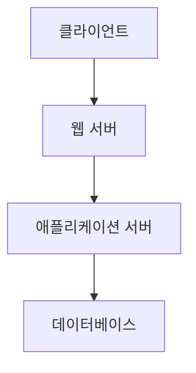

# Ⅰ. 테스트 문서

## 1. 머메이드 다이어그램 테스트

[그림Ⅰ-1] 시스템 아키텍처

```mermaid
graph TD
    A[클라이언트] --> B[웹 서버]
    B --> C[애플리케이션 서버]
    C --> D[데이터베이스]
```

## 2. 표 테스트

| 항목 | 설명 | 비고 |
|------|------|------|
| 항목1 | 설명1 | 비고1 |
| 항목2 | 설명2 | 비고2 |

## 3. 일반 텍스트

이것은 일반 텍스트입니다.

